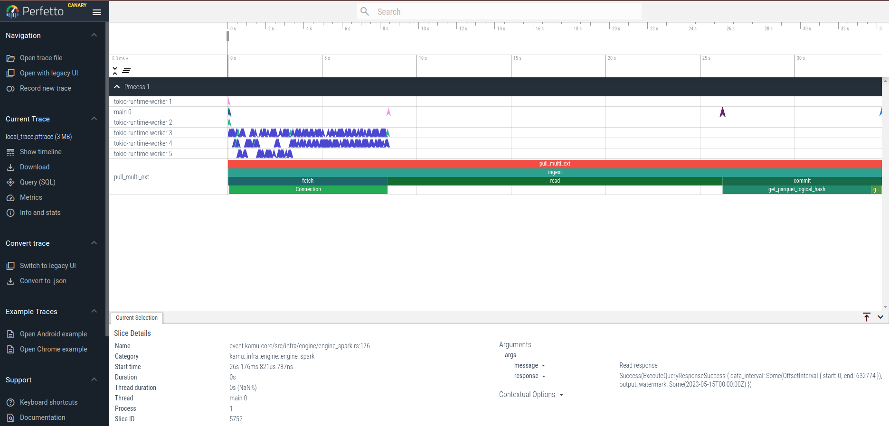

# Developer Guide <!-- omit in toc -->
- [Building Locally](#building-locally)
  - [Configure Podman as Default Runtime (Recommended)](#configure-podman-as-default-runtime-recommended)
  - [Build with Databases](#build-with-databases)
  - [Database migrations](#database-migrations)
  - [Run Linters](#run-linters)
  - [Run Tests](#run-tests)
  - [Build Speed Tweaks (Optional)](#build-speed-tweaks-optional)
    - [Artifact reuse (shared target dir)](#artifact-reuse-shared-target-dir)
    - [Artifact reuse (sscache)](#artifact-reuse-sscache)
    - [Faster linker](#faster-linker)
  - [Building with Web UI (Optional)](#building-with-web-ui-optional)
  - [Code Generation](#code-generation)
- [Code Structure](#code-structure)
  - [Dependency Injection](#dependency-injection)
  - [Async](#async)
  - [Error Handling](#error-handling)
  - [Test Groups](#test-groups)
- [Typical Workflows](#typical-workflows)
  - [Feature Branches](#feature-branches)
  - [Release Procedure](#release-procedure)
  - [Jupyter Demo Release Procedure](#jupyter-demo-release-procedure)
  - [Minor Dependencies Update](#minor-dependencies-update)
  - [Major Dependencies Update](#major-dependencies-update)
  - [Building Multi-platform Images](#building-multi-platform-images)
  - [Upgrading Datafusion stack](#upgrading-datafusion-stack)
- [Tips](#tips)
  - [IDE Configuration](#ide-configuration)
  - [Debugging](#debugging)
    - [Logs](#logs)
    - [Tracing](#tracing)


## Building Locally
Prerequisites:
* Docker or Podman (note: unit tests run with Podman by default)
  * If using `docker` - make sure it's usable without `sudo` ([guidelines](https://docs.docker.com/engine/install/linux-postinstall))
  * If using `podman` - make sure it's setup to run rootless containers ([guidelines](https://github.com/containers/podman/blob/main/docs/tutorials/rootless_tutorial.md))
* Rust toolset
  * Install `rustup`
  * The correct toolchain version will be automatically installed based on the `rust-toolchain` file in the repository
* Tools used by tests
  * Install [`jq`](https://stedolan.github.io/jq) - used to query and format JSON files
  * Install [`kubo`](https://docs.ipfs.io/install/command-line/#official-distributions) (formerly known as `go-ipfs`) - for IPFS-related tests
* Code generation tools (optional - needed if you will be updating schemas)
  * Install [`flatc`](https://github.com/google/flatbuffers)
  * Install [`protoc`](https://github.com/protocolbuffers/protobuf) followed by:
    * `cargo install protoc-gen-prost` - to install [prost protobuf plugin](https://crates.io/crates/protoc-gen-prost)
    * `cargo install protoc-gen-tonic` - to install [tonic protobuf plugin](https://crates.io/crates/protoc-gen-tonic)
* Cargo toolbelt
  * Prerequisites:
    * `cargo install cargo-update` - to easily keep your tools up-to-date
    * `cargo install cargo-binstall` - to install binaries without compiling
    * `cargo binstall cargo-binstall --force -y` - make future updates of `binstall` to use a precompiled version
  * Recommended:
    * `cargo binstall cargo-nextest -y` - advanced test runner
    * `cargo binstall bunyan -y` - for pretty-printing the JSON logs
    * `cargo binstall cargo-llvm-cov -y` - for test coverage
    * `cargo binstall cargo-cache -y` - to keep track of cargo cache usage
  * Optional - if you will be doing releases:
    * `cargo binstall cargo-edit -y` - for setting crate versions during release
    * `cargo binstall cargo-update -y` - for keeping up with major dependency updates
    * `cargo binstall cargo-deny -y` - for linting dependencies
    * `cargo binstall cargo-udeps -y` - for linting dependencies (detecting unused)
  * To keep all these cargo tools up-to-date use `cargo install-update -a`
* Database tools (optional, unless modifying repositories is necessary):
  * Install Postgres command line client `psql`:
    * deb: `sudo apt install -y postgresql-client`
    * rpm: `sudo dnf install -y postgresql`
  * Install MariaDB command line client `mariadb`: 
    * deb: `sudo apt install -y mariadb-client`
    * rpm: `sudo dnf install -y mariadb`
  <!-- Installation using `cargo install` (rather than `cargo binstall`) is used intentionally -->
  <!-- Details: https://github.com/launchbadge/sqlx/issues/3396 -->
  * Install `sqlx-cli`: `cargo install sqlx-cli`

Clone the repository:
```shell
git clone git@github.com:kamu-data/kamu-cli.git
```
Build the project:
```shell
cd kamu-cli
cargo build
```

To use your locally-built `kamu` executable link it as so:
```shell
ln -s $PWD/target/debug/kamu-cli ~/.local/bin/kamu
```

When needing to test against a specific official release, you can install it under a different alias:

```shell
curl -s "https://get.kamu.dev" | KAMU_ALIAS=kamu-release sh
```

New to Rust? Check out these [IDE configuration tips](#ide-configuration).


### Configure Podman as Default Runtime (Recommended)
Set podman as preferred runtime for your user:
```shell
cargo run -- config set --user engine.runtime podman
```

When you run tests or use `kamu` anywhere in your user directory you will now use `podman` runtime.

If you need to run some tests under `Docker` use:
```shell
KAMU_CONTAINER_RUNTIME_TYPE=docker cargo test <some_test>
```

### Build with Databases

By default, we define `SQLX_OFFLINE=true` environment variable to ensure the compilation succeeds without access to a live database.
The default mode is fine in most of the cases, assuming the developer's assignment is not related to databases/repositories directly.

When databases have to be touched, the setup of local database containers must be configured using the following script:
```shell
make sqlx-local-setup
```

This mode:
 * creates Docker containers with empty databases
 * applies all database migrations from scratch
 * generates `.env` files in specific crates to point to databases running in Docker containers by setting `DATABASE_URL` variables
   as well as to disable `SQLX_OFFLINE` variable in those crates

This setup ensures any SQL queries are automatically checked against live database schema at compile-time.
This is highly useful when queries have to be written or modified.

After the database-specific assignment is over, it makes sense to re-enable default mode by running another script:
```shell
make sqlx-prepare
make sqlx-local-clean
```

The first step, `make sqlx-prepare`, analyzes SQL queries in the code and generates the latest up-to-date data 
for offline checking of queries (`.sqlx` directories). It is necessary to commit them into the version control
 to share the latest updates with other developers, as well as to pass through GitHub pipeline actions.

Note that running `make lint` will detect if re-generation is necessary before pushing changes.
Otherwise, GitHub CI flows will likely fail to build the project due to database schema differences.

The second step, `make sqlx-local-clean` would reverse `make sqlx-local-setup` by:
 * stopping and removing Docker containers with the databases
 * removing `.env` files in database-specific crates, which re-enables `SQLX_OFFLINE=true` for the entire repository.


### Database migrations
Any change to the database structure requires writing SQL migration scripts.
The scripts are stored in `./migrations/<db-engine>/` folders, and they are unique per database type.
The migration commands should be launched within database-specific crate folders, such as `./src/database/sqlx-postgres`. Alternatively, you will need to define `DATABASE_URL` variable manually.

Typical commands to work with migrations include:
* `sqlx migrate add --source <migrations_dir_path> <description>` to add a new migration
* `sqlx migrate run --source <migrations_dir_path>` to apply migrations to the database
* `sqlx migrate info --source <migrations_dir_path> ` to print information about currently applied migration within the database


### Working with Elasticsearch

Typical commands to work with Elasticsearch engine locally:
* `make elasticsearch-setup-http` - starts Elasticsearch and Kibana, connected to each other (use this one by default)
* `make elasticsearch-setup-https` - the same, but enables HTTPS/TLS communcations (for experiments only, requires changing URLs in tests)
* `make elasticsearch-stop` - stops Elasticsearch and Kibana, but does not remove a container volume, so data survives the restart
* `make elasticsearch-clean` - stops Elasticsearch and Kibana, and additionally wipes container volumes, guaranteeing clean data after restart
* `make elasticsearch-test-gc` - runs cleanup of all test indices in the local Elasticsearch instance

Once started, these services could be accessed directly from the browser:
* in HTTP mode (use by default ):
  * Elasticsearch: http://localhost:9200/
  * Kibana: http://localhost:5601/
* in HTTPS/TLS mode:
  * Elasticsearch: https://localhost:9200/
  * Kibana: http://localhost:5601/ (still http, although internally it connects to Elasticsearch via HTTPS/TLS)  
* when prompted for authentication, use:
  * login: elastic
  * password: root

Healthy instance of Elasticsearch is required to execute Elasticsearch-related tests: `make test-elasticsearch`.
This test group is included into the full test suite as well.

### Run Linters
Use the following command:
```sh
make lint
```
This will do a number of highly useful checks:
* Rust formatting check
* License headers check
* Dependencies check: detecting issues with existing dependencies, detecting unused dependencies
* Rust coding practices checks (`clippy`)
* SQLX offline data check (`sqlx` data for offline compilation must be up-to-date with the database schema)


### Run Tests
Before you run tests for the first time, you need to run:
```sh
make test-setup
```

This will download all necessary images for containerized tests.

You can run all tests except database-specific as:
```sh
make test
```

In most cases, you can skip tests involving very heavy Spark and Flink engines and databases by running:
```sh
make test-fast
```

If testing with databases and/or Elasticsearch is required (including E2E tests), use:
```sh
make sqlx-local-setup # Start database-related containers 
make elasticsearch-setup-http # Start Elasticsearch & Kibana without HTTPS/TLS

make test-full # or `make test-e2e` for E2E only

make sqlx-local-clean
make elasticsearch-clean
```

---

These are just wrappers on top of [Nextest](https://nexte.st/) that [control](/.config/nextest.toml) test concurrency and retries.

To run tests for a specific crate, e.g. `opendatafabric` use:
```sh
cargo nextest run -p opendatafabric
```


### Build Speed Tweaks (Optional)

#### Artifact reuse (shared target dir)
Working on `kamu` often involves switching between multiple related repositories that depend on a similar set of crates. To avoid wasting a lot of time and disk space recompiling them it is advisable to setup a shared `/target` directory.

For example if you have projects layed out like so:
```sh
/home/me/code/kamu/
  /kamu-cli
  /kamu-node
  /kamu-engine-datafusion
```

Create a file `/home/me/code/kamu/.cargo/config.toml` that contains:
```toml
[build]
target-dir = "/home/me/code/kamu/.target"
```

This way all projects you build under `/kamu` directory will share one target directory, reusing all artifacts.

#### Artifact reuse (sscache)
Alternatively to reuse build artifacts you can use [sccache](https://github.com/mozilla/sccache#installation).
After installing in a way that is convenient for you, configure `$CARGO_HOME/config.toml` as follows:

```toml
[build]
rustc-wrapper = "/path/to/sccache"
```

Same can be achieved using environment variable `RUSTC_WRAPPER`:

```shell
export RUSTC_WRAPPER=/path/to/sccache # for your convenience, save it to your $SHELL configuration file (e.g. `.bashrc`, `.zshrc, etc)
cargo build
```


#### Faster linker

Consider configuring Rust to use `lld` linker, which is much faster than the default `ld` (may improve link times by ~10-20x).

To do so install `lld`, then update `$CARGO_HOME/config.toml` file with the following contents:

```toml
[build]
rustflags = ["-C", "link-arg=-fuse-ld=lld"]
```

Another alternative is `mold` linker, which is also much faster than the default `ld`.

To do so install `mold` or build it with `clang++` compiler from [mold sources](https://github.com/rui314/mold#how-to-build) then update `$CARGO_HOME/config.toml` file with the following contents:

```toml
[build]
linker = "clang"
rustflags = ["-C", "link-arg=-fuse-ld=mold"]
```


### Building with Web UI (Optional)
To build the tool with embedded Web UI you will need to clone and build [kamu-web-ui](https://github.com/kamu-data/kamu-web-ui) repo or use pre-built release. Now build the tool while enabling the optional feature and passing the location of the web root directory:

```shell
KAMU_WEB_UI_DIR=../../../../kamu-web-ui/dist/kamu-platform/ cargo build --features kamu-cli/web-ui
```

Note: we assume that `kamu-web-ui` repository directory will be at the same level as `kamu-cli`, for example:
```
.
└── kamu-data
    ├── kamu-cli
    └── kamu-web-ui
```

Note: in debug mode, the directory content is not actually being embedded into the executable but accessed from the specified directory.


### Code Generation
Many core types in `kamu` are generated from schemas and IDLs in the [open-data-fabric](https://github.com/open-data-fabric/open-data-fabric) repository. If your work involves making changes to those - you will need to re-run the code generation tasks using:

```sh
make codegen
```

Make sure you have all related dependencies installed (see above) and that ODF repo is checked out in the same directory as `kamu-cli` repo.


## Code Structure
This repository is built around our interpretation of Onion / Hexagonal / Clean Architecture patterns [[1]](https://blog.cleancoder.com/uncle-bob/2012/08/13/the-clean-architecture.html) [[2]](https://herbertograca.com/2017/11/16/explicit-architecture-01-ddd-hexagonal-onion-clean-cqrs-how-i-put-it-all-together/).

In the `/src` directory you will find:
- `domain` 
  - Crates here contain **implementation-agnostic domain model entities and interfaces** for service and repositories
  - Crate directories are named after domain they represent, e.g. `task-system` while crate names will typically have `kamu-<domain>` prefix
- `adapter`
  - Crates here **expose domain data and operations under different protocols**
  - Crate directories are named after the protocol they are using, e.g. `graphql` while crate names will typically have `kamu-adapter-<protocol>` prefix
  - Adapters only operate on entities and interfaces defined in `domain` layer, independent of specific implementations
- `infra`
  - Crates here contain **specific implementations of services and repositories** (e.g. repository that stores data in S3)
  - Crate directories are named as `<domain>-<technology>`, e.g. `object-repository-s3` while crate names will typically have `kamu-<domain>-<technology>` prefix
  - Infrastructure layer only operates on entities and interfaces defined in `domain` layer
- `app`
  - Crates here **combine all layers above into functional applications**

### Dependency Injection
This architecture relies heavily on separation of interfaces from implementations and [dependency inversion principle](https://martinfowler.com/articles/injection.html), so we are using a homegrown dependency injection library [`dill`](https://github.com/sergiimk/dill-rs) to simplify gluing these pieces together.

### Async
The system is built to be highly-concurrent and, for better or worse, the explicit `async/await` style concurrency is most prevalent in Rust libraries now. Therefore:
- Our domain interfaces (traits) use `async fn` for any non-trivial functions to allow concurrent implementations
- Our domain traits are all `Send + Sync`
  - for implementations to be used as `Arc<dyn Svc>`
  - to have implementations use interior mutability

### Error Handling
Our error handling approach is still evolving, but here are some basic design rules we settled on:
- We don't return `Box<dyn Error>` or any fancier alternatives (like `anyhow` or `error_stack`) - we want users to be able to handle our errors precisely
- We don't put all errors into a giant enum - this is as hard for users to handle as `Box<dyn Error>`
- We are explicit about what can go wrong in every function - i.e. we define error types **per function**
- Errors in domain interfaces typically carry `Internal(_)` enum variant for propagating errors that are not part of the normal flow
- We never want `?` operator to implicitly convert something into an `InternalError` - a decision that some error is not expected should be explicit
- We want `Backtrace`s everywhere, as close to the source as possible

With these ideas in mind:
- We heavily use `thiserror` library to define errors per function and generate error type conversions
- We use our own `internal-error` crate to concisely box unexpected errors into `InternalError` type

### Test Groups
We use the homegrown [`test-group`](https://crates.io/crates/test-group) crate to organize tests in groups. The complete set of groups is:
- `containerized` - for tests that spawn Docker/Podman containers
- `engine` - for tests that involve any data engine or data framework (query, ingest, or transform paths), subsequently grouped by:
  - `datafusion` - tests that use Apache DataFusion
  - `spark` - tests that use Apache Spark
  - `flink` - tests that use Apache Flink
- `database` - for tests that involve any database interaction, subsequently grouped by:
  - `mysql` - tests that use MySQL/MariaDB
  - `postgres` - tests that use PostreSQL
- `ingest` - tests that test data ingestion path
- `transform` - tests that test data transformation path
- `query` - tests that test data query path
- `flaky` - special group for tests that sometimes fail and need to be retried (use very sparingly and create tickets)
- `setup` - special group for tests that initialize the environment (e.g. pull container images) - this group is run by CI before executing the rest of the tests


## Typical Workflows

### Feature Branches
1. Our policy is to have `master` branch **always stable, ready to be released at any point in time**, thus all changes are developed on feature branches and merged to `master` only when they pass all the checks
2. Continuous **upkeep** of our repo is every developer's responsibility, so before starting a feature branch check if [major dependency update](#major-dependencies-update) is due and perform it on a separate branch
3. Please follow this convention for branch names:
   1. `bug/invalid-url-path-in-s3-store`
   2. `feature/recursive-pull-flag`
   3. `refactor/core-crate-reorg`
   4. `ci/linter-improvements`
   5. `docs/expand-developer-docs`
   6. `chore/bump-dependencies`
   7. `release/v1.2.3` - for hot fix releases
4. Include brief description of your changes under `## Unreleased` section of the `CHANGELOG.md` in your PR
5. (Recommended) Please configure git to [sign your commits](https://docs.github.com/en/authentication/managing-commit-signature-verification/signing-commits)
6. Branches should have coarse-grained commits with good descriptions - otherwise commits should be squashed
7. Follow [minor dependency update](#minor-dependencies-update) procedure - do it right before merging to avoid merge conflicts in `Cargo.lock` while you're maintaining your branch
8. (Optional) We usually create a new release for every feature merged into `master`, so follow the [release procedure](#release-procedure)
9. Maintainers who merge branches should do so via `git merge --ff-only` and NOT rebasing to not lose **commit signatures**

### Release Procedure
1. Start by either creating a release branch or with an existing feature branch
2. We try to stay up-to-date with all dependencies, so before every release we:
   1. Run `cargo update` to pull in any minor releases
   2. Run `cargo upgrade --dry-run --incompatible` and see which packages have major upgrades - either perform them or ticket them up
   3. Run `cargo deny check` to audit updated dependencies for licenses, security advisories etc.
3. Bump the version using: `make release-patch / make release-minor / make release-major`
4. Create a dated `CHANGELOG` entry for the new version
5. Create PR, wait for tests, then merge as normal feature branch
6. On `master` tag the latest commit with a new version: `git tag vX.Y.Z`.
7. Push the tag to the repo: `git push origin tag vX.Y.Z`
8. GitHub Actions will pick up the new tag and create a new GitHub release from it

### Jupyter Demo Release Procedure
Our Jupyter demo at https://demo.kamu.dev includes a special Jupyter notebook image that embeds `kamu-cli`, multiple examples, and some other tools. The tutorials also guide users to interact with `kamu-node` deployed in the demo environment. Because of this - it's important to update Jupyter whenever we break any protocol compatibility.

1. Increment `DEMO_VERSION` version in the [Makefile](https://github.com/kamu-data/kamu-cli/blob/master/images/demo/Makefile)
2. Set the same version for `jupyter` and `minio` images in [`docker-compose.yml`](https://github.com/kamu-data/kamu-cli/blob/master/images/demo/docker-compose.yml) (`minio` image that we will build is used to run the demo environment locally)
3. Run `make clean`
4. Run `make minio-data` - this will prepare example datasets to be included into `minio` image
5. Prepare your `docker buildx` to build multi-platform images (see [instructions below](#building-multi-platform-images))
6. Run `make minio-multi-arch` to build **and push** multi-arch `minio` image
7. Setup GitHub access token:
  7.1. Go to [GitHub access token page](https://github.com/settings/tokens/new?description=Upload%20Kamu%20packages&scopes=write%3Apackages) and generate 
    access token with `write:packages` permissions.
  7.2 Run `export CR_PAT=<your_token>`. To check everything is fine run `echo $CR_PAT | docker login ghcr.io -u <your_username>> --password-stdin`
8. Run `make jupyter-multi-arch` to build **and push** multi-arch `jupyter` image
9. You can now proceed to deploy the new image to kubernetes environment

### Minor Dependencies Update
1. Run `cargo update` to pull in any minor updates
2. Run `cargo deny check` to audit new dependencies for duplicates and security advisories
3. (Optional) Periodically run `cargo clean` to prevent your `target` dir from growing too big

### Major Dependencies Update
1. (Optional) Start by upgrading your local tools: `cargo install-update -a`
2. Run `cargo update` to pull in any minor releases first
3. Run `cargo upgrade --dry-run` and see which packages have major upgrades
4. To perform major upgrades You can go crate by crate or all at once - it's up to you
5. The tricky part is usually `arrow` and `datafusion` family of crates, to upgrade them you need to:
   1. See what is the latest version of `datafusion`
   2. Go to [datafusion repo](https://github.com/apache/arrow-datafusion/), switch to corresponding tag, and check its `Cargo.toml` to see which version of `arrow` it depends on
   3. Update to those major versions. For example `datafusion v32` depends on `arrow v47`, so the command is:
       ```shell
       cargo upgrade -p arrow@47 -p arrow-digest@47 -p arrow-flight@47 -p datafusion@32
       ```
   4. Note that [arrow-digest](https://github.com/kamu-data/arrow-digest) is our repo versioned in lockstep with `arrow`, so if the right version of it is missing - you should update it as well
6. If some updates prove to be difficult - ticket them up and leave a `# TODO:` comment in `Cargo.toml`
7. Run `cargo update` again to pull in any minor releases that were affected by your upgrades
8. Run `cargo deny check` to audit new dependencies for duplicates and security advisories
9. (Optional) Periodically run `cargo clean` to prevent your `target` dir from growing too big


### Building Multi-platform Images
We release multi-platform images to provide our users with native performance without emulation. Most of our images are built automatically by CI pipelines, so you may not have to worry about building them. Some images, however, are still built manually.

To build multi-platform image on a local machine we use `docker buildx`. It has ability to create virtual builders that run QEMU for emulation.

This command is usually enough to get started:
```sh
docker buildx create --use --name multi-arch-builder
```

If in some situation you want to run an image from different architecture on Linux under emulation - use this command to bootstrap QEMU ([source](https://wiki.archlinux.org/title/docker#Using_buildx_for_cross-compiling)):
```sh
docker run --rm --privileged multiarch/qemu-user-static --reset -p yes
```


### Upgrading Datafusion stack
We embed Datafusion engine as our main data manipulation library and try to stay up to date with new versions.

The usual upgrade procedure looks like this:
1. Open [`datafusion`](https://github.com/apache/datafusion/) repo and note which versions of `arrow` and `object_store` crates it is using (in `Cargo.toml`)
2. Upgrade [`arrow-digest`](https://github.com/kamu-data/arrow-digest/) crate to new arrow if needed and publish
3. Upgrade [`datafusion-odata`](https://github.com/kamu-data/datafusion-odata) and [`datafusion-ethers`](https://github.com/kamu-data/datafusion-ethers) crates to new `datafusion` and publish
4. Check 3rd party extensions we depend on have upgraded: [`datafusion-functions-json`](https://github.com/datafusion-contrib/datafusion-functions-json)
5. Upgrade `kamu-cli` using command like:
   ```sh
   cargo -Z unstable-options update --breaking \
     -p arrow \
     -p arrow-digest \
     -p arrow-flight \
     -p arrow-json \
     -p arrow-schema \
     -p object_store \
     -p datafusion \
     -p datafusion-functions-json \
     -p datafusion-odata \
     -p datafusion-ethers \
     -p parquet \
     --dry-run
   ```
6. Ensure `Cargo.lock` does not contain duplicate versions of major crates (or run `cargo deny check --hide-inclusion-graph`)
7. Follow the steps in `src/utils/datafusion-cli/README.md` to update the SQL shell
8. Fix any compilation errors and warnings and ensure tests are green


## Tips

### IDE Configuration
When using VSCode we recommend following extensions:
- `rust-analyzer` - Rust language server
  - Setting up `clippy`:
    ```json5
    // settings.json
    {
        // other settings
        "rust-analyzer.check.overrideCommand": "cargo clippy --workspace --all-targets"
    }  
    ```
- `Error Lens` - to display errors inline with code
- `Even Better TOML` - for editing TOML files
- `Dependi` - displays dependency version status in `Cargo.toml`
  - Note: It's better to use `cargo upgrade --dry-run` when upgrading to bump deps across entire workspace


### Debugging

#### Logs
When running `kamu` it automatically logs to `.kamu/run/kamu.log`. Note that the `run` directory is cleaned up between every command.

You can control the log level using standard RUST_LOG environment variable, e.g.:

```sh
RUST_LOG=debug kamu ...
RUST_LOG="trace,mio::poll=info" kamu ...
```

The log file is in Bunyan format with one JSON object per line. It is intended to me machine-readable. When analyzing logs yourself you can pipe it through [`bynyan`] tool (see installation instructions above):

```sh
cat .kamu/run/kamu.log | bunyan
```

You can also run kamu with verbosity flags as `kamu -vv ...` for it to log straight to STDERR in a human-readable format.

#### Tracing
Using `kamu --trace` flag allows you to record the execution of the program and open [Perfetto UI](https://perfetto.dev/) in a browser, allowing to easily analyze async code execution and task performance.

> Note: If you are using Brave or a similar high-security browser and get an error from Perfetto when loading the trace - try disabling the security features to allow the UI app fetch data from `http://localhost:9001`.


