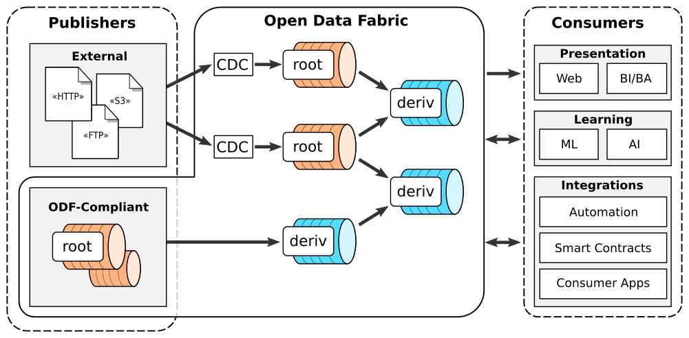

<div align="center">


[Website] | [Docs] | [Demo] | [Tutorials] | [Examples] | [FAQ] | [Chat]

[](https://github.com/kamu-data/kamu-cli/releases/latest)
[](https://github.com/kamu-data/kamu-cli/actions)
[](https://discord.gg/nU6TXRQNXC)

</p>
</div>

## Quickstart

Using the installer script _(Linux / MacOSX / WSL2)_:
```sh
curl -s "https://get.kamu.dev" | sh
```

## Get Started

* Watch [this introductory video](https://www.youtube.com/watch?v=oUTiWW6W78A&list=PLV91cS45lwVG20Hicztbv7hsjN6x69MJk) to see `kamu` in action.
* Learn how to use `kamu` with this [self-serve demo](https://docs.kamu.dev/cli/get-started/self-serve-demo/) without needing to install anything.
* Then follow the "Getting Started" section of our [documentation] to install the tool and try a bunch of examples.

## About

`kamu` (pronounced `kaˈmju`) is an easy-to-use command-line tool for managing, transforming, and collaborating on structured data.

In short, it can be described as:
* Git for data
* Decentralized data warehouse
* A peer-to-peer stream processing data pipeline
* Blockchain-like ledger for data
* Or even Kubernetes for data :)

Using `kamu`, any person or smallest organization can easily **share structured data** with the world. Data can be static or **flow continuously**. In all cases `kamu` will ensure that it stays:
* Reproducible - i.e. you can ask the publisher *"Give me the same exact data you gave me a year ago"*
* Verifiable - i.e. you can ask the publisher *"Is this the exact data you had a year ago?"*

Teams and data communities can then **collaborate** on cleaning, enriching, and aggregating data by building arbitrarily complex **decentralized data pipelines**. Following the **"data as code"** philosophy `kamu` doesn't let you touch data manually - instead, you transform it using **Streaming SQL** (we support [multiple frameworks](https://docs.kamu.dev/cli/transform/supported-engines/)). This ensures that data supply chains are:
* Autonomous - write query once and run it forever, no more babysitting fragile batch workflows
* Low latency - get accurate results immediately, as new data arrives
* Transparent - see where every single piece of data came from, who transformed it, and how
* Collaborative - collaborate on data just like on Open Source Software

Data scientists, analysts, ML/AI researchers, and engineers can then:
* Access **fresh, clean, and trustworthy data** in seconds
* Easily **keep datasets up-to-date**
* Safely **reuse data** created by the hard work of the community

The reuse is achieved by maintaining **unbreakable lineage and provenance trail** in **tamper-proof** metadata, which lets you assess the trustworthyness of data, no matter how many hands and transformation steps it went through.

In a larger context, `kamu` is a reference implementation of [Open Data Fabric](https://github.com/kamu-data/open-data-fabric) - a Web 3.0 protocol for providing timely, high-quality, and verifiable data for data science, smart contracts, web and applications.

<div align="center">

</div>


## Use Cases

In general, `kamu` is a great fit for cases where data is exchanged between several independent parties, and for (low to moderate frequency & volume) mission-critical data where high degree of trustworthiness and protection from malicious actors is required.

Examples:

<details>
<summary><b>Open Data</b></summary>

To share data **outside of your organization** today you have limited options:

- You can publish it on some open data portal, but lose ownership and control of your data
- You can deploy and operate some open-source data portal (like CKAN or Dataverse), but you probably have neither time nor money to do so
- You can self-host it as a CSV file on some simple HTTP/FTP server, but then you are making it extremely hard for others to discover and use your data

Let's acknowledge that for organizations that produce the most valuable data (governments, hospitals, NGOs), publishing data is **not part of their business**. They typically don't have the incentives, expertise, and resources to be good publishers.

This is why the goal of `kamu` is to make data publishing **cheap and effortless**:
- It invisibly guides publishers towards best data management practices (preserving history, making data reproducible and verifiable)
- Adds as little friction as exporting data to CSV
- Lets you host your data on any storage (FTP, S3, GCS, etc.)
- Maintain full control and ownership of your data

As opposed to just the download counter you get on most data portals, `kamu` brings publishers closer with the communities allowing them to see who and how uses their data. You no longer send data into "the ether", but create a **closed feedback loop** with your consumers.
</details>

<details>
<summary><b>Science & Research</b></summary>

One of the driving forces behind `kamu`'s design was the [ongoing reproducibility crisis](https://www.nature.com/articles/533452a) in science, which we believe to a large extent is caused by our poor data management practices.

After incidents like [The Surgisphere scandal](https://www.the-scientist.com/features/the-surgisphere-scandal-what-went-wrong--67955) the sentiment in research is changing from assuming that all research is done in good faith, to considering any research unreliable until proven otherwise.

Data portals like Dataverse, Dryad, Figshare, and Zenodo are helping reproducibility by **archiving data**, but this approach:
- Results in hundreds of millions of poorly systematized datasets
- Tends to produce the research based on stale and long-outdated data
- Creates lineage and provenance trail that is very manual and hard to trace (through published papers)

In `kamu` we believe that the majority of valuable data (weather, census, health records, financial core data) **flows continuously**, and most of the interesting insights lie around the latest data, so we designed it to bring **reproducibility and verifiability to near real-time data**.

When using `kamu`:

- Your data projects are **100% reproducible** using a built-in stable references mechanism
- Your results can be reproduced and **verified by others in minutes**
- All the data prep work (that often accounts for [80% of time of a data scientist](https://www.forbes.com/sites/gilpress/2016/03/23/data-preparation-most-time-consuming-least-enjoyable-data-science-task-survey-says/?sh=348d5f876f63)) can be shared and **reused** by others
- Your data projects will **continue to function** long after you've moved on, so the work done years ago can continue to produce valuable insights with minimal maintenance on your part
- Continuously flowing datasets are much **easier to systematize** than the exponentially growing number of snapshots
</details>

<details>
<summary><b>Data-driven Journalism</b></summary>

Data-driven journalism is on the rise and has proven to be extremely effective. In the world of misinformation and extremely polarized opinions data provides us an anchoring point to discuss complex problems and analyze cause and effect. Data itself is non-partisan and has no secret agenda, and arguments around different interpretations of data are infinitely more productive than ones based on gut feelings.

Unfortunately, too often data has issues that undermine its trustworthiness. And even if the data is correct, it's very easy to pose a question about its sources that will take too long to answer - the data will be dismissed, and the gut feelings will step in.

This is why `kamu`'s goal is to make data **verifiably trustworthy** and make answering **provenance** questions a **matter of seconds**. Only when data cannot be easily dismissed we will start to pay proper attention to it.

And once we agree that source data can be trusted, we can build analyses and **real-time dashboards** that keep track of complex issues like corruption, inequality, climate, epidemics, refugee crises, etc.

`kamu` prevents good research from going stale the moment it's published!
</details>

<details>
<summary><b>Business core data</b></summary>

`kamu` aims to be the most reliable data management solution that provides recent data while maintaining the **highest degree of accountability** and **tamper-proof provenance**, without you having to put all data in some central database.

We're developing it with financial and pharmaceutical use cases in mind, where **audit and compliance could be fully automated** through our system.

Note that we currently focus on mission-critical data and `kamu` is not well suited for IoT or other high-frequency and high-volume cases, but can be a good fit for insights produced from such data that influence your company's decisions and strategy.
</details>

<details>
<summary><b>Personal analytics</b></summary>

Being data geeks, we use `kamu` for data-driven decision-making even in our personal lives.

Actually, our largest data pipelines so far were created for personal finance:
- to collect and harmonize data from multiple bank accounts
- convert currencies
- analyze stocks trading data.

We also scrape a lot of websites to make smarter purchasing decisions. `kamu` lets us keep all this data up-to-date with an **absolute minimal effort**.
</details>

## Features

`kamu` connects **publishers** and **consumers** of data through a decentralized network and lets people **collaborate** on extracting insight from data. It offers many perks for everyone who participates in this first-of-a-kind data supply chain:

<details>
<summary><b>For Data Publishers</b></summary>

- Easily **share your data** with the world **without moving it** anywhere
- Retain full **ownership and control** of your data
- Close the feedback loop and **see who and how uses your data**
- Provide **real-time**, **verifiable and reproducible** data that follows the best data management practices
  

</details>

<details>
<summary><b>For Data Scientists</b></summary>

- **Ingest any existing dataset** from the web
- Always **stay up-to-date** by pulling latest updates from the data sources with just one command
- Use **stable data references** to make your data projects fully reproducible
- **Collaborate** on cleaning and improving data of existing datasets
- Create derivative datasets by transforming, enriching, and summarizing data others have published
- **Write query once and run it forever** - our pipelines require nearly zero maintenance
- Built-in support for **GIS data**
- **Share** your results with others in a fully reproducible and reusable form

</details>

<details>
<summary><b>For Data Consumers</b></summary>

- **Download** a dataset from a shared repository
- **Verify** that all data comes from trusted sources using 100% accurate **lineage**
- **Audit** the chain of transformations this data went through
- **Validate** that downloaded was not tampered with a single command
- **Trust** your data by knowing where every single bit of information came from with our **fine grain provenance**

</details>

<details>
<summary><b>For Data Exploration</b></summary>

- Explore data and run **ad-hoc SQL queries** (backed by the power of Apache Spark)
- Launch a **Jupyter notebook** with one command
- Join, filter, and shape your data using SQL
- Visualize the result using your favorite library
- Explore complex pipelines in Web UI
  
  
  

</details>


## Community

If you like what we're doing - support us by starring the repo, this helps us a lot!

Subscribe to our [YouTube channel](https://www.youtube.com/channel/UCWciDIWI_HsJ6Md_DdyJPIQ) to get fresh tech talks and deep dives.

Stop by and say "hi" in our [Discord Server](https://discord.gg/nU6TXRQNXC) - we're always happy to chat about data.

If you'd like to contribute [start here](https://docs.kamu.dev/contrib/).

---

<div align="center">
  
[Website] | [Docs] | [Tutorials] | [Examples] | [FAQ] | [Chat] | [Contributing] | [Developer Guide] | [License]

[](https://deps.rs/repo/github/kamu-data/kamu-cli)


</div>

[Tutorials]: https://docs.kamu.dev/cli/learn/learning-materials/
[Examples]: https://docs.kamu.dev/cli/learn/examples/
[Docs]: https://docs.kamu.dev/cli/
[Documentation]: https://docs.kamu.dev/cli/
[Demo]: https://docs.kamu.dev/cli/get-started/self-serve-demo/
[FAQ]: https://docs.kamu.dev/cli/get-started/faq/
[Chat]: https://discord.gg/nU6TXRQNXC
[Contributing]: https://docs.kamu.dev/contrib/
[Developer Guide]: https://docs.kamu.dev/cli/developer-guide/
[License]: https://docs.kamu.dev/contrib/license/
[Website]: https://kamu.dev