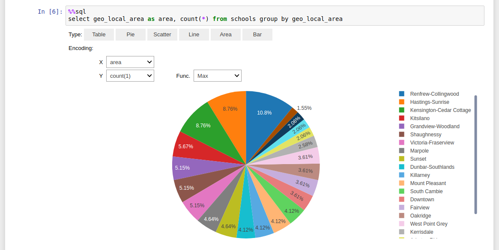

# Kamu CLI

Kamu is a new-generation data management and exploration tool which aims to enable effective collaboration of people around data. To put it simply, it tries to accomplish what `git` and other version control systems did for software - provide a reliable, transparent, and trustworthy way of iteratively improving something as a community - but does it in a way that is most suitable to data.

https://kamu.dev

## Features

- Easily ingest any data set from the web
- Keep track of any updates to the data source in the future
- All data is stored in the efficient structured format (Parquet)
- Explore data and run adhoc SQL queries (backed by the power of Apache Spark)

- Launch a Jupyter notebook with one command
- Join, filter, and shape your data using Spark dataframe API or Spark SQL
- Fetch the result of any query as a Pandas dataframe
- Visualize it in any way you prefer using any Python library

## Documentation
- [Installation](docs/install.md)
- [First Steps](docs/first_steps.md)
- [Architecture](docs/architecture.md)
- [Developer Guide](docs/developer_guide.md)
