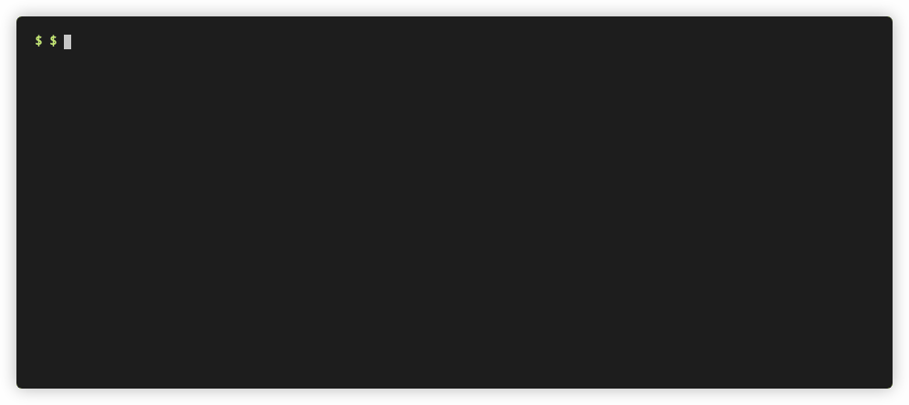
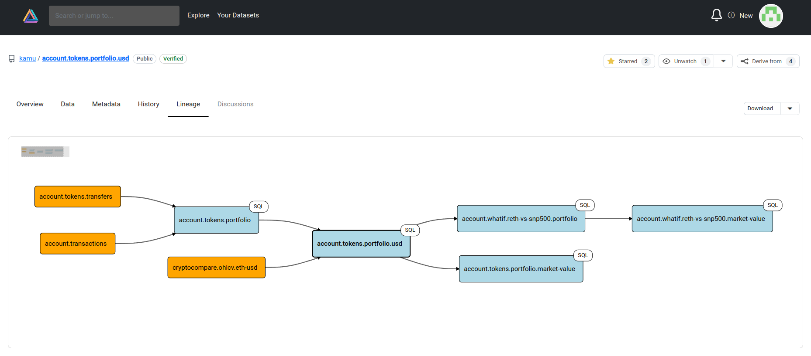

<div align="center">


[Website] | [Docs] | [Demo] | [Tutorials] | [Examples] | [FAQ] | [Chat]

[](https://github.com/kamu-data/kamu-cli/releases/latest)
[](https://docs.kamu.dev/cli/)
[](https://github.com/kamu-data/kamu-cli/actions)
[](https://discord.gg/nU6TXRQNXC)


</p>
</div>

## About
`kamu` *(pronounced [kæmˈuː](https://en.wikipedia.org/wiki/Albert_Camus))* is a command-line tool for management and verifiable processing of structured data.

It's a green-field project that aims to enable **global collaboration on data** on the same scale as seen today in software.

You can think of `kamu` as:
- ***Local-first data lakehouse*** - a free alternative to Databricks / Snowflake / Microsoft Fabric that can run on your laptop without any accounts, and scale to a large on-prem cluster
- ***Kubernetes for data pipelines*** - an *infrastructure-as-code* framework for building ETL pipelines using [wide range of open-source SQL engines](https://docs.kamu.dev/cli/supported-engines/)
- ***Git for data*** - a tamper-proof ledger that handles data ownership and preserves full history of changes to source data
- ***Blockchain for data*** - a verifiable computing system for transforming data and recording fine-grain provenance and lineage
- ***Peer-to-peer data network*** - a set of [open data formats and protocols](https://github.com/open-data-fabric/open-data-fabric/) for:
  - Non-custodial data sharing
  - Federated querying of global data as if one giant database
  - Processing pipelines that can span across multiple organizations.


### Featured Video
<div align="center">
<a href="https://www.youtube.com/watch?v=c9UCjJdvJAU"></a>
</div>


## Quick Start
Use the installer script _(Linux / MacOSX / WSL2)_:
```sh
curl -s "https://get.kamu.dev" | sh
```

* Watch [introductory videos](https://www.youtube.com/watch?v=oUTiWW6W78A&list=PLV91cS45lwVG20Hicztbv7hsjN6x69MJk) to see `kamu` in action
* Follow the ["Getting Started"](https://docs.kamu.dev/welcome/) guide through an online demo and installation instructions.


## How it Works

### Ingest from any source
`kamu` works well with popular data extractors like Debezium and provides [many built-in sources](https://docs.kamu.dev/cli/ingest/) ranging from polling data on the web to MQTT broker and blockchain logs.

<div align="center">

</div>


### Track tamper-proof history
Data is stored in [Open Data Fabric](https://github.com/open-data-fabric/open-data-fabric/) (ODF) format - an open **Web3-native format** inspired by Apache Iceberg and Delta.

In addition to "table" abstraction on top of Parquet files, ODF provides:
- Cryptographic integrity and commitments
- Stable references over real-time data
- Decentralized identity, ownership, attribution, and permissions (based on [W3C DIDs](https://www.w3.org/TR/did-core/))
- Rich extensible metadata (e.g. licenses, attachments, semantics)
- Compatibility with decentralized storages like [IPFS](https://ipfs.tech)

Unlike Iceberg and Delta that encourage continuous loss of history through Change-Data-Capture, ODF format is **history-preserving**. It encourages working with data in the [event form](https://www.kamu.dev/blog/a-brief-history-of-time-in-data-modelling-olap-systems/), and dealing with inaccuracies through [explicit retractions and corrections](https://docs.kamu.dev/cli/transform/retractions-corrections/).


### Explore, query, document
`kamu` offers a wide range of [integrations](https://docs.kamu.dev/cli/integrations/), including:
- Embedded SQL shell for quick EDA
- Integrated Jupyter notebooks for ML/AI
- Embedded Web UI with SQL editor and metadata explorer
- Apache Superset and many other BI solutions

<div align="center">



</div>


### Build enterprise-grade ETL pipelines
Data in `kamu` can only be [transformed through code](https://docs.kamu.dev/cli/transform/). An SQL query that cleans one dataset or combines two via JOIN can be used to create a **derivative dataset**.

`kamu` doesn't implement data processing itself - it integrates [many popular data engines](https://docs.kamu.dev/cli/supported-engines/) *(Flink, Spark, DataFusion...)* as plugins, so you can build an ETL flow that uses the strengths of different engines at different steps of the pipeline:

<div align="center">

</div>


### Get near real-time consistent results
All derivative datasets use **stream processing** that results in some [revolutionary qualities](https://www.kamu.dev/blog/end-of-batch-era/):
- Input data is only read once, minimizing the traffic
- Configurable balance between low-latency and high-consistency
- High autonomy - once pipeline is written it can run and deliver fresh data forever with little to no maintenance. 


### Share datasets with others
ODF datasets can be shared via any [conventional](https://docs.kamu.dev/cli/collab/repositories/) (S3, GCS, Azure) and [decentralized](https://docs.kamu.dev/cli/collab/ipfs/) (IPFS) storage and easily replicated. Sharing a large dataset is simple as:

```sh
kamu push covid19.case-details "s3://datasets.example.com/covid19.case-details/"
```

Because dataset **identity is an inseparable part of the metadata** - dataset can be copied, but everyone on the network will know who the owner is.


### Reuse verifiable data
`kamu` will store the transformation code in the dataset metadata and ensure that it's **deterministic and reproducible**. This is a form of **verifiable computing**.

You can send a dataset to someone else and they can confirm that the data they see in fact corresponds to the inputs and code:

```sh
# Download the dataset
kamu pull "s3://datasets.example.com/covid19.case-details/"

# Attempt to verify the transformations
kamu verify --recursive covid19.case-details
```

Verifiability allows you to [establish trust](https://docs.kamu.dev/cli/collab/validity/) in data processed by someone you don't even know and detect if they act maliciously.

Verifiable trust allows people to **reuse and collaborate** on data on a global scale, similarly to open-source software.


### Query world's data as one big database
Through federation, data in different locations can be queried as if it was in one big data lakehouse - `kamu` will take care of how to compute results most optimally, potentially delegating parts of the processing to other nodes.

Every query result is accompanied by a **cryptographic commitment** that you can use to reproduce the same query days or even months later.


### Start small and scale progressively
`kamu` offers unparalleled flexibility of deployment options:
- You can build, test, and debug your data projects and pipelines on a laptop
- Incorporate online storage for larger volumes, but keep processing it locally
- When you need real-time processing and 24/7 querying you can run the same pipelines with [`kamu-node`](https://github.com/kamu-data/kamu-node/) as a small server
- A node can be deployed in Kubernetes and scale to a large cluster.


### Get data to and from blockchains
Using `kamu` you can easily [read on-chain data](https://docs.kamu.dev/cli/ingest/blockchain-source/) to run analytics on smart contracts, and provide data to blockchains via novel [Open Data Fabric oracle](https://docs.kamu.dev/node/protocols/oracle/).


## Community
If you like what we're doing - support us by starring the repo, this helps us a lot!

Subscribe to our [YouTube channel](https://www.youtube.com/channel/UCWciDIWI_HsJ6Md_DdyJPIQ) to get fresh tech talks and deep dives.

Stop by and say "hi" in our [Discord Server](https://discord.gg/nU6TXRQNXC) - we're always happy to chat about data.

If you'd like to contribute [start here](https://docs.kamu.dev/contrib/).

---

<div align="center">
  
[Website] | [Docs] | [Tutorials] | [Examples] | [FAQ] | [Chat] | [Contributing] | [Developer Guide] | [License]

[](https://deps.rs/repo/github/kamu-data/kamu-cli)


</div>

[Tutorials]: https://docs.kamu.dev/cli/learn/learning-materials/
[Examples]: https://docs.kamu.dev/cli/learn/examples/
[Docs]: https://docs.kamu.dev/welcome/
[Demo]: https://demo.kamu.dev/
[FAQ]: https://docs.kamu.dev/cli/get-started/faq/
[Chat]: https://discord.gg/nU6TXRQNXC
[Contributing]: https://docs.kamu.dev/contrib/
[Developer Guide]: ./DEVELOPER.md
[License]: https://docs.kamu.dev/contrib/license/
[Website]: https://kamu.dev
