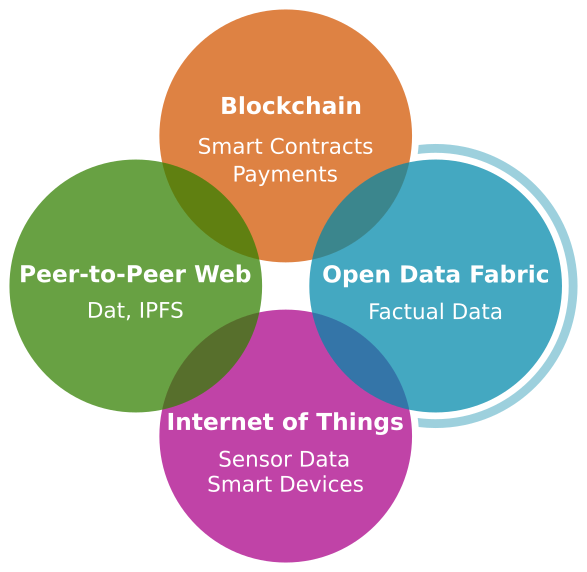
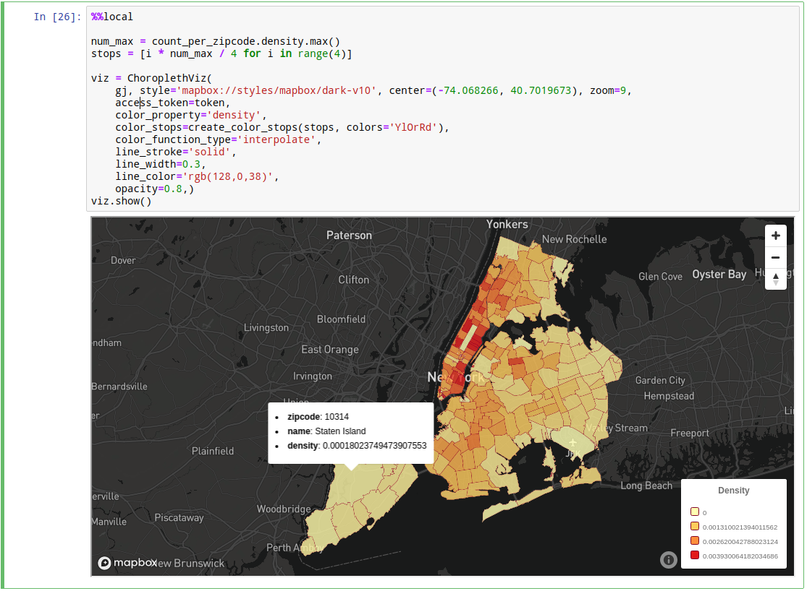

# Kamu <!-- omit in toc -->

Welcome to `kamu` - a new-generation data management and transformation tool!

- [About](#about)
- [Learning Materials](#learning-materials)
- [Features](#features)
- [Important Disclaimer](#important-disclaimer)
- [Documentation](#documentation)

## About

`kamu` is a reference implementation of [Open Data Fabric](https://github.com/kamu-data/open-data-fabric) - a **Web 3.0 technology** that powers a distributed structured data supply chain for providing timely, high-quality, and verifiable data for data science, smart contracts, web and applications.

Using `kamu` you can become a member of the world's first **peer-to-peer data pipeline** that:

- Connects publishers and consumers of data **worldwide**.
- Enables effective **collaboration** of people around data transformation and cleaning.
- Ensures data propagates with **minimal latency**.
- Provides the most complete, secure, and fully accurate **lineage and provenance** information on where every piece of data came from and how it was produced.
- Guarantees **reproducibility** of all data workflows.

## Learning Materials

- [Kamu Blog: Introducing Open Data Fabric](https://www.kamu.dev/blog/introducing-odf/) - a casual introduction.
- [Open Data Fabric protocol specification](https://github.com/kamu-data/open-data-fabric) - technical overview and many gory details.

## Features

- **For Data Publishers**
  - Create and share your own dataset with the world
  - Ingest any existing data set from the web
  - Easily keep track of any updates to the data source in the future
  - Close the feedback loop and see who and how uses your data
    

- **For Data Professionals**
  - Collaborate on cleaning and improving data of existing datasets
  - Create derivative datasets by transforming, enriching, and summarizing data others have published
  - Write query once - run it forever with one of our state of the art stream processing engines
  - Always stay up-to-date by pulling latest updates from the data sources with just one command
  - Built-in support for GIS data

- **For Data Consumers**
  - Download a dataset from a shared repository
  - Easily verify that all data comes from trusted sources
  - Audit the chain of transformations this data went through
  - Validate that downloaded data was in fact produced by the declared transformations

- **For Data Exploration**
  - Explore data and run ad-hoc SQL queries (backed by the power of Apache Spark)
    
  - Launch a Jupyter notebook with one command
  - Join, filter, and shape your data using SQL
  - Visualize the result using your favorite library
    

## Important Disclaimer
`kamu` is an **alpha quality** software. Our main goal currently is to demonstrate the potential of the [Open Data Fabric](https://github.com/kamu-data/open-data-fabric) protocol and its transformative properties to the community and the industry and validate our ideas.

Naturally, we don't recommend using `kamu` for any critical tasks - it's definitely **not prod-ready**. We are, however absolutely delighted to use `kamu` for our personal data analytics needs and small projects, and hoping you will enjoy it too.

If you do - simply make sure to **maintain your source data separately** and don't rely on `kamu` for data storage. This way any time a new version comes out that breaks some compatibility you can simply delete your kamu workspace and re-create it from scratch in a matter of seconds.

Also, please **be patient with current performance** and resource usage. We fully realize that waiting 15s to process a few KiB of CSV isn't great. Stream processing technologies is a relatively new area, and the data processing engines `kamu` uses (e.g. Apache Spark and Flink) are tailored to run in large clusters, not on a laptop. They take a lot of resources to just boot up, so the start-stop-continue nature of `kamu`'s transformations is at odds with their design. We are hoping that the industry will better recognize our use-case and expect to see a better support for it in future. We are committed to improving the performance significantly in the near future.

## Documentation
- **[Installation](docs/install.md)**
- **[First Steps](docs/first_steps.md)**
- **Examples**
  - **[Currency Conversion](docs/examples/currency_conversion.md)** [temporal-table joins]
  - **[Stock Market Trading Data Analysis](docs/examples/trading.md)** [aggregations, temporal-table joins, watermarks, notebooks]
  - **[Overdue Order Shipments Detection](docs/examples/overdue_shipments.md)** [stream-to-stream joins, watermarks]
  - **[Housing Prices Analysis](docs/examples/housing_prices.md)** [GIS functions and joins, notebooks]
- **Ingesting Data**
  - Supported Formats
  - Merge Strategies
- **Transforming Data**
  - Streaming Aggregations
  - Temporal Table Joins
  - Stream-to-Stream Joins
  - Watermarks
  - Geo-Spatial Data
- **[Exploring Data](docs/exploring_data.md)**
- **[Sharing data](docs/sharing_data.md)**
- **[Troubleshooting](docs/troubleshooting.md)**
- **Reference**
  - **[Metadata Schemas](https://github.com/kamu-data/open-data-fabric/blob/master/open-data-fabric.md#datasetsnapshot-schema)**
  - Supported Engines
  - **[Supported Remotes](docs/sharing_data.md#remote-types)**
- **Contributing**
  - Contribution Guidelines
  - **[Developer Guide](docs/developer_guide.md)**
