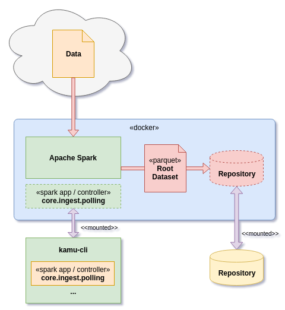
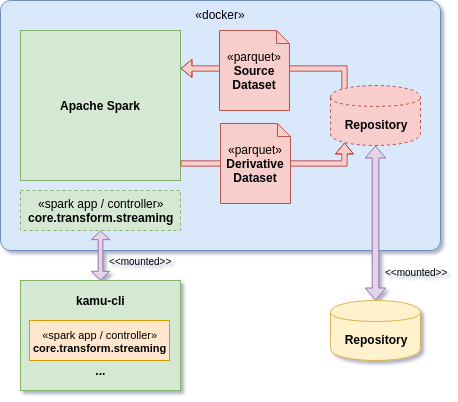
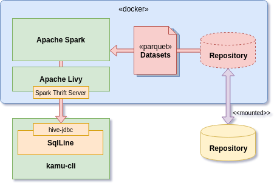
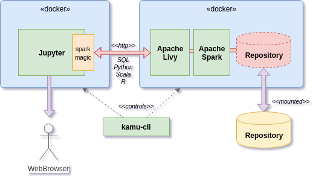

# Architecture <!-- omit in toc -->

Note: this page is outdated. See [Open Data Fabric](https://github.com/kamu-data/open-data-fabric) for technical details.

## 3rd Party Components

* [Apache Parquet](https://parquet.apache.org/) - Structured data format optimized for querying
* [Apache Spark](https://spark.apache.org/) - Data processing and analytics engine
* [GeoSpark](http://geospark.datasyslab.org/) - GIS extension for Spark
* [Apache Livy](https://livy.incubator.apache.org) - Multi-user HTTP/JDBC gateway for Spark
* [Jupyter Hub](https://jupyter.org/) - Interactive computing environment
* [SparkMagic](https://github.com/juliusvonkohout/sparkmagic) - Jupyter to Livy connector
* [SqlLine](https://github.com/julianhyde/sqlline) - SQL command shell
* [Hive JDBC connector](https://hive.apache.org/) - Lets `SqlLine` connect to Livy via JDBC protocol
* [Docker](https://www.docker.com/) - Container-based virtualization tool used to run different components in isolation

## Runtime Configurations

Depending on the task `kamu` utilizes several different runtime configurations:

### Root Pull

### Derivative Transform

### SQL Shell

### Notebook

