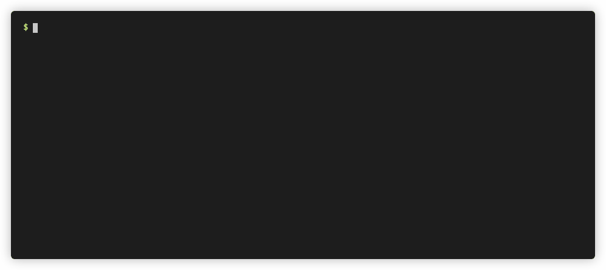
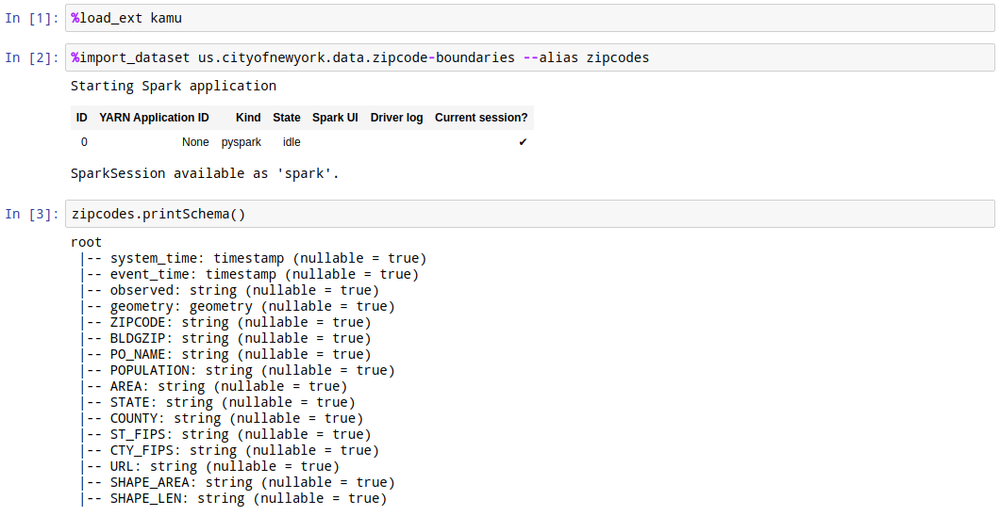
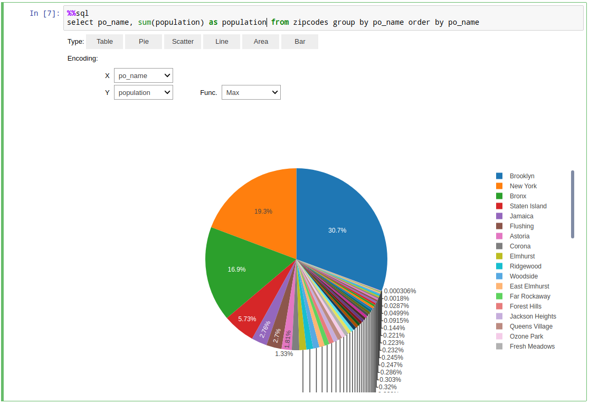

# First Steps <!-- omit in toc -->

This tutorial is also available in a video form:

[](http://www.youtube.com/watch?v=UpT2tvf3r0Y "Kamu 101 - First Steps")

- [Using the help command](#using-the-help-command)
- [Getting data in](#getting-data-in)
  - [Initializing the workspace](#initializing-the-workspace)
  - [Adding a dataset](#adding-a-dataset)
- [Exploring data](#exploring-data)
  - [SQL shell](#sql-shell)
  - [Notebooks](#notebooks)


This tutorial will give you a high-level tour of `kamu` and show you how it works through examples.

We assume that you have already followed the [installation steps](./install.md) and have `kamu` tool ready.

Throughout this tutorial we will be using the [Zip Code Boundaries](https://data.cityofnewyork.us/Business/Zip-Code-Boundaries/i8iw-xf4u) dataset, which can be found on [New York Open Data Portal](http://opendata.cityofnewyork.us/).


## Using the help command
When you execute `kamu` or `kamu -h` - the help message about all top-level commands will be displayed.

To get help on individual commands type `kamu <command> -h` - this will usually contain a detailed description of what command does along with usage examples.

Note that some command also have sub-commands, e.g. `kamu repo {add,list,...}`, same help pattern applies to those as well, e.g. `kamu repo add -h`.

## Getting data in

### Initializing the workspace
To work with `kamu` you first need a **workspace** - this is where kamu will store the important information about datasets and the cached data. Let's create one:


```bash
$ mkdir my_workspace
$ cd my_workspace
$ kamu init
$ kamu list
```

As you'd expect the workspace is currently empty.

### Adding a dataset
One of the design principles of `kamu` is to always know exactly where any piece of data came from, so it never simply copies data - instead we create source links to an external data (we'll get into the details of that later). For now let's create such link.



We will use a dataset manifest from the [kamu-repo-contrib](https://github.com/kamu-data/kamu-repo-contrib/blob/master/us.cityofnewyork.data/zipcode-boundaries.yaml) which looks like this:

```yaml
apiVersion: 1
kind: DatasetSnapshot
content:
  id: us.cityofnewyork.data.zipcode-boundaries
  source:
    kind: root
    fetch:
      kind: url
      url: https://data.cityofnewyork.us/api/views/i8iw-xf4u/files/YObIR0MbpUVA0EpQzZSq5x55FzKGM2ejSeahdvjqR20?filename=ZIP_CODE_040114.zip
    read:
      kind: esriShapefile
    merge:
      kind: snapshot
      primaryKey:
      - ZIPCODE
```

Such dataset in `kamu` is called a **root** dataset and is defined by a sequence of following operations:
- `fetch` - obtaining the data from some external source (e.g. HTTP/FTP)
- `prepare` (optional) - steps for preparing data for ingestion (e.g. extracting an archive)
- `read` - reading the data into a structured form
- `preprocess` (optional) - shaping the structured data and converting types into best suited form
- `merge` - merging the new data from the source with the history of previously seen data

> To create your own dataset manifests use `kamu new` command - it outputs a well-annotated template that you can customize for your needs.

Note that the data file we are ingesting is in ESRI Shapefile format, which is a common format for geo-spatial data, so we are using a special `esriShapefile` reader in our dataset manifest.

Let's add it to our workspace by giving `kamu` this file's URL:

```bash
$ kamu add https://raw.githubusercontent.com/kamu-data/kamu-repo-contrib/master/us.cityofnewyork.data/zipcode-boundaries.yaml
```

At this point no data was yet loaded from the source, so let's fetch it:

```bash
$ kamu pull --all
```

When you `pull`, `kamu` will go and check the data source for any new data that we didn't see yet. If there was any - it will be downloaded, decompressed, parsed into the structured form, preprocessed and saved locally.

Whenever you `pull` data in future only the new data that `kamu` haven't seen yet will be added to the dataset. In fact `kamu` preserves the complete history of all data - this is what enables you to have stable references to data, lets you "time travel", and establish from where and how certain data was obtained (provenance). We will discuss this in depth in further tutorials.

For now it suffices to say that all data is tracked by `kamu` in a series of blocks. The `Committed new block X` message you've seen during the `pull` tells us that the new data block was appended. You can inspect those blocks using the `log` command:

```bash
$ kamu log us.cityofnewyork.data.zipcode-boundaries
```

## Exploring data

Since you might not have worked with this dataset before you'd want to explore it first. For this `kamu` provides two tools:
* SQL shell
* Jupyter Notebooks integration

### SQL shell
SQL is the _lingua franca_ of the data science and `kamu` uses it extensively. So naturally it provides you a simple way to run ad-hoc queries on data.


Following comand will drop you into the SQL shell:
```bash
$ kamu sql
```

Under the hood it starts [Apache Spark](https://spark.apache.org/), so all of its powerful SQL engine is now available to you.

All datasets in your workspace should be available to you as tables:

```bash
kamu> show tables;
```

You can use `describe` to inspect the dataset's schema:

```bash
kamu> describe `us.cityofnewyork.data.zipcode-boundaries`;
```

> Note the extra back ticks needed to treat the dataset ID containing dots as a table name.

For brevity you can create aliases as:

```bash
kamu> create temp view zipcodes as (select * from `us.cityofnewyork.data.zipcode-boundaries`);
```

And of course you can run queries against any dataset:

```bash
0: kamu> select po_name, sum(population) from zipcodes group by po_name;
```

Use `Ctrl+D` to exit the SQL shell.

SQL is a widely supported language, so `kamu` can be used in conjuction with many other tools that support it, such as Tableau and Power BI. Use following command to expose `kamu` data through the JDBC server:

```bash
$ kamu sql server
```

The `kamu sql` is a very powerful command that you can use both interactively or for scripting. We encourage you to explore more of its options through `kamu sql --help`.

### Notebooks

Kamu also connects the power of Apache Spark with the [Jupyter Notebook](https://jupyter.org/) server. You can get started by running:

```bash
$ kamu notebook -e MAPBOX_ACCESS_TOKEN
```

> Note: Above we do one extra thing - we tell `kamu` to pass the [MapBox](https://www.mapbox.com/) access token from the `MAPBOX_ACCESS_TOKEN` environment variable I have on my machine into Jupyter - we'll make use of it later. If you don't have a MapBox token - simply run `kamu notebook`.

Executing this should open your default browser with a Jupyter running in it.

From here let's create a `PySpark` notebook. We start our notebook by loading `kamu` extension:

```
%load_ext kamu
```

After this the `import_dataset` command becomes available and we can load the dataset and alias it by doing:

```
%import_dataset us.cityofnewyork.data.zipcode-boundaries --alias zipcodes
```



This will take a few seconds as in the background it creates Apache Spark session, and it is Spark that loads the dataset into what it calls a "dataframe".

You can then start using the `zipcodes` dataframe in the exact same way you would in an interactive `spark-shell`.

There few very important things to understand here:
- Spark and Jupyter are running in separate processes
- The commands you execute in the notebook are executed "remotely" and the results are transferred back
- This means that it doesn't really matter if your data is located on your machine or somewhere else - the notebook will work the same

The dataframe is automatically exposed in the SQL engine too, and you can run SQL queries using `%%sql` annotation:


Thanks to the [sparkmagic](https://github.com/jupyter-incubator/sparkmagic) library you also get some simple instant visualizations for results of your queries.



After you are done joining, filtering, and shaping the data you can choose to get it out of the Spark into the Jupyter notebook kernel.

Let's make this more interesting and try to visualize the population density map of New York's zipcodes.

Following command executes an SQL query and using `-o count_per_zipcode` transfers the result into the notebook as [Pandas](https://pandas.pydata.org/) dataframe:


> Note that we had to convert the geometry data into text here, as its stored in a binary format which Pandas doesn't understand. We also had to change projections, which is very easy using [Apache Sedona](http://incubator.apache.org/projects/sedona.html) (formerly known as GeoSpark) spatial function. More on geometry later.

Now that we have the data in Jupyter - we can use any of your favorite tools and libraries to further process it or visualize it. With a little bit of tinkering we can use the [mapboxgl](https://github.com/mapbox/mapboxgl-jupyter) library to display our density map as a choropleth chart:


You can find this as well as many other notebooks in [kamu-repo-contrib](https://github.com/kamu-data/kamu-repo-contrib) repo.

Don't get distracted by the pretty notebooks however - the true power of `kamu` lies in how it manages data, letting you to reliably track it, transform it, and share results with your peers in an easily reproducible an verifiable way. So make sure to check out our other tutorials!
