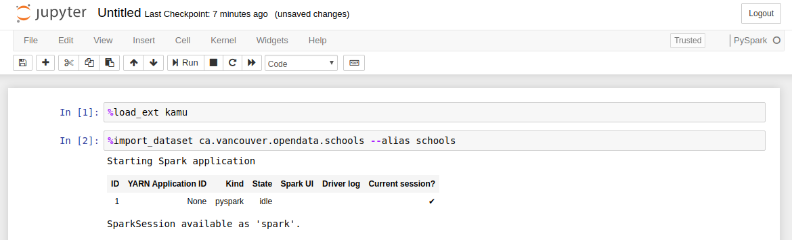
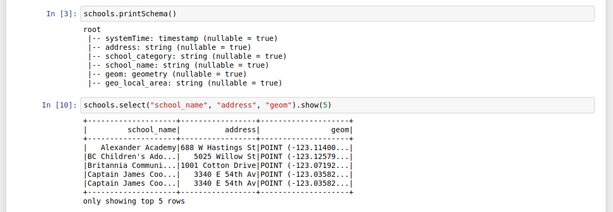
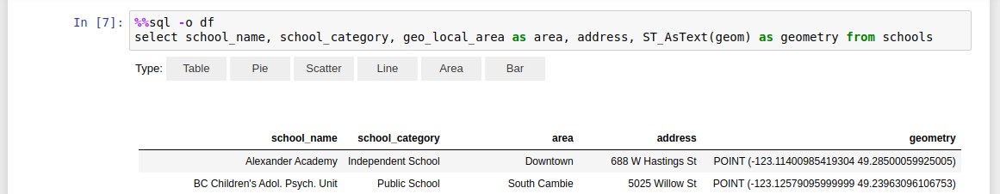
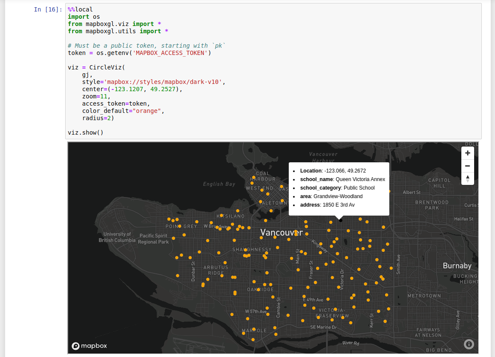

# First Steps

- [First Steps](#first-steps)
  - [Getting data in](#getting-data-in)
    - [Initializing the workspace](#initializing-the-workspace)
    - [Adding a dataset](#adding-a-dataset)
  - [Exploring data](#exploring-data)
    - [SQL shell](#sql-shell)
    - [Notebook](#notebook)

This tutorial will take you through simple first steps you can make with `kamu` and show you how it works through examples.

We assume that you have already followed the [installation steps](./install.md) and have `kamu` tool ready.

We'll be using a simple Vancouver Schools dataset, which can be found on [Vancouver Open Data Portal](https://opendata.vancouver.ca/explore/dataset/schools/information/).


## Getting data in


### Initializing the workspace
To work with `kamu` you first need a **workspace** - this is where kamu will store the important information about datasets and the cached data. Let's create one:

```bash
$ mkdir my_repo
$ cd my_repo

$ kamu init
[INFO] Initialized an empty workspace
```

As you'd expect the workspace is currently empty:

```bash
$ kamu list
+----+------+
| ID | Kind |
+----+------+
+----+------+
```

### Adding a dataset
One of the core ideas of `kamu` is to always know exactly where any piece of data came from. So it never simply copies data, but rather links datasets together. But we'll get into the details of that later.

For now let's create such link. We will use a dataset definition from the [kamu-repo-contrib](https://github.com/kamu-data/kamu-repo-contrib/blob/master/ca.vancouver.opendata/schools/ca.vancouver.opendata.schools.yaml) which looks like this:

```yaml
apiVersion: 1
kind: Dataset
content:
  id: ca.vancouver.opendata.schools
  rootPollingSource:
    fetch:
      kind: fetchUrl
      url: https://opendata.vancouver.ca/explore/dataset/schools/download/?format=csv&timezone=America/Los_Angeles&use_labels_for_header=true
    read:
      kind: csv
      header: true
      delimiter: ';'
      quote: '"'
      escape: '"'
      nullValue: ''
    preprocess:
    - view: output
      query: >
        SELECT
          address,
          school_category,
          school_name,
          ST_GeomFromGeoJSON(geom) as geom,
          geo_local_area
        FROM input
    merge:
      kind: snapshot
      primaryKey:
      - school_name
```

Such dataset in kamu is called **root** dataset and is defined by a sequence of following operations:
- `fetch` - obtaining the data from some external source (e.g. HTTP/FTP)
- `prepare` (optional) - steps for preparing data for ingestion (e.g. extracting an archive)
- `read` - reading the data into a structured form
- `preprocess` (optional) - shaping the structured data and converting types into best suited form
- `merge` - merging the new data from the source with the history of previously seen data

Let's add it to our workspace:

```bash
$ kamu add https://raw.githubusercontent.com/kamu-data/kamu-repo-contrib/master/ca.vancouver.opendata/schools/ca.vancouver.opendata.schools.yaml

$ kamu list
+-------------------------------+------+
| ID                            | Kind |
+-------------------------------+------+
| ca.vancouver.opendata.schools | Root |
+-------------------------------+------+
```

At this point no data was yet loaded from the source, so let's fetch it:

```
$ kamu pull --all
[INFO] Starting Spark job
[INFO] Updated 1 datasets
```

When you `pull`, the tool will go and check if any new data that we didn't see yet was added to the data source. If there was - it will be downloaded, decompressed, parsed into the structured form, preprocessed and saved locally. The final steps of loading and shaping the data are powered by [Apache Spark](https://spark.apache.org/).


## Exploring data

Since you probably never worked with this dataset before you'd want to explore it first. For this `kamu` provides two tools:
* SQL shell
* Jupyter Notebooks integration

### SQL shell
SQL is the _lingua franca_ of the data science and `kamu` uses it extensively. So naturally it provides you a simple way to run adhoc queries on data.


Following comand will drop you into the SQL shell:
```bash
$ kamu sql
```

Under the hood it starts [Apache Spark](https://spark.apache.org/), so all of its powerful SQL engine is now available to you.

You can immediately run a query against any dataset:

```bash
0: kamu> select school_name from parquet.`ca.vancouver.opendata.schools` limit 5;
+---------------------------------------+
|              school_name              |
+---------------------------------------+
| Alexander Academy                     |
| BC Children's Adol. Psych. Unit       |
| Britannia Community Secondary         |
| Captain James Cook Elementary         |
| Captain James Cook StrongStart Centre |
+---------------------------------------+
5 rows selected (0.132 seconds)
```

This is a bit verbose, so usually you'd want to create an alias to the dataset:

```bash
0: kamu> create temporary view schools as (select * from parquet.`ca.vancouver.opendata.schools`);
+--------+
| Result |
+--------+
+--------+
No rows selected (0.092 seconds)

0: kamu> describe schools;
+-----------------+-----------+---------+
|    col_name     | data_type | comment |
+-----------------+-----------+---------+
| systemTime      | timestamp |         |
| address         | string    |         |
| school_category | string    |         |
| school_name     | string    |         |
| geom            | geometry  |         |
| geo_local_area  | string    |         |
+-----------------+-----------+---------+
6 rows selected (0.056 seconds)

0: kamu> select school_name, address from schools where school_name like('%Cook%');
+---------------------------------------+----------------+
|              school_name              |    address     |
+---------------------------------------+----------------+
| Captain James Cook Elementary         | 3340 E 54th Av |
| Captain James Cook StrongStart Centre | 3340 E 54th Av |
+---------------------------------------+----------------+
2 rows selected (0.091 seconds)
```

Use `Ctrl+D` to exit the SQL shell.

SQL is a widely supported language, so `kamu` can be used in conjuction with many other tools that support it, such as Tableau and Power BI. Use following command to expose `kamu` data through the JDBC server:

```bash
$ kamu sql server
```

The `kamu sql` is a very powerful command that you can use both interactively or for scripting. We encourage you to explore more of its options through `kamu sql --help`.

### Notebook

Kamu also connects the power of Apache Spark with the [Jupyter Notebook](https://jupyter.org/) server. You can get started by running:

```bash
$ kamu notebook -e MAPBOX_ACCESS_TOKEN
```

> Note: Above we do one extra thing - we tell `kamu` to pass the [MapBox](https://www.mapbox.com/) access token from the `MAPBOX_ACCESS_TOKEN` environment variable I have on my machine into Jupyter. We'll make use of it later.

Executing this should open your default browser with a Jupyter running in it.

From here let's create a `PySpark` notebook. We start our notebook by loading `kamu` extension:

```
%load_ext kamu
```

After this the `import_dataset` command becomes available and we can load the dataset and alias it by doing:

```
%import_dataset ca.vancouver.opendata.schools --alias schools
```



This will take a few seconds as in the background it creates Apache Spark session, and it is Spark that loads the dataset into what it calls a "dataframe".

You can then start using the `schools` dataframe in the exact same way you would in an interactive `spark-shell`:



There few very important things to understand here:
- Spark and Jupyter are running in separate processes
- The commands you execute in the notebook are executed "remotely" and the results are transfered back
- This means that it doesn't really matter if your data is located on your machine or somewhere else - the notebook will work the same

The dataframe is automatically exposed in the SQL engine too, and you can run SQL queries using `%%sql` annotation:


Thanks to the [sparkmagic](https://github.com/jupyter-incubator/sparkmagic) library you also get some simple instant visualizations for results of your queries.

After you are done joining, filtering, and shaping the data the way you want it you can choose to get it out of the Spark into the actual Jupyter notebook kernel.

Following command executes a query and with `-o df` transfers the result into the notebook as [Pandas](https://pandas.pydata.org/) dataframe:



> Note that we had to convert the geometry data into text here, because Pandas doesn't support it (more on geometry later).

Now that you have the data in Jupyter - you can use any of your favorite tools and libraries to further process it or visualize it. Below we are using the [mapboxgl](https://github.com/mapbox/mapboxgl-jupyter) library to show the schools on a map:


