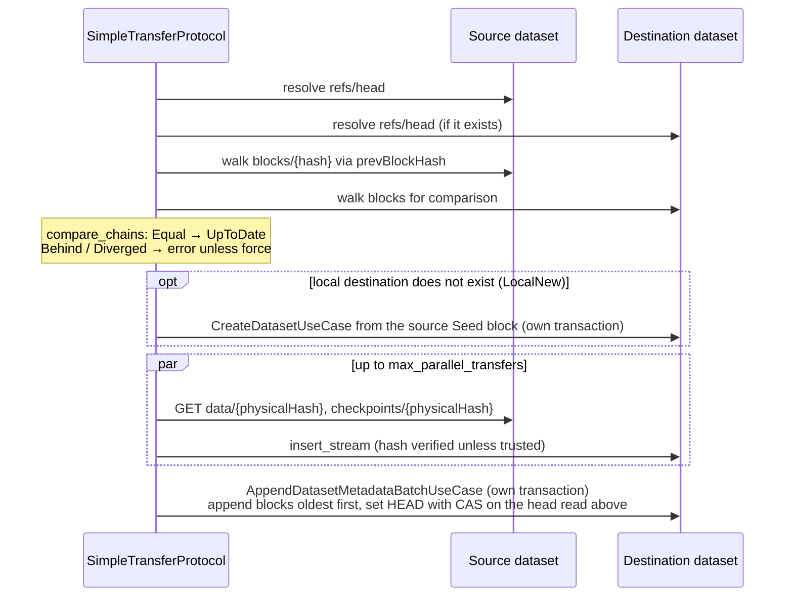
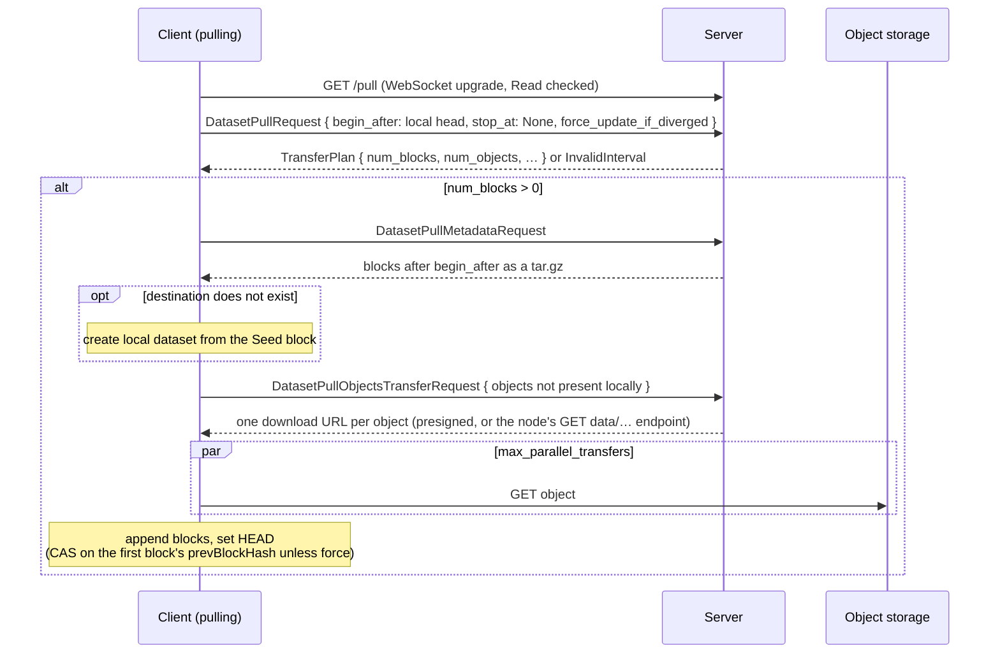
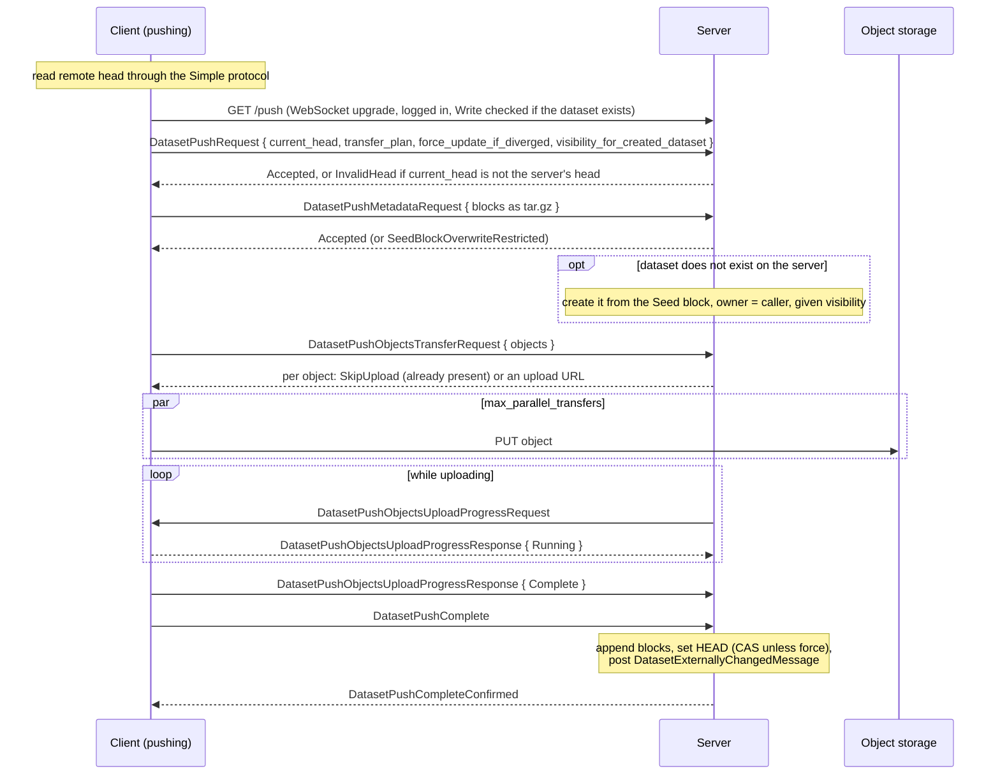

# Dataset Sync — Architecture

> **Status:** in production; covers copying datasets between a local workspace and remote
> repositories: `SyncService`, the Simple and Smart Transfer Protocols on both the client and
> the server side, `kamu push`, remote repositories and aliases, and IPFS. Behaviour that
> surprises newcomers is listed in [§12](#12-testing--gotchas).
> Type names and paths below are drawn from source — when they drift, treat the source as canonical
> and update this page.

---

## Agent / newcomer quick-start

**One-paragraph mental model.** A dataset is a content-addressed metadata chain plus data and
checkpoint objects named by their hashes, so copying it means: find which blocks the destination
lacks, copy the objects those blocks reference, append the blocks, and move the destination's
`HEAD`. **`SyncService`** does exactly that between two **sync refs** — a local dataset, a local
dataset to be created, or a remote dataset behind a URL — and picks a protocol from the URLs. The
**Simple Transfer Protocol** needs nothing from the remote but readable files (`refs/head`,
`blocks/`, `data/`, `checkpoints/`), works over the local filesystem, S3 and HTTP, and does all
the comparison work on the client. The **Smart Transfer Protocol** (`odf+http(s)://` URLs) talks
to a Kamu node over a WebSocket: the server computes the block delta, ships the blocks as one
tarball, and hands out URLs (often presigned S3 URLs) for the objects, which the client transfers
in parallel; it is the only way to *write* to a remote node. `kamu pull` uses sync for datasets
with a pull alias, `kamu push` always syncs, and the Kamu node serves both protocols.

**Where to start reading, by intent:**

| You want to… | Start at |
| --- | --- |
| Know the ODF concepts this builds on | [§2 ODF concepts](#2-odf-concepts) |
| See which protocol a sync uses | [§5 Choosing a protocol](#5-choosing-a-protocol) |
| Follow a Simple Transfer Protocol sync | [§6 Simple Transfer Protocol](#6-simple-transfer-protocol) |
| Follow a smart pull or push, client and server | [§7 Smart Transfer Protocol](#7-smart-transfer-protocol) |
| Understand `kamu push` and remote aliases | [§8 Push](#8-push), [§9 Remote repositories and aliases](#9-remote-repositories-and-aliases) |
| Know who may read or write over the wire | [§10 Authorization](#10-authorization) |
| Find the file for X | [§13 Reference map](#13-filecrate-reference-map) |

---

## Table of contents

- [1. Purpose \& scope](#1-purpose--scope)
- [2. ODF concepts](#2-odf-concepts)
- [3. Layers and crates](#3-layers-and-crates)
- [4. Sync requests](#4-sync-requests)
- [5. Choosing a protocol](#5-choosing-a-protocol)
- [6. Simple Transfer Protocol](#6-simple-transfer-protocol)
- [7. Smart Transfer Protocol](#7-smart-transfer-protocol)
- [8. Push](#8-push)
- [9. Remote repositories and aliases](#9-remote-repositories-and-aliases)
- [10. Authorization](#10-authorization)
- [11. Committing, validation and errors](#11-committing-validation-and-errors)
- [12. Testing \& gotchas](#12-testing--gotchas)
- [13. File/crate reference map](#13-filecrate-reference-map)

---

## 1. Purpose & scope

This page covers how one dataset is copied from a source to a destination, whichever side is
remote, and the server endpoints that let other clients copy from and to a Kamu node.

Out of scope, each with its own owner:

| Topic | Owner |
| --- | --- |
| When `kamu pull` syncs a dataset, how pull requests and local aliases are resolved, how sync jobs are scheduled and authorized among other jobs | [dataset-pull.md](dataset-pull.md) |
| How the update task runs a sync job on the server | [task-system.md](task-system.md) |
| How the server reacts to a dataset changed by a push: flows, sensors | [flow-system.md](flow-system.md) |
| How `HEAD` updates post `DatasetReferenceMessage` | [root-dataset-ingest.md](root-dataset-ingest.md#8-committing-and-concurrency) |
| The wire format of the Smart Transfer Protocol messages | the ODF [OpenAPI](https://github.com/open-data-fabric/open-data-fabric/blob/master/protocols/smart-transfer-protocol.openapi.yaml) and [AsyncAPI](https://github.com/open-data-fabric/open-data-fabric/blob/master/protocols/smart-transfer-protocol.asyncapi.yaml) specs |

---

## 2. ODF concepts

The [Open Data Fabric specification](https://github.com/open-data-fabric/open-data-fabric) owns
the repository model and both protocols. This page does not restate them; read these first:

| Topic | Spec / RFC |
| --- | --- |
| Repositories, aliases and references | [Repository](https://github.com/open-data-fabric/open-data-fabric/blob/master/open-data-fabric.md#repository), [Aliases and References](https://github.com/open-data-fabric/open-data-fabric/blob/master/open-data-fabric.md#aliases-and-references) |
| Content addressability of blocks and objects | [RFC-003](https://github.com/open-data-fabric/open-data-fabric/blob/master/rfcs/003-content-addressability.md), [RFC-006](https://github.com/open-data-fabric/open-data-fabric/blob/master/rfcs/006-checkpoints-as-files.md) |
| Simple Transfer Protocol | [Simple Transfer Protocol](https://github.com/open-data-fabric/open-data-fabric/blob/master/open-data-fabric.md#simple-transfer-protocol), [RFC-007](https://github.com/open-data-fabric/open-data-fabric/blob/master/rfcs/007-simple-transfer-protocol.md) |
| Smart Transfer Protocol | [Smart Transfer Protocol](https://github.com/open-data-fabric/open-data-fabric/blob/master/open-data-fabric.md#smart-transfer-protocol), [RFC-008](https://github.com/open-data-fabric/open-data-fabric/blob/master/rfcs/008-smart-transfer-protocol.md), [OpenAPI](https://github.com/open-data-fabric/open-data-fabric/blob/master/protocols/smart-transfer-protocol.openapi.yaml), [AsyncAPI](https://github.com/open-data-fabric/open-data-fabric/blob/master/protocols/smart-transfer-protocol.asyncapi.yaml) |

---

## 3. Layers and crates

| Layer | Crate / path | Contents |
| --- | --- | --- |
| Domain types | `kamu-core` — [`sync_service.rs`](../../src/domain/core/src/services/sync_service.rs) | `SyncService`, `SyncRequest`, `SyncRef`, `SyncOptions`, `SyncResult`, `SyncError`, listeners and stats |
| Chain comparison | `kamu-core` — [`metadata_chain_comparator.rs`](../../src/domain/core/src/utils/metadata_chain_comparator.rs) | `MetadataChainComparator::compare_chains` → equal / ahead / behind / diverged |
| Sync service and request builder | `kamu` — [`src/infra/core/src/services/sync/`](../../src/infra/core/src/services/sync) | `SyncServiceImpl` (protocol dispatch, IPFS), `SyncRequestBuilder` |
| Simple protocol client | `kamu` — [`simple_transfer_protocol.rs`](../../src/infra/core/src/utils/simple_transfer_protocol.rs) | `SimpleTransferProtocol` |
| Smart protocol client trait | `kamu` — [`smart_transfer_protocol.rs`](../../src/infra/core/src/utils/smart_transfer_protocol.rs) | `SmartTransferProtocolClient`, `TransferOptions` |
| Smart protocol client and server | `kamu-adapter-http` — [`src/adapter/http/src/smart_protocol/`](../../src/adapter/http/src/smart_protocol) | `WsSmartTransferProtocolClient`, `AxumServerPullProtocolInstance`, `AxumServerPushProtocolInstance`, messages, `protocol_dataset_helper` |
| Server HTTP endpoints | `kamu-adapter-http` — [`simple_protocol/handlers.rs`](../../src/adapter/http/src/simple_protocol/handlers.rs), [`http_server_dataset_router.rs`](../../src/adapter/http/src/http_server_dataset_router.rs) | `refs`, `blocks`, `data`, `checkpoints` (GET and PUT), `pull` and `push` WebSocket upgrades |
| Appending incoming blocks | `kamu-datasets-services` — `AppendDatasetMetadataBatchUseCaseImpl`, `CreateDatasetUseCaseImpl` | block validation, `HEAD` update |
| Push | `kamu` — [`push_dataset_use_case_impl.rs`](../../src/infra/core/src/use_cases/push_dataset_use_case_impl.rs), [`push_request_planner_impl.rs`](../../src/infra/core/src/services/push_request_planner_impl.rs); CLI [`push_command.rs`](../../src/app/cli/src/commands/push_command.rs) | `kamu push` |
| Remotes | `kamu` — [`src/infra/core/src/services/remote/`](../../src/infra/core/src/services/remote) | `RemoteRepositoryRegistryImpl`, `RemoteAliasesRegistryImpl`, `RemoteAliasResolverImpl` |

---

## 4. Sync requests

A `SyncRequest` is a pair of `SyncRef`s:

| `SyncRef` | Meaning |
| --- | --- |
| `Local(ResolvedDataset)` | a dataset in this node or workspace |
| `LocalNew(DatasetAlias)` | a local dataset that the sync will create from the source's `Seed` block |
| `Remote(SyncRefRemote)` | a dataset behind a URL, opened through `DatasetFactory` as an `odf::Dataset` over the URL's storage (file, S3, HTTP, IPFS gateway) |

`SyncRequestBuilder::build_sync_request(src_ref, dst_ref, create_dst_if_not_exists)` turns two
`DatasetRefAny`s into a request. A reference counts as local when `DatasetRefAny::as_local_ref`
accepts it (a repo-like prefix that is not a registered repository is read as an account);
otherwise it is resolved to a URL by `RemoteAliasResolver::resolve_pull_url`
([§9](#9-remote-repositories-and-aliases)). The source must have a `HEAD`. A missing local
destination becomes `LocalNew` when creation is allowed and the reference carries an alias.

`SyncOptions`:

| Option | Effect |
| --- | --- |
| `trust_source` | skip block validation and hash recomputation; defaults to "the source is local" |
| `create_if_not_exists` | allow creating the destination (default on) |
| `force` | overwrite the destination even if it is ahead or has diverged |
| `dataset_visibility` | visibility of a dataset created by the sync (default private) |

`SyncResult` is `UpToDate` or `Updated { old_head, new_head, num_blocks }`; `old_head: None` means
the destination was created.

---

## 5. Choosing a protocol

`SyncServiceImpl::sync_impl` dispatches on the two refs:

| Source → destination | Protocol |
| --- | --- |
| any → `ipfs://` | rejected: a CID changes with every update |
| remote → `ipns://` | rejected: pull locally first |
| local → `ipns://<key>` | IPFS add and IPNS publish ([§6.3](#63-ipfs)) |
| `odf+http(s)://` → `odf+http(s)://` | rejected: pull locally first |
| `odf+http(s)://` → any | Smart Transfer Protocol, pull flow ([§7](#7-smart-transfer-protocol)) |
| any → `odf+http(s)://` | Smart Transfer Protocol, push flow |
| anything else (local, `file://`, `s3://`, `http(s)://`) | Simple Transfer Protocol ([§6](#6-simple-transfer-protocol)) |

The `odf+` prefix is stripped (`odf_to_transport_protocol`) before connecting. A plain `http(s)://`
URL is therefore read with the Simple protocol, and is read-only; a registered repository is turned
into an `odf+` URL when a push target is resolved ([§9](#9-remote-repositories-and-aliases)).

---

## 6. Simple Transfer Protocol

### 6.1 Client: `SimpleTransferProtocol::sync`

The same code serves every non-smart direction: remote → local pull, local → remote push to a
file or S3 repository, and local → local copies. Both ends are `odf::Dataset`s, so "remote" only
changes which storage the object reads and writes go to.

1. **Heads and comparison.** `MetadataChainComparator::compare_chains` walks both chains and
   returns `Equal`, `LhsAhead` (the blocks to copy), `LhsBehind` or `Divergence`. Without `force`,
   behind is `DestinationAhead` and divergence is `DatasetsDiverged`. With `force`, the whole
   source chain, `Seed` included, is appended onto the destination; this protocol does not compare
   the two `Seed` blocks.
2. **Create.** A missing local destination is created from the source's `Seed` block, in its own
   transaction, with the requested visibility. The created head must equal the `Seed` hash.
3. **Objects.** Every data slice and checkpoint referenced by the new blocks is streamed from the
   source's object repo to the destination's, `max_parallel_transfers` at a time (default 10,
   `SIMPLE_PROTOCOL_MAX_PARALLEL_TRANSFERS`). With a trusted source the declared hash is passed as
   precomputed; otherwise the local filesystem repo recomputes and checks it. The S3 repo requires
   a precomputed hash (it panics without one), so a sync into S3 storage works only from a trusted
   source, and then stores the stream without checking it.
4. **Blocks.** All new blocks are appended in one call of `AppendDatasetMetadataBatchUseCase`, in
   a transaction, followed by one `set_ref` with `SetRefCheckRefMode::Explicit(dst_head)`: a
   destination that moved since step 1 fails with `UpdatedConcurrently`.

Objects land before the blocks that reference them, so a failure leaves at most unreferenced
objects, never a block with a missing object. A failure after step 2 leaves a destination that
holds only its `Seed`; the next sync continues from it.

### 6.2 Server: read-only endpoints

A Kamu node serves every dataset under `/{dataset}` (single-tenant) or `/{account}/{dataset}`
(multi-tenant), so any Simple protocol client can read it:

| Endpoint | Handler | Action checked |
| --- | --- | --- |
| `GET refs/{reference}` | `dataset_refs_handler` | Read |
| `GET blocks/{block_hash}` | `dataset_blocks_handler` | Read |
| `GET data/{physical_hash}`, `GET checkpoints/{physical_hash}` | `dataset_data_get_handler`, `dataset_checkpoints_get_handler` | Read |
| `PUT data/{physical_hash}`, `PUT checkpoints/{physical_hash}` | `dataset_data_put_handler`, `dataset_checkpoints_put_handler` | Write |

The `PUT` endpoints are not part of the Simple protocol: they are the upload fallback of the Smart
protocol ([§7.3](#73-object-transfer)). Each streams the body into the object repo, verifying it
against the hash in the path. Authorization is done by the router's layers ([§10](#10-authorization)).

### 6.3 IPFS

Pushing to `ipns://<key-id>` adds the local dataset directory to the local IPFS node (`ipfs add`,
ignoring `config` and `info`) and publishes the root CID under that IPNS key. The previous head is
read through the IPFS HTTP gateway only if the key resolves locally; an equal head re-publishes the
old CID to keep the IPNS record alive. Only local filesystem datasets can be added. Reading from
IPFS goes through the gateway as an HTTP Simple protocol source.

---

## 7. Smart Transfer Protocol

The client is `WsSmartTransferProtocolClient`; the server is `AxumServerPullProtocolInstance` /
`AxumServerPushProtocolInstance`, started by `GET {dataset}/pull` and `GET {dataset}/push` WebSocket
upgrades. The client sends `x-odf-smtp-version` on the upgrade request, and the server rejects a
missing or incompatible version before upgrading. The client sends `Authorization: Bearer` with a
token found by `OdfServerAccessTokenResolver` for the server URL (from `kamu login`). Messages are
JSON; a response that can fail is a `Result` of the success type and a typed error. Field names are
the Rust ones (snake_case), not the camelCase of the ODF AsyncAPI specification.

### 7.1 Pull flow

The server builds the plan from the chain interval after `begin_after` up to its head. A
`begin_after` that is not an ancestor of the head is `InvalidInterval`, which the client reports
as `DatasetsDiverged`, even when the local copy is merely ahead of the server;
with `force` the server sends the whole chain instead, and the client refuses it when its `Seed`
has a different dataset ID or kind from the local one (`OverwriteSeedBlock`).

### 7.2 Push flow

Server-side details:

- The upgrade requires a logged-in caller. For a dataset that does not exist yet, the account in
  the URL must be the caller's; the dataset is created when the first metadata arrives.
- Blocks are held in memory from the metadata request until completion, then appended in one
  `AppendDatasetMetadataBatchUseCase` call with full validation and
  `SetRefCheckRefMode::ForceUpdateIfDiverged(force)`.
- Completion posts `DatasetExternallyChangedMessage::smart_transfer_protocol_sync` in a separate
  transaction, which is how flows learn about a push
  ([flow-system.md](flow-system.md#changes-made-outside-flows)).
- Each step that touches the database opens its own short transaction; no transaction spans the
  WebSocket session.

### 7.3 Object transfer

Objects never travel over the WebSocket. For each object the server asks its object repo for an
external URL (`get_external_download_url` / `get_external_upload_url`):

| Storage | URL handed out | Headers |
| --- | --- | --- |
| S3 | a presigned `GET` or `PUT` URL with an expiry | those the presigner requires |
| Local filesystem, other | the node's own `{dataset}/data/{hash}` or `{dataset}/checkpoints/{hash}` endpoint ([§6.2](#62-server-read-only-endpoints)) | the protocol version and the caller's own bearer token |

The client downloads or uploads each object to that URL, at most `max_parallel_transfers` at a
time (default: the machine's available parallelism). On pull the client verifies each object's
hash as it inserts it. On push the server's `PUT` endpoint verifies the hash; a presigned S3
upload is not re-hashed by the server.

---

## 8. Push

`kamu push <dataset>…` builds `PushDatasetUseCase::execute_multi`:

1. **Authorization:** Read on every dataset to push ([§10](#10-authorization)); any failure
   returns only those failures.
2. **Plan:** `PushRequestPlanner::collect_plan` resolves each dataset's target with
   `RemoteAliasResolver::resolve_push_target` ([§9](#9-remote-repositories-and-aliases)).
3. **Sync requests:** source = the local dataset, destination = the target URL.
4. **Sync:** all requests run concurrently (`join_all`) through `SyncService` with the push's
   `SyncOptions`.
5. **Aliases:** if every push succeeded and `add_aliases` is on (the default; `--no-alias` turns it
   off), a push alias with the target URL is stored on each dataset.

`--recursive` and `--all` are accepted by the CLI but `unimplemented!` in the use case. `--to`
names the target (a URL, a `repo/name` alias, or a repository); `--force` and `--visibility` map
to `SyncOptions`.

---

## 9. Remote repositories and aliases

| Registry | Stores | Where |
| --- | --- | --- |
| `RemoteRepositoryRegistryImpl` | named repositories (`kamu repo add <name> <url>`), URL normalized to end with `/` | one YAML manifest per repository in the workspace `repos` directory |
| `RemoteAliasesRegistryImpl` | per-dataset pull and push aliases (`kamu repo alias add`) | the dataset's `info` storage |

`RemoteAliasResolverImpl` turns references into URLs:

| Resolution | Rule |
| --- | --- |
| Pull URL of `repo/name` or `repo/account/name` | `odf+` repository: the repository's `odf+http(s)` URL plus the account (asked from the server's `info` and `accounts/me` when the reference has none and the server is multi-tenant) and the name; other repositories: the repository URL joined with the alias |
| Pull URL of a URL | the URL itself, with a trailing `/` |
| Pull URL of an ID | not supported |
| Push target | `--to` URL as given; otherwise the dataset's single push alias, if it is a URL alias (a `repo/name` push alias is skipped; several aliases are `AmbiguousAlias`); otherwise the only configured repository (none is `EmptyRepositoryList`, several are `AmbiguousRepository`). For a repository, the account comes from the server as above, and the remote dataset name from a lookup of the dataset ID on the server, falling back to the local name |

How `kamu pull` uses pull aliases to decide that a dataset is synced belongs to
[dataset-pull.md](dataset-pull.md#51-resolving-each-request).

---

## 10. Authorization

| Path | Check |
| --- | --- |
| Server, every `{dataset}/…` route | `DatasetResolverLayer` resolves the dataset from the path (optional only for `/push`); `DatasetAuthorizationLayer` requires **Write** for `/push` and every unsafe method (anything but `GET`, `HEAD`, `OPTIONS` and `TRACE`), **Read** otherwise. With `allowAnonymous=false`, `AuthPolicyLayer` rejects anonymous callers first |
| Server push to a new dataset | logged-in caller; the account in the path must be the caller's |
| `kamu pull` sync jobs | Write on an existing destination ([dataset-pull.md](dataset-pull.md#7-authorization)) |
| `kamu push` | Read on each pushed dataset; the remote server decides about the destination |
| Update task sync jobs | none at run time ([dataset-pull.md](dataset-pull.md#8-server-use)) |

`SyncService` and `SyncRequestBuilder` resolve local datasets through the plain registry and check
nothing themselves; callers own authorization.

---

## 11. Committing, validation and errors

| Writer | Validation of incoming blocks | `HEAD` update |
| --- | --- | --- |
| Simple protocol, local source | none (trusted), hashes not recomputed | CAS on the destination head read at the start |
| Simple protocol, remote source | full, hashes recomputed | as above |
| Smart pull client | full | CAS on the first new block's `prevBlockHash`; none with `force` |
| Smart push server | full | as above |

Every block except the `Seed` of a newly created dataset passes through
`AppendDatasetMetadataBatchUseCase` (IPFS publishing aside), which appends without moving the
ref and sets `HEAD` once at the end, so readers see either the old or the new head. Setting `HEAD`
posts `DatasetReferenceMessage`; the smart push server also posts `DatasetExternallyChangedMessage`.

The variants are in `SyncError` (`sync_service.rs`). Two mappings are surprising: a Smart-protocol push
onto a remote that is ahead or has diverged fails with `InvalidInterval`, not `DestinationAhead` or
`DatasetsDiverged`; and server-side internal failures reach the client as `Internal` with the
generic message "Internal error", the cause staying in the server log (the one exception is a
failure while computing the pull transfer plan, whose message is forwarded as is). Of the typed
protocol errors, `InvalidInterval` (→ `DatasetsDiverged` on pull), `SeedBlockOverwriteRestricted`
(→ `OverwriteSeedBlock` on push; on pull the client makes the `Seed` check itself), `RefCollision`
and `NameCollision` keep their meaning; `InvalidHead` becomes `Internal`.

---

## 12. Testing & gotchas

### Testing

- Sync service tests: `src/infra/core/tests/tests/test_sync_service_impl.rs`.
- Smart protocol tests, client against an in-process server, single- and multi-tenant, local and
  S3 storage: `src/adapter/http/tests/tests/test_protocol_dataset_helpers.rs` and the
  `tests_pull` / `tests_push` scenario directories under `src/adapter/http/tests/tests/`.
- CLI and node end-to-end scenarios: `src/e2e/app/cli/repo-tests/src/test_smart_transfer_protocol.rs`,
  `commands/test_pull_command.rs`, `commands/test_repo_command.rs`.

### Behaviour by design

| Area | What happens |
| --- | --- |
| Plain `http(s)://` URLs | Read-only through the Simple protocol; a push to a *registered* `http(s)` repository is rewritten to `odf+http(s)` by `resolve_push_target` and uses the Smart protocol |
| Remote to remote | Only `odf+` → `odf+` and remote → `ipns://` are rejected; any other remote-to-remote pair runs through the Simple protocol, and an `odf+` source with a remote destination fails late with `Internal`. `kamu pull` and `kamu push` never build such a request |
| Created destination | Created in its own transaction before objects and blocks; a failed sync can leave a dataset holding only its `Seed`, and the next sync continues from it |
| Unreferenced objects | A failed or concurrent sync can leave uploaded objects that no block references |
| `force` | Replaces the destination's history from the source. The Smart protocol refuses a different `Seed` (`OverwriteSeedBlock`, `SeedBlockOverwriteRestricted`); the Simple protocol does not check |
| Trusted local source | Local-to-local copies skip validation and hash recomputation |

---

## 13. File/crate reference map

| Concern | File |
| --- | --- |
| Sync types and errors | [`sync_service.rs`](../../src/domain/core/src/services/sync_service.rs) |
| Protocol dispatch, IPFS, URL helpers | [`sync_service_impl.rs`](../../src/infra/core/src/services/sync/sync_service_impl.rs) |
| Sync ref resolution | [`sync_request_builder.rs`](../../src/infra/core/src/services/sync/sync_request_builder.rs) |
| Chain comparison | [`metadata_chain_comparator.rs`](../../src/domain/core/src/utils/metadata_chain_comparator.rs) |
| Simple protocol client | [`simple_transfer_protocol.rs`](../../src/infra/core/src/utils/simple_transfer_protocol.rs) |
| Smart protocol client | [`ws_tungstenite_client.rs`](../../src/adapter/http/src/smart_protocol/ws_tungstenite_client.rs), [`smart_transfer_protocol.rs`](../../src/infra/core/src/utils/smart_transfer_protocol.rs) |
| Smart protocol server | [`axum_server_pull_protocol.rs`](../../src/adapter/http/src/smart_protocol/axum_server_pull_protocol.rs), [`axum_server_push_protocol.rs`](../../src/adapter/http/src/smart_protocol/axum_server_push_protocol.rs) |
| Messages, phases, transfer plans, tarballs, object URLs | [`messages.rs`](../../src/adapter/http/src/smart_protocol/messages.rs), [`phases.rs`](../../src/adapter/http/src/smart_protocol/phases.rs), [`protocol_dataset_helper.rs`](../../src/adapter/http/src/smart_protocol/protocol_dataset_helper.rs) |
| Server endpoints and routing | [`handlers.rs`](../../src/adapter/http/src/simple_protocol/handlers.rs), [`http_server_dataset_router.rs`](../../src/adapter/http/src/http_server_dataset_router.rs), [`dataset_authorization_layer.rs`](../../src/adapter/http/src/middleware/dataset_authorization_layer.rs) |
| Push | [`push_dataset_use_case_impl.rs`](../../src/infra/core/src/use_cases/push_dataset_use_case_impl.rs), [`push_request_planner_impl.rs`](../../src/infra/core/src/services/push_request_planner_impl.rs), [`push_command.rs`](../../src/app/cli/src/commands/push_command.rs) |
| Remote repositories, aliases, URL resolution | [`src/infra/core/src/services/remote/`](../../src/infra/core/src/services/remote) |
