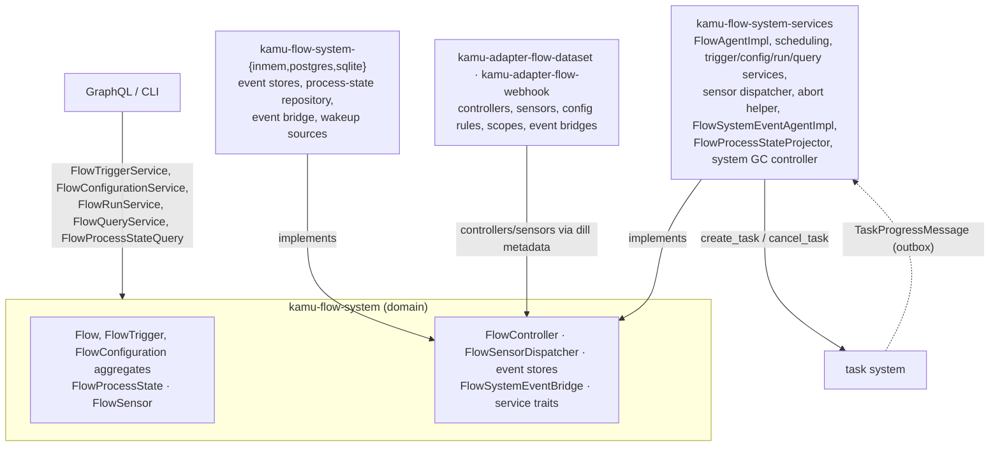
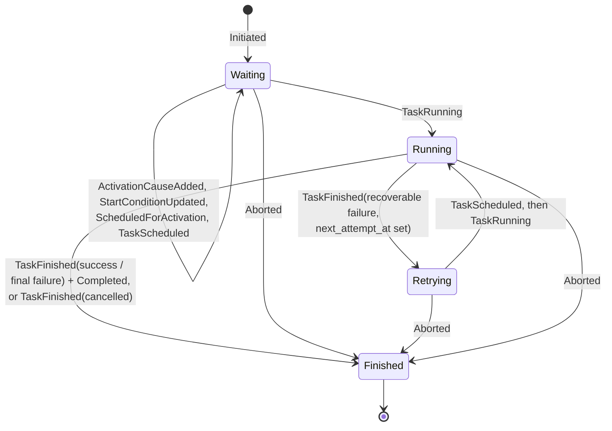
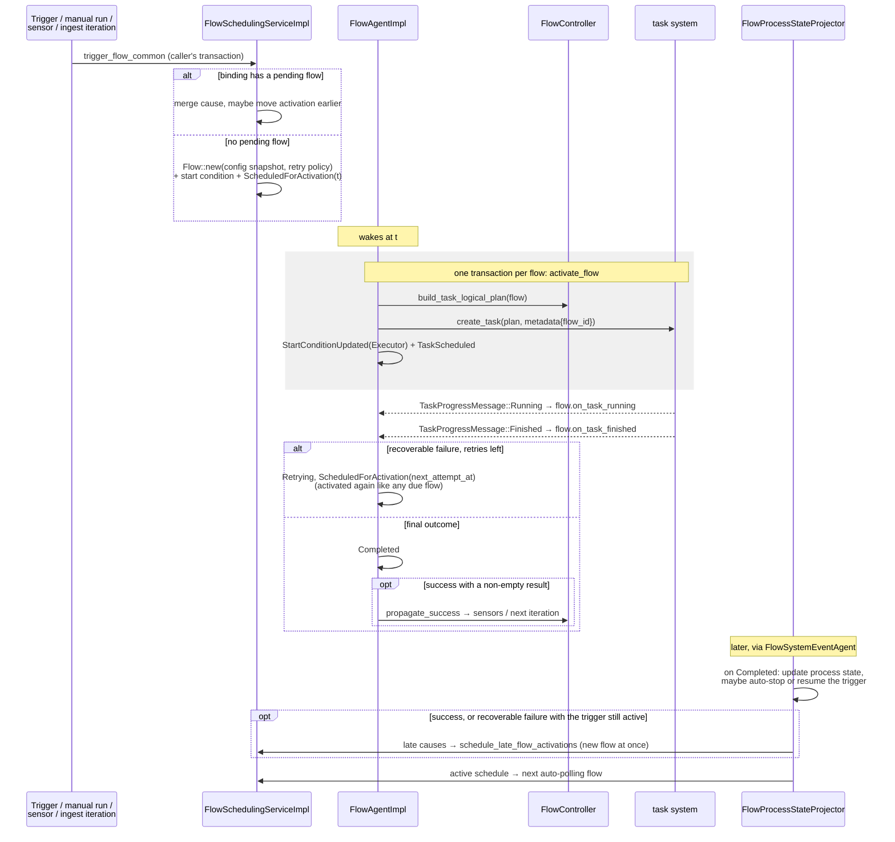
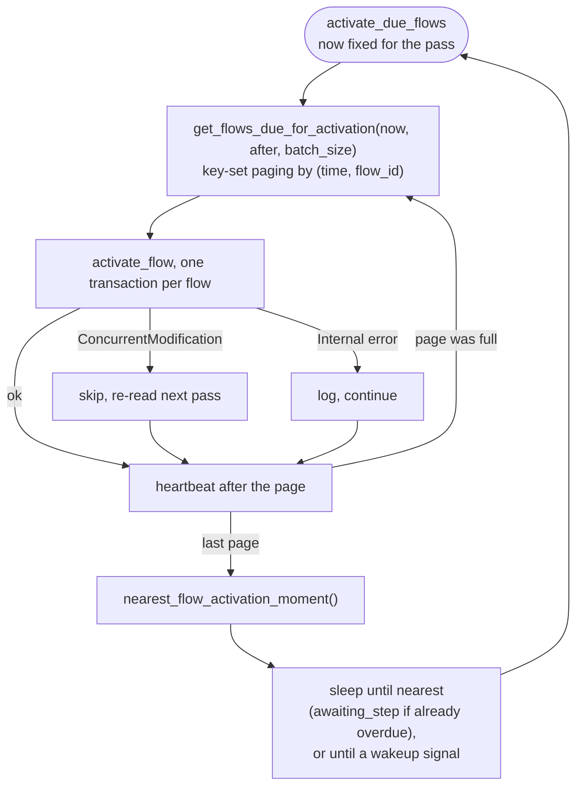
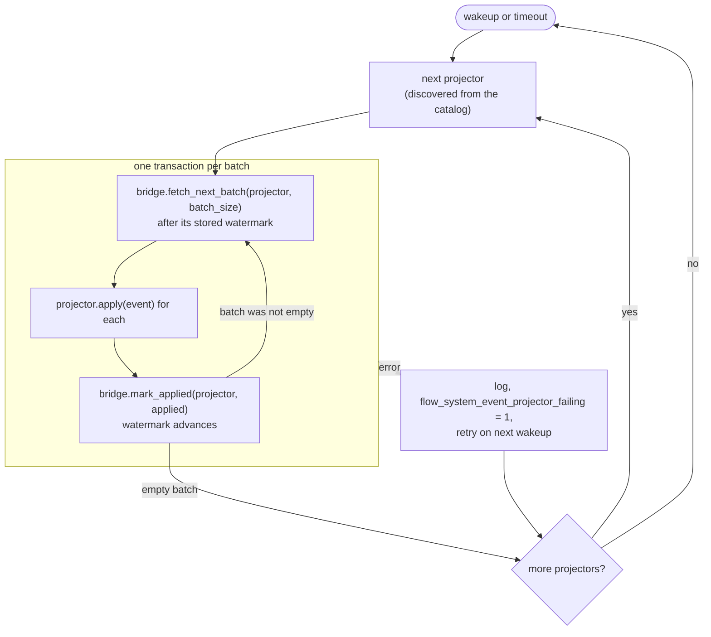
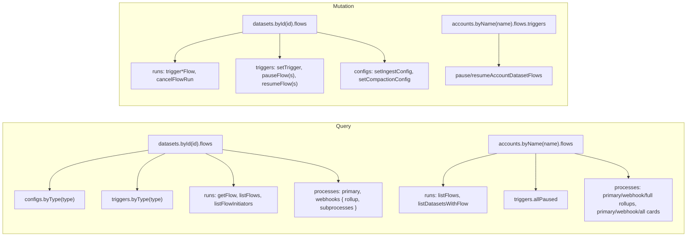

# Flow System — Architecture

> **Status:** in production; decides when work runs, and hands each run to the
> [task system](task-system.md). Known defects and open suspicions are listed in
> [§15](#15-gotchas).
> Type names and paths below are drawn from source — when they drift, treat the source as canonical
> and update this page.

---

## Agent / newcomer quick-start

**One-paragraph mental model.** A **flow binding** names a recurring job: a flow type
(`dev.kamu.flow.dataset.ingest`, `…transform`, `…compact`, `dev.kamu.flow.webhook.deliver`, …) and a
**scope** (a dataset, a webhook subscription, the system). Per binding, users store a **trigger**
(a schedule or a reactive rule, plus a stop policy) and optionally a **configuration** (type-specific
options and a retry policy). A **flow** is one run of a binding — an event-sourced aggregate that
collects **activation causes** (manual, schedule, upstream data change, next ingest iteration), waits
on a **start condition** (schedule, throttling, batching), and when due is **activated** by the
**flow agent**: a **flow controller** for its type builds a task logical plan and the task system
runs it. When the task finishes, the flow agent records the outcome, retries if the failure is
recoverable and the retry policy allows, and on success lets the controller **propagate** it —
typically to **sensors** that start flows of downstream datasets or webhook deliveries. A second
background agent replays all flow, trigger and configuration events into a per-binding **flow
process state** (healthy, failing, paused, auto-stopped); that projector also auto-stops triggers
after too many failures and schedules the next periodic run.

**Where to start reading, by intent:**

| You want to… | Start at |
| --- | --- |
| Learn the vocabulary | [§2 Concepts](#2-concepts) |
| Follow one flow from trigger to completion | [§5 Life of a flow](#5-life-of-a-flow) |
| Understand when a flow is scheduled | [§6 Scheduling](#6-scheduling) |
| See how datasets react to each other | [§8 Sensors and propagation](#8-sensors-and-propagation) |
| Understand health, failures and auto-stop | [§9 Flow process state](#9-flow-process-state) |
| See what each flow type does | [§10 Flow types](#10-flow-types) |
| Read or drive flows through GraphQL | [§12 GraphQL API](#12-graphql-api) |
| Add a flow type | [§14 Recipe](#14-recipe-a-new-flow-type) |
| Know what can go wrong | [§15 Gotchas](#15-gotchas) |
| Find the file for X | [§16 Reference map](#16-filecrate-reference-map) |

---

## Table of contents

- [Flow System — Architecture](#flow-system--architecture)
  - [Agent / newcomer quick-start](#agent--newcomer-quick-start)
  - [Table of contents](#table-of-contents)
  - [1. Purpose \& scope](#1-purpose--scope)
  - [2. Concepts](#2-concepts)
  - [3. Layers and crates](#3-layers-and-crates)
  - [4. The flow aggregate](#4-the-flow-aggregate)
    - [State](#state)
    - [Events](#events)
    - [Activation causes](#activation-causes)
  - [5. Life of a flow](#5-life-of-a-flow)
  - [6. Scheduling](#6-scheduling)
    - [Throttling](#throttling)
    - [Deciding the activation time](#deciding-the-activation-time)
    - [Reactive batching](#reactive-batching)
  - [7. The flow agent](#7-the-flow-agent)
    - [Startup recovery](#startup-recovery)
    - [Main loop](#main-loop)
    - [Activation](#activation)
    - [Consumed messages](#consumed-messages)
    - [Run, cancel, query](#run-cancel-query)
  - [8. Sensors and propagation](#8-sensors-and-propagation)
    - [Dispatcher](#dispatcher)
    - [Sensors](#sensors)
    - [Propagation](#propagation)
  - [9. Flow process state](#9-flow-process-state)
    - [The event stream and its agent](#the-event-stream-and-its-agent)
    - [State](#state-1)
    - [Projector reactions](#projector-reactions)
    - [Queries](#queries)
  - [10. Flow types](#10-flow-types)
    - [Webhook delivery](#webhook-delivery)
  - [11. Scope removal and external events](#11-scope-removal-and-external-events)
    - [Scope removal](#scope-removal)
    - [Changes made outside flows](#changes-made-outside-flows)
  - [12. GraphQL API](#12-graphql-api)
    - [Flow types in the schema](#flow-types-in-the-schema)
    - [Queries](#queries-1)
    - [Mutations](#mutations)
    - [Types](#types)
    - [Things to know](#things-to-know)
  - [13. Storage](#13-storage)
  - [14. Recipe: a new flow type](#14-recipe-a-new-flow-type)
  - [15. Gotchas](#15-gotchas)
    - [Behaviour by design](#behaviour-by-design)
    - [Defects visible in the code](#defects-visible-in-the-code)
    - [Suspected, not reproduced](#suspected-not-reproduced)
  - [16. File/crate reference map](#16-filecrate-reference-map)

---

## 1. Purpose & scope

The flow system owns **when and why** work happens: schedules, reactions to upstream changes,
manual runs, batching, throttling, retries, and the health of each recurring job. It never touches
datasets or sends HTTP requests itself; that is the [task system](task-system.md)'s job, reached only
through `TaskScheduler::create_task` / `cancel_task` and `TaskProgressMessage`.

Covered elsewhere:

| Topic | Owner |
| --- | --- |
| Task execution, planners, runners, task outcomes and recoverability | [task-system.md](task-system.md) |
| How the flow agent and the flow-system event agent wake up | [wakeup-listeners.md](wakeup-listeners.md) |
| Outbox delivery, and the `(tx_id, event_id)` ordering the event bridge also uses | [outbox.md](outbox.md#6-ordering--delivery-guarantees) |
| Flow agent, flow completion and projector metrics, alerts | [metrics.md](metrics.md#flow-agent) |

---

## 2. Concepts

| Term | Type | Meaning |
| --- | --- | --- |
| Flow type | `FlowBinding::flow_type: String` | What kind of job, e.g. `dev.kamu.flow.dataset.ingest` |
| Scope | `FlowScope(serde_json::Value)` | What it applies to: JSON with a mandatory `type` — `System`, `Dataset { dataset_id }`, `WebhookSubscription { subscription_id, event_type, dataset_id? }` |
| Binding | `FlowBinding { flow_type, scope }` | The key for triggers, configurations, the pending flow and the process state |
| Trigger | `FlowTrigger` aggregate | *When* to run: `FlowTriggerRule::Schedule` or `::Reactive`, a pause flag and a `FlowTriggerStopPolicy` |
| Configuration | `FlowConfiguration` aggregate | *How* to run: a type-specific `FlowConfigurationRule` and an optional `RetryPolicy` |
| Flow | `Flow` aggregate | One run of a binding, possibly over several task attempts |
| Activation cause | `FlowActivationCause` | Why a flow exists: `Manual`, `AutoPolling`, `ResourceUpdate`, `IterationFinished` |
| Start condition | `FlowStartCondition` | What a waiting flow waits for: `Schedule`, `Throttling`, `Reactive` (batching), `Executor` (its task) |
| Flow controller | `dyn FlowController` + `FlowControllerMeta` | Per-type plug-in: builds the task plan, propagates success, owns sensors |
| Sensor | `dyn FlowSensor` | In-memory listener for one scope, reacting to successes in the scopes it depends on |
| Process state | `FlowProcessState` | Per-binding health projection: effective state, failures, last/next run |

The scope is opaque to the domain crates; adapters define the scope kinds and query helpers
(`FlowScopeDataset`, `FlowScopeSubscription`).

---

## 3. Layers and crates

| Crate | Path |
| --- | --- |
| `kamu-flow-system` | `src/domain/flow-system/domain` |
| `kamu-flow-system-services` | `src/domain/flow-system/services` |
| `kamu-flow-system-inmem` / `-postgres` / `-sqlite` | `src/infra/flow-system/*` |
| `kamu-flow-system-repo-tests` | `src/infra/flow-system/repo-tests` |
| `kamu-adapter-flow-dataset` | `src/adapter/flow-dataset` |
| `kamu-adapter-flow-webhook` | `src/adapter/flow-webhook` |

Two background agents run in the API server: `FlowAgentImpl` (activations and task progress) and
`FlowSystemEventAgentImpl` (projections). Storage backends are chosen in
`src/app/cli/src/database.rs`; agent configuration comes from `flowSystem` and
`backgroundAgents` in the CLI config (`src/app/cli/src/services/config/models.rs`).

---

## 4. The flow aggregate

`Flow` (`domain/src/aggregates/flow/flow.rs`) over `FlowState`
(`domain/src/entities/flow/flow_state.rs`), persisted through `FlowEventStore`.

### State

| Field | Meaning |
| --- | --- |
| `flow_binding` | Fixed at creation |
| `activation_causes` | Causes gathered before the first task was scheduled; the first is the *primary* cause |
| `late_activation_causes` | Causes that arrived after a task was scheduled; they may seed the next flow (see [§5](#5-life-of-a-flow)) |
| `start_condition` | What it waits for now; cleared once its task runs |
| `config_snapshot` | Taken at creation from the stored configuration, or from a forced configuration (a manual run, or the ingest controller carrying the snapshot into the next iteration); later changes to the stored configuration do not affect this flow. Replaced only by `ConfigSnapshotModified`, when a forced configuration merges into this pending flow and moves its activation earlier |
| `retry_policy` | Fixed at creation |
| `task_ids` | One per attempt |
| `outcome` | `FlowOutcome::{Success(TaskResult), Failed(TaskError), Aborted}` |
| `timing` | `first_activated_at`, `scheduled_for_activation_at`, `awaiting_executor_since`, `running_since`, `last_attempt_finished_at`, `completed_at` |

Status is derived: `Finished` if there is an outcome, else `Retrying` if a previous attempt
finished, else `Running` if a task runs, else `Waiting`.

### Events

| Event | Effect |
| --- | --- |
| `Initiated` | Binding, first cause, config snapshot, retry policy |
| `ActivationCauseAdded` | Appends to `activation_causes`, or to `late_activation_causes` once a task exists |
| `StartConditionUpdated` | Sets the start condition; `Executor` also sets `awaiting_executor_since`. Rejected once a task awaits an executor |
| `ScheduledForActivation` | Sets the planned activation time. Rejected once a task awaits an executor |
| `ConfigSnapshotModified` | Replaces the snapshot (a forced configuration merged into a pending flow) |
| `TaskScheduled` | Appends a task ID; sets `first_activated_at` the first time |
| `TaskRunning` | Sets `running_since`, clears the start condition |
| `TaskFinished` | Success → outcome `Success`; cancelled → `Aborted`; failure with `next_attempt_at` → back to waiting with that activation time (`Retrying`); failure without → outcome `Failed` |
| `Completed` | Emitted right after a final non-aborted `TaskFinished`; carries the outcome and the late causes |
| `Aborted` | Outcome `Aborted`; idempotent; rejected after success |

`Flow::on_task_finished` computes `next_attempt_at` from the retry policy only for
**recoverable** failures, with the attempt number equal to the number of tasks so far — so
`max_attempts = N` allows N retries, N + 1 tasks in all. Aborted flows never get `Completed`.

### Activation causes

| Cause | Raised by | Deduplicated against the flow's causes |
| --- | --- | --- |
| `Manual { initiator_account_id }` | `FlowRunService::run_flow_manually` | one per initiator |
| `AutoPolling` | schedule triggers, restart recovery | one per flow |
| `ResourceUpdate { changes, resource_type, details }` | sensors, external dataset changes | compared on `details` and `changes` |
| `IterationFinished` | ingest with more data to fetch | never |

`ResourceChanges` is `NewData { blocks_added, records_added, new_watermark }` or `Breaking` (history
rewritten: compaction, reset, force push). For datasets, `details` is
`DatasetResourceUpdateDetails`: dataset ID, old and new head, and a `DatasetUpdateSource`
(`UpstreamFlow`, `HttpIngest`, `SmartProtocolPush`, `ExternallyDetectedChange`).

---

## 5. Life of a flow

There is **at most one pending (non-finished) flow per binding**; everything that wants the binding
to run while one is pending merges into it. Once its task is scheduled, new causes become *late*
causes. When the flow completes, they start a fresh flow only if it succeeded, or failed recoverably
while its trigger is still active ([§9](#projector-reactions)). After an unrecoverable failure, or a
recoverable one that stopped the trigger, they are dropped; aborted flows never complete, so theirs
are dropped too.

The task-progress consumer runs in its own transaction (`TransactionalWrapped`, initial boundary
`Latest`). A message for a flow that already finished — for example, aborted while its task ran —
is ignored.

---

## 6. Scheduling

All entry points funnel into `FlowSchedulingServiceImpl::trigger_flow_common(trigger_time, binding,
maybe_trigger_rule, causes, maybe_forced_config)`
(`services/src/flow/flow_scheduling_service_impl.rs`). It runs in the caller's transaction.

| Caller | Trigger rule passed | Cause |
| --- | --- | --- |
| Schedule trigger activated (`activate_flow_trigger`) | `Schedule` | `AutoPolling` |
| Periodic continuation after a completion (projector) | `Schedule` | `AutoPolling` |
| Late causes after a completion (projector) | none | the late causes |
| `FlowRunService::run_flow_manually` | none | `Manual` |
| `FlowRunService::run_flow_automatically` (sensors, ingest iteration) | as given, usually `Reactive` | as given |
| Restart recovery of waiting reactive flows | `Reactive` | `AutoPolling` |

### Throttling

A binding may not start more often than `FlowAgentConfig::mandatory_throttling_period` (config
`flowSystem.mandatoryThrottlingPeriodSecs`, default 60 s). The boundary is
`last_attempt_at + period`, where `last_attempt_at` comes from the **process state projection**
([§9](#9-flow-process-state)), floored at the activation time. If the boundary pushes the activation
later, the start condition becomes `Throttling { interval, wake_up_at, shifted_from }`.

Trigger times passed in by manual and automatic runs, trigger messages and startup recovery are
rounded to `awaiting_step` (`flowSystem.awaitingStepSecs`, default 1 s); times computed from them
(schedule ticks, retry delays, batching deadlines, throttling boundaries) are not.

### Deciding the activation time

| Context | New flow | Pending flow |
| --- | --- | --- |
| Schedule | `max(boundary, schedule.next_activation_time(now, last_attempt))`; condition `Schedule` or `Throttling` | moved earlier only if the boundary is before the planned time |
| None (manual, late causes) | `max(boundary, activation_time)` | moved earlier if the boundary is before the planned time; a forced configuration replaces the snapshot |
| Reactive | batching evaluation, below | re-evaluated only if it still waits on a `Reactive` condition |

`Schedule::TimeDelta { every }` gives `max(now, last_attempt + every)`, or `now` when the binding
never ran — so a new trigger on a fresh binding runs at once.
`Schedule::Cron` gives the next tick after now (5-field expression, seconds prepended).

### Reactive batching

`evaluate_flow_reactive_rule` sums `records_added` over the flow's `ResourceUpdate` causes, noting
any `Breaking` one. With the rule's `BatchingRule` (`Immediate`, or
`Buffering { min_records_to_await, max_batching_interval }`):

- the batching deadline is the primary cause's time + `max_batching_interval`;
- the start condition is set to `Reactive { active_rule, batching_deadline,
  last_activation_cause_index }` so the UI can show progress;
- if records ≥ minimum, the deadline passed, or a change was breaking, the flow activates now
  (subject to throttling); otherwise it is scheduled for the deadline. At the deadline it runs even
  with fewer records than the minimum;
- a flow with no `ResourceUpdate` cause is not scheduled at all.

Records are counted across all inputs together, not per input.

---

## 7. The flow agent

`FlowAgentImpl` (`services/src/flow/flow_agent_impl.rs`) is a singleton `BackgroundAgent`, outbox
consumer and `InitOnStartup` job.

### Startup recovery

`JOB_KAMU_FLOW_AGENT_RECOVERY`, after the dataset dependency graph is indexed, in one transaction,
at the rounded current time:

1. **Waiting flows** with a `Reactive` start condition are re-evaluated with an `AutoPolling` cause,
   so batching deadlines that passed during downtime fire.
2. **Enabled triggers** — schedule triggers first, so roots update before derived datasets:

   | Pending flow | Schedule | Reactive |
   | --- | --- | --- |
   | none | activated: a flow is enqueued | activated: the sensor is registered with `FlowSensorActivation::CatchUp`, so `on_activated` catches up on missed input |
   | exists | nothing; its completion plans the next one | the sensor is registered with `FlowSensorActivation::Restore`, skipping `on_activated`: the pending flow already holds the input seen before the restart |

   `Restore` relies on startup order: every startup job finishes before any background agent
   starts, so the outbox delivers messages written before or during downtime (task results,
   `DatasetExternallyChangedMessage` from pushes) only once restored sensors exist; a change that
   arrives while the pending flow has a task becomes a late cause. An input change that posts no
   message is invisible to sensors at any time; only a `CatchUp` activation notices it.

Trigger messages arriving before recovery finished are ignored; recovery reads the current state
instead.

### Main loop

`batch_size` comes from `backgroundAgents.batching.flowActivations` (default 20). A failed activation
leaves the flow due; it is retried after `awaiting_step`, never in a tight loop. The wakeup channel
fires when a flow's `scheduled_for_activation_at` moves (details in
[wakeup-listeners.md](wakeup-listeners.md)).

### Activation

`activate_flow` → `schedule_flow_task` finds the controller for the flow type, calls
`build_task_logical_plan`, creates the task with `METADATA_TASK_FLOW_ID`, sets the `Executor`
start condition and records `TaskScheduled`. A concurrent modification of the flow rolls back the
whole activation, including the task.

### Consumed messages

| Message | Handling |
| --- | --- |
| `TaskProgressMessage::Running` | `flow.on_task_running` |
| `TaskProgressMessage::Finished` | `flow.on_task_finished`; if the outcome is final and successful with a non-empty result, `propagate_success`; then completion metrics |
| `FlowTriggerUpdatedMessage`, active | `activate_flow_trigger`: schedule → enqueue an auto-polling flow; reactive → `ensure_flow_sensor` |
| `FlowTriggerUpdatedMessage`, inactive | `FlowAbortHelper::deactivate_flow_trigger`: abort the pending flow (cancelling its tasks) and unregister the sensor |

### Run, cancel, query

`FlowRunServiceImpl`: `run_flow_manually` (a `Manual` cause, optional forced configuration),
`run_flow_automatically` (used by sensors and the ingest controller), and `cancel_flow_run`, which
aborts the flow via `FlowAbortHelper::abort_flow` (`Aborted` + `TaskScheduler::cancel_task` for each
task) and, if the binding has an active schedule, **pauses** the trigger as a user pause.

`FlowQueryServiceImpl` is a thin read wrapper over `FlowEventStore`: list all flows with an order,
list scoped flows with filters (type, status, initiator) and order, list initiators, filter scopes
that have flows, get one flow.

---

## 8. Sensors and propagation

Sensors connect bindings: "when the scope I depend on succeeds, run my flow".

### Dispatcher

`FlowSensorDispatcherImpl` (`services/src/flow_sensor/flow_sensor_dispatcher_impl.rs`) is an
in-memory singleton. It holds one sensor per **output scope** and indexes which input scopes each
is sensitive to.

| Operation | Called by |
| --- | --- |
| `register_sensor` (fails if the scope already has one), then `sensor.on_activated` unless restoring | `FlowController::ensure_flow_sensor`, on reactive trigger activation and startup recovery |
| `find_sensor` + `update_rule` | `ensure_flow_sensor` when the sensor exists |
| `unregister_sensor` | trigger deactivation |
| `refresh_sensor_dependencies` | `DatasetDependenciesMessage::Updated` |
| `dispatch_input_flow_success(input_binding, cause)` | controllers' `propagate_success`; external dataset changes |

Dispatch routes **by the input scope only**: every sensor sensitive to a dataset scope hears about
every success on that dataset — ingest, transform, compaction, reset, external push.

Sensors live only in memory. They are rebuilt at startup for every enabled reactive trigger (see
[§7](#startup-recovery)) and later through trigger messages.

### Sensors

| Sensor | Output scope | Sensitive to | `on_activated` | `on_sensitized` |
| --- | --- | --- | --- | --- |
| `DerivedDatasetFlowSensor` (flow-dataset) | a derived dataset | its upstream datasets (`DependencyGraphService`) | `TransformFlowEvaluator`: if inputs have new data, runs the transform with one `NewData` cause per input | `NewData` → transform flow with the reactive rule; `Breaking` + `Recover` → reset-to-metadata flow; `Breaking` + `NoAction` → warning only |
| `DatasetUpdatedWebhookSensor` (flow-webhook) | a webhook subscription | the subscription's dataset | nothing | `NewData`, or `Breaking` + `Recover` → webhook deliver flow with the reactive rule; `Breaking` + `NoAction` → skipped |

`ReactiveRule { for_new_data: BatchingRule, for_breaking_change: BreakingChangeRule }` is set on the
trigger; batching itself happens in scheduling ([§6](#reactive-batching)), not in the sensor.

### Propagation

When a flow succeeds with a non-empty result, the flow agent calls the controller's
`propagate_success`. Dataset controllers turn the task result into a `ResourceUpdate` cause whose
source is `UpstreamFlow` and dispatch it with their own binding as input:

| Controller | Result → cause |
| --- | --- |
| Ingest | `Updated` → `NewData` from `DatasetIncrementQueryService`; first, if `has_more` and the configuration sets `fetch_next_iteration`, runs the same binding again with `IterationFinished`. `UpToDate` → nothing |
| Transform | `Updated` → `NewData`; `UpToDate` → nothing |
| Compact | `Success` → `Breaking`; `NothingToDo` → nothing |
| Reset | head changed → `Breaking` |
| Reset to metadata | `Success` → `Breaking` |

Breaking changes therefore cascade: with `Recover`, each downstream dataset resets to metadata in
turn, which dispatches `Breaking` again. With `NoAction`, the downstream transform will next fail
with the task error `InputDatasetCompacted`, which is unrecoverable
([task-system.md](task-system.md#71-update-dataset)).

---

## 9. Flow process state

A **flow process** is the long-lived view of one binding: is it healthy, failing, paused,
auto-stopped; when did it last run, when will it run next. It is a projection, maintained
asynchronously, used by GraphQL, by email notifications in downstream products, and — importantly
— by scheduling (throttling reads `last_attempt_at`).

### The event stream and its agent

Flow, trigger and configuration events share one global event-ID sequence and are read together
as `FlowSystemEvent`s through `FlowSystemEventBridge`. `FlowSystemEventAgentImpl`
(`services/src/flow_system_events/`) catches every `FlowSystemEventProjector` up on start, then on
every wakeup (`flow_system_events_ready`) or timeout:

On Postgres the watermark is a `(tx_id, event_id)` pair and only events visible in the current
snapshot are read — the same scheme as the outbox ([outbox.md](outbox.md#6-ordering--delivery-guarantees)).
SQLite orders by event ID alone. `FlowProcessStateProjector` is the only projector.

### State

`FlowProcessState` (`domain/src/entities/flow_process_state/flow_process_state.rs`): user intent,
stop policy, `consecutive_failures`, `last_success_at`, `last_failure_at`, `last_attempt_at`,
`next_planned_at`, `paused_at`, `running_since`, `auto_stopped_at` / `auto_stopped_reason`,
`effective_state`, and `last_applied_event_id`.

| Effective state | When |
| --- | --- |
| `Unconfigured` | no trigger (user intent `Undefined`), e.g. only manual runs |
| `PausedManual` | trigger paused by the user |
| `Active` | enabled, no consecutive failures |
| `Failing` | enabled, some failures below the stop threshold |
| `StoppedAuto` | auto-stopped by the stop policy or an unrecoverable failure |

### Projector reactions

| Event | Process state | Side effects (same transaction) |
| --- | --- | --- |
| Trigger `Created` / `Modified` | intent and stop policy; un-pausing from `StoppedAuto` resets failures | lifecycle messages |
| Flow `ScheduledForActivation` | `next_planned_at` (enabled only) | — |
| Flow `TaskRunning` | `running_since` | — |
| Flow `Completed` | while enabled: success resets failures (and self-heals an auto-stop); failure counts up unless already auto-stopped | see below |
| Trigger `AutoStopped` / `ScopeRemoved`, configuration events | ignored | — |

On `Completed`:

1. Failure → post `FlowProcessLifecycleMessage::FailureRegistered`.
2. If the new state demands it: **auto-stop** — an unrecoverable failure stops at once
   (`UnrecoverableFailure`); otherwise `FlowTriggerStopPolicy::AfterConsecutiveFailures(n)` stops
   at n (`StopPolicy`). The projector calls `FlowTriggerService::apply_trigger_auto_stop_decision`
   and posts `TriggerAutoStopped`. A later success emits `ResumedFromAutoStop`, and the projector
   resumes the trigger.
3. On success, or a recoverable failure while the trigger stays active: late causes start a new
   flow (`schedule_late_flow_activations`, with no trigger rule — reactive batching does not apply).
4. If the trigger is an active schedule: enqueue the next auto-polling flow.

So **the projector is not read-only**: periodic continuation and auto-stop both depend on the
flow-system event agent running. Its writes produce new events that come back through it later.

`FlowProcessLifecycleMessage` has no consumer in this repository.

### Queries

`FlowProcessStateQuery`: `try_get_process_state`, `has_any_process_states`, `list_processes`
(filter by scope query, flow types, effective states, last-attempt window, last failure, next planned window, minimum failures;
ordered by last attempt, next planned, last failure, failures, state or type) and `rollup` (counts
per effective state and the worst failure streak).

---

## 10. Flow types

| Flow type | Controller | Scope | Configuration rule | Task plan | Sensor |
| --- | --- | --- | --- | --- | --- |
| `dev.kamu.flow.dataset.ingest` | `FlowControllerIngest` | dataset | `FlowConfigRuleIngest` (`IngestRule`): `fetch_uncacheable`, `fetch_next_iteration` | `LogicalPlanDatasetUpdate` | — |
| `dev.kamu.flow.dataset.transform` | `FlowControllerTransform` | dataset | — | `LogicalPlanDatasetUpdate { fetch_uncacheable: false }` | `DerivedDatasetFlowSensor` |
| `dev.kamu.flow.dataset.compact` | `FlowControllerCompact` | dataset | `FlowConfigRuleCompact` (`CompactionRule`): max slice size and records, both > 0 | `LogicalPlanDatasetHardCompact` (limits `None` without a rule) | — |
| `dev.kamu.flow.dataset.reset` | `FlowControllerReset` | dataset | `FlowConfigRuleReset` (`ResetRule`): new and old head — **required** | `LogicalPlanDatasetReset` | — |
| `dev.kamu.flow.dataset.reset_to_metadata` | `FlowControllerResetToMetadata` | dataset | — | `LogicalPlanDatasetResetToMetadata` | — |
| `dev.kamu.flow.webhook.deliver` | `FlowControllerWebhookDeliver` | webhook subscription | — | `LogicalPlanWebhookDeliver` | `DatasetUpdatedWebhookSensor` |
| `dev.kamu.flow.system.gc` | `FlowControllerSystemGC` | system | — | `LogicalPlanProbe` (a 20 s placeholder) | — |

Flow type strings, scope attribute names and configuration `TYPE_ID`s are persisted in events;
use the `kamu-renaming-a-concept` skill before changing any of them.

### Webhook delivery

The webhook deliver flow is entirely driven by flow-system machinery:

- **Setup.** `FlowWebhooksEventBridge` reacts to the subscription enabling the `DATASET.REF.UPDATED`
  event by setting a reactive trigger (`BatchingRule::immediate()`, `BreakingChangeRule::Recover`,
  stop policy `AfterConsecutiveFailures(webhooks.maxConsecutiveFailures)`); disabling pauses it.
  `WebhookTriggerStartupRecoveryJob` reconciles triggers with subscription statuses on startup.
- **Payload.** Built when the flow is activated, from all its `ResourceUpdate` causes:
  `WebhookDatasetRefUpdatedPayload { version: 2, dataset_id, owner_account_id, block_ref: "head",
  new_hash, old_hash?, is_breaking_change }`, old hash from the first cause, new hash from the
  last. A batch of updates is one delivery.
- **Failure.** Delivery errors are recoverable task errors ([task-system.md](task-system.md#74-webhook-delivery)),
  so the retry policy applies; after the stop policy's consecutive failures the trigger is
  auto-stopped, and `FlowWebhooksEventBridge`, seeing `StoppedAutomatically` on a subscription
  scope, marks the subscription unreachable.

---

## 11. Scope removal and external events

### Scope removal

When a dataset is deleted (`DatasetLifecycleMessage::Deleted`, via `FlowDatasetsEventBridge`) or a
webhook subscription is deleted (via `FlowWebhooksEventBridge`, once per event type), every
`FlowScopeRemovalHandler` is called for the scope:

| Handler | Effect |
| --- | --- |
| `FlowTriggerServiceImpl` | triggers → `ScopeRemoved` (no `FlowTriggerUpdatedMessage`) |
| `FlowConfigurationServiceImpl` | configurations → `ScopeRemoved`: hidden from `find_configuration` and the active list until set again, which makes them active |
| `FlowAbortHelper` | aborts pending flows in the scope, cancelling their tasks |
| `FlowSensorDispatcherImpl` | drops the scope's sensor and its indexes |
| `FlowProcessStateProjector` | deletes the scope's process states |

Handler order is unspecified; each must be self-sufficient.

### Changes made outside flows

`FlowDatasetsEventBridge` also turns `DatasetExternallyChangedMessage` into dispatches, as if the
dataset's ingest flow had succeeded:

| Change | Cause |
| --- | --- |
| HTTP ingest (push API) | `NewData` from the increment, source `HttpIngest` |
| Smart-protocol push (`SmartTransferProtocolSync`) | `NewData`, source `SmartProtocolPush`; `Breaking` if the old head is no longer an ancestor (force push) |

Empty changes are skipped. Dependency updates refresh sensor inputs.

---

## 12. GraphQL API

Flows have **no query root of their own**: every flow query and mutation hangs off a dataset or an
account. Rust paths below are relative to `src/adapter/graphql/src`; schema field names are the
camelCase forms of the Rust methods. The GraphQL layer only calls the flow services
(`FlowQueryService`, `FlowRunService`, `FlowTriggerService`, `FlowConfigurationService`,
`FlowProcessStateQuery`) — with two read-side exceptions: `Flow.history` reads
`FlowEventStore::get_events` directly, and `Flow.relatedTrigger` loads triggers in bulk from
`FlowTriggerEventStore`.

### Flow types in the schema

`DatasetFlowType` (`INGEST`, `EXECUTE_TRANSFORM`, `HARD_COMPACTION`, `RESET`, `RESET_TO_METADATA`)
maps to the flow type strings of [§10](#10-flow-types) in `scalars/flow_scalars.rs`
(`encode_dataset_flow_type` / `decode_dataset_flow_type`). The Rust `SystemFlowType` (only `GC`) is
not part of the schema. Webhook delivery flows have no enum value: they surface as webhook
processes and through run filters.

`ensure_expected_dataset_kind` (`mutations/flows_mut/flows_mut_utils.rs`) restricts types by dataset
kind: ingest and hard compaction need a root dataset, transform a derivative one, the resets any.

### Queries

| Schema path | Rust | Domain call |
| --- | --- | --- |
| `Dataset.flows.configs.byType(datasetFlowType)` | `queries/datasets/dataset_flow_configs.rs` | `FlowConfigurationService::find_configuration` |
| `Dataset.flows.triggers.byType(datasetFlowType)` | `queries/datasets/dataset_flow_triggers.rs` | `FlowTriggerService::find_trigger` |
| `Dataset.flows.runs.getFlow(flowId)` | `queries/datasets/dataset_flow_runs.rs` | `FlowQueryService::get_flow`, after checking the flow's scope is this dataset; otherwise `FlowNotFound` |
| `Dataset.flows.runs.listFlows(page, perPage, filters, order)` | same | `FlowQueryService::list_scoped_flows` |
| `Dataset.flows.runs.listFlowInitiators` | same | `list_scoped_flow_initiators` + `AccountService` |
| `Dataset.flows.processes.primary` | `queries/datasets/dataset_flow_processes.rs` | `FlowProcessStateQuery::try_get_process_state` for the ingest (root) or transform (derivative) binding; synthesizes an `Unconfigured` state if none |
| `Dataset.flows.processes.webhooks { rollup, subprocesses }` | `queries/webhooks/webhook_flow_subprocess_group.rs` | `FlowProcessStateQuery::rollup` / `list_processes` over the dataset's subscription scopes |
| `Account.flows.runs.listFlows(…)` | `queries/accounts/account_flow_runs.rs` | `list_scoped_flows` over the account's owned datasets |
| `Account.flows.runs.listDatasetsWithFlow` | same | `FlowQueryService::filter_flow_scopes_having_flows` |
| `Account.flows.triggers.allPaused` | `queries/accounts/account_flow_triggers.rs` | `FlowTriggerService::has_active_triggers_for_scopes` |
| `Account.flows.processes.{primaryRollup, webhookRollup, fullRollup}` | `queries/accounts/account_flow_processes.rs` | `FlowProcessStateQuery::rollup` |
| `Account.flows.processes.{primaryCards, webhookCards, allCards}` | same | `FlowProcessStateQuery::list_processes`; `allCards` returns the union `AccountFlowProcessCard = Dataset \| Webhook` |

"Primary" means the ingest and transform flow types; "webhook" means webhook delivery.

Run filters (`DatasetFlowFilters`, `AccountFlowFilters`): `byStatus`, `byInitiator` (one of `system`
or `accounts`), `byProcessType` (one of `primary { byFlowTypes }` or
`webhooks { subscriptionIds }`), and for accounts a required `byDatasetIds`; ordering
`FlowRunOrder`. The scope query is chosen in
`queries/flows/flow_query_utils.rs`: with no process type filter, a dataset query also matches the
dataset's webhook subscription scopes. Process filters (`FlowProcessFilters`) mirror
`FlowProcessListFilter` ([§9](#queries)); without `effectiveStateIn`, unconfigured processes are
excluded. Pagination is page-based, 15 per page by default.

### Mutations

Dataset mutations live under `mutations/flows_mut/`. Each leaf requires a logged-in user; reaching
`datasets.byId(…).flows` requires `Write` on the dataset and then `Maintain`
(`utils::check_dataset_maintain_access`).

| Mutation | Domain call | Checks before calling |
| --- | --- | --- |
| `runs.triggerIngestFlow(ingestConfigInput?)` | `FlowRunService::run_flow_manually` | root dataset with a polling source |
| `runs.triggerTransformFlow` | same | derivative with a transform, every input readable by the caller |
| `runs.triggerCompactionFlow(compactionConfigInput?)` | same | root; config validated |
| `runs.triggerResetFlow(resetConfigInput?)` | same | a custom new head must exist in the chain and differ from the current head; the old head defaults to the current one |
| `runs.triggerResetToMetadataFlow` | same | — |
| `runs.cancelFlowRun(flowId)` | `FlowRunService::cancel_flow_run` | the flow belongs to this dataset |
| `triggers.setTrigger(datasetFlowType, triggerRuleInput, triggerStopPolicyInput)` | `FlowTriggerService::set_trigger` | schedules only for ingest and hard compaction, reactive rules only for transform; dataset kind; valid cron or batching; valid stop policy; flow preconditions |
| `triggers.pauseFlow(type)` / `resumeFlow(type)` | `pause_flow_trigger` / `resume_flow_trigger` | — |
| `triggers.pauseFlows` / `resumeFlows` | `pause_/resume_flow_triggers_for_scopes` | — |
| `configs.setIngestConfig(ingestConfigInput, retryPolicyInput?)` | `FlowConfigurationService::set_configuration` | root, flow preconditions |
| `configs.setCompactionConfig(compactionConfigInput, retryPolicyInput?)` | same | root, config validated |
| `Account.flows.triggers.pause/resumeAccountDatasetFlows` (`mutations/flows_mut/account_flow_triggers_mut.rs`) | `FlowTriggerService` over owned dataset scopes | caller is that account |

A manual run passes the given configuration as a forced snapshot ([§6](#6-scheduling)); the stored
configuration is untouched. Reset configuration can only be passed this way — there is no setter.
Retry policies are set only together with an ingest or compaction configuration. Webhook flows are
driven by subscription mutations in the webhooks domain, which reach flows through
`FlowWebhooksEventBridge` ([§10](#webhook-delivery)).

Expected failures are returned as typed results, all with a `message`: `TriggerFlowResult`,
`SetFlowTriggerResult`, `SetFlowConfigResult`, `CancelFlowRunResult`, `GetFlowResult`, with variants
such as `FlowIncompatibleDatasetKind`, `FlowPreconditionsNotMet`, `FlowTypeIsNotSupported`,
`FlowInvalidRunConfigurations`, `FlowInvalidConfigInputError`, `FlowNotFound`. Only internal
errors become GraphQL errors.

### Types

| GraphQL type | Rust | Rendered from |
| --- | --- | --- |
| `Flow` | `queries/flows/flow.rs` | `FlowState`, built in batches by `Flow::build_batch` |
| `FlowStatus` | `scalars/flow_scalars.rs` | `WAITING`, `RUNNING`, `RETRYING`, `FINISHED` |
| `FlowDescription` union | `queries/flows/flow_description.rs` | per scope and flow type: polling ingest, push ingest, transform, hard compaction, reset, reset to metadata, unknown; system GC; webhook deliver (target URL, label, event type). Successful task results appear here ([task-system.md](task-system.md#11-graphql-api)) |
| `FlowOutcome` union | `queries/flows/flow_outcome.rs` | `Success`, `Failed { reason: TaskFailureReason }`, `Aborted` |
| `FlowEvent` interface | `queries/flows/flow_event.rs` | one per domain event; `TaskScheduled`, `TaskRunning` and `TaskFinished` fold into `FlowEventTaskChanged { taskStatus, nextAttemptAt, task }` |
| `FlowActivationCause` union | `queries/flows/flow_activation_cause.rs` | `Manual { initiator }`, `AutoPolling`, `DatasetUpdate { dataset, source }`, `IterationFinished` |
| `FlowStartCondition` union | `queries/flows/flow_start_condition.rs` | `Schedule`, `Throttling`, `Reactive` (batching rule, deadline, accumulated records, watermark change), `Executor { taskId }` |
| `FlowTrigger`, `FlowTriggerRuleInput`, `FlowTriggerStopPolicyInput` | `scalars/flow_trigger.rs` | schedule (`timeDelta` or `cron5ComponentExpression`) or reactive (`forNewData`: `immediate` / `buffering`; `forBreakingChange`: `NO_ACTION` / `RECOVER`); stop policy `never` / `afterConsecutiveFailures` |
| `FlowConfiguration`, `FlowConfigRule`, config inputs | `scalars/flow_configuration.rs` | ingest, compaction, reset (`custom { newHeadHash }` or `toSeed`, plus `oldHeadHash`) |
| `FlowRetryPolicy`, `FlowRetryPolicyInput` | `scalars/flow_retry_policy.rs` | max attempts, minimum delay, backoff type |
| `FlowProcessSummary`, `FlowProcessGroupRollup` | `scalars/flow_process_summary.rs`, `scalars/flow_process_group_rollup.rs` | `FlowProcessState`, rollups |

`Dataset.permissions.flows` (`scalars/dataset/dataset_permissions.rs`) tells the UI what the caller
may do: `canView` (logged in with read access) and `canRun` (maintain access).

### Things to know

- **Unknown values panic.** `decode_dataset_flow_type` on an unknown flow type string, `FlowConfigRule`
  conversion on an unknown rule type, and activation-cause rendering on a non-dataset resource type
  all panic instead of returning an error.
- **A new flow type needs schema work**: an enum value or a process-type filter, a description
  variant, and, if it has a configuration, input and output types.

Tests: `src/adapter/graphql/tests/tests/flows/` (dataset runs, triggers, configs, processes; account
triggers and processes), with harnesses in `src/adapter/graphql/tests/utils/base_gql_flow_harness.rs`
and `base_gql_flow_runs_harness.rs`.

---

## 13. Storage

| Store | Postgres table(s) | Notes |
| --- | --- | --- |
| `FlowEventStore` | `flow_events`, `flows` | `flows` is a denormalized row per flow: type, scope, initiator, status, `last_event_id`, `scheduled_for_activation_at` |
| `FlowTriggerEventStore` | `flow_trigger_events` | keyed by flow type + scope; the first event of each saved batch stores the event it was based on (`prev_event_id`, 0 for none), unique per binding, so concurrent writers collide |
| `FlowConfigurationEventStore` | `flow_configuration_events` | keyed by flow type + scope; the first event of each saved batch stores the event it was based on (`prev_event_id`, 0 for none), unique per binding, so concurrent writers collide |
| `FlowSystemEventBridge` | view `flow_system_events`, `flow_system_projected_offsets` | union of the three event tables; per-projector watermark |
| `FlowProcessStateRepository` / `Query` | `flow_process_states` | one row per binding, guarded by the last applied event ID |

The three event tables draw IDs from one sequence (on SQLite, a shared counter maintained by
triggers), which is what lets the bridge merge them into one ordered stream.

`FlowEventStore` queries that drive scheduling:

| Method | Purpose |
| --- | --- |
| `try_get_pending_flow(binding)` | the single non-finished flow of a binding |
| `nearest_flow_activation_moment()` | `MIN(scheduled_for_activation_at)` over waiting and retrying flows — the agent's sleep deadline |
| `get_flows_due_for_activation(up_to, after, limit)` | due flows, key-set paged by `(time, flow_id)` |
| `try_get_all_scope_pending_flows(scope)` | for aborting a scope |
| listing and counting by scope query, filters and order | `FlowQueryService`, GraphQL |

`save_events` on the flow store updates the `flows` row in the same statement as the optimistic
check (`last_event_id` must match), maintaining `scheduled_for_activation_at` from
`ScheduledForActivation` and `TaskFinished.next_attempt_at` and clearing it on `TaskScheduled` and
`Aborted`. Updating that column is what fires the flow agent's wakeup on Postgres.

Wakeup channels and their SQLite polling equivalents are in
[wakeup-listeners.md](wakeup-listeners.md#3-inventory).

---

## 14. Recipe: a new flow type

1. **Task type first**, if no existing one fits ([task-system.md](task-system.md#12-recipe-a-new-task-type)).
2. **Flow type constant** in the adapter, `dev.kamu.flow.<area>.<action>`, never renamed.
3. **Scope**: reuse a scope kind, or define one with a mandatory `type` attribute and query
   helpers.
4. **Configuration rule**, if the flow needs options: `flow_config_struct!` with a stable
   `TYPE_ID`. `from_flow_config` does not check the type, so check `rule_type` before decoding.
5. **Controller**: a dill component implementing `FlowController` with `FlowControllerMeta`.
   `build_task_logical_plan` reads the scope and the frozen config snapshot; `propagate_success`
   dispatches to sensors if others depend on this flow. Override `ensure_flow_sensor` if the type
   supports reactive triggers.
6. **Sensor**, for reactive triggers: implement `FlowSensor`; keep it idempotent, since it is
   re-registered on every restart and every trigger change.
7. **Scope removal**: make sure something calls the `FlowScopeRemovalHandler`s when the scope's
   owner is deleted.
8. **GraphQL**: expose the type, its description, configuration inputs and run mutation
   ([§12](#12-graphql-api)).
9. **Default retry policy** for the type, if wanted, in `flowSystem.defaultRetryPolicies`.
10. **Tests**: controller and sensor tests in the adapter's `tests/`; scheduling behaviour in
   `src/domain/flow-system/services/tests`.

---

## 15. Gotchas

Three kinds of entries, kept apart on purpose. None of the defects below is tracked by an issue or
pinned by a test yet; when one is, link it here, and remove the row once it is fixed.

### Behaviour by design

| Area | What happens |
| --- | --- |
| Throttling input | Throttling reads `last_attempt_at` from the asynchronous projection; if the projector lags or is stuck, throttling uses stale data |
| Continuation depends on the projector | A stuck flow-system event agent stops periodic flows, late-cause flows and auto-stop, while flows already scheduled still run |
| Configuration changes | Pending flows keep their snapshot and retry policy; only a forced configuration merged into the pending flow replaces the snapshot ([§4](#state)) |
| Late causes | Dropped when a flow ends unsuccessfully with its trigger stopped, or is aborted ([§5](#5-life-of-a-flow)) |
| Unconfigured bindings | Without a trigger, failures are not counted and nothing auto-stops |
| Manual cancel | Cancelling a flow pauses the binding's schedule trigger as a user pause |
| Scope-removed triggers | Modifying a removed trigger revives it, so that a scope re-added with the same ID works again. `set_trigger` and `resume_flow_trigger` do not check liveness; callers that must not revive a trigger have to check |

### Defects visible in the code

Each is stated by the code as written; the consequence column is derived from it.

| Area | Code | Consequence |
| --- | --- | --- |
| Configuration message | `FlowConfigurationUpdatedMessage` has a dispatcher but no producer, and no consumer outside tests | dead code |

### Suspected, not reproduced

Hypotheses from combining several code paths; each needs a test before it is treated as a defect.

| Area | Reasoning |
| --- | --- |
| Projection order | Postgres delivers events in `(tx_id, event_id)` order, while process state rejects any event ID not above the last applied one for the binding. Two transactions touching one binding that commit in the opposite order of their event IDs would fail the projector's batch on every retry |

---

## 16. File/crate reference map

| Concern | Path |
| --- | --- |
| Flow aggregate, state, events, causes, start conditions, outcome | `src/domain/flow-system/domain/src/aggregates/flow/`, `.../entities/flow/` |
| Trigger aggregate, rules, stop policy | `.../aggregates/flow_trigger/`, `.../entities/flow_trigger/`, `.../entities/shared/{schedule,reactive_rule,batching_rule}.rs` |
| Configuration aggregate, rule macro, retry policy | `.../aggregates/flow_configuration/`, `.../entities/flow_configuration/`, `.../entities/shared/retry_policy.rs` |
| Scope, binding, flow-system event | `.../entities/shared/{flow_scope,flow_binding,flow_system_event}.rs` |
| Process state | `.../entities/flow_process_state/` |
| Sensor trait | `.../entities/flow_sensor/flow_sensor.rs` |
| Controller trait, service and repository traits, messages | `.../services/`, `.../repos/`, `.../messages/`, `.../agents/` |
| Flow agent, scheduling, run/query, abort, GC controller, metrics | `src/domain/flow-system/services/src/flow/` |
| Trigger and configuration services | `src/domain/flow-system/services/src/flow_trigger/`, `.../flow_configuration/` |
| Sensor dispatcher | `src/domain/flow-system/services/src/flow_sensor/` |
| Flow-system event agent, projector | `src/domain/flow-system/services/src/flow_system_events/`, `.../flow_process/` |
| Storage per backend | `src/infra/flow-system/{inmem,postgres,sqlite}/src/` |
| Dataset controllers, sensor, config rules, scope, event bridge | `src/adapter/flow-dataset/src/` |
| Webhook controller, sensor, scope, payload, bridge, recovery job | `src/adapter/flow-webhook/src/` |
| GraphQL queries, mutations, types | `src/adapter/graphql/src/queries/{flows,datasets/dataset_flow_*,accounts/account_flow_*}`, `src/adapter/graphql/src/mutations/flows_mut/`, `src/adapter/graphql/src/scalars/flow_*.rs` |
| Schema | `migrations/{postgres,sqlite}/*flow*` |
| Configuration | `src/app/cli/src/services/config/models.rs` (`FlowSystemConfig`, `BackgroundAgentsConfig`) |
