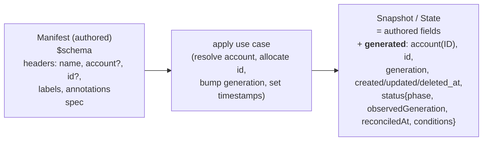

# Resource Anatomy — Authored vs Generated

> Part of the [Resources Framework](resources-framework.md) — see
> [§5a](resources-framework.md#5a-resource-anatomy--input-vs-auto-generated) for where this fits.

**This is the part to get right when authoring or generating manifests.** Only a subset of a
resource is user-authored; everything else is owned and produced by the framework.

**(1) User-authored — the manifest.** `ResourceManifest`
([`manifests/resource_manifest.rs`](/src/domain/resources/domain/src/manifests/resource_manifest.rs)):

```rust
pub struct ResourceManifest {
    #[serde(rename = "$schema")]
    pub schema: ResourceSchemaId,            // required — canonical schema URL
    pub headers: ResourceManifestHeaders,
    pub spec: serde_json::Value,             // desired state; type-specific shape
}

#[serde(deny_unknown_fields)]                // ← unknown fields (e.g. `status`) are rejected
pub struct ResourceManifestHeaders {
    pub id: Option<ResourceID>,              // optional — NOT assignable; an exact pointer to an
                                             // existing resource for updates (e.g. when renaming)
    pub account: Option<ResourceAccountRef>, // optional — id/did/name selector; defaults to caller
    pub name: ResourceName,                  // required
    pub labels: Vec<(TypeRef, serde_json::Value)>,
    pub annotations: Vec<(TypeRef, serde_json::Value)>,
}
```

A user may write **only**: `$schema`, `headers.{id?, account?, name, labels, annotations}`, and
`spec`. `deny_unknown_fields` means a manifest **cannot** carry `status`, timestamps, or
`generation` — those are server-owned.

> **Well-known annotations.** `description` is not a dedicated header field — it is the *first*
> well-known entry in `headers.annotations`, establishing the pattern future well-known annotations
> (e.g. an icon or docs link) will follow. A well-known annotation is declared as a schema URI,
> embedded JSON Schema doc, and typed validator in
> [`validation/schemas/annotations/description.rs`](/src/domain/resources/domain/src/validation/schemas/annotations/description.rs),
> mirroring the category-specific schema files used for labels and conditions. A DI-registered
> extension-schema dispatcher validates the value and the facade apply preparation canonicalizes
> authored short names (for example `description`) to the stable schema URI
> (`https://kamu.dev/schemas/resource/v1alpha1/annotations/Description`) before diffing and storage.
> Runtime description lookup and the missing-description warning therefore read the canonical URI
> key only; the short name is an input spelling, not stored identity.
> A manifest author writes it as, e.g.:
> ```yaml
> headers:
>   name: my-resource
>   annotations:
>     description: "..."
> ```

> **`TypeUri` vs `ResourceSchemaId`.** Both model the same `$schema` at two levels. `TypeUri` is the
> opaque identity value carried through fields, storage, and the wire (`ResourceSnapshot.schema`,
> dispatcher lookup, outbox). `ResourceSchemaId` is a parsed *lens* wrapping a `TypeUri` that exposes
> decomposed `base`/`context`/`version`/`name` segments for validation and display. The manifest
> deserializes `$schema` as `ResourceSchemaId` (malformed URLs rejected at parse time); everything
> downstream carries the plain `TypeUri`. Both serialize byte-identically, so there's no wire/storage
> difference.

> **`ResourceAccountRef`** is ODF's generated `auth::AccountRef` struct — `{ id: Option<ResourceID>,
> did: Option<AccountID>, name: Option<AccountName> }`, all fields optional — shared by the manifest
> `account` field and every facade selector's `account`. See [§7](resources-framework.md#7-account-resolution--authorization)
> for how a selector resolves to an account and how an empty one (`{}`) is rejected.

The `id` is **not** something the user assigns — a new resource's UID is always allocated by the
server. It may only be *supplied* on a manifest to point at an already-existing resource for an
update; this is what lets a resource be renamed (the `id` keeps the identity stable while `name`
changes). Omit it for normal create/update-by-name.

**(2) Framework-generated — the rest of headers + all of status.**
`ResourceHeaders` ([`values/resource_headers.rs`](/src/domain/resources/domain/src/values/resource_headers.rs))
and `ResourceStatus` ([`state/resource_status.rs`](/src/domain/resources/domain/src/state/resource_status.rs)):

```rust
pub struct ResourceHeaders {
    pub id: ResourceID,                      // generated — stable identity, assigned once
    pub account: auth::AccountHandle,        // resolved owning account: resource id (`id`) + DID (`did`) + name
    pub name: ResourceName,                  // (authored)
    pub labels: ResourceLabels,              // (authored) BTreeMap<TypeRef, serde_json::Value>
    pub annotations: ResourceAnnotations,    // (authored) BTreeMap<TypeRef, serde_json::Value>
    pub generation: u64,                     // generated — bumps on spec/headers change
    pub created_at: DateTime<Utc>,           // generated
    pub updated_at: DateTime<Utc>,           // generated
    pub deleted_at: Option<DateTime<Utc>>,   // generated (soft-delete tombstone)
}

pub struct ResourceStatus {                  // ODF-generated; entirely server-owned
    pub phase: ResourcePhase,                // Pending|Reconciling|Ready|Failed
    pub observed_generation: Option<u64>,
    pub reconciled_at: Option<DateTime<Utc>>,
    pub conditions: Option<ResourceConditions>,
}
```

> **Codegen-alias convention.** `ResourceHeaders`, `ResourceHeadersInput`, `ResourcePhase`,
> `ResourceConditions`, `ResourceLabels`, `ResourceAnnotations`, `ResourceHandle` (and `ResourceID`/
> `TypeUri`/`ResourceAccountRef` seen earlier) are all `pub type` aliases adopting ODF's generated types
> verbatim rather than hand-rolled structs. The generated DTOs have no direct `Serialize`/`Deserialize`
> — serde goes through ODF's YAML "shadow proxy", so fields of these types carry a
> `#[serde_as(as = "odf::metadata::serde::yaml::resource::…")]` annotation instead of deriving serde
> for free. Postgres/SQLite repos round-trip labels/annotations through the
> `resource_labels_{from,to}_json` helpers; the Cynic remote client binds its own scalar newtypes.
> This is a deliberate per-field cost of reusing the codegen shape, not a bug.
>
> The whole-resource envelope follows the same convention: domain `Resource`
> ([`values/resource.rs`](/src/domain/resources/domain/src/values/resource.rs)) is a `pub type` alias of
> `odf::metadata::resource::Resource<serde_json::Value>`, and the GraphQL `Resource` re-exports the
> matching generated `SimpleObject`. Both live in `values/`, not `views/` — `views/` is reserved for
> query-shaped results (`ResourceSummaryView`, list/apply-manifest outcomes), whereas `Resource` is the
> canonical per-instance DTO. Its identity/lookup counterpart, domain `ResourceHandle`
> ([`values/resource_handle.rs`](/src/domain/resources/domain/src/values/resource_handle.rs)), is also a
> `pub type` alias — of `odf::metadata::resource::ResourceHandle` (RFC-18 shape: `account:
> auth::AccountHandle`, `r#type: TypeUri`, `id: ResourceID`, `did: Option<Did>`, `name: ResourceName`).
> `did` is always `None` today — populating it needs DID-aware resource types, which don't exist yet
> (see [`handle_support.rs`](/src/domain/resources/facade/src/facade/local/helpers/handle_support.rs)).
> A short display name is derived on demand from `r#type` via `resource_type_name()` (see
> [`resource_schema_id.rs`](/src/domain/resources/domain/src/values/resource_schema_id.rs)) rather
> than carried on the handle. The GraphQL-facing type is also `ResourceHandle`; it mirrors the same
> fields, exposing `r#type` under the wire name `type`. Handles do not carry CLI selector names.
>
> Per-kind `Spec`/`SpecInput` types follow the same convention where the RFC shape and the domain's
> existing behavior (validation, linting) are compatible. `kamu_configuration::VariableSetSpec` /
> `VariableSetSpecInput`
> ([`variable_set/spec.rs`](/src/domain/configuration/domain/src/resources/variable_set/spec.rs)) and
> `kamu_configuration::SecretSetSpec` / `SecretSetSpecInput`
> ([`secret_set/spec.rs`](/src/domain/configuration/domain/src/resources/secret_set/spec.rs)) are thin
> newtypes around the corresponding `odf::metadata::config::*Spec` / `*SpecInput` DTOs — a bare
> `pub type` alias isn't legal here because the generated DTOs have no native
> `Serialize`/`Deserialize` (only via the YAML shadow proxy), and implementing those foreign traits
> directly on a foreign type through an alias would violate the orphan rule. Both resources' newtypes
> are declared via the shared `kamu_resources::declare_rfc_spec_newtype!` macro
> ([`values/rfc_spec_newtype.rs`](/src/domain/resources/domain/src/values/rfc_spec_newtype.rs)), which
> derives `Serialize`/`Deserialize` via `#[serde(try_from = "…", into = "…")]` delegating through the
> proxy — reusable for any future RFC spec adoption. The domain's `ResourceValidateSpec`/
> `ResourceLinterSpec` impls attach to `VariableSetSpecInput`/`SecretSetSpecInput` (the write-path
> types the framework validates/lints), not `VariableSetSpec`/`SecretSetSpec`. The individual secret
> DTO (`odf::metadata::config::Secret`, aliased as `kamu_configuration::Secret`) is a bare `type`
> alias like `Variable` — it sits at a leaf inside a codegen-owned `BTreeMap`, so it cannot be a
> newtype; its `literal_value`/`is_encrypted`/`content_encoding`/`as_encrypted`/
> `decrypt_plaintext_bytes` helpers attach via the `SecretExt` extension trait instead.
> `content_encoding` returns the parsed `kamu_configuration::ContentEncoding` (`Jwe`/`Aes256Gcm`)
> rather than a raw string, so encoding-specific code matches on the enum and must be revisited when
> a new encoding is added. A plaintext secret written with the scalar shorthand (`API_TOKEN: hunter2`)
> does not round-trip as a scalar — `get ss --revealed` renders it as `{ value: hunter2 }`, matching
> `VariableSet`'s behavior (there is no retained "was this shorthand" flag once parsed).

The behaviorally-significant consequences of adopting these shapes:

- **`headers.account` is a mandatory `auth::AccountHandle`** carrying the RFC-18 shape — the account
  *resource* id (`id: ResourceID`, an artificial UUID stored on `accounts.resource_id`), the account
  DID (`did: AccountID`), and the account `name`. The `resources` table stores only `account_id` (the
  DID), so repositories resolve **both the name and the account resource id** on every read
  (Postgres/SQLite via `JOIN accounts`, selecting `accounts.resource_id`; in-memory via a batched
  `AccountRepository` lookup — no N+1). Neither is persisted on the resource row, so an account rename
  (or a future resource-id change) shows up immediately on the next read
  ([`test_account_rename_reflected_immediately_in_headers`](/src/infra/resources/repo-tests/src/resource_repository_test_suite.rs)).
  If the owning account can't be found (e.g. deletion racing async cleanup), repos substitute the
  sentinels `deleted-account` (`DELETED_ACCOUNT_NAME_SENTINEL`) and the nil resource id
  (`deleted_account_resource_id_sentinel()`) rather than failing the read. `Account` is **not** itself
  a resource yet; `resource_id` is an artificial, stable id assigned per account
  (`kamu_accounts::Account::resource_id`) in preparation for `Account` eventually becoming a
  projection of an account resource — no account-resource events/history exist today.
- **Account is a precondition, not resolved, at the use-case boundary.**
  `ResourceHeadersInput.account` is an `Option<auth::AccountRef>` selector — `{id, did, name}`, all
  optional — but by the time headers reach `ApplyResourceUseCase::plan`/`apply` it must already be a
  fully-resolved `AccountRef` (all three fields `Some`); `ResourceHeaders::from_input` panics
  otherwise. Resolution is the caller's job — via the facade's `ResourceAccountResolver` (which also
  authorizes), or by resolving the account directly when only a DID/name is in hand (e.g.
  `DatasetEnvVarMutationAdapterImpl` looks up the resource id via `AccountService` from
  `DatasetEntry.owner_id`/`owner_name` before building headers). The use case enforces this
  defensively because the downstream event-sourced projector is pure/sync and cannot resolve
  accounts.
- **Built-in conditions** are Kamu extensions keyed by stable URIs under
  `https://kamu.dev/schemas/resource/v1alpha1/conditions/{Ready,Reconciling}`; each value
  carries `value` (the `True`/`False`/`Unknown` signal, matching the ODF `ResourceCondition`
  meta-schema's required `value` property), `reason`, optional `message`, and `lastTransitionTime`.
  `conditions` is optional (absent → `None`, not empty map): new resources have none, and a spec
  update clears them. The schema docs under `src/domain/resources/schemas/…/conditions/` are embedded
  from the corresponding `validation/schemas/conditions/*` files into DI-registered extension
  dispatchers; value validation is strict serde over `ResourceConditionValue` (unknown fields are
  rejected).
- **Manifest labels/annotations reject duplicate keys.** The ODF proxy deserializes into a `BTreeMap`
  that silently drops duplicates (last-write-wins), so `ResourceManifestHeaders.{labels,annotations}`
  stay `Vec<(TypeRef, serde_json::Value)>` with a custom visitor that errors on a repeated key. An
  invalid key fails at manifest *parse* time (`ParseManifest`), not headers validation — so the
  `InvalidLabelKey`/`InvalidAnnotationKey` and per-value-size problem codes were removed as
  unreachable; only entry *counts* (`MAX_LABELS`/`MAX_ANNOTATIONS`) are enforced.
- **Registered label/annotation keys are canonicalized before diffing.** Facade apply preparation
  resolves `headers.labels` and `headers.annotations` with `ResourceExtensionSchemaResolver` before
  constructing `ResourceHeadersInput`. Short names and aliases that resolve to a registered extension
  are rewritten to the canonical schema URI, so re-applying `description` after a stored URI form (or
  vice versa) is `Untouched` rather than a headers update. Duplicate keys that only become duplicates
  after canonicalization are rejected as `InvalidHeaders`. Unknown short names remain free-form and
  are preserved, with a warning; unknown full URIs are strict and are rejected. Registration is not
  limited to the resources domain: `kamu-configuration` registers
  [`legacy-config-target-dataset`](resources-framework.md#legacy-dataset-association--the-legacy-config-target-dataset-label),
  scoped so it canonicalizes on `VariableSet`/`SecretSet` and is rejected elsewhere.
- **Resource warning codes live with `ResourceWarning`.** Core resource-header warnings are defined in
  [`values/resource_warning.rs`](/src/domain/resources/domain/src/values/resource_warning.rs): missing
  description, non-indexable labels, and free-form label/annotation warnings. Configuration-specific
  spec warnings stay on their spec input types (`VariableSetSpecInput`, `SecretSetSpecInput`) because
  those are configuration-domain lints. The *detection* half of the lints shared by both types lives
  in [`resources/spec_lints.rs`](/src/domain/configuration/domain/src/resources/spec_lints.rs) as small
  classifier structs (`CredentialShape`, `ValueShape`, `CaseCollisions`); the codes and messages stay
  on the spec input types.
- **A lint must describe a consequence, not a style preference.** A warning earns its place when the
  spec is legal and storable but the author probably did not mean it, and the system's later behavior
  will surprise them — a credential in a `VariableSet` is stored unencrypted and returned by `get`
  (`secret_material_in_variable`, deliberately *not* mirrored onto `SecretSet`, where a credential is
  the point); names differing only by case are stored as distinct entries and collide wherever names
  are folded (`case_colliding_names`); values keep whatever whitespace was authored
  (`suspicious_value_whitespace`) and are never templated (`unexpanded_interpolation`). A rule that
  only restates a convention the validator does not enforce is noise: a `lowercase_variable_name`
  lint was removed for this reason, since `is_valid_variable_name` accepts mixed case by design and
  nothing downstream depends on it.

Also generated: `id` (allocated if the manifest omitted it). Reconciliation time is represented
inside the status object as `status.reconciledAt`; there is no separate top-level timestamp.

**(3) Persisted form — the snapshot.** `ResourceSnapshot`
([`core/resource_snapshot.rs`](/src/domain/resources/domain/src/core/resource_snapshot.rs))
combines authored + generated + event-sourcing bookkeeping:

```rust
pub struct ResourceSnapshot {
    pub id: ResourceID,
    pub schema: TypeUri,                      // canonical schema URL (identity value)
    pub headers: ResourceHeaders,            // authored fields + generated fields
    pub spec: serde_json::Value,             // authored (may be transformed — see SecretSet)
    pub status: Option<ResourceStatus>,      // generated ODF status
    pub last_event_id: Option<EventID>,      // event-sourcing cursor (optimistic concurrency)
}
```



**Worked example — `VariableSet`:** the user authors `spec.variables`; the framework generates the
entire `status` after reconciliation.

**`SecretSet` goes further — and its security invariant is documented separately below.** Authored
plaintext secrets are converted to an encrypted canonical form *before the first durable write*, so
the persisted `spec` is itself server-derived. See [Secret handling](resources-framework.md#secret-handling-invariant).
