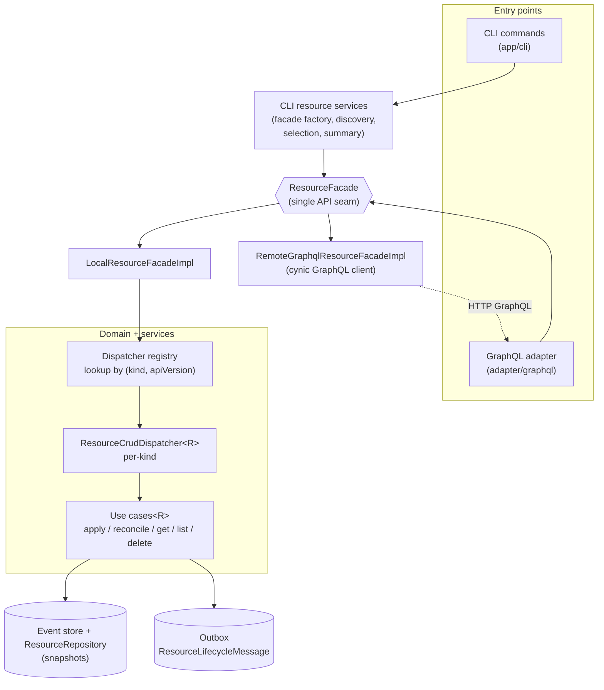
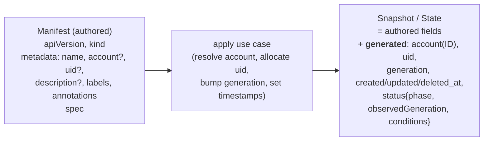
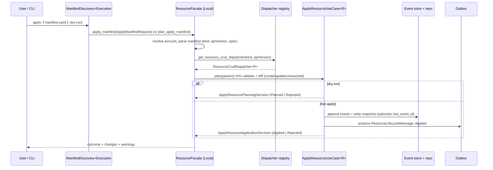
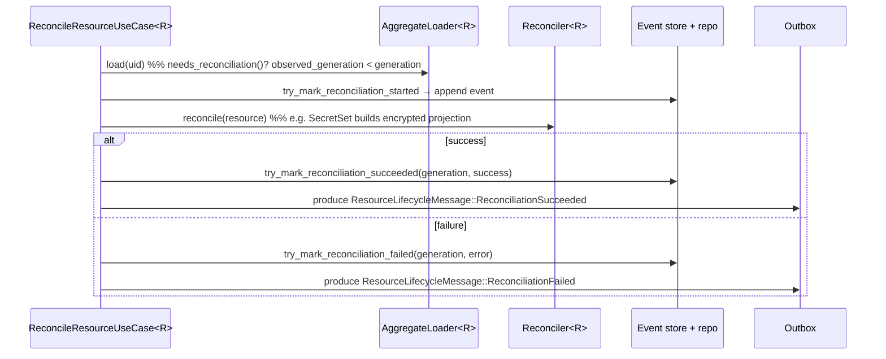
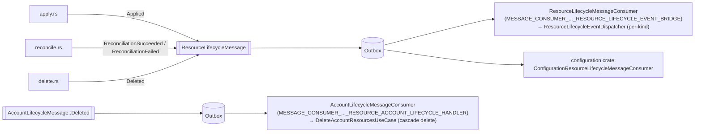
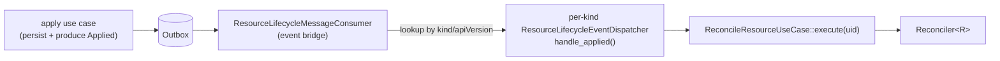
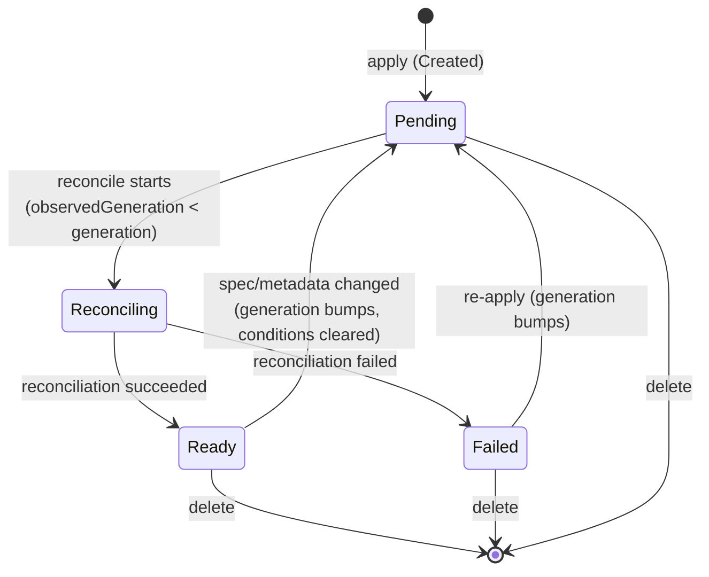

# Resources Framework — Architecture

> **Status:** prototype, under active development on branch
> `feature/1609-managed-resources-prototype-stage1`.
> This document describes the framework *as it stands today*. Type names, paths, and field lists
> below are drawn from source — when they drift, treat the source as canonical and update this page.

---

## Agent / newcomer quick-start

**One-paragraph mental model.** The resources framework is a generic, event-sourced,
Kubernetes-inspired subsystem for *declarative* management of arbitrary "resource kinds". A user
authors a **manifest** (`apiVersion` + `kind` + `metadata` + `spec`); the framework stores it as an
event-sourced aggregate, fills in server-owned metadata (uid, timestamps, `generation`) and an
**initial** server-owned `status`, then **asynchronously reconciles** it toward the desired state
(the status progresses `Pending → Reconciling → Ready`/`Failed`). Every kind (today:
`VariableSet`, `SecretSet`) implements a small set of traits and registers a **dispatcher** keyed by
`(kind, apiVersion)`. All callers — the CLI and the GraphQL API — go through a single seam, the
**`ResourceFacade`** trait, which has an in-process (`Local`) implementation and a
`RemoteGraphql` implementation that talks to a remote server.

**Where to start reading, by intent:**

| You want to… | Start at |
| --- | --- |
| Know the rules I must not break | [§3 Invariants](#3-invariants) |
| Understand the core abstractions | [§5 Domain model](#5-domain-model-kamu-resources) |
| Know what a user types vs what the server generates | [§5a Resource anatomy](#5a-resource-anatomy--input-vs-auto-generated) |
| Understand storage, uniqueness, soft-delete | [§6 Persistence model](#6-persistence-model) |
| Understand account scoping & permissions | [§7 Account resolution & authorization](#7-account-resolution--authorization) |
| Trace an `apply` / reconcile end-to-end | [§13 Data flow](#13-data-flow-walkthroughs) |
| Add a new resource kind | [§14 Concrete kinds + recipe](#14-concrete-resource-kinds-kamu-configuration) |
| Find the file for X | [§16 Reference map](#16-filecrate-reference-map) |
| Avoid common traps | [§17 Gotchas](#17-extension-points--gotchas) |

**Build & test:**

```bash
cargo build
cargo nextest run -E 'test(test_apply_resource_use_case)'
make clippy
```

> `SQLX_OFFLINE=true` is needed only when there's no reachable Postgres — e.g. agents running with
> limited permissions. Human developers with the local Docker Postgres/Elasticsearch containers up
> can omit it (SQLx validates against the live DB instead of the offline cache).

---

## Table of contents

1. [Purpose & scope](#1-purpose--scope)
2. [Concept glossary](#2-concept-glossary)
3. [Invariants](#3-invariants)
4. [Layered architecture](#4-layered-architecture)
5. [Domain model (`kamu-resources`)](#5-domain-model-kamu-resources)
   - [5a. Resource anatomy — input vs auto-generated](#5a-resource-anatomy--input-vs-auto-generated)
6. [Persistence model](#6-persistence-model)
7. [Account resolution & authorization](#7-account-resolution--authorization)
8. [Rename & conflict rules](#8-rename--conflict-rules)
9. [Services (`kamu-resources-services`)](#9-services-kamu-resources-services)
10. [Facade (`kamu-resources-facade`)](#10-facade-kamu-resources-facade)
11. [GraphQL API](#11-graphql-api)
12. [CLI](#12-cli)
    - [CLI semantics matrix](#cli-semantics-matrix)
13. [Data flow walkthroughs](#13-data-flow-walkthroughs)
14. [Concrete resource kinds (`kamu-configuration`)](#14-concrete-resource-kinds-kamu-configuration)
15. [Tests](#15-tests)
16. [File/crate reference map](#16-filecrate-reference-map)
17. [Extension points & gotchas](#17-extension-points--gotchas)

---

## 1. Purpose & scope

The framework provides a uniform way to **declaratively manage** typed resources:

- **CRUD + reconcile** — `apply` (create/update), `get`, `list`, `delete` (selectors support `%`
  name patterns), plus a `reconcile` step (outbox-driven, asynchronous — see
  [How reconciliation is scheduled](#how-reconciliation-is-scheduled)) that drives a resource toward
  its desired state.
- **Kubernetes-style model** — every resource carries user-authored `metadata` + `spec`. The server
  maintains the remaining metadata — including `generation` (the desired-state revision, bumped on
  each spec/metadata change) — and a `status` with `phase`, `observedGeneration` (reconciliation
  progress), and `conditions`. Reconciliation is needed whenever `observedGeneration < generation`.
- **Pluggable kinds** — the generic machinery is type-parameterized over a resource type `R`;
  concrete kinds plug in via traits + a registered dispatcher keyed by `(kind, apiVersion)`.
- **Local & remote symmetry** — the same operations run in-process or against a remote server behind
  one trait (`ResourceFacade`).
- **Event-sourced & transactional** — mutations are recorded as immutable events; lifecycle changes
  are announced on the transactional **outbox**.

**Not in scope here:** the supported / production-ready kinds today are `VariableSet` and `SecretSet`
(below). A third kind, `Storage`, is already **registered** in the CLI catalog and wired through the
same machinery but is **incomplete / WIP** — see [§14](#14-concrete-resource-kinds-kamu-configuration).
Datasets and flows are **not** resources today, though bringing them under the framework is a
long-term goal. This page documents what exists now.

---

## 2. Concept glossary

| Term | Meaning |
| --- | --- |
| **Resource** | A single managed object instance of a given kind, identified by a `ResourceUID`. |
| **Kind** | The resource type discriminator string, e.g. `VariableSet`, `SecretSet`. |
| **ApiVersion** | Versioning string for the kind's schema, e.g. `kamu.dev/v1alpha1`. |
| **Descriptor** | The `(kind, apiVersion)` pair (`ResourceDescriptor`) used to route to the right dispatcher. |
| **Manifest** | The user-authored wire document (`apiVersion`/`kind`/`metadata`/`spec`) in YAML or JSON. |
| **Spec** | The desired-state portion authored by the user; stored as `serde_json::Value`. |
| **Status** | Server-owned observed state (`phase`, `observedGeneration`, `conditions`). Note `generation` lives in **metadata**, not status. |
| **Snapshot** | The persisted materialized form of a resource (`ResourceSnapshot`). |
| **Phase** | Lifecycle stage: `Pending`, `Reconciling`, `Ready`, `Failed`. (`Degraded` exists in the enum but is reserved/unused today — see [§13 state machine](#lifecycle-state-machine).) |
| **Condition** | A K8s-style condition entry contributing to the overall phase. |
| **generation / observedGeneration** | `generation` bumps on each spec/metadata change; `observedGeneration` records the last generation reconciliation observed. Drift ⇒ reconcile. |
| **Reconciliation** | The act of driving actual state toward the spec (e.g. `SecretSet` materializes its encrypted read-side projection). |
| **Selector** | Identifies one (`ResourceSelector`) or many (`ResourceBatchSelector`) resources, by name or UID, optionally scoped to an account. |
| **SpecViewMode** | How sensitive spec fields are rendered. Two modes only: `Encrypted` (default — the stored ciphertext envelope is returned as-is) and `Revealed` (decrypted plaintext). There is no separate "redacted/placeholder" mode today. |
| **Dispatcher** | Per-kind adapter (`ResourceCrudDispatcher`, …) registered in `dill` and looked up by descriptor. |
| **Facade** | The single API seam (`ResourceFacade`) used by all callers; local or remote-GraphQL impl. |

---

## 3. Invariants

The rules below hold across the framework. They are the contract a maintainer (or coding agent) must
not break; most are enforced in code and exercised by tests — pointers given where useful.

- **`ResourceUID` is immutable and server-allocated.** A new resource's UID comes from
  `GenericResourceQueryService::allocate_uid()`; callers cannot choose it. Once assigned it never
  changes (it is the primary key — see [§6](#6-persistence-model)).
- **`(account_id, kind, name)` is unique.** Enforced by a DB unique constraint
  `UNIQUE (account_id, resource_kind, resource_name)`. Names are stored lowercased.
- **`apiVersion` selects schema/dispatcher behavior — it is *not* part of resource identity.**
  Identity is `(account, kind, name)` (and the UID); `apiVersion` only routes to a dispatcher
  ([§9](#9-services-kamu-resources-services)). Consequently `VariableSet/kamu.dev/v1alpha1/foo` and
  `VariableSet/kamu.dev/v1beta1/foo` **cannot coexist** — they are the same resource. A version
  change is schema evolution of one named resource, not a second parallel resource (see the
  migration note in [§6](#6-persistence-model)).
- **`metadata.generation` changes only when desired state changes.** It starts at 1 on create and is
  bumped by the aggregate only when an apply produces a real metadata/spec change (`Update`); an
  unchanged apply is `Untouched` and does not bump it.
- **`status.observedGeneration <= metadata.generation`** always. Reconciliation sets
  `observedGeneration` to the generation it just processed; `needs_reconciliation()` is exactly
  `observedGeneration < generation`.
- **`status` is never accepted from manifests.** It is server-owned end to end; manifests use
  `deny_unknown_fields`, so a `status` key is rejected ([§5a](#5a-resource-anatomy--input-vs-auto-generated)).
- **`SecretSet` plaintext never crosses a durable boundary.** It is encrypted by the spec sanitizer
  *before the first event/snapshot write*; plaintext must not appear in events, snapshots, the
  read-side projection, logs, GraphQL responses, CLI output, diffs, or outbox payloads
  ([Secret handling](#secret-handling-invariant)).
- **Local and remote facade behavior must match for all contract-tested cases.** The `contract_test!`
  suite runs each case against both implementations; new facade behavior must be added there
  ([§15](#15-tests)).
- **Batch operations preserve the positional `request_index`.** `BatchResourceResponse` reports each
  success/problem tagged with the originating request index, so partial results map back to inputs.
- **A resource is always scoped to exactly one account**, fixed by the persistence key; cross-account
  visibility is denied by treating out-of-account UIDs as not-found ([§7](#7-account-resolution--authorization)).

---

## 4. Layered architecture

Dependency injection is handled by **`dill`** (a catalog/IoC container). Each crate exposes a
`register_dependencies(&mut CatalogBuilder)` that the application composes in order.



Note the loop: the **remote** facade implementation calls back into the GraphQL adapter of a remote
server, whose resolvers in turn use a **local** facade there. Local and remote thus share contract
behavior (verified by the same contract tests — see [§15](#15-tests)).

**Crates:**

| Crate | Path | Role |
| --- | --- | --- |
| `kamu-resources` | `src/domain/resources/domain` | Base domain model: traits, values, manifests, events, repo & dispatcher interfaces, use-case traits, messages. |
| `kamu-resources-services` | `src/domain/resources/services` | Implementations: loaders, persistence, query services, use-case macros, dispatcher macros + registry, message handlers. |
| `kamu-resources-facade` | `src/domain/resources/facade` | The `ResourceFacade` trait + `Local` and `RemoteGraphql` implementations. |
| `kamu-resources-facade-tests` | `src/domain/resources/facade-tests` | Cross-implementation contract tests enforcing local/remote symmetry for covered behavior. |
| `kamu-configuration` / `kamu-configuration-services` | `src/domain/configuration/{domain,services}` | Concrete kinds: `VariableSet`, `SecretSet`. |

---

## 5. Domain model (`kamu-resources`)

Module layout: `core/`, `state/`, `values/`, `validation/`, `views/`, `manifests/`, `services/`,
`repo/`, `dispatchers/`, `messages/`, `use_cases/`.

### Core traits

A resource is layered as a stack of traits. The base is **`DeclarativeResource`** — a resource has a
`Spec`, a `Status`, and a backing `ResourceState`
([`core/declarative_resource.rs`](/src/domain/resources/domain/src/core/declarative_resource.rs)):

```rust
pub trait DeclarativeResource:
    Sized + Send + Sync + std::fmt::Debug + AsRef<Self::ResourceState>
{
    type Spec: std::fmt::Debug + Send + Sync;
    type Status: ResourceStatusLike + std::fmt::Debug;
    type ResourceState: DeclarativeResourceState<Spec = Self::Spec, Status = Self::Status>
        + TryFrom<ResourceSnapshot, Error = InternalError>
        + From<Self>;

    fn uid(&self) -> &ResourceUID;
    fn metadata(&self) -> &ResourceMetadata;
    fn spec(&self) -> &Self::Spec;
    fn status(&self) -> &Self::Status;
}
```

**`ReconcilableResource`** adds the lifecycle + reconciliation transitions
([`core/reconcilable_resource.rs`](/src/domain/resources/domain/src/core/reconcilable_resource.rs)).
Note that `needs_reconciliation()` is derived from `generation` vs the status:

```rust
pub trait ReconcilableResource: DeclarativeResource {
    type ReconcileSuccess;
    type ReconcileError: ResourceReconcileError;
    type ReconcileFailureDetails;
    type LifecycleError;

    fn needs_reconciliation(&self) -> bool { /* observed_generation vs generation */ }

    fn try_create(now, uid, metadata: ResourceMetadataInput, spec) -> Result<Self, LifecycleError>;
    fn try_update_metadata(&mut self, now, new_metadata: ResourceMetadataInput) -> ...;
    fn try_update_spec(&mut self, now, new_spec: Self::Spec) -> ...;
    fn try_delete(&mut self, now, tombstone_name: String) -> ...;
    fn try_mark_reconciliation_started(&mut self, now) -> ...;
    fn try_mark_reconciliation_succeeded(&mut self, now, expected_generation, success) -> ...;
    fn try_mark_reconciliation_failed(&mut self, now, expected_generation, error) -> ...;
}
```

**`ReconcilableEventSourcedResource`** binds the resource to the `event-sourcing` crate — its
`ResourceState` is an event `Projection` over `ReconcilableResourceEvent<Spec, Success, FailureDetails>`
and an aggregate. This is the bound that all generic use cases require.

**Presentation & descriptor traits:**

- **`ResourceType` / `ResourceApiVersion`** — const strings `RESOURCE_TYPE` and `API_VERSION`.
- **`ResourceDescriptorProvider`** — blanket-implemented for any `ResourceType + ResourceApiVersion`;
  exposes `const DESCRIPTOR: ResourceDescriptor` = `(kind, apiVersion)`
  ([`core/resource_descriptor.rs`](/src/domain/resources/domain/src/core/resource_descriptor.rs)).
- **`ResourcePresentation`** — short names + per-kind list columns for table/`list` rendering.

### Events

`ReconcilableResourceEvent<TSpec, TSuccess, TFailureDetails>` is the event-sourcing alphabet:
`Created`, `MetadataUpdated`, `SpecUpdated`, `Deleted`, `ReconciliationStarted`,
`ReconciliationSucceeded`, `ReconciliationFailed`. The `ResourceState` projection folds these into
current state.

### Repository

`ResourceRepository` (`repo/`) is the persistence seam: allocate UID, create/update snapshot
(with optimistic `expected_last_event_id`), find by name/uid, search identities, and stream UIDs /
snapshots by kind.

### Dispatchers

The generic code can't name a concrete `R` at the API boundary, so dynamic dispatch is keyed by
descriptor. `ResourceCrudDispatcher` is the main one (also `ResourcePresentationDispatcher`,
`ResourceLifecycleEventDispatcher`, and a spec-view dispatcher that reveals/decrypts sensitive
spec fields on request). Each carries
`ResourceDispatcherMeta { descriptor }` as `dill` metadata for registry lookup
(see [§9](#9-services-kamu-resources-services)).

### Use-case traits

Generic, `R`-parameterized contracts in `use_cases/`: `ApplyResourceUseCase<R>` (two-phase, below),
`ReconcileResourceUseCase<R>`, `GetResourceByUidUseCase<R>`, `ListResourcesByKindUseCase<R>`,
`DeleteResourcesUseCase<R>`, plus the non-generic `ListAllResourcesUseCase` and
`DeleteAccountResourcesUseCase`.

### 5a. Resource anatomy — input vs auto-generated

> **This is the part to get right when authoring or generating manifests.** Only a subset of a
> resource is user-authored; everything else is owned and produced by the framework.

**(1) User-authored — the manifest.** `ResourceManifest`
([`manifests/resource_manifest.rs`](/src/domain/resources/domain/src/manifests/resource_manifest.rs)):

```rust
pub struct ResourceManifest {
    pub api_version: String,                 // required — e.g. "kamu.dev/v1alpha1"
    pub kind: String,                        // required — e.g. "VariableSet"
    pub metadata: ResourceManifestMetadata,
    pub spec: serde_json::Value,             // desired state; kind-specific shape
}

#[serde(deny_unknown_fields)]                // ← unknown fields (e.g. `status`) are rejected
pub struct ResourceManifestMetadata {
    pub uid: Option<ResourceUID>,            // optional — NOT assignable; an exact pointer to an
                                             // existing resource for updates (e.g. when renaming)
    pub account: Option<ResourceManifestAccount>, // optional — by name OR id; defaults to caller
    pub name: ResourceName,                  // required
    pub description: Option<String>,
    pub labels: Vec<(String, String)>,
    pub annotations: Vec<(String, String)>,
}
```

A user may write **only**: `apiVersion`, `kind`, `metadata.{uid?, account?, name, description?,
labels, annotations}`, and `spec`. `deny_unknown_fields` means a manifest **cannot** carry `status`,
timestamps, or `generation` — those are server-owned.

The `uid` is **not** something the user assigns — a new resource's UID is always allocated by the
server. It may only be *supplied* on a manifest to point at an already-existing resource for an
update; this is what lets a resource be renamed (the `uid` keeps the identity stable while `name`
changes). Omit it for normal create/update-by-name.

**(2) Framework-generated — the rest of metadata + all of status.**
`ResourceMetadata` ([`values/resource_metadata.rs`](/src/domain/resources/domain/src/values/resource_metadata.rs))
and `ResourceStatus` ([`state/resource_status.rs`](/src/domain/resources/domain/src/state/resource_status.rs)):

```rust
pub struct ResourceMetadata {
    pub account: odf::AccountID,             // resolved from manifest account / caller
    pub name: ResourceName,                  // (authored)
    pub description: Option<String>,         // (authored)
    pub labels: BTreeMap<String, String>,    // (authored)
    pub annotations: BTreeMap<String, String>, // (authored)
    pub generation: u64,                     // generated — bumps on spec/metadata change
    pub created_at: DateTime<Utc>,           // generated
    pub updated_at: DateTime<Utc>,           // generated
    pub deleted_at: Option<DateTime<Utc>>,   // generated (soft-delete tombstone)
}

pub struct ResourceStatus {                  // entirely server-owned
    pub phase: ResourcePhase,                // Pending|Reconciling|Ready|Degraded|Failed
    pub observed_generation: u64,
    pub conditions: Vec<ResourceCondition>,
}
```

Also generated: `uid` (allocated if the manifest omitted it) and `last_reconciled_at`.

**(3) Persisted form — the snapshot.** `ResourceSnapshot`
([`core/resource_snapshot.rs`](/src/domain/resources/domain/src/core/resource_snapshot.rs))
combines authored + generated + event-sourcing bookkeeping:

```rust
pub struct ResourceSnapshot {
    pub uid: ResourceUID,
    pub kind: String,
    pub api_version: String,
    pub metadata: ResourceMetadata,          // authored fields + generated fields
    pub spec: serde_json::Value,             // authored (may be transformed — see SecretSet)
    pub status: Option<serde_json::Value>,   // generated
    pub last_reconciled_at: Option<DateTime<Utc>>, // generated
    pub last_event_id: Option<EventID>,      // event-sourcing cursor (optimistic concurrency)
}
```



**Worked example — `VariableSet`:** the user authors `spec.variables`; the framework generates the
entire `status` after reconciliation.

**`SecretSet` goes further — and its security invariant is documented separately below.** Authored
plaintext secrets are converted to an encrypted canonical form *before the first durable write*, so
the persisted `spec` is itself server-derived. See [Secret handling](#secret-handling-invariant).

---

## 6. Persistence model

Resources are **event-sourced with a materialized snapshot per resource**. Storage backends live in
`src/infra/resources/` (`postgres`, `sqlite`, `inmem`), all implementing the domain
`ResourceRepository` + raw event-store traits and sharing the cross-backend test suite in
`src/infra/resources/repo-tests/`. Schema is defined by
[`migrations/postgres/20260323155948_resources.sql`](/migrations/postgres/20260323155948_resources.sql)
(SQLite mirror alongside).

**Two tables:**

- **`resources`** — one row per resource (the snapshot): `resource_uid` (UUID, **PK**),
  `account_id`, `resource_kind`, `api_version`, `resource_name`, `description`, `labels`/`annotations`
  (JSONB), `spec` (JSONB), `status` (JSONB, nullable), `generation`, `created_at`/`updated_at`,
  `deleted_at` (nullable), `last_reconciled_at`, `last_event_id`. **Uniqueness:**
  `UNIQUE (account_id, resource_kind, resource_name)` — note **api_version is not part of the key**.
  A partial index on `(account_id, kind, api_version, status->>'phase') WHERE deleted_at IS NULL`
  backs the summary projection.
- **`resource_events`** — append-only log: `event_id` (BIGINT from a sequence, PK), `resource_uid`
  (FK → `resources`), `resource_kind`, `event_time`, `event_type`, `event_payload` (JSONB).

**Source of truth.** The event log is authoritative — aggregates are rebuilt by projecting events
(`ResourceAggregateLoader`). The `resources` row is a **derived snapshot** maintained in the same
transaction as the event append; it exists for efficient queries/listing/uniqueness and should never
diverge. If they ever disagree, the events win and the snapshot is the bug.

**Optimistic concurrency.** `update_resource` is a compare-and-set on `last_event_id`: the update
only applies if the stored `last_event_id` equals the caller's `expected_last_event_id`; otherwise it
returns `UpdateResourceError::concurrent_modification()`. A unique-constraint violation surfaces as
`UpdateResourceError::Duplicate`.

**Soft-delete / tombstone.** Delete is a soft-delete: the row stays with `deleted_at` set and a
`Deleted` event is appended. Because the unique constraint still covers deleted rows, delete also
**renames the resource to a tombstone name** (`try_delete(now, tombstone_name)` → `Deleted` event
carries `tombstone_name`) so the original `(account, kind, name)` is freed for reuse. All query/list
methods filter `WHERE deleted_at IS NULL`, so tombstones are invisible to normal reads.

**Migration / backfill.** Schema changes are ordinary SQLx migrations under `migrations/{postgres,sqlite}`.
There is a precedent for data backfill into resources —
`20260513120000_backfill_env_var_resources.sql` migrates legacy dataset env-vars into `VariableSet`
resources; new kinds that supersede existing data should follow that pattern (additive migration +
backfill, never rewriting the event log in place).

**Version upgrades.** Because `apiVersion` is not part of identity (see [§3](#3-invariants)), a new
schema version of a kind must be modeled as **schema evolution / conversion of the same named
resource**, not as a parallel resource with the same name under a different API version. Upgrades
should convert spec/status in place (migration or a conversion step) so the `(account, kind, name)`
row remains singular across versions.

---

## 7. Account resolution & authorization

Every resource belongs to exactly one account, and that scoping is also the authorization boundary.
Resolution + permission checks live in `ResourceAccountResolverImpl`
([`facade/local/resource_account_resolver_impl.rs`](/src/domain/resources/facade/src/facade/local/resource_account_resolver_impl.rs)).

- **Who may specify `metadata.account`.** The manifest `account` field is optional and **defaults to
  the calling subject's own account**. To target *another* account, the resolver requires the caller
  to be an **admin** (`rebac_service.is_account_admin`); otherwise it returns
  `AccessError::Unauthorized`. An **anonymous** subject cannot resolve any account (rejected).
- **Account selector forms.** `account` may be given by name or by id; if both, they must agree
  (mismatch → error). Resolution maps the selector to a concrete `(AccountID, AccountName)`.
- **Remote calls.** For a remote context the CLI authenticates with an access token; the server then
  resolves the *authenticated principal* into the current account subject exactly as above — the
  client never asserts its own account id, the server derives it.
- **Local workspace context.** The local facade uses the workspace's current account subject
  (`CurrentAccountSubject`) as the caller; the same admin rule applies for cross-account targeting.
- **UID belonging to a different account.** Lookups are account-scoped (`find_account_snapshot`
  filters by `account_id`). A UID that exists but belongs to another account is reported as
  **not-found** (`ResourceUIDNotFoundError`), not "forbidden" — so existence is not leaked across
  accounts. A UID of the wrong *kind* yields `ResourceTypeMismatchError`.
- **Account-deletion cascade.** When an account is deleted, `DeleteAccountResourcesUseCase` deletes
  that account's resources (see [§13](#13-data-flow-walkthroughs)). It operates on live resources;
  already-tombstoned resources are simply skipped (they are already `deleted_at`-marked), so the
  cascade is idempotent with respect to prior deletions.

---

## 8. Rename & conflict rules

The apply planner ([`services/apply_resource_planner.rs`](/src/domain/resources/services/src/services/apply_resource_planner.rs))
decides create vs update by resolving the target resource first:

- **No `uid` in manifest** → resolve by `(account, kind, name)`. Found → update; not found → create
  (new UID allocated).
- **`uid` in manifest** → load that exact resource (the "exact pointer"). This is what enables a
  **rename**: supply the `uid` and a new `metadata.name`; identity stays stable while the name
  changes.

Concrete conflict cases:

| Case | Outcome |
| --- | --- |
| `uid` + changed `metadata.name` | **Rename** — name updated on the same resource (`Update`). |
| `uid` whose resource is a different `kind` (or apiVersion type) | **Reject** — `ResourceTypeMismatchError`. |
| `uid` resolving to a resource in a different account | **Not found** — `ResourceUIDNotFoundError` (account-scoped lookup; existence not leaked). |
| `metadata.account` targeting another account without admin | **Reject** — `AccessError::Unauthorized` ([§7](#7-account-resolution--authorization)). |
| Rename target name already taken (same account+kind) | **Reject** — unique-constraint `Duplicate` at persistence. |
| Update by name where another account has the same name | **No conflict** — the account disambiguates; each `(account, kind, name)` is independent. |
| Apply re-using a tombstoned (deleted) name | **Allowed** — the deleted resource was renamed to a tombstone, freeing the name for a fresh create. |
| Apply with no real change | **`Untouched`** — no generation bump, no events, no reconcile. |

Note names are normalized to lowercase on write, so case-only differences are not distinct names.

---

## 9. Services (`kamu-resources-services`)

This crate turns the domain traits into running code. Module layout: `services/`, `use_cases/`,
`crud_dispatchers/`, `message_handlers/`, `event_stores/`, `resources/`, `testing/`.

**Supporting services:**

- **`ResourceAggregateLoader<R>`** — replays the event stream and projects a resource aggregate.
- **`ResourcePersistenceService<R>`** — commits aggregate changes as events + snapshot (create /
  save / delete, with `delete_many`).
- **`GenericResourceQueryService`** (impl `GenericResourceQueryServiceImpl`) — descriptor-agnostic
  queries (allocate UID, find by name, search identities) delegating to `ResourceRepository`.
- **`TypedResourceQueryService<R>`** — type-safe queries for a single kind.
- **`Reconciler<R>`** — the per-kind reconcile engine (implemented in the kind's crate).

**Two-phase apply.** `ApplyResourceUseCase<R>` separates *planning* (validate, diff, decide
create/update/untouched, without writing) from *application* (persist + publish)
([`use_cases/apply_resource_use_case.rs`](/src/domain/resources/domain/src/use_cases/apply_resource_use_case.rs)):

```rust
pub trait ApplyResourceUseCase<R: ReconcilableEventSourcedResource>: Send + Sync {
    async fn plan(&self, params: ApplyResourceParams<R>)
        -> Result<ApplyResourcePlanningDecision<R>, ApplyResourceUseCaseError<R>>;
    async fn apply(&self, params: ApplyResourceParams<R>)
        -> Result<ApplyResourceApplicationDecision<R>, ApplyResourceUseCaseError<R>>;
}

pub enum ApplyResourcePlanningDecision<R> { Planned(ApplyResourcePlan<R>), Rejected(ApplyResourceRejection) }
pub enum ApplyResourceApplicationDecision<R> { Applied(ApplyResourceResult<R>), Rejected(ApplyResourceRejection) }
pub enum ApplyResourceAction { Create, Update, Untouched }
pub enum ApplyResourceOutcome { Created, Updated, Untouched }
```

The `--dry-run` path uses `plan`; a live apply uses `apply`. Use-case implementations are generated
by **`declare_*_use_case!`** macros so each kind gets a fully-wired instance without boilerplate.

**Dispatchers + registry.** Each kind registers a `ResourceCrudDispatcher` via
`declare_resource_crud_dispatcher!` (and a presentation dispatcher). Lookup is by descriptor through
`dill` metadata
([`crud_dispatchers/resource_crud_dispatcher_registry.rs`](/src/domain/resources/services/src/crud_dispatchers/resource_crud_dispatcher_registry.rs)):

```rust
pub fn get_resource_crud_dispatcher<E>(target_catalog, kind, api_version)
    -> Result<Arc<dyn ResourceCrudDispatcher>, E>
{
    let mut handlers = target_catalog.builders_for_with_meta::<dyn ResourceCrudDispatcher, _>(
        |meta: &ResourceDispatcherMeta| {
            meta.descriptor.resource_type == kind && meta.descriptor.api_version == api_version
        });
    // exactly-one expected → NotFound / Duplicate otherwise
}
```

**Message handlers** (outbox consumers — see [§13](#13-data-flow-walkthroughs)):
`ResourceLifecycleMessageConsumer` and `AccountLifecycleMessageConsumer`.

**DI registration** — [`dependencies.rs`](/src/domain/resources/services/src/dependencies.rs) is the
single place where this crate's `dill` catalog components (base query services, the cross-kind use
cases, and the outbox message consumers) are registered. Per-kind use cases and dispatchers are
registered separately by the kind's own crate (see [§14](#14-concrete-resource-kinds-kamu-configuration)).

---

## 10. Facade (`kamu-resources-facade`)

`ResourceFacade` is the **single API seam** every caller uses. It hides the per-kind generics behind
descriptor-keyed dispatch and gives local/remote symmetry. Selected signature
([`facade/resource_facade.rs`](/src/domain/resources/facade/src/facade/resource_facade.rs)):

```rust
#[async_trait]
pub trait ResourceFacade: Send + Sync {
    async fn list_supported_kinds(&self) -> Result<Vec<ResourceKindDescriptor>, ...>;
    async fn summary(&self, request: ResourcesSummaryRequest) -> Result<ResourcesSummary, ...>;

    async fn get(&self, selector: ResourceSelector, spec_view_mode: SpecViewMode) -> Result<ResourceView, ...>;
    async fn get_many(&self, selector: ResourceBatchSelector, spec_view_mode: SpecViewMode)
        -> Result<BatchResourceResponse<ResourceView, ResourceLookupProblem>, ...>;
    async fn get_identity(&self, selector: ResourceSelector) -> Result<ResourceIdentityView, ...>;
    async fn render_manifest(&self, selector, format: ResourceManifestFormat, spec_view_mode) -> ...;

    async fn list(&self, request: ListResourcesRequest) -> Result<Vec<ResourceSummaryView>, ...>;
    async fn list_identities(&self, request: ListResourceIdentitiesRequest) -> ...;
    async fn search_identities(&self, request: SearchResourceIdentitiesRequest) -> ...;
    async fn list_all(&self, request: ListAllResourcesRequest) -> ...;

    async fn plan_apply_manifest(&self, request: ApplyManifestRequest) -> Result<ApplyManifestPlanningDecision, ...>;
    async fn apply_manifest(&self, request: ApplyManifestRequest) -> Result<ApplyManifestApplicationDecision, ...>;
    async fn delete(&self, selector: ResourceSelector) -> Result<ResourceUID, ...>;
    async fn delete_many(&self, selector: ResourceBatchSelector) -> ...;
}
```

**Selectors & view modes:**

```rust
pub struct ResourceSelector { pub account: Option<ResourceManifestAccount>, pub kind: String,
                              pub api_version: Option<String>, pub resource_ref: ResourceRef }
pub enum   ResourceRef { ById(ResourceUID), ByName(ResourceName) }
pub enum   ResourceManifestFormat { Json, Yaml }
pub enum   SpecViewMode { Encrypted /* default */, Revealed }
```

Batch operations return `BatchResourceResponse<T, E>` with positional `successes` / `problems`
(each tagged by `request_index`) — so a partial batch reports per-item outcomes.

**Implementations:**

- **`LocalResourceFacadeImpl`** — resolves account → resolves selector to UID/snapshot → looks up the
  per-kind dispatcher via `get_resource_crud_dispatcher` → calls it. Holds the `dill::Catalog`,
  a `ResourceAccountResolver`, and `GenericResourceQueryService`.
- **`RemoteGraphqlResourceFacadeImpl`** — a `cynic`-based GraphQL client that issues the queries /
  mutations of a remote server (whose resolvers use a *local* facade there). Operations live under
  `facade/graphql/cynic_api/operations/`; responses are mapped back to domain views/errors in
  `facade/graphql/outcome_mapper/`.

**Registration** ([`dependencies.rs`](/src/domain/resources/facade/src/dependencies.rs)) adds
`ResourceAccountResolverImpl` and `LocalResourceFacadeImpl`. (The remote impl is constructed
on demand by the CLI for remote contexts — see [§12](#12-cli).)

---

## 11. GraphQL API

Files: [`adapter/graphql/src/queries/resources/`](/src/adapter/graphql/src/queries/resources)
and [`adapter/graphql/src/mutations/resources_mut/`](/src/adapter/graphql/src/mutations/resources_mut).
Every resolver delegates to `ResourceFacade`.

**Queries (`Resources`):** `supported_kinds`, `summary`, `resource` / `resources`,
`resource_identity` / `resource_identities`, `list_by_kind` / `list_identities_by_kind`,
`search_identities`, `list_all` / `list_all_identities`, `render_manifest` / `render_manifests`.
The `revealed: bool` argument maps to `SpecViewMode`.

**Mutations (`ResourcesMut`):** `apply_manifest(manifest, format, dry_run?)`, `delete(selector)`,
`delete_many(selector)`. `dry_run` routes to `plan_apply_manifest`, otherwise `apply_manifest`.

**Outcome-union pattern.** *Domain/application outcomes* are modeled as unions: a resolver returns a
union of `Success` + typed `Problem` variants (bad account, unsupported descriptor, validation
failures, …) so clients handle each expected case structurally rather than by parsing error strings.
This does **not** cover everything — authentication failures, authorization failures, server bugs,
and infrastructure failures still surface as ordinary GraphQL `errors`. Clients must handle both: the
typed `Problem` variants *and* transport-level GraphQL errors. The apply outcome
(`resource_apply_outcome_model.rs`) is the richest example of the union:

- `Success` → operation (`Created`/`Updated`/`Untouched`) + `changes` (each: kind
  `Generation`/`Metadata`/`Spec`, JSON path, `before`/`after`) + `warnings`.
- `Rejection` → category (`ImmutableFieldChanged`, `BusinessValidationFailed`,
  `ReferencedObjectMissing`, `LifecycleRuleConflict`) + message.
- `ParseManifest`, `UnsupportedDescriptor`, `BadAccount`, `InvalidMetadata`, `InvalidSpec` →
  structured validation/parse problems.

These map directly from the domain views in
[`views/apply_manifest_views.rs`](/src/domain/resources/domain/src/views/apply_manifest_views.rs)
(`ApplyManifestPlan` / `ApplyManifestResult` / `ApplyManifestRejection` /
`ApplyManifestChange` / `ApplyManifestChangeKind`).

---

## 12. CLI

**Resource commands** (defined in [`/src/app/cli/src/cli.rs`](/src/app/cli/src/cli.rs), implemented
in [`/src/app/cli/src/commands/`](/src/app/cli/src/commands)). Note the user-facing subcommands are
the short, *unified* forms — `delete`/`get`/`list` serve both datasets and resources — while the
implementation files carry `_resource(s)_` names:

| Subcommand | Implementation file | Purpose |
| --- | --- | --- |
| `kamu apply` | `apply_command.rs` | Discover manifests (files/dir/stdin) and apply/plan them; `--dry-run`, `--recursive`, `--stdin`, `--continue-on-error`. |
| `kamu list` | `list_resources_command.rs` | List resources by kind or all; renders Table/CSV/JSON/Parquet. |
| `kamu get` | `get_resource_command.rs` | Get resource(s) by selector(s); names or full manifest; `--spec`, `--revealed`. |
| `kamu delete` | `delete_resources_command.rs` | Delete by selector(s); `--force`, `--ignore-not-found`, `--dry-run`. |

**Context commands** (manage which server/workspace resources target): `kamu context add` / `list` /
`check` / `use` / `delete`, and `kamu context api-resources` (list supported kinds for a context).

**CLI-side services** ([`app/cli/src/services/resources/`](/src/app/cli/src/services/resources),
implementations under `impl/`):

| Service | Role |
| --- | --- |
| `ResourceFacadeFactory` | Returns the right `ResourceFacade` for a context — local for the workspace, or a `RemoteGraphqlResourceFacadeImpl` (with access token) for a remote context. |
| `ResourceManifestDiscoveryService` | Finds `.yaml`/`.yml`/`.json` manifests from paths/stdin (recursive optional). |
| `ResourceManifestExecutionService` | Reads a discovered manifest and calls `plan_apply_manifest` / `apply_manifest`. |
| `ResourceKindLookupService` | Resolves a kind by name/short-name/kind string; caches `list_supported_kinds` per context. |
| `ResourceSelectionSyntaxService` | Parses the `get`/`delete` selector grammar. |
| `ResourceSelectionResolutionService` | Expands parsed selectors into concrete targets via facade queries. |
| `ResourceSelectorResolutionService` | Resolves a single selector string to a `ResourceRef`. |
| `ResourceSummaryService` | Produces the dashboard summary (context info + per-kind counts). |

**Selector grammar** (used by `get`/`delete`): `all`; `kind all` or `kind/all`; same-kind list
`kind name1 name2 …` (no slash); slash form `kind/name …` (exactly one `/` each); plus name patterns.

Local-vs-remote is chosen entirely by `ResourceFacadeFactory` + the context resolver — commands
themselves are agnostic.

### CLI semantics matrix

| Aspect | `apply` | `get` | `list` | `delete` |
| --- | --- | --- | --- | --- |
| Input | manifest(s): `-f <file>`, dir + `--recursive`, or `--stdin` | selector(s) | positional `target` (a kind or `all`) | selector(s) |
| Selector / target examples | n/a (identity from manifest) | `vs my-vars`, `vs/my-vars`, `secretset/db%`, `vs all` | `kamu list variablesets` (or `vs`, `secretsets`, `ss`, `all`) | `vs my-vars`, `vs/my%`, `vs all` |
| `%` name patterns | n/a | **yes** | n/a (lists whole kind) | **yes** |
| May return / act on multiple | yes (per manifest) | **yes, but bounded** — selector-driven, capped by `max_results` (default), `--unbounded` to lift | yes (bounded by `--max-results`/`--unbounded`) | yes |
| `get` ≠ `list` | — | `get` resolves explicit selectors to specific resources and is **bounded by design** so it doesn't degrade into a kind-wide listing; use `list` to enumerate a kind | enumerates a kind/all | — |
| Output modes | summary + changes (`--dry-run`)/warnings; verbose | `-o name` \| `-o json` \| `-o yaml`; `--spec` for apply-compatible spec | Table/CSV/JSON/Parquet (via `OutputConfig`), `-w` for wider detail | summary / dry-run preview |
| Default secret visibility | n/a | **`Encrypted`** (ciphertext); `--revealed` to decrypt | secrets not expanded in list columns | n/a |
| Relevant flags | `--dry-run`, `--recursive`, `--stdin`, `--continue-on-error` | `--ignore-not-found`, `--spec`, `--revealed`, `--max-results`/`--unbounded` | `--max-results`/`--unbounded`, `-w`, `-o` | `--force`, `--ignore-not-found`, `--dry-run` |
| Flag semantics | `--continue-on-error`: keep going past a failing manifest; `--dry-run`: plan only, no writes | `--ignore-not-found`: skip missing selectors instead of erroring | — | `--force`: skip confirmation prompt; `--ignore-not-found`: exit OK if absent; `--dry-run`: preview resolved deletions |
| Local vs remote | identical behavior; chosen by context (`--context` to override) | identical | identical | identical |

> The `get` vs `list` boundary is intentional: `get` is for *named/selected* resources (bounded),
> `list` is for *enumeration* (paginated). Keep `get` from growing into a second `list`.

**Selector grammar — accepted forms** (parsed by `ResourceSelectionSyntaxParser`,
[`resource_selection_syntax_parser.rs`](/src/app/cli/src/services/resources/impl/resource_selection_syntax_parser.rs)):
`all`; same-kind list `kind name1 name2 …` (no slash); slash form `kind/name …` (each arg exactly one
`/`); `kind all` or `kind/all`; names may use `%` patterns.

**Intentionally rejected** (documented as a contract, not just left implicit):

- `kamu get vs/foo bar` — **mixing** slash and same-kind list forms in one command is rejected
  ("Cannot mix positional `kind name` and slash `kind/name` syntax"). The one exception is a leading
  `all` (e.g. `all vs/foo` is accepted, with the rest treated as shadowed).
- `kamu get vs/foo/extra` — the slash form must contain **exactly one** `/` (rejected: "Invalid
  resource reference").
- `kamu get vs` — a bare kind with **no selector** is rejected ("Expected `kind/name`"); use
  `kamu get vs all` / `kamu get vs/all`, or `kamu list vs`, to enumerate the kind.

> Note: `kamu get all` *is* accepted by the parser (resolves all resources, **bounded** by
> `--max-results`/`--unbounded`). For unbounded enumeration prefer `kamu list all` — this is a
> guidance boundary, not a parser rejection.

---

## 13. Data flow walkthroughs

### (a) `kamu apply -f manifest.yaml`



### (b) Reconciliation



Reconciliation is internally **two separately-committed phases**
([`use_cases/reconcile.rs`](/src/domain/resources/services/src/use_cases/reconcile.rs)): phase 1
marks the resource `Reconciling` and **commits that transition** (a stable persisted hand-off point);
phase 2 then runs the `Reconciler<R>` and persists the outcome (`Ready`/`Failed`) in a *separate*
transaction. Because the two phases commit independently, concurrent changes between them are
expected and handled via optimistic concurrency ([§6](#6-persistence-model)) — a resource can be left
in `Reconciling` if phase 2 never completes, and a later reconcile will pick it up.

### Outbox connections

Producer: **`MESSAGE_PRODUCER_KAMU_RESOURCE_SERVICE`** (`dev.kamu.domain.resources.ResourceService`).
The use cases publish `ResourceLifecycleMessage` variants:



- **Resource lifecycle** — `Applied` (from `use_cases/apply.rs`), `ReconciliationSucceeded` /
  `ReconciliationFailed` (`use_cases/reconcile.rs`), `Deleted` (`use_cases/delete.rs`). Consumed by
  the **event bridge** (routes to the per-kind `ResourceLifecycleEventDispatcher` — this is what
  schedules reconciliation) and by the configuration crate's projection-maintenance consumer. See
  [How reconciliation is scheduled](#how-reconciliation-is-scheduled) for the split of duties.
- **Account cascade** — when an account is deleted, `AccountLifecycleMessage::Deleted` is consumed by
  `AccountLifecycleMessageConsumer` (`MESSAGE_CONSUMER_KAMU_RESOURCE_ACCOUNT_LIFECYCLE_HANDLER`),
  which invokes `DeleteAccountResourcesUseCase` to remove all of that account's resources.

### How reconciliation is scheduled

Reconciliation is **not** synchronous within `apply` — it is driven by the outbox. The chain is:



1. `apply` persists the resource and produces `ResourceLifecycleMessage::Applied` to the outbox.
2. The generic **`ResourceLifecycleMessageConsumer`** (the "event bridge",
   `MESSAGE_CONSUMER_KAMU_RESOURCE_LIFECYCLE_EVENT_BRIDGE`,
   [`message_handlers/resource_lifecycle_message_consumer.rs`](/src/domain/resources/services/src/message_handlers/resource_lifecycle_message_consumer.rs))
   consumes it and looks up the per-kind `ResourceLifecycleEventDispatcher` by descriptor.
3. That dispatcher's `handle_applied` calls **`ReconcileResourceUseCase::execute(uid)`**, which loads
   the aggregate, marks reconciliation started, invokes the kind's `Reconciler<R>`, and records the
   outcome (producing `ReconciliationSucceeded` / `ReconciliationFailed`).

The per-kind dispatcher + reconcile use case are generated and registered together by the
`declare_resource_service_layer!` umbrella macro
([`resources/mod.rs`](/src/domain/resources/services/src/resources/mod.rs)); its
`register_<kind>_resource_service_layer(builder)` is called from the kind's crate
(e.g. `configuration/services/src/dependencies.rs`). In the current dispatcher
([`resource_lifecycle_reconcile_dispatcher.rs`](/src/domain/resources/services/src/message_handlers/resource_lifecycle_reconcile_dispatcher.rs))
only `handle_applied` triggers work; `handle_reconciliation_succeeded/failed/deleted` are no-ops.

There is a **second, separate consumer** in the configuration crate
(`ConfigurationResourceLifecycleMessageConsumer`) that reacts to `ReconciliationSucceeded` / `Deleted`
to **maintain the read-side projections** (cleanup superseded generations, delete projection rows on
resource deletion) — it does *not* trigger reconciliation. So the two `ResourceLifecycleMessage`
consumers have distinct jobs: the bridge **schedules reconciliation**, the configuration consumer
**garbage-collects projections**.

> There is **no periodic/background reconcile loop** today — reconciliation fires once per `Applied`
> message (i.e. per generation-changing apply). A failed reconcile is not automatically retried; a
> subsequent re-apply that bumps the generation produces a new `Applied` and re-triggers the chain.

### Lifecycle state machine

Below is the machine **as actually implemented today** for `VariableSet` / `SecretSet`. The
transitions come from `ResourceStatus` in
[`state/resource_status.rs`](/src/domain/resources/domain/src/state/resource_status.rs)
(`mark_reconciling` → `Reconciling`, `mark_ready` → `Ready`, `mark_failed` → `Failed`,
`mark_pending_for_new_generation` → `Pending`).



**Notes on current behavior (stage-1):**

- **`Degraded` is not reachable today.** The variant exists in `ResourcePhase` (and the GraphQL
  schema) but no code path assigns it; treat it as reserved for future, richer resources. `Failed`
  is the only unhealthy phase currently produced — set by `mark_failed` when the reconciler returns
  an error, alongside a `Ready=false` condition carrying the reason/message.
- **`Failed` is status, not terminal and not auto-retried.** There is no background reconcile
  worker or scheduler yet. Recovery is driven by the **user re-applying** the manifest: a changed
  spec bumps `generation`, which moves the resource back to `Pending` (clearing conditions) and makes
  it eligible for reconciliation again.
- An unchanged re-apply (`Untouched`) does not bump `generation` and so does not re-trigger
  reconciliation.

---

## 14. Concrete resource kinds (`kamu-configuration`)

Two kinds are functional today, both at `apiVersion = kamu.dev/v1alpha1`. (A third, `Storage`
(`st`/`storage`), lives under `src/domain/storage/` and is wired through the same machinery but is
**work in progress / not yet complete** — treat it as an in-flight example, not a supported kind.)

| Kind | Short name | Spec | Reconciliation |
| --- | --- | --- | --- |
| **`VariableSet`** | `vs` | `spec.variables` (name → value, scalar or `{ value }`) | Projects status; lint warnings (e.g. reserved `KAMU_` prefix). |
| **`SecretSet`** | `ss` | `spec.secrets` (name → plaintext / `{ value }` / encrypted) | Materializes an **encrypted** read-side projection (`SecretSetEntry`) for consumers (see [Secret handling](#secret-handling-invariant) for where encryption actually happens). |

### Secret handling invariant

> **Invariant:** plaintext secret material must never be written to resource events, snapshots, the
> read-side projection, logs, GraphQL responses, CLI output, diffs, or outbox payloads. `SecretSet`
> input is converted to an encrypted canonical representation **before the first durable write.**

Concretely, encryption happens in **two distinct places — and *not* (primarily) in the reconciler**,
which is the easy thing to assume:

1. **Spec sanitizer — the pre-persistence boundary** ([`sanitizers/secret_set.rs`](/src/domain/configuration/services/src/sanitizers/secret_set.rs)).
   `SecretSetSpecSanitizer` implements `ResourceSpecSanitizer<SecretSetResource>::sanitize_new_spec`.
   The apply use case calls `sanitize_params(...)` as the **very first step** of both `plan` and
   `apply` — *before* the planner runs and *before* any event/snapshot is written
   ([`use_cases/apply.rs`](/src/domain/resources/services/src/use_cases/apply.rs), lines 121 & 140).
   The sanitizer walks each secret, and for any non-encrypted value encrypts it (AES-GCM via
   `crypto_utils::AesGcmEncryptor`) into `SecretSpec::Encrypted { encrypted, nonce }` (base64). So
   the `spec` that gets persisted in `Created`/`SpecUpdated` events and snapshots **already holds
   ciphertext, never plaintext.** (As an optimization, if the new plaintext decrypts-equal to the
   current stored secret, the existing ciphertext is reused to avoid a spurious change.)
2. **Reconciler — encrypted read-side projection** ([`reconcilers/secret_set.rs`](/src/domain/configuration/services/src/reconcilers/secret_set.rs)).
   `SecretSetReconcilerImpl` re-encrypts into a *separate* materialized projection
   (`SecretSetEntry` rows with `value` + `secret_nonce`) in `SecretSetProjectionRepository`, which is
   what downstream consumers read. This is also ciphertext-only; it does **not** rewrite the resource
   `spec`.

**Reading back:** the secret-set spec-view dispatcher
([`resource_crud_dispatchers/secret_set_spec_view.rs`](/src/domain/configuration/services/src/resource_crud_dispatchers/secret_set_spec_view.rs))
exposes `reveal_spec`, used only when `SpecViewMode::Revealed` is requested — it decrypts each
`SecretSpec::Encrypted` back to a literal. With the default `SpecViewMode::Encrypted`, the stored
ciphertext envelope is returned unchanged (no decryption).

Domain types live in `src/domain/configuration/domain/src/resources/<kind>/`
(`resource.rs`, `spec.rs`, `state.rs`, `status.rs`, `event.rs`, `reconciliation.rs`, …). Each
resource declares its identity and implements the core traits, e.g.:

```rust
// variable_set/resource.rs
impl VariableSetResource {
    pub const RESOURCE_TYPE: &'static str = "VariableSet";
    pub const RESOURCE_SHORT_NAMES: &'static [&'static str] = &["vs"];
    pub const API_VERSION: &'static str = "kamu.dev/v1alpha1";
}
impl ResourceType for VariableSetResource { const RESOURCE_TYPE: &'static str = Self::RESOURCE_TYPE; }
impl ResourceApiVersion for VariableSetResource { const API_VERSION: &'static str = Self::API_VERSION; }
impl DeclarativeResource for VariableSetResource { /* … */ }
impl ResourcePresentation for VariableSetResource { /* short names + list columns */ }
```

Registration is in `src/domain/configuration/services/src/resource_crud_dispatchers/<kind>.rs`
using the framework macros:

```rust
kamu_resources_services::declare_resource_crud_dispatcher!(
    dispatcher = VariableSetResourceCrudDispatcher, resource = VariableSetResource);
kamu_resources_services::declare_resource_presentation_dispatcher!(
    dispatcher = VariableSetResourcePresentationDispatcher, resource = VariableSetResource);

pub fn register_variable_set_resource_crud_dispatcher(catalog_builder: &mut dill::CatalogBuilder) {
    catalog_builder.add::<VariableSetResourceCrudDispatcher>();
    catalog_builder.add::<VariableSetResourcePresentationDispatcher>();
}
```

### Recipe: how to add a new resource kind

1. **Define the domain types** under `configuration/domain/src/resources/<kind>/`: `spec.rs`
   (`#[serde(deny_unknown_fields)]`, with validation + lint), `status.rs`, `state.rs`, `event.rs`,
   and `resource.rs` implementing `ResourceType`, `ResourceApiVersion`, `DeclarativeResource`,
   `ReconcilableResource`/`ReconcilableEventSourcedResource`, and `ResourcePresentation`
   (set `RESOURCE_TYPE`, `RESOURCE_SHORT_NAMES`, `API_VERSION`).
2. **Implement a `Reconciler<R>`** in `configuration/services/src/reconcilers/` (no-op projection is
   fine if there's nothing to do; transform the spec here if needed — see `SecretSet`).
3. **Declare dispatchers** with `declare_resource_crud_dispatcher!` /
   `declare_resource_presentation_dispatcher!` (and a spec-view dispatcher if the kind has sensitive
   fields) and add a `register_<kind>_resource_crud_dispatcher(builder)` function.
4. **Wire it into DI** — generate the per-kind service layer (event-store bridge, loader,
   persistence, typed query, all use cases, and the lifecycle reconcile dispatcher) with the
   `declare_resource_service_layer!` umbrella macro, then call its
   `register_<kind>_resource_service_layer(builder)` plus your CRUD/presentation/spec-view
   `register_*` from the crate's `dependencies.rs`, and `add` the `Reconciler<R>` impl.
5. **Test all three tiers** (see [§15](#15-tests)): a reconciler/service unit test, a facade contract
   case, and an E2E lifecycle test (apply → list → get → update → delete) plus a golden-view test.

The dispatcher registry then resolves your kind by `(kind, apiVersion)`, so the generic CRUD
operations work everywhere without changing the CLI command or GraphQL resolver code. **But "no
changes" is only true for the generic path** — in practice a complete kind still needs:

- **DI registration** and **presentation metadata** (short names + list columns) for it to appear and
  render at all;
- **facade contract coverage** (the `contract_test!` suite) so local/remote behavior is exercised;
- **schema / codegen validation** if the remote GraphQL client's generated `cynic` types depend on
  kind-specific shapes;
- **CLI golden-output coverage** (the per-kind golden-view E2E test) so output formatting is pinned;
- any **kind-specific spec-view / sanitizer** logic (e.g. encryption) and its tests.

---

## 15. Tests

Three tiers, all exercising the real `VariableSet` / `SecretSet` kinds:

**Service-level (unit/integration)** —
[`src/domain/resources/services/tests`](/src/domain/resources/services/tests) and
[`src/domain/configuration/services/tests`](/src/domain/configuration/services/tests). Cover the
apply planner/executor, reconcile transitions, CRUD dispatch, persistence, the event-store bridge,
and the message consumers. A `TestResource` mock and `BaseResourceServiceHarness`
(`services/src/testing/`) provide a kind-agnostic harness; configuration tests cover the real
reconcilers (incl. the `SecretSet` spec sanitizer, encrypted projection, and `reveal_spec`).

**Facade contract tests** —
[`src/domain/resources/facade-tests`](/src/domain/resources/facade-tests). The key idea: a
`contract_test!` macro runs **each** case against **both** a `LocalFacadeHarness` and a
`RemoteGraphqlFacadeHarness`, so the suite **enforces local/remote symmetry for the behavior it
covers** (it doesn't guarantee parity for untested paths). Suites cover apply, batch ops, account scoping,
list/search, supported kinds, get-identity, error taxonomy, delete, render-manifest, list-all,
summary, and spec view modes.

**E2E (CLI)** —
[`src/e2e/app/cli/repo-tests/src/commands/resources`](/src/e2e/app/cli/repo-tests/src/commands/resources).
Drive the real CLI binary via `KamuCliPuppet`. A `ResourceCtx` abstraction
(`repo-tests/src/resources/context.rs`) runs every scenario against **both** an implicit local
context and a registered remote context. The `get_view.rs` helper parses `get -o json` into a
queryable `ResourceView` (`ident()`, `variable()`, `has_secret()`, `uid()`, …) so assertions are
targeted rather than brittle; a golden-view test pins the whole-document shape once per kind.

### Testing policy — what belongs where

Each tier has a distinct job; put a test at the lowest tier that can express it:

- **Service tests** validate internal state transitions and persistence edge cases — reconcile
  transitions, generation/observed-generation bookkeeping, optimistic-concurrency conflicts,
  tombstone/uniqueness behavior, event-store projection. Fast, no transport.
- **Facade contract tests** validate **semantic API parity** between the local and remote facade:
  one `contract_test!` body runs against both, so behavior (including error taxonomy and batch
  positional results) stays identical. This is the canonical place to lock in facade behavior.
- **CLI E2E tests** validate **black-box user behavior** and local/remote **context symmetry** —
  argument parsing, selector grammar, output formatting (golden views), confirmation/flag behavior.

**Avoid redundant pure-GraphQL or pure-remote tests.** Once the facade contract suite is strong, a
separate remote-only or GraphQL-only test is justified *only* when it covers something the contract
suite structurally cannot: transport/error mapping, GraphQL **schema compatibility**, authentication/
authorization at the transport edge, or **`cynic` response-deserialization** in the remote client.
Otherwise the behavior is already guaranteed for both implementations by the contract tests.

---

## 16. File/crate reference map

| Layer | Crate | Directory | Key files |
| --- | --- | --- | --- |
| Domain model | `kamu-resources` | `src/domain/resources/domain/src` | `core/`, `state/`, `values/`, `manifests/`, `repo/`, `dispatchers/`, `messages/`, `use_cases/`, `views/` |
| Services | `kamu-resources-services` | `src/domain/resources/services/src` | `use_cases/{apply,reconcile,delete}.rs`, `crud_dispatchers/resource_crud_dispatcher_registry.rs`, `message_handlers/`, `event_stores/`, `dependencies.rs` |
| Facade | `kamu-resources-facade` | `src/domain/resources/facade/src/facade` | `resource_facade.rs`, `local/`, `graphql/` |
| GraphQL | (adapter) | `src/adapter/graphql/src` | `queries/resources/`, `mutations/resources_mut/` |
| CLI commands | (app/cli) | `src/app/cli/src/commands` | `apply_command.rs`, `list_resources_command.rs`, `get_resource_command.rs`, `delete_resources_command.rs`, `context_*_command.rs` |
| CLI services | (app/cli) | `src/app/cli/src/services/resources` | `resource_facade_factory.rs`, `resource_manifest_{discovery,execution}_service.rs`, `resource_kind_lookup_service.rs`, `resource_selection_*_service.rs`, `resource_summary_service.rs`, `impl/` |
| Concrete kinds | `kamu-configuration` / `-services` | `src/domain/configuration/{domain,services}/src` | `resources/{variable_set,secret_set}/`, `reconcilers/`, `resource_crud_dispatchers/`, `dependencies.rs` |
| Concrete kind (WIP) | `kamu-storage` / `-services` | `src/domain/storage/{domain,services}/src` | `Storage` kind (`st`/`storage`) — registered in the CLI catalog but incomplete; same machinery as above |
| Tests | several | see [§15](#15-tests) | `resources/services/tests`, `resources/facade-tests`, `e2e/app/cli/repo-tests/src/commands/resources` |

---

## 17. Extension points & gotchas

- **`SQLX_OFFLINE=true`** makes `cargo` build/check/test/clippy validate against the offline SQLx
  cache instead of a live database — needed for agent/CI-style runs without a reachable Postgres.
  Developers with the local Docker Postgres/Elasticsearch services up may omit it. (Never needed for
  `fmt`/`doc`.)
- **Dispatch is by `(kind, apiVersion)` — both must match.** A missing pair yields
  `UnsupportedResourceDescriptorError::NotFound`; two matching registrations yield `Duplicate`.
- **Manifests are strict** — `#[serde(deny_unknown_fields)]` means a manifest cannot carry
  `status`, timestamps, or `generation`. Those are server-owned ([§5a](#5a-resource-anatomy--input-vs-auto-generated)).
- **`spec` is stored as `serde_json::Value`** — the framework is schema-agnostic; per-kind structure
  and validation live in the kind's `spec.rs`.
- **Secrets are encrypted before the first durable write** (by the spec sanitizer, not the
  reconciler) and only decrypted on read with `SpecViewMode::Revealed` (CLI `--revealed`, GraphQL
  `revealed: true`); the default `Encrypted` returns the stored ciphertext envelope. See
  [Secret handling](#secret-handling-invariant) — never assume plaintext is safe to log or emit.
- **Two-phase apply** — `--dry-run` / `plan_apply_manifest` never writes; only `apply_manifest`
  persists and publishes the outbox message.
- **Local ≡ remote is a contract-test invariant for covered behavior** — the `contract_test!` suite
  enforces parity only for the cases it exercises (not untested paths); when changing facade
  behavior, extend that suite so both implementations stay in lockstep.
- **Test convention:** use `assert_matches!` directly (never `assert!(matches!(...))`).
