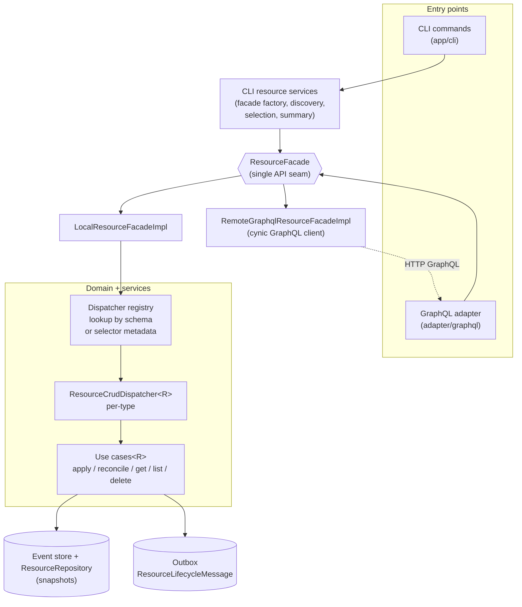
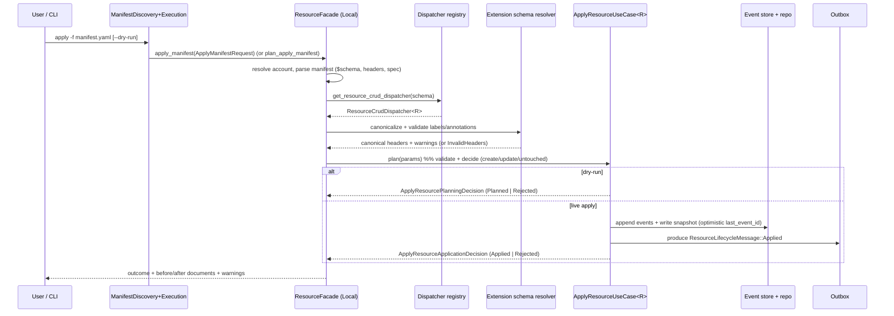
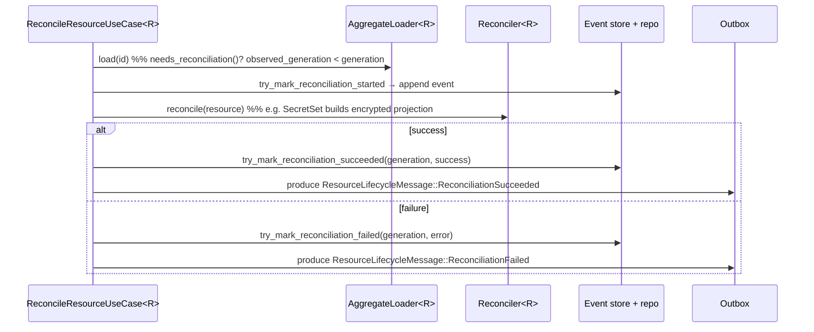
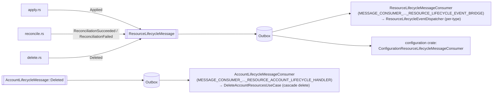
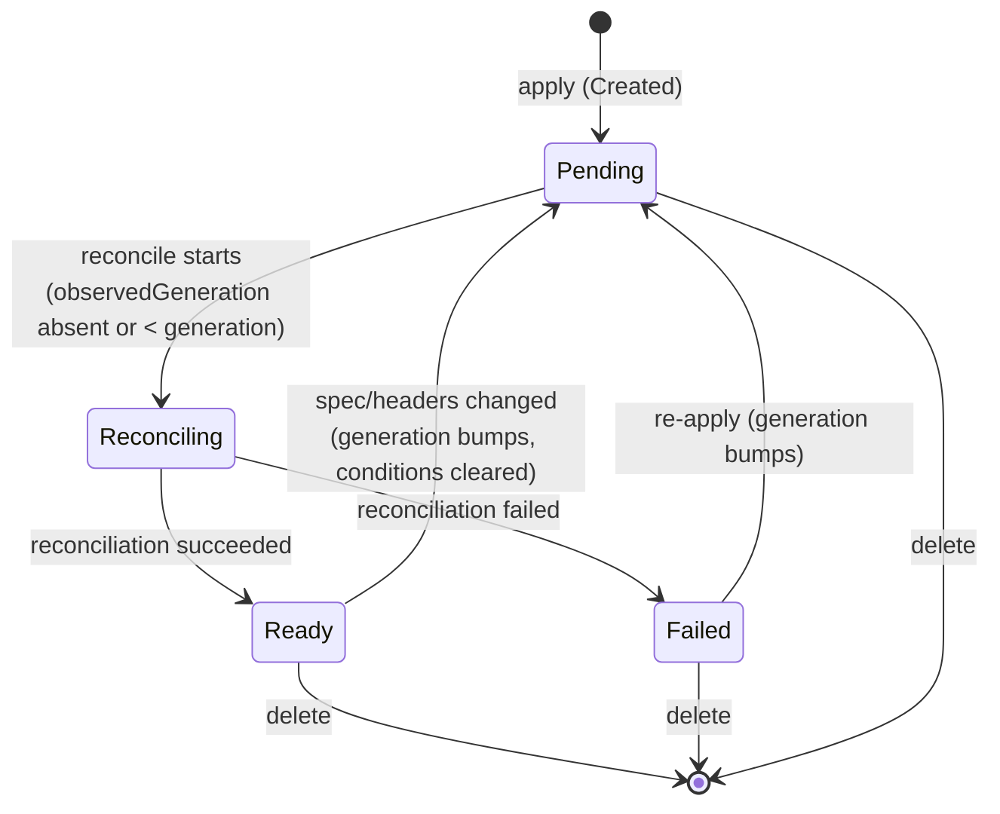

# Resources Framework — Architecture

> **Status:** prototype, under active development.
> This document describes the framework *as it stands today*. Type names, paths, and field lists
> below are drawn from source — when they drift, treat the source as canonical and update this page.

---

## Agent / newcomer quick-start

**One-paragraph mental model.** The resources framework is a generic, event-sourced,
Kubernetes-inspired subsystem for *declarative* management of arbitrary "resource types". A user
authors a **manifest** (`$schema` + `headers` + `spec`); the framework stores it as an event-sourced
aggregate, fills in server-owned headers (id, timestamps, `generation`) and an **initial**
server-owned `status`, then **asynchronously reconciles** it toward the desired state (the status
progresses `Pending → Reconciling → Ready`/`Failed`). Every type (today: `VariableSet`, `SecretSet`)
implements a small set of traits and registers a **dispatcher** keyed by its canonical schema URL.
All callers — the CLI and the GraphQL API — go through a single seam, the **`ResourceFacade`** trait,
which has an in-process (`Local`) implementation and a `RemoteGraphql` implementation that talks to
a remote server.

**Where to start reading, by intent:**

| You want to… | Start at |
| --- | --- |
| Know the rules I must not break | [§3 Invariants](#3-invariants) |
| Understand the core abstractions | [§5 Domain model](#5-domain-model-kamu-resources) |
| Know what a user types vs what the server generates | [Resource anatomy](resources-anatomy.md) |
| Understand storage, uniqueness, soft-delete | [§6 Persistence model](#6-persistence-model) |
| Understand account scoping & permissions | [§7 Account resolution & authorization](#7-account-resolution--authorization) |
| Trace an `apply` / reconcile end-to-end | [§13 Data flow](#13-data-flow-walkthroughs) |
| Add a new resource type | [§14 Concrete types + recipe](#14-concrete-resource-types-kamu-configuration) |
| Find the file for X | [§16 Reference map](#16-filecrate-reference-map) |
| Filter by label (`-l`, wire, storage) | [Resource label filtering](resources-label-filtering.md) |
| Avoid common traps | [§17 Gotchas](#17-extension-points--gotchas) |

**Build & test:**

```bash
cargo build
cargo nextest run -E 'test(test_apply_resource_use_case)'
make clippy
```

> SQLx query-checking mode comes from `.env` files, not from your shell — don't set `SQLX_OFFLINE`
> by hand. The root `.env` sets it `true` repo-wide so CI (which has no database) compiles from the
> committed `.sqlx` cache; `make sqlx-local-setup` starts the DB containers and writes per-crate
> `.env` files that turn it off, so queries are checked against the real schema. After changing SQL,
> `make sqlx-prepare` and commit the regenerated `.sqlx`. See
> [`DEVELOPER.md`](/DEVELOPER.md#build-with-databases).
>
> Build/check/lint the **whole workspace** — do not scope these commands with `-p <crate>`.

---

## Table of contents

**Companion pages:** [Resource anatomy](resources-anatomy.md) ·
[Resource label filtering](resources-label-filtering.md)

- [Resources Framework — Architecture](#resources-framework--architecture)
  - [Agent / newcomer quick-start](#agent--newcomer-quick-start)
  - [Table of contents](#table-of-contents)
  - [1. Purpose \& scope](#1-purpose--scope)
  - [2. Concept glossary](#2-concept-glossary)
  - [3. Invariants](#3-invariants)
  - [4. Layered architecture](#4-layered-architecture)
  - [5. Domain model (`kamu-resources`)](#5-domain-model-kamu-resources)
    - [Core traits](#core-traits)
    - [Events](#events)
    - [Repository](#repository)
    - [Dispatchers](#dispatchers)
    - [Use-case traits](#use-case-traits)
    - [5a. Resource anatomy — input vs auto-generated](#5a-resource-anatomy--input-vs-auto-generated)
  - [6. Persistence model](#6-persistence-model)
  - [7. Account resolution \& authorization](#7-account-resolution--authorization)
  - [8. Rename \& conflict rules](#8-rename--conflict-rules)
  - [9. Services (`kamu-resources-services`)](#9-services-kamu-resources-services)
  - [10. Facade (`kamu-resources-facade`)](#10-facade-kamu-resources-facade)
  - [11. GraphQL API](#11-graphql-api)
  - [12. CLI](#12-cli)
    - [CLI semantics matrix](#cli-semantics-matrix)
  - [13. Data flow walkthroughs](#13-data-flow-walkthroughs)
    - [(a) `kamu apply -f manifest.yaml`](#a-kamu-apply--f-manifestyaml)
    - [Canonical manifest documents](#canonical-manifest-documents)
    - [(b) Reconciliation](#b-reconciliation)
    - [Outbox connections](#outbox-connections)
    - [How reconciliation is scheduled](#how-reconciliation-is-scheduled)
    - [Lifecycle state machine](#lifecycle-state-machine)
  - [14. Concrete resource types (`kamu-configuration`)](#14-concrete-resource-types-kamu-configuration)
    - [Legacy dataset association — the `legacy-config-target-dataset` label](#legacy-dataset-association--the-legacy-config-target-dataset-label)
    - [Secret handling invariant](#secret-handling-invariant)
    - [Recipe: how to add a new resource type](#recipe-how-to-add-a-new-resource-type)
  - [15. Tests](#15-tests)
    - [Testing policy — what belongs where](#testing-policy--what-belongs-where)
  - [16. File/crate reference map](#16-filecrate-reference-map)
  - [17. Extension points \& gotchas](#17-extension-points--gotchas)

---

## 1. Purpose & scope

The framework provides a uniform way to **declaratively manage** typed resources:

- **CRUD + reconcile** — `apply` (create/update), `get`, `list`, `delete` (selectors support `%`
  name patterns), plus a `reconcile` step (outbox-driven, asynchronous — see
  [How reconciliation is scheduled](#how-reconciliation-is-scheduled)) that drives a resource toward
  its desired state.
- **ODF resource model** — every resource carries user-authored `headers` + `spec`. The server
  maintains the remaining headers — including `generation` (the desired-state revision, bumped on
  each spec/headers change) — and the generated ODF `status` with `phase`, optional
  `observedGeneration`, optional `reconciledAt`, and optional `conditions`. Reconciliation is needed
  when `observedGeneration` is absent or lower than `generation`.
- **Pluggable types** — the generic machinery is type-parameterized over a resource type `R`;
  concrete types plug in via traits + registered dispatchers keyed by canonical schema URL.
- **Local & remote symmetry** — the same operations run in-process or against a remote server behind
  one trait (`ResourceFacade`).
- **Event-sourced & transactional** — mutations are recorded as immutable events; lifecycle changes
  are announced on the transactional **outbox**.

**Not in scope here:** the supported / production-ready types today are `VariableSet` and `SecretSet`
(below). A third type, `Storage`, is already **registered** in the CLI catalog and wired through the
same machinery but is **incomplete / WIP** — see [§14](#14-concrete-resource-types-kamu-configuration).
Datasets and flows are **not** resources today, though bringing them under the framework is a
long-term goal. This page documents what exists now.

---

## 2. Concept glossary

| Term | Meaning |
| --- | --- |
| **Resource** | A single managed object instance of a given type, identified by a `ResourceID`. |
| **Schema** | The canonical resource-type identity URL, e.g. `.../config/v1alpha1/VariableSet`. Carried as a `TypeUri` (opaque identity); `ResourceSchemaId` is a parsed lens over it. Its last path segment is a `TypeName` (e.g. `VariableSet`). |
| **Type name** | Human-facing resource type label derived from the schema's last path segment (`TypeName`, e.g. `VariableSet`). `ResourceTypeCountSummary` and `ResourceNameNotFoundError` carry this value as `type_name`; `ResourceHandle` does not store it and instead derives it on demand via `ResourceSchemaId`/`resource_type_name()`. |
| **Selector name / alias** | A resource *type's* CLI/API lookup name used only to resolve raw selector input before dispatch: canonical (the schema `TypeName`, e.g. `VariableSet`, `SecretSet`) or an alias (e.g. `variablesets`, `vs`, `secretsets`, `ss`). Both are `ResourceSelectorName` values and live in selector-resolution structures (`ResourceTypeDescriptor`, `ResourcePresentationDefinition`, `ResourceDispatcherMeta`, CLI selector services). Matching is case-insensitive and exact (no automatic singular/plural inflection) — every accepted spelling is explicitly registered. |
| **Resource type selector** | Raw user/API input identifying a *type* before resolution (`ResourceTypeSelectorRaw`; matches a selector name or alias). Distinct from **Selector**, which identifies an *instance*. |
| **Descriptor** | Schema (`TypeUri`) + selector name/aliases identifying a type for routing/presentation; domain type `ResourceTypeDescriptor`, carried in `dill` as `ResourceDispatcherMeta`. |
| **Manifest** | The user-authored wire document (`$schema`/`headers`/`spec`) in YAML or JSON. |
| **Spec** | The desired-state portion authored by the user; stored as `serde_json::Value`. |
| **Status** | Server-owned observed state (`ResourceStatus`: `phase`, optional `observedGeneration`/`reconciledAt`/`conditions`). `conditions` is a `TypeRef → JSON` map. `generation` lives in **headers**, not status. On a `Resource` (domain/GraphQL), `status` is always present — a resource with no reconciliation yet gets a synthesized `Pending` status with no conditions. The `Option` lives only in the persisted `ResourceSnapshot` row (`None` before the first write completes). |
| **Snapshot** | The persisted materialized form of a resource (`ResourceSnapshot`). |
| **Phase** | Lifecycle stage: `Pending`, `Reconciling`, `Ready`, `Failed` (ODF RFC-018 `ResourcePhase`; see [§13 state machine](#lifecycle-state-machine)). |
| **Condition** | A status signal keyed by a condition schema URI. Built-ins: `Accepted`, `Ready`, `Reconciling`; each value has `value`, `reason`, optional `message`, `lastTransitionTime`. |
| **generation / observedGeneration** | `generation` bumps on each spec/headers change; `observedGeneration` records the last one reconciliation processed. Absent or lower → reconcile. |
| **Reconciliation** | Driving actual state toward the spec (e.g. `SecretSet` materializes its encrypted read-side projection). |
| **Ref** | Identifies exactly one resource *instance* (`ResourceRef`), by exact name or UID, optionally account- and type-scoped. A batch is `Vec<ResourceRef>`. |
| **Selector** | Matches zero or many resource *instances* (`ResourceSelector`), by SQL `LIKE` name pattern and/or UID. Several selectors act as a logical OR. |
| **SpecViewOpts** | Options controlling how sensitive spec fields render, `{ revealed: bool }` today. `revealed: false` (default) returns stored ciphertext as-is; `revealed: true` decrypts. A struct, not an enum, so future spec-view options can be added without growing every call site's argument list. No "redacted" mode today. |
| **Dispatcher** | Per-type adapter (`ResourceCrudDispatcher`, …) registered in `dill`, looked up by schema or selector metadata. |
| **Facade** | The single API seam (`ResourceFacade`); local or remote-GraphQL impl. |
| **TypeRef** | A label/annotation *key*: a short `TypeName` (e.g. registered `environment`, or free-form `env`) or a full schema URI, per ODF RFC-018 (`odf::metadata::resource::TypeRef` = `Uri \| Name`). `Ord`, so a `BTreeMap` key; serializes as a plain string. |
| **Labels / Annotations** | `headers.{labels,annotations}`: `BTreeMap<TypeRef, serde_json::Value>` (arbitrary JSON keyed by `TypeRef`, not flat `String → String`). Manifest input starts as ordered `Vec<(TypeRef, Value)>` so duplicate keys can be rejected before map construction; registered extension keys are canonicalized to schema URI and typed-value validated during facade apply preparation. Per RFC-018, labels are meant to be indexed/queryable and annotations not: **string-valued** labels are indexed via `resource_labels_projection` and selectable with `--label`/`-l`; non-string values are stored but not indexed, so they can never be matched by an equality filter. Annotations are never indexed. |

---

## 3. Invariants

The rules below hold across the framework. They are the contract a maintainer (or coding agent) must
not break; most are enforced in code and exercised by tests — pointers given where useful.

- **`ResourceID` is immutable and server-allocated.** A new resource's UID comes from
  `GenericResourceQueryService::allocate_uid()`; callers cannot choose it. Once assigned it never
  changes (it is the primary key — see [§6](#6-persistence-model)).
- **`(account_id, schema, name)` is unique.** Enforced by a DB unique constraint
  `UNIQUE (account_id, resource_schema, resource_name)`. Names are stored lowercased.
- **`$schema` is the resource type identity.** A schema URL is parsed into base/context/version/name
  for validation and display, but dispatch and persistence compare the full canonical schema — carried
  as a `TypeUri` and string-equal on the wire/in storage (the dill registry key is an equivalent
  `&'static str`, see [§9](#9-services-kamu-resources-services)).
- **Selectors are presentation names, not manifest identity.** CLI and GraphQL selectors still use
  friendly selector names and aliases (`VariableSet`, `variablesets`, `vs`, `SecretSet`, `secretsets`,
  `ss`), typed as `ResourceTypeSelectorRaw` before resolution, which are resolved to a
  `ResourceTypeDescriptor.schema` before repository or dispatcher access.
- **`headers.generation` changes only when desired state changes.** It starts at 1 on create and is
  bumped by the aggregate only when an apply produces a real headers/spec change (`Update`); an
  unchanged apply is `Untouched` and does not bump it.
- **`status.observedGeneration <= headers.generation`** when present. A new resource has no
  observed generation. Reconciliation sets `observedGeneration` to the generation it just processed;
  `needs_reconciliation()` is true when `observedGeneration` is absent or lower than `generation`.
- **`status` is never accepted from manifests.** It is server-owned end to end; manifests use
  `deny_unknown_fields`, so a `status` key is rejected ([§5a](#5a-resource-anatomy--input-vs-auto-generated)).
- **`SecretSet` plaintext never crosses a durable boundary.** It is encrypted by the spec sanitizer
  *before the first event/snapshot write*; plaintext must not appear in events, snapshots, the
  read-side projection, logs, GraphQL responses, CLI output, diffs, or outbox payloads
  ([Secret handling](#secret-handling-invariant)).
- **Local and remote facade behavior must match for all contract-tested cases.** The `contract_test!`
  suite runs each case against both implementations; new facade behavior must be added there
  ([§15](#15-tests)).
- **Ref-keyed operations exist only in batch form**; a single-resource call is a one-element batch.
  A scalar method would be a second implementation of the batch pipeline's contract
  ([§10](#10-facade-kamu-resources-facade)).
- **Batch operations preserve the positional `request_index`.** `BatchResourceResponse` reports each
  success/problem tagged with the originating request index, so partial results map back to inputs.
- **A resource is always scoped to exactly one account**, fixed by the persistence key; cross-account
  visibility is denied by treating out-of-account UIDs as not-found ([§7](#7-account-resolution--authorization)).

---

## 4. Layered architecture

Dependency injection is handled by **`dill`** (a catalog/IoC container). Each crate exposes a
`register_dependencies(&mut CatalogBuilder)` that the application composes in order.


```mermaid
flowchart TD
    subgraph adapters["Entry points"]
      CLI["CLI commands<br/>(app/cli)"]
      GQL["GraphQL adapter<br/>(adapter/graphql)"]
    end

    CLISVC["CLI resource services<br/>(facade factory, discovery,<br/>selection, summary)"]
    FACADE{{"ResourceFacade<br/>(single API seam)"}}
    LOCAL["LocalResourceFacadeImpl"]
    REMOTE["RemoteGraphqlResourceFacadeImpl<br/>(cynic GraphQL client)"]

    subgraph domain["Domain + services"]
      REG["Dispatcher registry<br/>lookup by schema<br/>or selector metadata"]
      DISP["ResourceCrudDispatcher&lt;R&gt;<br/>per-type"]
      UC["Use cases&lt;R&gt;<br/>apply / reconcile / get / list / delete"]
    end

    STORE[("Event store + ResourceRepository<br/>(snapshots)")]
    OUTBOX[("Outbox<br/>ResourceLifecycleMessage")]

    CLI --> CLISVC --> FACADE
    GQL --> FACADE
    FACADE --> LOCAL
    FACADE --> REMOTE
    REMOTE -.HTTP GraphQL.-> GQL
    LOCAL --> REG --> DISP --> UC
    UC --> STORE
    UC --> OUTBOX
```

Note the loop: the **remote** facade implementation calls back into the GraphQL adapter of a remote
server, whose resolvers in turn use a **local** facade there. Local and remote thus share contract
behavior (verified by the same contract tests — see [§15](#15-tests)).

**Crates:**

| Crate | Path | Role |
| --- | --- | --- |
| `kamu-resources` | `src/domain/resources/domain` | Base domain model: traits, values, manifests, events, repo & dispatcher interfaces, use-case traits, messages. |
| `kamu-resources-services` | `src/domain/resources/services` | Implementations: loaders, persistence, query services, use-case macros, dispatcher macros + registry, message handlers. |
| `kamu-resources-facade` | `src/domain/resources/facade` | The `ResourceFacade` trait + `Local` and `RemoteGraphql` implementations. |
| `kamu-resources-facade-tests` | `src/domain/resources/facade-tests` | Cross-implementation contract tests enforcing local/remote symmetry for covered behavior. |
| `kamu-configuration` / `kamu-configuration-services` | `src/domain/configuration/{domain,services}` | Concrete types: `VariableSet`, `SecretSet`. |

---

## 5. Domain model (`kamu-resources`)

Module layout: `core/`, `state/`, `values/`, `validation/`, `views/`, `manifests/`, `services/`,
`repo/`, `dispatchers/`, `messages/`, `use_cases/`.

### Core traits

A resource is layered as a stack of traits. The base is **`DeclarativeResource`** — a resource has a
`Spec` (per-kind) and a backing `ResourceState`
([`core/declarative_resource.rs`](/src/domain/resources/domain/src/core/declarative_resource.rs)).
Unlike `Spec`, status is **not** an associated type: every resource kind shares one canonical
`ResourceStatus` (the ODF RFC-018 shape — phase/conditions/observed-generation), so there is no
per-kind variation to parameterize over. `status()` returns the concrete `ResourceStatus` directly:

```rust
pub trait DeclarativeResource:
    Sized + Send + Sync + std::fmt::Debug + AsRef<Self::ResourceState>
{
    type Spec: std::fmt::Debug + Send + Sync;
    type SpecInput: std::fmt::Debug + Send + Sync;
    type ResourceState: DeclarativeResourceState<Spec = Self::Spec>
        + TryFrom<ResourceSnapshot, Error = InternalError>
        + From<Self>;

    fn id(&self) -> &ResourceID;
    fn headers(&self) -> &ResourceHeaders;
    fn spec(&self) -> &Self::Spec;
    fn status(&self) -> &ResourceStatus;
}
```

**`Spec` vs `SpecInput`.** `Spec` is the resolved, stored shape — what a snapshot persists and what
`get`/`list` return. `SpecInput` is the write-path shape decoded straight from a manifest/apply
request; it is validated and linted (`ResourceValidateSpec`/`ResourceLinterSpec` run against
`SpecInput`, not `Spec`), carried unconverted through `ApplyResourceParams` and into the
`Created`/`SpecUpdated` events, and converted to `Spec` exactly once — lazily, at projection/replay
time (`ResourceSpecFromInput::from_input`, called from `project_reconcilable_resource_state` in
`core/reconcilable_status_projector.rs`) — mirroring how `ResourceHeadersInput` is threaded through
events and converted to `ResourceHeaders` via `ResourceHeaders::from_input` at the same projection
step (see below). For a resource kind with no server-side defaulting, `Spec` and `SpecInput` are the
same type and `from_input` is the identity — `VariableSetResource` and `SecretSetResource` are both
such cases today; `StorageResource` (WIP) is expected to be the first case where they genuinely
diverge, once reference resolution (`ValueRef` -> concrete value) is implemented.

**`ReconcilableResource`** adds the lifecycle + reconciliation transitions
([`core/reconcilable_resource.rs`](/src/domain/resources/domain/src/core/reconcilable_resource.rs)).
Note that `needs_reconciliation()` is derived from `generation` vs the status:

```rust
pub trait ReconcilableResource: DeclarativeResource {
    type ReconcileSuccess;
    type ReconcileError: ResourceReconcileError;
    type ReconcileFailureDetails;
    type LifecycleError;

    fn needs_reconciliation(&self) -> bool { /* observed_generation vs generation */ }

    fn try_create(now, id, headers: ResourceHeadersInput, spec: Self::SpecInput) -> Result<Self, LifecycleError>;
    fn try_update_headers(&mut self, now, new_headers: ResourceHeadersInput) -> ...;
    fn try_update_spec(&mut self, now, new_spec: Self::SpecInput) -> ...;
    fn try_delete(&mut self, now, tombstone_name: String) -> ...;
    fn try_mark_reconciliation_started(&mut self, now) -> ...;
    fn try_mark_reconciliation_succeeded(&mut self, now, expected_generation, success) -> ...;
    fn try_mark_reconciliation_failed(&mut self, now, expected_generation, error) -> ...;
}
```

**`ReconcilableEventSourcedResource`** binds the resource to the `event-sourcing` crate — its
`ResourceState` is an event `Projection` over `ReconcilableResourceEvent<Spec, Success, FailureDetails>`
and an aggregate. This is the bound that all generic use cases require.

**Presentation & descriptor traits:**

- **`ResourceSchemaProvider`** — exposes `fn schema() -> &'static TypeUri`, the canonical schema URL
  (as a `TypeUri`) for the resource, backed by a `'static` value (a `LazyLock<TypeUri>` from the ODF
  codegen) ([`core/resource_descriptor.rs`](/src/domain/resources/domain/src/core/resource_descriptor.rs)).
- **`ResourcePresentation`** — exposes a `ResourcePresentationDefinition` with `canonical_selector:
  ResourceSelectorName`, `selector_aliases: &'static [ResourceSelectorName]`, and per-type list
  columns for table/`list` rendering.

  > Routing does not go through a `ResourceDescriptor`/`DESCRIPTOR` const; the registry keys
  > dispatchers on `dill` metadata (`ResourceDispatcherMeta`) and compares it against the target
  > `TypeUri`/selector — see [§9](#9-services-kamu-resources-services) for the const-string details.

### Events

`ReconcilableResourceEvent<TSpec, TSuccess, TFailureDetails>` is the event-sourcing alphabet:
`Created`, `HeadersUpdated`, `SpecUpdated`, `Deleted`, `ReconciliationStarted`,
`ReconciliationSucceeded`, `ReconciliationFailed`. `Created.spec` and `SpecUpdated.new_spec` are
instantiated with `R::SpecInput`, not `R::Spec` — the event log stores what was submitted, same as
`Created.headers`/`HeadersUpdated.new_headers` store `ResourceHeadersInput`. The `ResourceState`
projection folds these into current state, converting `SpecInput` -> `Spec` (and `HeadersInput` ->
`Headers`) at fold time — see `Spec` vs `SpecInput` above.

### Repository

`ResourceRepository` (`repo/`) is the persistence seam: allocate an id, create/update snapshots
(with optimistic `expected_last_event_id`), read by id or name (singly and in batch), and run
scoped searches — `search_resource_handles` / `list_resource_snapshots` plus their `count_*`
siblings, which share the scope predicate and must agree with it.

**Batch reads return rows in request order.** `resolve_resource_ids_by_names`,
`find_resource_handles_by_ids`, `find_resource_snapshots_by_ids` and
`find_resource_snapshots_by_schema_and_ids` return rows ordered to match the input slice; rows that
do not exist, are deleted, or belong to another account are simply absent, so a result may be
*shorter* than the request but never reordered. Callers rely on this to zip results back onto
positional `request_index` values. Postgres pins the order in SQL with `array_position`; SQLite has
no equivalent, so its repository re-sorts in Rust after the query (`IN (...)` makes no ordering
promise); the in-memory backend iterates the request slice directly. Pinned by the shared repository
suite, which asserts the *reversed* request too — an arbitrary-but-stable scan order would pass a
forward-only assertion.

**Label filters apply only to scoped searches**, never to direct identity reads: the scoped calls
carry their pairs per row inside `ResourceScope`, while the by-id/by-name reads take none at all.

### Dispatchers

The generic code can't name a concrete `R` at the API boundary, so dynamic dispatch is keyed by
descriptor. `ResourceCrudDispatcher` is the main one (also `ResourcePresentationDispatcher`,
`ResourceLifecycleEventDispatcher`, and a spec-view dispatcher that reveals/decrypts sensitive
spec fields on request). Each carries
schema plus presentation metadata as `dill` metadata for registry lookup
(see [§9](#9-services-kamu-resources-services)).

### Use-case traits

Generic, `R`-parameterized contracts in `use_cases/`: `ApplyResourceUseCase<R>` (two-phase, below),
`ReconcileResourceUseCase<R>`, `DeleteResourcesUseCase<R>`, plus the non-generic
`ListAllResourcesUseCase` and `DeleteAccountResourcesUseCase`.

Reads are deliberately absent from this list. Typed per-type read use cases would each run their own
paginated query, which cannot paginate correctly across types — page 2 of a merged result is not
page 2 of each type. All reads instead go through the schema-agnostic `GenericResourceQueryService`,
which takes a `ResourceScope` and answers a multi-type request in one query.

### 5a. Resource anatomy — input vs auto-generated

Only a subset of a resource is user-authored: a manifest carries `$schema`,
`headers.{id?, account?, name, labels, annotations}` and `spec`, and nothing else —
`deny_unknown_fields` rejects `status`, timestamps and `generation`, which are server-owned. The
framework generates the remaining headers (`id`, resolved `account`, `generation`,
`created_at`/`updated_at`/`deleted_at`) and the whole `status`. `SecretSet` goes further: authored
plaintext is encrypted *before the first durable write*, so its persisted `spec` is server-derived
too (see [Secret handling](#secret-handling-invariant)).

**→ [Resource anatomy — authored vs generated](resources-anatomy.md)** — the field-by-field
breakdown: manifest/headers/status structs, the codegen-alias convention and why these are ODF
aliases rather than hand-rolled types, well-known annotations, label/annotation canonicalization,
and the persisted `ResourceSnapshot`.

---

## 6. Persistence model

Resources are **event-sourced with a materialized snapshot per resource**. Storage backends live in
`src/infra/resources/` (`postgres`, `sqlite`, `inmem`), all implementing the domain
`ResourceRepository` + raw event-store traits and sharing the cross-backend test suite in
`src/infra/resources/repo-tests/`. Schema is defined by
[`migrations/postgres/20260323155948_resources.sql`](/migrations/postgres/20260323155948_resources.sql)
(SQLite mirror alongside).

**Two tables:**

- **`resources`** — one row per resource (the snapshot): `resource_id` (UUID, **PK**),
  `account_id`, `resource_schema`, `resource_name`, `labels`/`annotations`
  (JSONB), `spec` (JSONB), `status` (JSONB, nullable), `generation`, `created_at`/`updated_at`,
  `deleted_at` (nullable), `last_event_id`. **Uniqueness:**
  `UNIQUE (account_id, resource_schema, resource_name)`.
  A partial index on `(account_id, resource_schema, status->>'phase') WHERE deleted_at IS NULL`
  backs the summary projection. `labels`/`annotations` are untyped JSONB with **no index of their
  own**; label selector queries are served by the separate `resource_labels_projection` table
  (below), never by scanning this JSONB. There is no dedicated
  `description` column: `description` lives inside `annotations` as the first well-known
  annotation entry, so adding future well-known annotations needs no schema change.
- **`resource_events`** — append-only log: `event_id` (BIGINT from a sequence, PK), `resource_id`
  (FK → `resources`), `resource_schema`, `event_time`, `event_type`, `event_payload` (JSONB).

**Source of truth.** The event log is authoritative — aggregates are rebuilt by projecting events
(`ResourceAggregateLoader`). The `resources` row is a **derived snapshot** maintained in the same
transaction as the event append; it exists for efficient queries/listing/uniqueness and should never
diverge. If they ever disagree, the events win and the snapshot is the bug.

**List columns.** Concrete resources no longer extend status with per-type `stats`. Presentation
columns are derived from the current spec/read model instead: `VariableSet.variables` is
`spec.variables.entries.len()`, `SecretSet.secrets` is `spec.secrets.entries.len()`, and
`Storage.provider` / `Storage.detail` are derived from the storage spec.

**Optimistic concurrency.** `update_resource` is a compare-and-set on `last_event_id`: the update
only applies if the stored `last_event_id` equals the caller's `expected_last_event_id`; otherwise it
returns `UpdateResourceError::concurrent_modification()`. A unique-constraint violation surfaces as
`UpdateResourceError::Duplicate`.

**Soft-delete / tombstone.** Delete is a soft-delete: the row stays with `deleted_at` set and a
`Deleted` event is appended. Because the unique constraint still covers deleted rows, delete also
**renames the resource to a tombstone name** (`try_delete(now, tombstone_name)` → `Deleted` event
carries `tombstone_name`) so the original `(account, schema, name)` is freed for reuse. All query/list
methods filter `WHERE deleted_at IS NULL`, so tombstones are invisible to normal reads.

**Migration / backfill.** Schema changes are ordinary SQLx migrations under `migrations/{postgres,sqlite}`.
There is a precedent for data backfill into resources —
`20260513120000_backfill_env_var_resources.sql` migrates legacy dataset env-vars into `VariableSet`
resources; new types that supersede existing data should follow that pattern (additive migration +
backfill, never rewriting the event log in place).

**Schema/version upgrades.** The schema URL is part of resource identity, including its version
segment. Supporting a new schema version therefore requires an explicit compatibility/migration
story for that resource type: update manifests, projections, dispatcher registration, and any
existing rows/events that should move to the new schema.

---

## 7. Account resolution & authorization

Every resource belongs to exactly one account, and that scoping is also the authorization boundary.
Resolution + permission checks live in `ResourceAccountResolverImpl`
([`facade/local/resource_account_resolver_impl.rs`](/src/domain/resources/facade/src/facade/local/resource_account_resolver_impl.rs)).

- **Who may specify `headers.account`.** The manifest `account` field is optional and **defaults to
  the calling subject's own account**. To target *another* account, the resolver requires the caller
  to be an **admin** (`rebac_service.is_account_admin`); otherwise it returns
  `AccessError::Unauthorized`. An **anonymous** subject cannot resolve any account (rejected).
- **Account selector forms.** `account` (`ResourceAccountRef`) carries `id`/`did`/`name`, all
  optional. The account is looked up by `did` if given, else by `name`; any other selector field(s)
  present are then checked for agreement against the resolved account (a mismatch on `id`, `did`, or
  `name` → `SelectorMismatch`). An empty selector (`{}`) parses successfully (the struct derives
  `Default`) but is rejected by the resolver itself with `EmptySelector`, since at least one of
  `id`/`did`/`name` is required to resolve an account.
- **Remote calls.** For a remote context the CLI authenticates with an access token; the server then
  resolves the *authenticated principal* into the current account subject exactly as above — the
  client never asserts its own account id, the server derives it.
- **Local workspace context.** The local facade uses the workspace's current account subject
  (`CurrentAccountSubject`) as the caller; the same admin rule applies for cross-account targeting.
- **UID belonging to a different account.** Lookups are account-scoped (`find_account_snapshot`
  filters by `account_id`). A UID that exists but belongs to another account is reported as
  **not-found** (`ResourceIDNotFoundError`), not "forbidden" — so existence is not leaked across
  accounts. A UID of the wrong schema yields `ResourceTypeMismatchError` in the domain and
  `ResourceLookupProblem::SchemaMismatch` at the facade boundary.
- **Account-deletion cascade.** When an account is deleted, `DeleteAccountResourcesUseCase` deletes
  that account's resources (see [§13](#13-data-flow-walkthroughs)). It operates on live resources;
  already-tombstoned resources are simply skipped (they are already `deleted_at`-marked), so the
  cascade is idempotent with respect to prior deletions.

---

## 8. Rename & conflict rules

The apply planner ([`services/apply_resource_planner.rs`](/src/domain/resources/services/src/services/apply_resource_planner.rs))
decides create vs update by resolving the target resource first:

- **No `id` in manifest** → resolve by `(account, schema, name)`. Found → update; not found → create
  (new UID allocated).
- **`id` in manifest** → load that exact resource (the "exact pointer"). This is what enables a
  **rename**: supply the `id` and a new `headers.name`; identity stays stable while the name
  changes.

Concrete conflict cases:

| Case | Outcome |
| --- | --- |
| `id` + changed `headers.name` | **Rename** — name updated on the same resource (`Update`). |
| `id` whose resource has a different schema | **Reject** — `ResourceTypeMismatchError` in domain code, mapped to `SchemaMismatch` in the facade. |
| `id` resolving to a resource in a different account | **Not found** — `ResourceIDNotFoundError` (account-scoped lookup; existence not leaked). |
| `headers.account` targeting another account without admin | **Reject** — `AccessError::Unauthorized` ([§7](#7-account-resolution--authorization)). |
| Rename target name already taken (same account+schema) | **Reject** — unique-constraint `Duplicate` at persistence. |
| Update by name where another account has the same name | **No conflict** — the account disambiguates; each `(account, schema, name)` is independent. |
| Apply re-using a tombstoned (deleted) name | **Allowed** — the deleted resource was renamed to a tombstone, freeing the name for a fresh create. |
| Apply with no real change | **`Untouched`** — no generation bump, no events, no reconcile. |

Note names are normalized to lowercase on write, so case-only differences are not distinct names.

---

## 9. Services (`kamu-resources-services`)

This crate turns the domain traits into running code. Module layout: `services/`, `use_cases/`,
`crud_dispatchers/`, `message_handlers/`, `event_stores/`, `resources/`, `testing/`.

**Supporting services:**

- **`ResourceAggregateLoader<R>`** — replays the event stream and projects a resource aggregate.
- **`ResourcePersistenceService<R>`** — commits aggregate changes as events + snapshot (create /
  save / delete, with `delete_many`).
- **`GenericResourceQueryService`** (impl `GenericResourceQueryServiceImpl`) — descriptor-agnostic
  queries (allocate UID, find by name, search identities) delegating to `ResourceRepository`.
- **`TypedResourceQueryService<R>`** — type-safe queries for a single type.
- **`Reconciler<R>`** — the per-type reconcile engine (implemented in the type's crate).

**Two-phase apply.** `ApplyResourceUseCase<R>` separates *planning* (validate, diff, decide
create/update/untouched, without writing) from *application* (persist + publish)
([`use_cases/apply_resource_use_case.rs`](/src/domain/resources/domain/src/use_cases/apply_resource_use_case.rs)):

```rust
pub trait ApplyResourceUseCase<R: ReconcilableEventSourcedResource>: Send + Sync {
    async fn plan(&self, params: ApplyResourceParams<R>)
        -> Result<ApplyResourcePlanningDecision<R>, ApplyResourceUseCaseError<R>>;
    async fn apply(&self, params: ApplyResourceParams<R>)
        -> Result<ApplyResourceApplicationDecision<R>, ApplyResourceUseCaseError<R>>;
}

pub enum ApplyResourcePlanningDecision<R> { Planned(ApplyResourcePlan<R>), Rejected(ApplyResourceRejection) }
pub enum ApplyResourceApplicationDecision<R> { Applied(ApplyResourceResult<R>), Rejected(ApplyResourceRejection) }
pub enum ApplyResourceAction { Create, Update, Untouched }
pub enum ApplyResourceOutcome { Created, Updated, Untouched }
```

The `--dry-run` path uses `plan`; a live apply uses `apply`. Use-case implementations are generated
by **`declare_*_use_case!`** macros so each type gets a fully-wired instance without boilerplate.

**Dispatchers + registry.** Each type registers a `ResourceCrudDispatcher` via
`declare_resource_crud_dispatcher!` (and a presentation dispatcher). Lookup is by schema or selector
metadata through `dill` — the registry key is `ResourceDispatcherMeta` (schema `&'static str` +
selector name/aliases). There are **three** lookup entry points, differing only in how a missing
dispatcher is reported
([`crud_dispatchers/resource_crud_dispatcher_registry.rs`](/src/domain/resources/services/src/crud_dispatchers/resource_crud_dispatcher_registry.rs)):

```rust
// (1) By schema (from a parsed manifest `$schema`) — a miss is a user error.
pub fn get_resource_crud_dispatcher<E>(target_catalog, schema: &str) -> Result<Arc<dyn …>, E>
    where E: From<UnsupportedResourceDescriptorError> + From<InternalError>;

// (2) By selector name/alias (from a CLI/GraphQL selector) — a miss is a user error.
pub fn get_resource_crud_dispatcher_by_raw_selector<E>(target_catalog, raw_selector: &ResourceTypeSelectorRaw) -> Result<…, E>
    where E: From<UnsupportedResourceSelectorError> + From<InternalError>;

// (3) By a schema already known valid (stored snapshot, or an already-resolved selector) —
//     a miss is a data-integrity catastrophe, so it is an InternalError (→ 500), never a user error.
pub fn get_resource_crud_dispatcher_for_trusted_schema(target_catalog, schema: &str)
    -> Result<Arc<dyn …>, InternalError>;
```

Each finds exactly one dispatcher; zero → `NotFound`, more than one → `Duplicate`. The distinction
between (1)/(2) (fresh, unvalidated input → user error) and (3) (schema the system itself produced →
a miss means corrupt storage/registration, i.e. `InternalError`) is the point of having three.

**Message handlers** (outbox consumers — see [§13](#13-data-flow-walkthroughs)):
`ResourceLifecycleMessageConsumer` and `AccountLifecycleMessageConsumer`.

**DI registration** — [`dependencies.rs`](/src/domain/resources/services/src/dependencies.rs) is the
single place where this crate's `dill` catalog components (base query services, the cross-type use
cases, and the outbox message consumers) are registered. Per-type use cases and dispatchers are
registered separately by the type's own crate (see [§14](#14-concrete-resource-types-kamu-configuration)).

**Extension-schema registry.** Built-in label/annotation/condition schemas register
`ResourceExtensionSchemaDispatcher` trait objects through the same dill metadata pattern as CRUD
dispatchers. During catalog assembly,
`kamu_resources_services::build_catalog_with_resource_extension_schema_registry` builds a preview
catalog, constructs `ResourceExtensionSchemaRegistry` from every registered dispatcher, attaches the
immutable registry value, and returns the final catalog. The registry parses const-friendly metadata
into runtime records, checks duplicate schema IDs and short-name conflicts, and precomputes lookup
indexes by URI plus short-name precedence tiers (exact resource type → versioned context → context →
any resource). `ResourceExtensionSchemaResolver` sits on top of the registry: exact URI keys are
strict (unknown / wrong-kind / inapplicable URIs reject), while unresolved short names are preserved
as free-form extension keys with warnings. For registered labels and annotations the resolver also
validates the JSON value through the schema dispatcher and rewrites the key to the canonical schema
URI before headers are converted into maps. `ResourcePersistenceServiceHelper` delegates to
`ResourceDurableStateValidator` before create/save repository/event-store writes: registered
label/annotation URIs and all condition URIs must resolve, apply to the resource schema, and
validate through their dispatcher; registered short aliases are rejected as noncanonical durable
state; unknown short label/annotation names remain free-form. The validator reports
`ResourceDurableStateValidationError`, composed from existing domain errors such as
`ParseResourceSchemaError`, `ResourceExtensionResolutionError`, and `ResourceExtensionValueError`.
Persistence carries it as `ResourcePersistenceError::InvalidDurableState`; public use-case
boundaries translate that into an internal error because user-authored paths should have been
rejected earlier. Delete is not blocked by this guard, so cleanup can still remove a resource that
already contains corrupt extension state. Label indexing and filtering are implemented — see
[§10](#10-facade-kamu-resources-facade) for the resolved-filter tree and the AND-only evaluation
boundary.

---

## 10. Facade (`kamu-resources-facade`)

`ResourceFacade` is the **single API seam** every caller uses. It hides the per-type generics behind
descriptor-keyed dispatch and gives local/remote symmetry. Selected signature
([`facade/resource_facade.rs`](/src/domain/resources/facade/src/facade/resource_facade.rs)):

```rust
#[async_trait]
pub trait ResourceFacade: Send + Sync {
    async fn list_supported_resource_types(&self) -> Result<Vec<ResourceTypeDescriptor>, ...>;
    async fn summary(&self, request: ResourcesSummaryRequest) -> Result<ResourcesSummary, ...>;

    // Ref-keyed reads and deletes take ODF `ResourceRef`s: each ref carries its
    // own account and type, so one batch can span both. These exist ONLY in
    // batch form — a single-resource call is a one-element vec.
    async fn get(&self, resource_refs: Vec<ResourceRef>, spec_view: SpecViewOpts)
        -> Result<BatchResourceResponse<Resource, ResourceLookupProblem>, ...>;
    async fn get_handles(&self, resource_refs: Vec<ResourceRef>)
        -> Result<BatchResourceResponse<ResourceHandle, ResourceLookupProblem>, ...>;
    async fn render_manifests(&self, resource_refs: Vec<ResourceRef>, format: ResourceManifestFormat, spec_view: SpecViewOpts)
        -> Result<BatchResourceResponse<RenderResourceManifestResult, ResourceLookupProblem>, ...>;

    // Listing is two methods sharing ONE request type (`selectors`, `account`,
    // `pagination`); only the response differs. Both return `{ items, total_count }`.
    async fn search(&self, request: SearchResourcesRequest) -> Result<SearchResourcesResponse, ...>;
    async fn search_handles(&self, request: SearchResourcesRequest) -> Result<SearchResourceHandlesResponse, ...>;

    // Apply is the one family that KEEPS a scalar form, because there the
    // scalar is the primitive and the batch is a loop over it — see below.
    async fn plan_apply_manifest(&self, request: ApplyManifestRequest) -> Result<ApplyManifestPlanningDecision, ...>;
    async fn apply_manifest(&self, request: ApplyManifestRequest) -> Result<ApplyManifestApplicationDecision, ...>;
    async fn plan_apply_manifests(&self, request: ApplyManifestBatchRequest)
        -> Result<ApplyManifestBatchResponse<ApplyManifestPlanningDecision>, BatchResourceError>;
    async fn apply_manifests(&self, request: ApplyManifestBatchRequest)
        -> Result<ApplyManifestBatchResponse<ApplyManifestApplicationDecision>, BatchResourceError>;

    async fn delete(&self, resource_refs: Vec<ResourceRef>)
        -> Result<BatchResourceResponse<ResourceID, ResourceLookupProblem>, ...>;
}
```

**The two families are deliberately asymmetric about which form is the
primitive.** Ref-keyed reads and deletes (`get`, `get_handles`,
`render_manifests`, `delete`) exist only in batch form: the batch pipeline —
group refs by `(account, schema)`, resolve ids per group, merge back by
`request_index` — *is* the primitive, so a scalar method would be a second
implementation of the same contract, kept honest only by tests.

Apply keeps its scalar form because there the scalar *is* the primitive:
`plan_apply_manifests`/`apply_manifests` are loops over
`plan_apply_manifest`/`apply_manifest`, and the per-item transaction boundary
belongs to the caller — the CLI's `--continue-on-error` path opens one
transaction per manifest — not to the facade.

**Selectors & view modes:**

```rust
// Both *are* the ODF types — plain re-exports, not local twins. A `ResourceRef`
// is exact and names one resource; a `ResourceSelector` carries a SQL LIKE
// pattern and matches zero or many.
pub type ResourceRef      = odf::metadata::resource::ResourceRef;
pub type ResourceSelector = odf::metadata::resource::ResourceSelector;

pub struct ResourceRef      { pub account: Option<ResourceAccountRef>, pub id: Option<ResourceID>,
                              pub did: Option<Did>, pub r#type: Option<TypeRef>,
                              pub name: Option<ResourceName> }
pub struct ResourceSelector { pub account: Option<ResourceAccountRef>, pub id: Option<ResourceID>,
                              pub did: Option<Did>, pub r#type: Option<TypeRef>,
                              pub name: Option<String> /* LIKE pattern */,
                              pub labels: Option<...> }
pub enum   ResourceManifestFormat { Json, Yaml }
pub struct SpecViewOpts { pub revealed: bool /* default: false */ }
```

Every field of both types is optional, so one selector can span every type and
account. Several selectors act as a logical **OR**; an empty list matches
nothing.

Field order follows ODF (`account, id, did, type, name`), which the generated serde proxy and
flatbuffers table also follow.

`did` is forward-reserved in ODF for when datasets and accounts become resources. No repository can
resolve by it, so it is **rejected rather than ignored** on both types — `validate_ref` for a ref
and `validate_selector` for a selector. Silently dropping it would return a *wider* result set than
was asked for, with no way for the caller to tell.

**The batch pipeline: group, resolve, merge.** Every ref-keyed call runs the same three-stage
shape. `group_refs_by_target` — the shared front half of all three pipelines (`get_handles`,
`resolve_multiple_resource_views`, which serves both `get` and `render_manifests`, and `delete`) —
resolves each ref's account and schema, then splits the batch into `(account, schema)` groups
(`local/helpers/batch_grouping.rs`). The services underneath are scalar in both dimensions, so a
batch spanning either must be issued as one call per combination; each group is still *batched*
internally, so an N-name group stays a single query and only the number of distinct pairs
multiplies round trips. Accounts are compared **after** resolution, so one account spelled by id in
one ref and by name in another lands in a single group. Groups come back in first-appearance order,
and each carries the originating `request_index` values so results merge back into the caller's
ordering.

The stage also fixes where a failure lands. An unresolvable account or an **unknown named** type
fails the *whole* call — both are addressing errors in the request. A **type-less** ref is
different: resolving it is a lookup against stored data, so a miss or an ambiguity is that one
ref's per-item problem, returned alongside the groups.

A type-less `ResourceRef` (`type: None`) is resolved by searching every registered type. Because
all three pipelines share this front half, they inherit that resolution together rather than one at
a time.
Because a ref names *exactly one* resource, a name matching in several types is an **ambiguity**
error (`AmbiguousType`, RF-172), not a multi-match: picking a winner would make `kamu get <name>`
silently resolve to whichever type sorted first. A name matching in none is `AnyTypeNameNotFound`
(RF-171). Contrast a type-less *selector*, for which several matches are the expected outcome —
that asymmetry is the whole ref/selector distinction.

A `ResourceRef` may carry **both** an `id` and a `name`. ODF treats the pair as a *consistency
assertion* rather than two lookups: the `id` is the authoritative half the lookup uses, and the
`name` is verified against the resolved resource. If they disagree the entry fails with a
`NameMismatch` problem (RF-170) — otherwise pairing one resource's id with another's name would
read, render, or delete the resource the `id` names while the caller believes they addressed the
one they spelled out.

The fields *within* one selector are a **conjunction**, but the repository's per-type rows are
OR'd — so a selector narrowing by more than one of `id` / `name` cannot be expressed as rows
without widening the match, and is rejected as `SelectorNarrowsBySeveralModes`. Unlike the
`AnyType*` limits, this one is not a property of `ResourceScope::AnyType` and survives the
per-row-type stage.

Batch operations return `BatchResourceResponse<T, E>` with positional `successes` / `problems`
(each tagged by `request_index`) — so a partial batch reports per-item outcomes.

`plan_apply_manifests` / `apply_manifests` are the exception: they return
`ApplyManifestBatchResponse<D>` and are all-or-nothing, not partial-batch. The
whole batch is one transaction — the first item that is individually
rejected or fails stops processing and rolls back everything, including
earlier items in the same call that would otherwise have succeeded.
`ApplyManifestBatchResponse::items` reports only the items actually
processed before the stop (positionally tagged by `request_index`, `Ok(D)`
or `Err(ApplyManifestError)`); `rolled_back_successes` separately lists the
indexes of items that individually succeeded but were rolled back, which the
local facade always leaves empty (it can report each item's true
pre-rollback outcome in `items` instead) but the remote GraphQL facade
populates when the rollback is forced through a transport-level error and
the normal per-item `data` is unavailable (see `GqlError::gql_extended` /
`extensions.batch` in `ResourcesMut::apply_manifests`).

**Implementations:**

- **`LocalResourceFacadeImpl`** — resolves account → resolves selector name/alias to a
  schema and UID/snapshot → looks up the per-type dispatcher via `get_resource_crud_dispatcher` →
  calls it. Holds the `dill::Catalog`,
  a `ResourceAccountResolver`, `GenericResourceQueryService`, and
  `ResourceExtensionSchemaResolver`. For `plan_apply_manifest` / `apply_manifest`, the shared
  preparation step parses the manifest, resolves the account, resolves the CRUD dispatcher,
  canonicalizes and validates labels/annotations, collects header warnings, then builds
  `ResourceHeadersInput`; this is why plan/apply accept, reject, and warn identically.
- **`RemoteGraphqlResourceFacadeImpl`** — a `cynic`-based GraphQL client that issues the queries /
  mutations of a remote server (whose resolvers use a *local* facade there). Operations live under
  `facade/graphql/cynic_api/operations/`; responses are mapped back to domain views/errors in
  `facade/graphql/outcome_mapper/`.

**Registration** ([`dependencies.rs`](/src/domain/resources/facade/src/dependencies.rs)) adds
`ResourceAccountResolverImpl` and `LocalResourceFacadeImpl`. (The remote impl is constructed
on demand by the CLI for remote contexts — see [§12](#12-cli).)

**Label filtering** rides on the selectors themselves: each `ResourceSelector` carries an optional
`labels`, and there is **no** call-level filter — search requests carry only `selectors`, `account`
and `pagination`, while the batch ref calls take a bare `Vec<ResourceRef>`, which has no `labels`
field at all. A uniform filter is just the case where every selector carries the same labels; what
per-selector labels add is two selectors filtering *differently* in one call.

**→ [Resource label filtering](resources-label-filtering.md)** — the full path: resolution through
`ResourceExtensionSchemaResolver`, the AND-only evaluation boundary in `flatten_conjunction`,
per-row scope pairs, the `resource_labels_projection` table, and the known rebuild gap.

---

## 11. GraphQL API

Files: [`adapter/graphql/src/queries/resources/`](/src/adapter/graphql/src/queries/resources)
and [`adapter/graphql/src/mutations/resources_mut/`](/src/adapter/graphql/src/mutations/resources_mut).
Every resolver delegates to `ResourceFacade`.

**Queries (`Resources`):** `supported_resource_types`, `summary`, `byRefs`,
`handlesByRefs`, `bySelectors` / `handlesBySelectors`, `renderManifests`. Each ref-keyed
query takes `[ResourceRefInput!]!` — there are no single-ref variants, matching the facade. The
`opts: SpecViewOptsInput` argument (`{ revealed: bool }`) maps to the facade's `SpecViewOpts`.

**Mutations (`ResourcesMut`):** `apply_manifest(manifest, format, dry_run?)`,
`apply_manifests(manifests, dry_run?)`, `delete(resourceRefs)`. `dry_run` routes to
`plan_apply_manifest`, otherwise `apply_manifest`.

**Outcome-union pattern.** *Domain/application outcomes* are modeled as unions: a resolver returns a
union of `Success` + typed `Problem` variants (account resolution, unsupported descriptor, validation
failures, …) so clients handle each expected case structurally rather than by parsing error strings.
This does **not** cover everything — authentication failures, authorization failures, server bugs,
and infrastructure failures still surface as ordinary GraphQL `errors`. Clients must handle both: the
typed `Problem` variants *and* transport-level GraphQL errors. The apply outcome
(`resource_apply_outcome_model.rs`) is the richest example of the union:

- `Success` → operation (`Created`/`Updated`/`Untouched`) + `before`/`after` (canonical manifest
  documents as JSON; `after` is non-null, `before` is null **iff** creating) + `warnings`. Sent for a live apply as well as a
  dry run — see [Canonical manifest documents](#canonical-manifest-documents).
- `Rejection` → category (`ImmutableFieldChanged`, `BusinessValidationFailed`,
  `ReferencedObjectMissing`, `LifecycleRuleConflict`) + message.
- `ParseManifest`, `UnsupportedDescriptor`, `AccountResolution`, `InvalidHeaders`, `InvalidSpec` →
  structured validation/parse problems. Extension-schema resolution failures are reported as
  `InvalidHeaders` with `ResourceHeaderValidationProblemCode::ResourceExtensionSchema`.

These map directly from the domain views in
[`views/apply_manifest_views.rs`](/src/domain/resources/domain/src/views/apply_manifest_views.rs)
(`ApplyManifestPlan` / `ApplyManifestResult` / `ApplyManifestDocuments` /
`ApplyManifestDocumentSource` / `ApplyManifestRejection`).

**Label-filter transport.** `ResourceLabelFilterInput { entries: [ResourceLabelFilterEntryInput!]! }`
carries the filter, where each entry is `{ key: String!, value: JSON! }`. It appears **only** as
`ResourceSelectorInput.labels` — there is no call-level `labelFilter` argument on `bySelectors` or
`handlesBySelectors`. The ref-keyed `byRefs`/`handlesByRefs`/`renderManifests` queries and
the `delete` mutation take `[ResourceRefInput!]!` and carry no filter at all.

Both `bySelectors` and `handlesBySelectors` take the **same** `SearchResourcesInput`; only the
response shape differs (`ResourceListOutcome` vs `ResourceHandleListOutcome`). They were separate
inputs whose fields were identical, so keeping two was pure duplication.

**Listing takes a selector list.** `ResourceSelectorInput` mirrors the ODF `ResourceSelector`
(`account`, `type`, `id`, `name`, `labels`) and replaced four earlier inputs — `ResourceQueryInput`,
`ResourceTypeQueryInput`, `ResourceAnyTypeScopeInput`, and `ResourceScopeInput`. Every field is
optional; several selectors act as a logical OR, which is what lets one call span resource types.
A selector with no `type` spans every type.

`account` is honoured per selector, so one call can span several accounts — the second headline
benefit of the ODF-shaped API. Naming an account you are not allowed to read denies the **whole**
call rather than dropping that selector (RF-105).

`labels` is honoured per selector, so one call can filter differently per type — the third headline
benefit of the ODF-shaped API, and the reason the repository's label pairs moved inside the per-row
scope predicate. `did` remains the one field that exists on the wire but cannot be resolved; it is
rejected rather than ignored, so a caller learns their request was not what they asked for.

The wire is scalar where the repository is list-carrying: a batch of N ids arrives as N selectors and
`coalesce_selectors` folds them into one row. Two type-less selectors that narrow differently, or a
type-less selector mixed with typed ones, cannot be expressed as per-type rows and surface as
`UnrepresentableScopeError` (RF-106) — a limit of `ResourceScope::AnyType` carrying a single query,
which disappears once every row carries its own type.

Entries are a **list, not a map**, so a key repeated by the caller reaches the server intact and is
reported as a duplicate rather than one spelling silently winning — a map would collapse it in the
transport before the server could see it. Note this catches only *literal* repeats; equivalent
spellings of one key (short name vs canonical URI) collide later, during resolution.

Filter failures surface as a `ResourceInvalidLabelFilterError` union variant carrying a stable
`ResourceLabelFilterProblemCode` (`InvalidKey`, `ResourceExtensionSchema`, `NonStringValue`,
`DuplicateAfterCanonicalization`, `UnsupportedExpression`). The typed code — rather than a message
string — is what lets the remote facade **rebuild the same error the local facade raises**, which
is what makes the `contract_test!` local/remote pairs assert identical behavior on both transports.

The same `{code, message}` shape is used by `ResourceInvalidHeadersError`
(`ResourceHeadersValidationProblemCode`) and `ResourceAccountResolutionError`
(`ResourceAccountResolutionProblemCode`: `EmptySelector`, `AccountNotFoundById`,
`AccountNotFoundByName`, `SelectorMismatch`). Account resolution is worth calling out: it reports
only *selector* problems, never authorization. A caller denied access to another account's resources
is carried separately as `ResourceAccountAccessError` (`AnonymousSubject`, `Access`) and surfaces as
an ordinary GraphQL error, so "this selector does not resolve" and "you may not use this account"
stay distinguishable to clients. `ResolveManifestAccountError` composes these two rather than
listing their cases inline, which keeps the split in one place instead of re-derived per consumer.
The remote (cynic) client does mechanical mapping only: no alias resolution, validation, or
canonicalization happens client-side.

---

## 12. CLI

**Resource commands** (defined in [`/src/app/cli/src/cli.rs`](/src/app/cli/src/cli.rs), implemented
in [`/src/app/cli/src/commands/`](/src/app/cli/src/commands)). Note the user-facing subcommands are
the short, *unified* forms — `delete`/`get`/`list` serve both datasets and resources — while the
implementation files carry `_resource(s)_` names:

| Subcommand | Implementation file | Purpose |
| --- | --- | --- |
| `kamu apply` | `apply_command.rs` | Discover manifests (files/dir/stdin) and apply/plan them as a single all-or-nothing batch by default; `--dry-run`, `--recursive`, `--stdin`, `--continue-on-error`. |
| `kamu list` | `list_resources_command.rs` | List resources by type or `%` for all; renders Table/CSV/JSON/Parquet. |
| `kamu get` | `get_resource_command.rs` | Get resource(s) by selector(s); names or full manifest; `--spec`, `--revealed`. |
| `kamu delete` | `delete_resources_command.rs` | Delete by selector(s); `--force`, `--ignore-not-found`, `--dry-run`. |

**Context commands** (manage which server/workspace resources target): `kamu context add` / `list` /
`check` / `use` / `delete`, and `kamu context api-resources` (list supported resource types for a
context).

**CLI-side services** ([`app/cli/src/services/resources/`](/src/app/cli/src/services/resources),
implementations under `impl/`):

| Service | Role |
| --- | --- |
| `ResourceFacadeFactory` | Returns the right `ResourceFacade` for a context — local for the workspace, or a `RemoteGraphqlResourceFacadeImpl` (with access token) for a remote context. |
| `ResourceManifestDiscoveryService` | Finds `.yaml`/`.yml`/`.json` manifests from paths/stdin (recursive optional). |
| `ResourceManifestExecutionService` | Reads a discovered manifest and calls `plan_apply_manifest` / `apply_manifest`. |
| `ResourceTypeLookupService` | Resolves a resource type by selector name/alias/raw string; caches `list_supported_resource_types` per context. |
| `ResourceSelectionSyntaxService` | Parses the `get`/`delete` selector grammar. |
| `ResourceLabelSelectorParser` | Parses `--label`/`-l` arguments into the wire-level `ResourceLabelFilterInput` (scanner + parser pair). Passes keys/values through verbatim — alias resolution and schema validation belong to the facade. |
| `ResourceSelectionResolutionService` | Expands parsed selectors into concrete targets via facade queries. |
| `ResourceSelectorResolutionService` | Resolves a single selector string to a `ResourceRef`. |
| `ResourceSummaryService` | Produces the dashboard summary (context info + per-type counts). |

Local-vs-remote is chosen entirely by `ResourceFacadeFactory` + the context resolver — commands
themselves are agnostic. Selector grammar is specified below, after the semantics matrix.

### CLI semantics matrix

| Aspect | `apply` | `get` | `list` | `delete` |
| --- | --- | --- | --- | --- |
| Input | manifest(s): `-f <file>`, dir + `--recursive`, or `--stdin` | selector(s) | one or more `type[/name]` targets, or `%` | selector(s) |
| Selector / target examples | n/a (identity from manifest) | `vs my-vars`, `vs/my-vars`, `secretset/db%`, `vs/%`, `%/my-vars` | `kamu list vs`, `vs/my-%`, `vs/<id>`, `<id>`, `%`, `%/app-%`, `vs/a-% ss/b-%` | `vs my-vars`, `vs/my%`, `vs/%` |
| `%` name patterns | n/a | **yes** | **yes** (`vs/my-%`); an exact name is a degenerate pattern, a `UUIDv4` is matched as an ID | **yes** |
| `%` type wildcards | n/a | **only bare `%`** (= all types); `%set`/`s%` rejected | **only bare `%`**; cannot be combined with narrower selectors | **only bare `%`**; `%set`/`s%` rejected |
| May return / act on multiple | yes (per manifest) | **yes, but bounded** — selector-driven, capped by `max_results`, `--unbounded` to lift | yes (bounded by `--max-results`/`--unbounded`) | yes |
| Output modes | summary + canonical diff (dry-run *and* live apply)/warnings; verbose | `-o name` \| `-o json` \| `-o yaml`; `--spec` for apply-compatible spec | Table/CSV/JSON/Parquet (via `OutputConfig`), `-w` for wider detail | summary / dry-run preview |
| Default secret visibility | n/a | **`Encrypted`** (ciphertext); `--revealed` to decrypt | secrets not expanded in list columns | n/a |
| Relevant flags | `--dry-run`, `--recursive`, `--stdin`, `--continue-on-error` | `--ignore-not-found`, `--spec`, `--revealed`, `--max-results`/`--unbounded`, `--label`/`-l` | `--max-results`/`--unbounded`, `-w`, `-o`, `--label`/`-l` | `--force`, `--ignore-not-found`, `--dry-run`, `--label`/`-l` |
| Label filtering | n/a | `-l` narrows the selector expansion | `-l` narrows the listing (incl. `list %`) | `-l` narrows what `--all`/patterns resolve to |
| Flag semantics | default: whole batch is one transaction, a rejection/failure rolls back every manifest including earlier successes; `--continue-on-error`: apply each manifest independently so earlier successes survive a later failure; `--dry-run`: plan only, no writes | `--ignore-not-found`: skip missing selectors instead of erroring | — | `--force`: skip confirmation prompt; `--ignore-not-found`: exit OK if absent; `--dry-run`: preview resolved deletions |
| Local vs remote | identical behavior; chosen by context (`--context` to override) | identical | identical | identical |

> The `get` vs `list` boundary is *bounded selection* vs *paginated enumeration* — not the presence
> of name patterns, which both support. Keep `get` from growing into a second `list`, and keep
> `list` from adopting what makes `get` a selection command: the bare same-type form
> (`list vs a b` stays rejected), erroring when a selection overflows `--max-results` (`list`
> truncates), and erroring when nothing matches (`list` prints an empty table).

> **Column shape follows request arity, never results.** One named type renders that type's own
> `list_columns`; two or more (and bare `%`) fall back to generic columns plus `Type`. A two-type
> request keeps the generic shape even when only one type matches — letting the *results* decide
> would make the output schema depend on the data, so the same command could emit different columns
> on different days. A name pattern never changes the column shape.

**`list` has its own, smaller grammar**, but it shares the *lexer*. It does not invoke
`ResourceSelectionSyntaxParser` (which imposes the same-type/ref-form arg shapes); it splits each
target with `ResourceSelectionScanner::scan_selector_arg` in
[`list_command.rs`](/src/app/cli/src/commands/list_command.rs). Accepted: `datasets` (alone), one or
more `type[/name]` targets, bare `%` or `%/pattern`, and a bare `UUIDv4` spanning every type. The
name half is classified by the same `UUIDv4` rule the other commands use (shared as
`is_resource_id`), so an ID is matched exactly and everything else is a `%` pattern. Rejected:
mixing `datasets` with resource types, `datasets/<name>`, combining `%` with narrower selectors,
more than one `/` in a target, and the bare same-type form (`list vs a b`) that belongs to `get`.

**The one grammar difference is a named parameter, not a duplicated splitter.** `BareTypePolicy`
decides whether a bare `type` carrying no `/` is legal: `list vs` enumerates the type
(`Allow`), while `get vs` / `delete vs` are usage errors directing the user to `vs/%` (`Reject`).
Everything else about splitting a `type[/name]` argument — rejecting empty halves and a second `/`,
and where the caret points — is decided once, in the scanner. Both sides of the divergence are
pinned by tests at the unit and E2E levels, because unifying them would silently change one
command's contract: loosening `get` would widen `delete`'s blast radius.

**Selector grammar — accepted forms** (parsed by `ResourceSelectionSyntaxParser`,
[`resource_selection_syntax_parser.rs`](/src/app/cli/src/services/resources/impl/resource_selection_syntax_parser.rs)):
same-type list `type name1 name2 …` (no slash); slash form `type/name …` (each arg exactly one `/`);
broad forms `type %` or `type/%` (one type) and `%/%` (everything).

`%` is the **only** broad token — there is no `all` keyword. It was removed as redundant: every role
it played already had a `%` spelling, and reserving a real word at argument 0 forced a dedicated
parser variant plus an exemption to the no-mixing rule. `kamu delete --all` covers the flag form.

**The `%` wildcard is asymmetric between the two halves — this is the point.**

- **Names** may use `%` patterns freely: `vs app-%`, `vs/db-%`, `variablesets/%`.
- **Types** are matched **exactly** (case-insensitively) against a canonical selector name or alias.
  The one special token is `%` **alone**, meaning *all types*: `%/my-vars`, `%/db-%`, `%/%`.
  Any other `%`-carrying spelling in the type position (`%set`, `s%`, `%TS`) is a **usage error**, not
  a pattern.

Matching *types* by wildcard was supported once and removed: it is hard to read back (`%set` silently
covering `VariableSet` + `SecretSet` but not `Storage`) and outright dangerous on `delete`, where a
mistyped pattern widens the blast radius to types the user never named. Exact-or-everything is the
whole rule.

Parsing is purely lexical — `ResourceSelectionSyntaxParser` tokenizes `%set/foo` happily; the type
half is validated later, when `ResourceSelectionSyntaxServiceImpl::classify_type_token` resolves it.

**Intentionally rejected** (documented as a contract, not just left implicit):

- `kamu get %set foo` / `kamu get s%/db-creds` — **type wildcards** other than bare `%` are rejected
  ("Unsupported get target '…'. Supported targets: …"). Use the exact type, or `%` for all types.
  A `%`-carrying type half stays on the *resource* path in `kamu delete` even when it names no
  supported type, so the user gets this error rather than a confusing legacy-dataset one.
- `kamu get vs/foo bar` — **mixing** slash and same-type list forms in one command is rejected
  ("Cannot mix positional `type name` and slash `type/name` syntax"), with no exceptions.
- `kamu get vs/foo/extra` — the slash form must contain **exactly one** `/` (rejected: "Invalid
  resource reference").
- `kamu get vs` — a bare type with **no selector** is rejected ("Expected `type/name`"); use
  `kamu get vs %` / `kamu get vs/%`, or `kamu list vs`, to enumerate the type.
- `kamu get %` / `kamu delete %` — a bare `%` is a *single plain arg*, so it hits the same rule and is
  rejected. The all-resources spelling is `%/%`. (`kamu delete %` is still routed to the resource path
  rather than the dataset one, so the user gets this selector error instead of a dataset glob that
  would match every dataset — see `DeleteRequestResolver::resolve`.)

(`kamu get %/%` *is* accepted, bounded by `--max-results`/`--unbounded`; prefer `kamu list %` for
unbounded enumeration — a guidance boundary, not a parser rejection.)

**Both CLI grammars use the same scanner/parser split.** A `winnow` scanner turns the input into
`Spanned` tokens carrying byte offsets, a parser consumes those tokens, and failures render through
one shared `usage_error_at`
([`selector_error.rs`](/src/app/cli/src/services/resources/impl/selector_error.rs)) that echoes the
input and points a caret at the offending column. The offset is a byte index but the caret is padded
in *characters*, so a multi-byte prefix still lands the caret on the right column.

The two scanners differ in exactly one respect, and it is a consequence of the charset rather than a
style choice: the selector scanner has **no escape production**. Both halves of a `type/name` are
hostname-charset (`Grammar::match_resource_name`), so `/`, `,`, `=` and `\` can never occur inside a
word — there is nothing to escape, and adding an escape layer would create a code path no valid
input can reach. The label scanner needs one because label keys and values are free-form text.

**Label selector grammar (`--label`/`-l`)** — parsed by `ResourceLabelSelectorParser`
([`resource_label_selector_parser.rs`](/src/app/cli/src/services/resources/impl/resource_label_selector_parser.rs)),
with escape handling split into a companion scanner:

```ebnf
selector    = [ conjunction ] , eof ;
conjunction = predicate , { separator , predicate } ;
predicate   = word , equals , word ;
```

Flat `key=value` equality only, ANDed. Repeated flags accumulate, so `-l a=1 -l b=2` and
`-l a=1,b=2` are equivalent. `=` and `,` are reserved delimiters **everywhere, including inside
values** — a second `=` in a predicate is a syntax error, not part of the value; write `\=`,
`\,`, or `\\` for literals. An empty key is rejected; an empty value is allowed. A duplicate
authored key across all flags is an error.

Only the conjunctive fragment is expressible **on purpose**: `$not`/`$or` are representable in the
resolved tree but rejected at evaluation, and the reserved sigils are rejected by the grammar *now*
so that adding them later is a grammar extension rather than a breaking reinterpretation of input
that parses today. Likewise `!=`/`in`/`notin` produce an explicit unsupported-syntax error rather
than being silently misparsed.

`-l` applies to resources only. `list datasets -l …` and `delete datasets -l …` (including the
mixed dataset+resource form) are rejected — datasets carry no labels, and filtering only the
resource half of a mixed delete would still delete every named dataset unfiltered.

**`-l` narrows the whole invocation, which the CLI expresses per selector.** The facade has no
call-level filter, so the CLI stamps the parsed filter onto *every* selector it builds — in
`selectors_for_query` for `list`, and via `with_labels` in the selection-resolution service for
`get`/`delete`. Because selectors are OR'd, `(A ∧ L) ∨ (B ∧ L)` is exactly `(A ∨ B) ∧ L`, so
`kamu list vs/a-% ss/b-% -l env=prod` runs the identical query it did when the filter was
call-level. The CLI has **no syntax** for per-selector labels; that capability is reachable through
GraphQL and the facade API. Adding one would be a grammar extension, not a reinterpretation of
input that parses today.

---

## 13. Data flow walkthroughs

### (a) `kamu apply -f manifest.yaml`


```mermaid
sequenceDiagram
    participant U as User / CLI
    participant D as ManifestDiscovery+Execution
    participant F as ResourceFacade (Local)
    participant R as Dispatcher registry
    participant X as Extension schema resolver
    participant UC as ApplyResourceUseCase<R>
    participant ST as Event store + repo
    participant OB as Outbox

    U->>D: apply -f manifest.yaml [--dry-run]
    D->>F: apply_manifest(ApplyManifestRequest) (or plan_apply_manifest)
    F->>F: resolve account, parse manifest ($schema, headers, spec)
    F->>R: get_resource_crud_dispatcher(schema)
    R-->>F: ResourceCrudDispatcher<R>
    F->>X: canonicalize + validate labels/annotations
    X-->>F: canonical headers + warnings (or InvalidHeaders)
    F->>UC: plan(params)  %% validate + decide (create/update/untouched)
    alt dry-run
        UC-->>F: ApplyResourcePlanningDecision (Planned | Rejected)
    else live apply
        UC->>ST: append events + write snapshot (optimistic last_event_id)
        UC->>OB: produce ResourceLifecycleMessage::Applied
        UC-->>F: ApplyResourceApplicationDecision (Applied | Rejected)
    end
    F-->>U: outcome + before/after documents + warnings
```

### Canonical manifest documents

An accepted apply reports **what the resource looks like on each side** — `before` and `after`, as
canonical manifest documents — rather than a precomputed list of field-level changes.

Both are produced by `ResourceManifest::from_resource`
([`manifests/resource_manifest.rs`](/src/domain/resources/domain/src/manifests/resource_manifest.rs)),
the *same* function that backs `render_manifests`. So the diff a user sees on apply and the document
they get from `kamu get -o yaml` provably agree, and the parity is pinned by the contract test
`apply_documents_match_rendered_manifest`.

The canonical form is the authored subset — `$schema` + `headers.{account, name, labels,
annotations}` + `spec` — deliberately excluding `headers.id`, `generation`, the timestamps, and
`status`. Two consequences follow directly:

- **An unchanged apply yields byte-identical documents** (`before == Some(after)`, which
  `ApplyManifestDocuments::has_changes()` reports). There are no spurious differences to normalize:
  the earlier mechanism had to truncate timestamps to microseconds to suppress Postgres-precision
  noise, and that whole bug class is now structurally absent rather than papered over.
- **`generation` never appears in a diff.** It changed on every non-`Untouched` apply, so it was
  pure noise.

**Ordering constraint.** The documents are *computed on demand*, via `ApplyManifestPlan::documents()`,
never stored mid-construction. `headers.account` is part of the canonical manifest and the facade
finalizes it only *after* the dispatcher returns
(`plan.resource.headers.account = prepared.target_account`), so canonicalizing earlier would bake in
a stale account and surface it as a spurious difference.

The two facades reach the documents by different routes, which `ApplyManifestDocumentSource` makes
explicit rather than papering over:

- `Pair { previous }` — the **local** facade carries the raw pre-apply resource and canonicalizes on
  demand, once the account is final.
- `Canonical(documents)` — the **remote** facade receives already-canonicalized documents and has no
  resource pair to rebuild them from.

Modeling this as an enum keeps `before == None` meaning *exactly* "the resource is being created".
An earlier revision instead stored a placeholder (`before: None, after: null`) between dispatcher and
facade; that is indistinguishable from a real create, and `has_changes()` read it as "changed" even
for an untouched apply. Pinned by `apply_documents_before_is_absent_only_for_creates`.

**The `before` side costs no extra read.** It comes from `previous_state`, captured by
`ApplyResourcePlanner::plan_update_resource` from the aggregate it has already loaded, before it
mutates it. A live apply cannot simply re-read the snapshot afterwards — by then it holds the *new*
state.

**Diffing is a front-end concern.** The backend never decides granularity; the CLI does, in
[`commands/resource_manifest_diff.rs`](/src/app/cli/src/commands/resource_manifest_diff.rs): it walks
both documents to find the narrowest changed paths, then renders just those subtrees as colored YAML
text diffs (via `similar`). A one-label change in a large manifest therefore renders as a couple of
lines rather than two whole-object dumps — the property that motivated this design, pinned by
`one_label_change_produces_a_small_diff`.

### (b) Reconciliation


```mermaid
sequenceDiagram
    participant UC as ReconcileResourceUseCase<R>
    participant L as AggregateLoader<R>
    participant Rec as Reconciler<R>
    participant ST as Event store + repo
    participant OB as Outbox

    UC->>L: load(id)  %% needs_reconciliation()? observed_generation < generation
    UC->>ST: try_mark_reconciliation_started → append event
    UC->>Rec: reconcile(resource)  %% e.g. SecretSet builds encrypted projection
    alt success
        UC->>ST: try_mark_reconciliation_succeeded(generation, success)
        UC->>OB: produce ResourceLifecycleMessage::ReconciliationSucceeded
    else failure
        UC->>ST: try_mark_reconciliation_failed(generation, error)
        UC->>OB: produce ResourceLifecycleMessage::ReconciliationFailed
    end
```

Reconciliation runs as **two separately-committed phases**
([`use_cases/reconcile.rs`](/src/domain/resources/services/src/use_cases/reconcile.rs)): phase 1
commits the `Reconciling` transition (a stable hand-off point); phase 2 runs the `Reconciler<R>` and
commits the outcome (`Ready`/`Failed`) in a separate transaction. Concurrent changes between them are
handled via optimistic concurrency ([§6](#6-persistence-model)) — a resource left in `Reconciling`
(phase 2 never completed) is picked up by a later reconcile.

### Outbox connections

Producer: **`MESSAGE_PRODUCER_KAMU_RESOURCE_SERVICE`** (`dev.kamu.domain.resources.ResourceService`).
The use cases publish `ResourceLifecycleMessage` variants:


```mermaid
flowchart LR
    APPLY["apply.rs"] -->|Applied| MSG[["ResourceLifecycleMessage"]]
    REC["reconcile.rs"] -->|ReconciliationSucceeded / ReconciliationFailed| MSG
    DEL["delete.rs"] -->|Deleted| MSG

    MSG --> OB[("Outbox")]

    OB --> BRIDGE["ResourceLifecycleMessageConsumer<br/>(MESSAGE_CONSUMER_..._RESOURCE_LIFECYCLE_EVENT_BRIDGE)<br/>→ ResourceLifecycleEventDispatcher (per-type)"]
    OB --> CFG["configuration crate:<br/>ConfigurationResourceLifecycleMessageConsumer"]

    ACC[["AccountLifecycleMessage::Deleted"]] --> OB2[("Outbox")]
    OB2 --> ACCH["AccountLifecycleMessageConsumer<br/>(MESSAGE_CONSUMER_..._RESOURCE_ACCOUNT_LIFECYCLE_HANDLER)<br/>→ DeleteAccountResourcesUseCase (cascade delete)"]
```

- **Resource lifecycle** — `Applied` (from `use_cases/apply.rs`), `ReconciliationSucceeded` /
  `ReconciliationFailed` (`use_cases/reconcile.rs`), `Deleted` (`use_cases/delete.rs`). Consumed by
  the **event bridge** (routes to the per-type `ResourceLifecycleEventDispatcher` — this is what
  schedules reconciliation) and by the configuration crate's projection-maintenance consumer. See
  [How reconciliation is scheduled](#how-reconciliation-is-scheduled) for the split of duties.
- **Account cascade** — when an account is deleted, `AccountLifecycleMessage::Deleted` is consumed by
  `AccountLifecycleMessageConsumer` (`MESSAGE_CONSUMER_KAMU_RESOURCE_ACCOUNT_LIFECYCLE_HANDLER`),
  which invokes `DeleteAccountResourcesUseCase` to remove all of that account's resources.

### How reconciliation is scheduled

Reconciliation is **not** synchronous within `apply` — it is driven by the outbox (see the diagram
above). `apply` produces `Applied`; the generic **event bridge**
`ResourceLifecycleMessageConsumer` (`MESSAGE_CONSUMER_KAMU_RESOURCE_LIFECYCLE_EVENT_BRIDGE`,
[`resource_lifecycle_message_consumer.rs`](/src/domain/resources/services/src/message_handlers/resource_lifecycle_message_consumer.rs))
consumes it, looks up the per-type `ResourceLifecycleEventDispatcher` by descriptor, and its
`handle_applied` calls `ReconcileResourceUseCase::execute(id)` (which loads the aggregate, marks
reconciliation started, runs the type's `Reconciler<R>`, and records
`ReconciliationSucceeded`/`Failed`). Only `handle_applied` triggers work today; the other
`handle_*` are no-ops. The dispatcher + reconcile use case are generated together by the
`declare_resource_service_layer!` macro and registered from the type's crate.

The **second consumer**, `ConfigurationResourceLifecycleMessageConsumer` (configuration crate),
reacts to `ReconciliationSucceeded`/`Deleted` to **garbage-collect read-side projections** (drop
superseded generations, delete projection rows) — it does *not* reconcile. So the bridge
**schedules reconciliation**, the configuration consumer **maintains projections**.

> There is **no periodic/background reconcile loop** today — reconciliation fires once per `Applied`
> message (i.e. per generation-changing apply). A failed reconcile is not automatically retried; a
> subsequent re-apply that bumps the generation produces a new `Applied` and re-triggers the chain.

### Lifecycle state machine

Below is the machine **as actually implemented today** for `VariableSet` / `SecretSet`. The
transitions come from `ResourceStatus` in
[`state/resource_status.rs`](/src/domain/resources/domain/src/state/resource_status.rs)
(`mark_reconciling` → `Reconciling`, `mark_ready` → `Ready`, `mark_failed` → `Failed`,
`mark_pending_for_new_generation` → `Pending`).


```mermaid
stateDiagram-v2
    [*] --> Pending: apply (Created)
    Pending --> Reconciling: reconcile starts<br/>(observedGeneration absent or < generation)
    Reconciling --> Ready: reconciliation succeeded
    Reconciling --> Failed: reconciliation failed
    Ready --> Pending: spec/headers changed<br/>(generation bumps, conditions cleared)
    Failed --> Pending: re-apply (generation bumps)
    Ready --> [*]: delete
    Failed --> [*]: delete
    Pending --> [*]: delete
```

**Notes on current behavior (stage-1):**

- **`Failed` is the only unhealthy phase.** `ResourcePhase` (`Pending`/`Reconciling`/`Ready`/`Failed`)
  is adopted directly from ODF RFC-018's codegen (see [§5a](#5a-resource-anatomy--input-vs-auto-generated)).
  `Failed` is set by `mark_failed` when the reconciler errors, alongside a `Ready=false` condition
  carrying the reason/message.
- **`Failed` is status, not terminal and not auto-retried.** There is no background reconcile
  worker or scheduler yet. Recovery is driven by the **user re-applying** the manifest: a changed
  spec bumps `generation`, which moves the resource back to `Pending` (clearing conditions) and makes
  it eligible for reconciliation again.
- An unchanged re-apply (`Untouched`) does not bump `generation` and so does not re-trigger
  reconciliation.

---

## 14. Concrete resource types (`kamu-configuration`)

Two types are functional today, both under the config `v1alpha1` schema namespace. (A third, `Storage`
(canonical selector `Storage`, aliases `storages`/`st`), lives under `src/domain/storage/`
and is wired through the same machinery but is **work in progress / not yet complete** — treat it as
an in-flight example, not a supported type.)

The canonical selector name is the schema's `TypeName` (its last path segment, e.g. `VariableSet`).
Matching against it is already case-insensitive, so `VariableSet`, `variableset`, and `VARIABLESET`
all resolve without a separate alias entry; the registered aliases below add the old
lowercase-plural form and the short code. (A lowercase spelling of the canonical name itself is
deliberately **not** registered as its own alias — it would collide with the canonical name under
case-insensitive matching and trip the CLI's duplicate-selector check; see
[`declare_resource_selector_constants!`](/src/domain/resources/domain/src/values/resource_type_selector.rs),
which generates the raw `&'static str` consts and the typed [`ResourceSelectorName`] consts from one
list of literals per type, so the two representations cannot drift.)

| Schema | Canonical selector | Aliases | Spec | Reconciliation |
| --- | --- | --- | --- | --- |
| `https://opendatafabric.org/schemas/config/v1alpha1/VariableSet` | `VariableSet` | `variablesets`, `vs` | `spec.variables` (name → `{ value }`; accepts scalar shorthand on input via ODF's `StructOrString`, but always round-trips as the structured `{ value }` form once parsed — RFC-adopted, see [`VariableSetSpec`](/src/domain/configuration/domain/src/resources/variable_set/spec.rs)) | Projects variable entries; status uses the standard ODF resource status. |
| `https://opendatafabric.org/schemas/config/v1alpha1/SecretSet` | `SecretSet` | `secretsets`, `ss` | `spec.secrets` (name → plaintext / `{ value }` / `{ value, contentEncoding: jwe }`) | Materializes an **encrypted** read-side projection (`SecretSetEntry`) for consumers (see [Secret handling](#secret-handling-invariant) for where encryption actually happens). |

### Legacy dataset association — the `legacy-config-target-dataset` label

> **Temporary.** This label exists only to keep pre-resources ingest flows working, and is expected
> to be removed once `Source` can reference a `VariableSet` directly. Deleting it will need no DB
> migration — that is the main reason it is a label and not a table.

In the old env-var system every value lived in the context of a dataset. Config resources are
top-level and account-scoped, so something has to carry that association until resource references
land. That something is a registered label whose value is the target dataset's DID:

```yaml
headers:
  labels:
    legacy-config-target-dataset: did:odf:fed012126262…
```

| | |
| --- | --- |
| Canonical URI | `https://kamu.dev/schemas/resource/v1alpha1/labels/LegacyConfigTargetDataset` |
| Short name | `legacy-config-target-dataset` |
| Value | A full `did:odf:…` DID, validated with `odf::DatasetID::from_did_str` |
| Scope | `ResourceExtensionScopeMeta::ResourceContext` over the ODF `config` context — `VariableSet` and `SecretSet` only |
| Registered by | **`kamu-configuration-services`**, not `kamu-resources-services` |

Three things about it are easy to get wrong:

- **It lives in the configuration domain.** Unlike `environment` and `description`, which are
  built-in and registered by `register_built_in_label_schema_dispatchers`, this label is declared in
  [`validation/schemas/labels/legacy_config_target_dataset.rs`](/src/domain/configuration/domain/src/validation/schemas/labels/legacy_config_target_dataset.rs)
  and registered by `register_configuration_label_schema_dispatchers`. A label that only means
  something to config resources has no business in the generic resources domain — and putting it
  there would have made the eventual deletion a cross-domain change.
- **It has no `maxLength`.** The `environment` label caps values at 63 characters; a `did:odf:` DID
  is **77**. Copying that cap would reject every legitimate value. Pinned by
  `test_accepts_a_dataset_did_longer_than_the_environment_label_limit`.
- **It is scoped, so it is not free-form anywhere else.** It is the only *dispatcher* using the
  `ResourceContext` scope variant — every built-in extension is `AnyResource` — so it is also the
  only exercise of that code path. Authored on a resource outside the `config` context, the short
  name stays free-form (with the usual warning) while the full URI is a hard `Inapplicable`
  rejection — the standard registered-extension asymmetry.

**Read path.** [`DatasetEnvVarResolverImpl`](/src/domain/configuration/services/src/dataset_env_var_resolver.rs)
resolves a dataset's effective env vars by calling
`ResourceRepository::find_resource_ids_by_schema_and_label` once per kind, filtering on the
canonical URI and the dataset DID, **scoped to the dataset's owner**. Ownership scoping is a
security boundary: nothing validates the label value on write, so any account may stamp any dataset
DID on a resource it owns, and an unscoped lookup would let a stranger inject variables into someone
else's ingest — or shadow them with a `SecretSet`, which overrides variables regardless of age. The
query is served by the `resource_labels_projection` covering index
([label filtering](resources-label-filtering.md#resource_labels_projection-index)), so it is as cheap
as the association table it replaced.

**Ordering.** The binding table had an explicit `binding_order` column. The label has no such field,
so ties are broken by `created_at ASC, resource_id ASC` — oldest wins within each kind, and secrets
still override variables wholesale. `created_at` is deliberate: `updated_at` would let editing an
older set silently flip precedence.

**Write path.** [`DatasetEnvVarMutationAdapterImpl`](/src/domain/configuration/services/src/dataset_env_var_mutation_adapter.rs)
stamps the label on the resources it auto-manages. Note that it still *finds* those resources by
their well-known name (`legacy-vars-<did>` / `legacy-secrets-<did>`), not by the label: the legacy
read-modify-write path owns exactly one resource per dataset per kind, whereas the label may
legitimately match several user-authored sets that this path must not touch.

**Dataset deletion leaves the label behind, deliberately.** There is no consumer that strips the
label when a dataset is deleted. The label is inert once the dataset is gone — nothing resolves env
vars for a nonexistent dataset — and the resource remains a legitimate user-owned top-level
resource that the user may still want. The bindings system did have such a consumer, but it was
also strictly worse: neither Postgres nor SQLite had an FK on `dataset_id`, so a lost lifecycle
message already orphaned binding rows.

### Secret handling invariant

> **Invariant:** plaintext secret material must never be written to resource events, snapshots, the
> read-side projection, logs, GraphQL responses, CLI output, diffs, or outbox payloads. `SecretSet`
> input is converted to an encrypted canonical representation **before the first durable write.**

Encryption happens in **two places — not (primarily) in the reconciler**, which is the easy wrong
assumption:

1. **Spec sanitizer — the pre-persistence boundary** ([`sanitizers/secret_set.rs`](/src/domain/configuration/services/src/sanitizers/secret_set.rs)).
   `SecretSetSpecSanitizer` runs as the **very first step** of both `plan` and `apply`, before the
   planner and before any event/snapshot write. It encrypts each non-encrypted secret into a compact
   **JWE** token (`dir` + `A256GCM`, via `crypto_utils::SecretCryptor` / `crypto_utils::jwe`) and
   stores it as `Secret { value: <jwe>, contentEncoding: Some("jwe") }`, so the persisted `spec`
   **already holds ciphertext.**

   > This ordering is what makes the apply `before`/`after` documents safe: they are built from the
   > sanitized state, carry the **stored (unrevealed)** spec, and never invoke
   > `ResourceSpecViewDispatcher::reveal_spec`. Pinned by the contract test
   > `apply_documents_never_expose_secret_plaintext`, which runs against both facades. "diffs" in
   > the invariant above means exactly these documents.

   The sanitizer also handles three edge cases:
   - If new plaintext decrypts-equal to the stored JWE token, it reuses that token to avoid a
     spurious change.
   - If input is already tagged as `contentEncoding: "jwe"`, the sanitizer decrypts it under the
     current key before trusting it. A wrong-key or tampered token becomes
     `ApplyResourceRejectionCategory::BusinessValidationFailed` (`ApplyResource*Decision::Rejected`),
     not a later reconciliation/reveal failure.
   - The read-only `contentEncoding: "aes256gcm"` form (`hex(nonce ‖ ciphertext)`) exists only for
     env-var backfill migrations, which cannot compute JWE in SQL. On the next apply, the sanitizer
     re-materializes it as JWE even when the plaintext has not changed.

   `ResourceSpecSanitizer::sanitize_new_spec` returns `SanitizeSpecOutcome<R>` so sanitizers can
   report key-dependent business rejections without adding resource-specific `LifecycleError`
   variants; technical failures still return `InternalError`.
2. **Reconciler — encrypted read-side projection** ([`reconcilers/secret_set.rs`](/src/domain/configuration/services/src/reconcilers/secret_set.rs)).
   `SecretSetReconcilerImpl` re-encrypts into a *separate* projection (`SecretSetEntry` rows in
   `SecretSetProjectionRepository`) that downstream consumers read; ciphertext-only, and it does not
   rewrite the resource `spec`.

**Reading back:** the secret-set spec-view dispatcher's `reveal_spec` decrypts each encrypted
secret (`contentEncoding` set) only under `SpecViewMode::Revealed`; the default `Encrypted` returns
the stored ciphertext unchanged.

Domain types live in `src/domain/configuration/domain/src/resources/<type>/`
(`resource.rs`, `spec.rs`, `state.rs`, `event.rs`, `reconciliation.rs`, …) — there is no per-kind
`status.rs`; status is the shared, non-generic `ResourceStatus` (see [Core traits](#core-traits)).
Each resource declares its identity and implements the core traits, e.g.:

```rust
// variable_set/resource.rs
impl VariableSetResource {
    // Raw `*_STR`/`*_STRS` consts are the const dill-registry keys (`#[meta]` requires consts);
    // the typed `CANONICAL_SELECTOR_NAME`/`SELECTOR_ALIASES` feed `ResourcePresentationDefinition`.
    // `declare_resource_selector_constants!` generates both representations from one list of
    // literals, so they cannot drift apart (no separate sync test needed). The canonical name is
    // the schema `TypeName`; aliases cover the old lowercase-plural form and the short code (the
    // singular "variableset" is not a separate alias — it already resolves case-insensitively
    // against the canonical "VariableSet").
    pub const SCHEMA_STR: &'static str = odf::metadata::config::VariableSet::schema_str();
    kamu_resources::declare_resource_selector_constants!("VariableSet", ["variablesets", "vs"]);
}
// Typed schema identity is a TypeUri accessor (not a const); it and SCHEMA_STR share one
// generated static, so they cannot drift.
impl ResourceSchemaProvider for VariableSetResource {
    fn schema() -> &'static TypeUri { odf::metadata::config::VariableSet::schema() }
}
impl DeclarativeResource for VariableSetResource { /* … */ }
impl ResourcePresentation for VariableSetResource { /* selector name/aliases + list columns */ }
```

Registration is in `src/domain/configuration/services/src/resource_crud_dispatchers/<type>.rs`
using the framework macros:

```rust
kamu_resources_services::declare_resource_crud_dispatcher!(
    dispatcher = VariableSetResourceCrudDispatcher, resource = VariableSetResource);
kamu_resources_services::declare_resource_presentation_dispatcher!(
    dispatcher = VariableSetResourcePresentationDispatcher, resource = VariableSetResource);

pub fn register_variable_set_resource_crud_dispatcher(catalog_builder: &mut dill::CatalogBuilder) {
    catalog_builder.add::<VariableSetResourceCrudDispatcher>();
    catalog_builder.add::<VariableSetResourcePresentationDispatcher>();
}
```

### Recipe: how to add a new resource type

1. **Define the domain types** under `configuration/domain/src/resources/<type>/`: `spec.rs`
   (`#[serde(deny_unknown_fields)]`, with validation + lint), `state.rs`, `event.rs`,
   and `resource.rs` implementing `ResourceSchemaProvider`, `DeclarativeResource`,
   `ReconcilableResource`/`ReconcilableEventSourcedResource`, and `ResourcePresentation`
   (implement `schema() -> &'static TypeUri`, and set `SCHEMA_STR` plus the selector consts via
   `kamu_resources::declare_resource_selector_constants!("TypeName", ["alias1", "alias2", ...])` —
   canonical should be the schema `TypeName`; include at least the singular and plural lowercase
   forms and a short code as aliases). No `status.rs` is needed — status is inherited automatically
   via the shared `ResourceStatus`/`ResourceStatusExt`, driven purely by the generic
   reconciliation-event projector.
2. **Implement a `Reconciler<R>`** in `configuration/services/src/reconcilers/` (no-op projection is
   fine if there's nothing to do; transform the spec here if needed — see `SecretSet`).
3. **Declare dispatchers** with `declare_resource_crud_dispatcher!` /
   `declare_resource_presentation_dispatcher!` (and a spec-view dispatcher if the type has sensitive
   fields) and add a `register_<type>_resource_crud_dispatcher(builder)` function.
4. **Wire it into DI** — generate the per-type service layer (event-store bridge, loader,
   persistence, typed query, all use cases, and the lifecycle reconcile dispatcher) with the
   `declare_resource_service_layer!` umbrella macro, then call its
   `register_<type>_resource_service_layer(builder)` plus your CRUD/presentation/spec-view
   `register_*` from the crate's `dependencies.rs`, and `add` the `Reconciler<R>` impl.
5. **Test all three tiers** (see [§15](#15-tests)): a reconciler/service unit test, a facade contract
   case, and an E2E lifecycle test (apply → list → get → update → delete) plus a golden-view test.

The registry then resolves your resource by schema or selector metadata, so the generic CRUD
operations work without touching CLI or GraphQL code. **But "no changes" holds only for the generic
path** — a complete type still needs its DI registration, presentation metadata (aliases + list
columns), facade contract coverage, CLI golden-output test, `cynic`/schema updates if the remote
client depends on type-specific shapes, and any type-specific spec-view/sanitizer logic (+ tests).

---

## 15. Tests

Three tiers, all exercising the real `VariableSet` / `SecretSet` types:

**Service-level (unit/integration)** —
[`src/domain/resources/services/tests`](/src/domain/resources/services/tests) and
[`src/domain/configuration/services/tests`](/src/domain/configuration/services/tests). Cover the
apply planner/executor, reconcile transitions, CRUD dispatch, persistence, the event-store bridge,
and the message consumers. A `TestResource` mock and `BaseResourceServiceHarness`
(`services/src/testing/`) provide a type-agnostic harness; configuration tests cover the real
reconcilers (incl. the `SecretSet` spec sanitizer, encrypted projection, and `reveal_spec`).

**Facade contract tests** —
[`src/domain/resources/facade-tests`](/src/domain/resources/facade-tests). The key idea: a
`contract_test!` macro runs **each** case against **both** a `LocalFacadeHarness` and a
`RemoteGraphqlFacadeHarness`, so the suite **enforces local/remote symmetry for the behavior it
covers** (it doesn't guarantee parity for untested paths). One file per area: `apply_manifest`,
`apply_manifest_batch`, `batch_ops`, `account_scoping`, `list_search`, `search_any_type`,
`supported_resource_types`, `get_handle`, `error_taxonomy`, `delete`, `render_manifest`, `summary`,
`spec_view_mode`, and `cross_impl` — the last asserting local and remote agree structurally, which
is the property the whole suite exists to protect. Every case carries an `RF-` id tracked in
`contract/COVERAGE.md`; retired ids keep a row there pointing at whatever absorbed them, so
coverage history lives in that ledger rather than in test comments.

Since the ref-keyed operations are batch-only, single-resource cases call them with a one-element
vec and unwrap via the `assert_single_batch_success` / `assert_single_batch_problem` helpers.

**E2E (CLI)** —
[`src/e2e/app/cli/repo-tests/src/commands/resources`](/src/e2e/app/cli/repo-tests/src/commands/resources/).
Drive the real CLI binary via `KamuCliPuppet`. A `ResourceCtx` abstraction
(`repo-tests/src/resources/context.rs`) runs every scenario against **both** an implicit local
context and a registered remote context. The `get_view.rs` helper parses `get -o json` into a
queryable `ResourceView` (`ident()`, `variable()`, `has_secret()`, `id()`, …) so assertions are
targeted rather than brittle; a golden-view test pins the whole-document shape once per type.

### Testing policy — what belongs where

Each tier has a distinct job; put a test at the lowest tier that can express it:

- **Service tests** validate internal state transitions and persistence edge cases — reconcile
  transitions, generation/observed-generation bookkeeping, optimistic-concurrency conflicts,
  tombstone/uniqueness behavior, event-store projection. Fast, no transport.
- **Facade contract tests** validate **semantic API parity** between the local and remote facade:
  one `contract_test!` body runs against both, so behavior (including error taxonomy and batch
  positional results) stays identical. This is the canonical place to lock in facade behavior.
- **CLI E2E tests** validate **black-box user behavior** and local/remote **context symmetry** —
  argument parsing, selector grammar, output formatting (golden views), confirmation/flag behavior.

**Avoid redundant pure-GraphQL or pure-remote tests.** Once the facade contract suite is strong, a
separate remote-only or GraphQL-only test is justified *only* when it covers something the contract
suite structurally cannot: transport/error mapping, GraphQL **schema compatibility**, authentication/
authorization at the transport edge, or **`cynic` response-deserialization** in the remote client.
Otherwise the behavior is already guaranteed for both implementations by the contract tests.

---

## 16. File/crate reference map

| Layer | Crate | Directory | Key files |
| --- | --- | --- | --- |
| Domain model | `kamu-resources` | `src/domain/resources/domain/src` | `core/`, `state/`, `values/`, `manifests/`, `repo/`, `dispatchers/`, `messages/`, `use_cases/`, `views/` |
| Domain schemas | `kamu-resources` | `src/domain/resources/schemas` | Informational JSON schemas for framework-owned resource extensions: built-in labels, annotations, and status conditions. |
| Services | `kamu-resources-services` | `src/domain/resources/services/src` | `use_cases/{apply,reconcile,delete}.rs`, `crud_dispatchers/resource_crud_dispatcher_registry.rs`, `resource_extension_schemas/`, `message_handlers/`, `event_stores/`, `dependencies.rs` |
| Facade | `kamu-resources-facade` | `src/domain/resources/facade/src/facade` | `resource_facade.rs`, `local/`, `graphql/` |
| GraphQL | (adapter) | `src/adapter/graphql/src` | `queries/resources/`, `mutations/resources_mut/` |
| CLI commands | (app/cli) | `src/app/cli/src/commands` | `apply_command.rs`, `list_resources_command.rs`, `get_resource_command.rs`, `delete_resources_command.rs`, `context_*_command.rs` |
| CLI services | (app/cli) | `src/app/cli/src/services/resources` | `resource_facade_factory.rs`, `resource_manifest_{discovery,execution}_service.rs`, `resource_type_lookup_service.rs`, `resource_selection_*_service.rs`, `resource_summary_service.rs`, `impl/` |
| Concrete types | `kamu-configuration` / `-services` | `src/domain/configuration/{domain,services}/src` | `resources/{variable_set,secret_set}/`, `reconcilers/`, `resource_crud_dispatchers/`, `dependencies.rs` |
| Concrete type (WIP) | `kamu-storage` / `-services` | `src/domain/storage/{domain,services}/src` | `Storage` type (`st`/`storage`) — registered in the CLI catalog but incomplete; same machinery as above |
| Tests | several | see [§15](#15-tests) | `resources/services/tests`, `resources/facade-tests`, `e2e/app/cli/repo-tests/src/commands/resources` |

---

## 17. Extension points & gotchas

- **Don't override SQLx mode on the command line.** It is set by `.env` files — repo-wide offline by
  default, live per-crate after `make sqlx-local-setup`. Forcing `SQLX_OFFLINE=true` over a local
  setup checks queries against the stale cache instead of the real schema (see the quick-start note).
- **Dispatch is by schema.** A missing schema yields
  `UnsupportedResourceDescriptorError::NotFound`; two matching registrations yield `Duplicate`.
  Selector-based lookup (`variablesets`, `vs`, etc.) is a separate metadata path and yields
  selector-specific not-found/duplicate errors.
- **A miss reports not-found or no-match, by what was asked — not by whether a type was named.**
  An *exact* reference names one resource, so a miss is "was not found": `vs/my-vars` names the
  type, `%/my-vars` cannot (every type was searched) but is still a not-found. A *pattern* names
  no resource, so a miss is "did not match any". `%/my-vars` once reported pattern phrasing
  despite being an exact ref — three spellings of "one exact thing was missing". The two shapes
  are pinned apart by unit tests and by `test_resources_get_selectors` E2E on both backends.
  Note the canonical selector in these messages is the ODF type name (`VariableSet`); `variablesets`
  and `vs` are aliases.
- **Extension-schema dispatch is also by schema URI.** Built-in extension dispatchers are registered
  for `description`, `environment`, and the three status conditions. Registry construction is an
  explicit catalog-assembly step and fails on duplicate extension schema IDs, invalid `https://`
  metadata, or same-tier short-name conflicts. Full URI keys are exact and strict; short names are
  human-authored aliases resolved through case-insensitive `TypeName` precedence tiers. Unknown short
  names stay free-form with warnings, while unknown full URIs reject.
- **Manifests are strict** — `#[serde(deny_unknown_fields)]` means a manifest cannot carry
  `status`, timestamps, or `generation`. Those are server-owned
  ([§5a](#5a-resource-anatomy--input-vs-auto-generated)).
- **`spec` is stored as `serde_json::Value`** — the framework is schema-agnostic; per-type structure
  and validation live in the type's `spec.rs`.
- **Schema strings are validated, not normalized** — `ResourceSchemaId::parse` rejects malformed
  URLs, whitespace, query strings, fragments, trailing slashes, and too-few path segments, but it
  preserves the accepted string (stored as the inner `TypeUri`) and allows non-`opendatafabric.org`
  hosts for future custom schema namespaces.
- **Secrets are encrypted before the first durable write** (by the spec sanitizer, not the
  reconciler) and only decrypted on read with `SpecViewMode::Revealed` (CLI `--revealed`, GraphQL
  `revealed: true`); the default `Encrypted` returns the stored ciphertext envelope. See
  [Secret handling](#secret-handling-invariant) — never assume plaintext is safe to log or emit.
- **Two-phase apply** — `--dry-run` / `plan_apply_manifest` never writes; only `apply_manifest`
  persists and publishes the outbox message.
- **Local ≡ remote is a contract-test invariant for covered behavior** — the `contract_test!` suite
  enforces parity only for the cases it exercises (not untested paths); when changing facade
  behavior, extend that suite so both implementations stay in lockstep.
- **Phase-1 expansion is where label filters apply — phase-2 has no filter to misuse.** `get` and
  `delete` first expand selectors into identifiers (filtered), then act on those ids by
  `ResourceRef::ById`. The phase-2 batch calls — `get`, `delete`, `render_manifests` —
  take a bare `Vec<ResourceRef>`, which has no `label_filter` field at all, so a future caller
  cannot reach those methods with an unfiltered id set and a forgotten filter: there is nothing to
  forget. If a new batch shape ever needs filtering, filter during expansion (phase 1)
  rather than adding a filter field to the batch call.
- **The label-filter capability boundary is `flatten_conjunction`, in one place.** The resolved
  filter is a full boolean tree, but evaluation is AND-only. The **facade** routes through that one
  domain helper, which rejects `Not`/`Or`, and hands backends a flat `Vec<ResourceLabelPair>` inside
  the scope. Backends therefore never see an expression tree and cannot call the helper at all, so
  widening support means changing it, the scope's pair representation, and the backends — never a
  repository signature, and never the resolver.
- **Test convention:** use `assert_matches!` directly (never `assert!(matches!(...))`).
