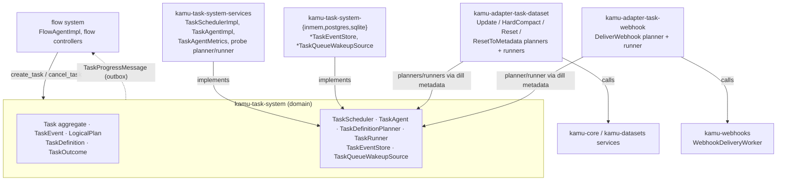
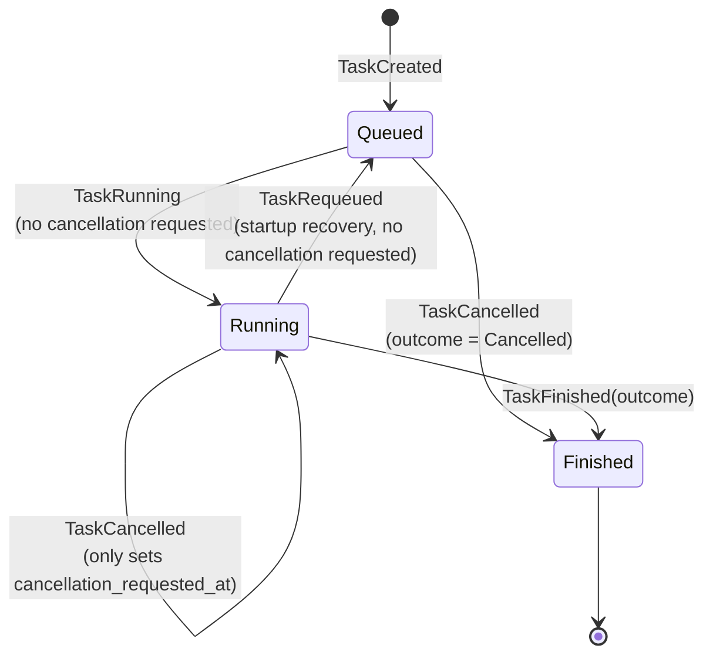
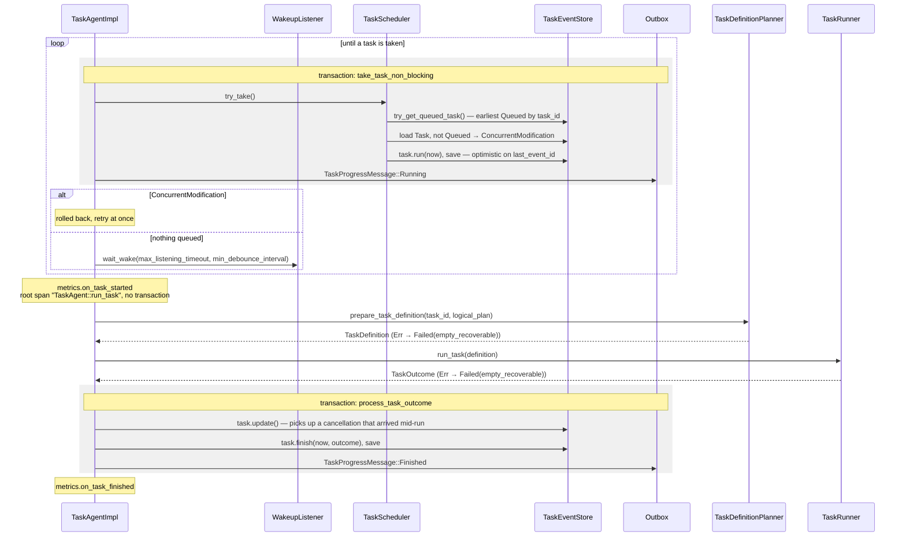

# Task System — Architecture

> **Status:** stable; the execution layer under the flow system.
> Type names and paths below are drawn from source — when they drift, treat the source as canonical
> and update this page.

---

## Agent / newcomer quick-start

**One-paragraph mental model.** A **task** is one unit of work — update a dataset, compact it,
reset it, deliver a webhook — kept as an event-sourced aggregate in the `tasks` / `task_events`
tables. A producer (the flow system is the only one) asks the `TaskScheduler` to **create** a task from
a serializable **logical plan**; the task enters the queue. A single **task agent** per process
takes the earliest queued task, marks it running and announces that on the outbox, then asks a
**planner** registered for the plan type to turn the plan into an in-memory **task definition**
(resolved datasets, ingest/transform/compaction plans), and hands that to a **runner** registered
for the definition type. The runner calls core domain services to do the work and returns a
**task outcome** — success with a typed result, failure with a typed error marked recoverable or
not, or cancelled. The agent records the outcome and posts a `TaskProgressMessage::Finished`; the
flow agent consumes it to advance, retry or complete the flow. Planners and runners are plain dill
components discovered by metadata, so the task-system crates know nothing about datasets or
webhooks.

**Where to start reading, by intent:**

| You want to… | Start at |
| --- | --- |
| Understand states and transitions | [§3 The task aggregate](#3-the-task-aggregate) |
| Follow one task end to end | [§5 The task agent](#5-the-task-agent) |
| Know which types travel where | [§4 Plans, definitions, outcomes](#4-plans-definitions-outcomes) |
| See what each task type actually does | [§7 Task types](#7-task-types) |
| Know how failures turn into retries | [§8 Failure handling](#8-failure-handling) |
| See how tasks show up in the GraphQL API | [§11 GraphQL API](#11-graphql-api) |
| Add a new task type | [§12 Recipe](#12-recipe-a-new-task-type) |
| Find the file for X | [§14 Reference map](#14-filecrate-reference-map) |

---

## Table of contents

- [1. Purpose \& scope](#1-purpose--scope)
- [2. Layers and crates](#2-layers-and-crates)
- [3. The task aggregate](#3-the-task-aggregate)
- [4. Plans, definitions, outcomes](#4-plans-definitions-outcomes)
- [5. The task agent](#5-the-task-agent)
- [6. Transactions](#6-transactions)
- [7. Task types](#7-task-types)
- [8. Failure handling](#8-failure-handling)
- [9. Storage backends](#9-storage-backends)
- [10. Integration with the flow system](#10-integration-with-the-flow-system)
- [11. GraphQL API](#11-graphql-api)
- [12. Recipe: a new task type](#12-recipe-a-new-task-type)
- [13. Testing \& gotchas](#13-testing--gotchas)
- [14. File/crate reference map](#14-filecrate-reference-map)

---

## 1. Purpose & scope

The flow system decides **when** something should happen — on a schedule, on upstream changes, on
a manual trigger, again after a failure. The task system decides nothing about timing: it executes
whatever is queued, in order, and reports how it went. Splitting the two keeps scheduling,
batching and retry policy out of the code that touches datasets, and keeps the execution engine
replaceable (the `executor` metric label is reserved for running tasks on several nodes; see
[metrics.md](metrics.md#task-agent)).

This page covers the task domain, the agent loop, the storage backends, and the dataset and webhook
adapters with the core services they call. Out of scope, each with its own owner:

| Topic | Owner |
| --- | --- |
| How the agent sleeps and wakes when the queue changes | [wakeup-listeners.md](wakeup-listeners.md) |
| How `TaskProgressMessage` is stored and delivered | [outbox.md](outbox.md) |
| Task agent metrics and alerts | [metrics.md](metrics.md#task-agent) |
| Flow scheduling, retry policies, flow outcomes | [flow-system.md](flow-system.md) |

---

## 2. Layers and crates

| Crate | Path | Holds |
| --- | --- | --- |
| `kamu-task-system` | `src/domain/task-system/domain` | aggregate, events, state projection, plan/definition/outcome types and their macros, service and repository traits, `TaskProgressMessage` |
| `kamu-task-system-services` | `src/domain/task-system/services` | `TaskSchedulerImpl`, `TaskAgentImpl`, `TaskAgentMetrics`, `ProbeTaskPlanner`, `ProbeTaskRunner` |
| `kamu-task-system-inmem` / `-postgres` / `-sqlite` | `src/infra/task-system/*` | `TaskEventStore` and `TaskQueueWakeupSource` per backend |
| `kamu-task-system-repo-tests` | `src/infra/task-system/repo-tests` | the shared `TaskEventStore` suite run against every backend |
| `kamu-adapter-task-dataset` | `src/adapter/task-dataset` | dataset plans, definitions, results, errors, planners, runners |
| `kamu-adapter-task-webhook` | `src/adapter/task-webhook` | webhook delivery plan, definition, error, planner, runner |

The domain crate depends on neither adapter. The CLI app wires everything in `src/app/cli/src/app.rs`
(`register_dependencies` of the services crate and both adapters, plus the
`TaskProgressMessage` dispatcher) and picks the storage backend in `src/app/cli/src/database.rs`.

---

## 3. The task aggregate

`Task` (`domain/src/aggregates/task.rs`) wraps the generic event-sourcing `Aggregate` over
`TaskState`, persisted through `TaskEventStore`. `TaskID` is a `u64` allocated by the store.

### Events

| Event | Raised by | Meaning |
| --- | --- | --- |
| `TaskCreated` | `TaskSchedulerImpl::create_task` | Enters the queue; carries the `LogicalPlan` and optional `TaskMetadata` |
| `TaskRunning` | `TaskSchedulerImpl::try_take` | The agent took it |
| `TaskRequeued` | `TaskAgentImpl` startup recovery | A run interrupted by a crash or shutdown goes back to the queue |
| `TaskCancelled` | `TaskSchedulerImpl::cancel_task` | Cancellation requested |
| `TaskFinished` | `TaskAgentImpl` | Final outcome recorded |

### State machine

Status is derived, not stored in the projection: `Finished` if an outcome exists, else `Running` if
`ran_at` is set, else `Queued`.

| From | Event | Result |
| --- | --- | --- |
| Queued | `TaskRunning` | Running, unless cancellation was requested |
| Queued | `TaskCancelled` | Finished with `TaskOutcome::Cancelled` at once — no executor will ever pick it up |
| Running | `TaskCancelled` | Still Running; only `cancellation_requested_at` is set. A run is never interrupted |
| Running | `TaskFinished` | Finished with the given outcome — which may differ from `Cancelled` even if cancellation was requested |
| Running | `TaskRequeued` | Queued again (`ran_at` cleared), unless cancellation was requested |
| any other | any | `ProjectionError` |

`Task::can_cancel` is true for queued or running tasks without a pending cancellation;
`cancel_task` on anything else returns the state unchanged, so it is idempotent.

`TaskEvent::next_status` / `status_after` compute the status an event batch leads to; the
SQL backends use them to maintain the denormalized `tasks.task_status` column without loading the
aggregate (see [§9](#9-storage-backends)).

### Metadata

`TaskMetadata` is a free-form string map stored on `TaskCreated` and copied into every progress
message. The flow system stores `METADATA_TASK_FLOW_ID` there; that is the only link from a task
back to its flow.

---

## 4. Plans, definitions, outcomes

A task passes through three representations. Each is a type-erased envelope in the domain crate
plus typed payload structs in the adapters, generated by macros.

| Stage | Envelope | Typed payloads made with | Lives | Identified by |
| --- | --- | --- | --- | --- |
| What to do | `LogicalPlan { plan_type, payload: Value }` | `logical_plan_struct!` → `TYPE_ID`, `into_logical_plan`, `from_logical_plan` | persisted in `TaskCreated` | `plan_type`, e.g. `"UpdateDataset"` |
| How to do it now | `TaskDefinition` (boxed `dyn TaskDefinitionInner`, downcast by type) | `task_definition_struct!` → `TASK_TYPE` | memory only, for one run | `task_type`, e.g. `"dev.kamu.tasks.dataset.update"` |
| How it went | `TaskOutcome::{Success(TaskResult), Failed(TaskError), Cancelled}` | `task_result_struct!`, `task_error_enum!` (with a fixed `recoverable` flag) | persisted in `TaskFinished`, sent in `TaskProgressMessage` | `result_type` / `error_type` |

Why the split:

- **The logical plan is durable and small.** It holds only IDs and options, so a task queued
  long ago still means the same thing; JSON as `{ "<plan_type>": payload }`.
  `LogicalPlan::dataset_id()` reads a `dataset_id` field from any payload for the store's
  per-dataset index.
- **The definition is computed at run time.** It holds live objects — `ResolvedDataset`, a
  `PullPlanIterationJob`, a `CompactionPlan` — reflecting the dataset as it is when the task runs,
  not when it was queued. It is never serialized.
- **The outcome is typed but opaque to the task system.** `TaskResult::empty()` and
  `TaskError::empty_recoverable()` / `empty_unrecoverable()` exist for outcomes with nothing to
  report; the flow controllers downcast results and errors with `from_task_result` /
  `from_task_error`. The `recoverable` flag is the one property the flow system reads generically
  (see [§8](#8-failure-handling)).

`TaskError`'s deserializer keeps older stored forms readable: a bare `"Empty"` string is a
recoverable empty error, and a map without `recoverable` is unrecoverable. Do not change these
defaults — they decide how stored history replays.

### Dispatch

Planners and runners register through dill metadata, and the agent picks the first match:

| Trait | Metadata | Matched against |
| --- | --- | --- |
| `TaskDefinitionPlanner::prepare_task_definition(task_id, &LogicalPlan)` | `TaskDefinitionPlannerMeta { logic_plan_type }` | `LogicalPlan::plan_type` |
| `TaskRunner::run_task(TaskDefinition)` | `TaskRunnerMeta { task_type }` | `TaskDefinition::task_type()` |

---

## 5. The task agent

`TaskAgentImpl` (`services/src/task_agent_impl.rs`) is a singleton `BackgroundAgent`, started by
the API server together with the other background agents (`src/app/cli/src/explore/api_server.rs`).
It runs **one task at a time, in-process**. There is no concurrency limit to configure because
there is no concurrency.

### Startup recovery

`InitOnStartup` job `JOB_KAMU_TASKS_AGENT_RECOVERY` runs before the loop:

1. Pre-registers the `task_agent_task_duration_seconds` label sets for every plan type that has a
   planner.
2. In one transaction, pages through tasks in `Running` state (100 at a time, always re-reading page one, since each
   handled task leaves the set). A task with a pending cancellation is finished as `Cancelled`
   and a `TaskProgressMessage::Finished` is posted; every other one is requeued with
   `TaskRequeued`.

Requeued tasks keep their ID and plan, so a crash costs a re-run, not a lost task. Runners must
therefore tolerate being re-run after a partial first attempt. The dataset runners do, because
`HEAD` moves in a single short transaction at the very end
(see [§7](#who-moves-head)); a webhook may be delivered twice.

### One iteration

`run()` creates one wakeup listener for the agent's whole life and calls `run_task_iteration` in a
loop; any error ends the loop. One iteration:

The planner and runner are the first ones registered for the plan type and the definition's task
type ([§4](#dispatch)).

Notes on the loop:

- **FIFO by `task_id`.** No priorities, no per-dataset fairness. A long ingest blocks every task
  behind it; the "Task stuck" alert in [metrics.md](metrics.md#4-recommended-alerts) exists for
  that.
- **Waking up.** Creating or requeuing a task signals the queue's wakeup channel; signals are only
  hints, so after any wakeup the agent re-queries the store. The per-backend mechanisms are in
  [wakeup-listeners.md](wakeup-listeners.md#3-inventory). The listener beats its heartbeat only
  while idle or taking a task, not while running one.
- **Several agents on one database are safe.** Two processes taking the same task both write
  `TaskRunning` against the same `last_event_id`; one save fails with a concurrent modification,
  its transaction rolls back, and it moves on to the next queued task.
- **Cancellation is cooperative only for queued tasks.** A running task always runs to completion;
  `process_task_outcome` records the runner's outcome, not `Cancelled`.
- **`run_single_task`** (`TaskAgent` trait) runs exactly one iteration; tests use it to drive the
  agent deterministically.

---

## 6. Transactions

The agent itself is not transactional; it opens short transactions around state changes, and the
heavy work runs between them. This keeps long ingests from holding a database transaction open.

| Step | Transaction | Opened by |
| --- | --- | --- |
| Recover running tasks | one for the whole recovery | `transactional_method2` on `recover_running_tasks` |
| Take a task + post `Running` | one per attempt | `transactional_method2` on `take_task_non_blocking` |
| Plan the task | the planner's choice — dataset planners open their own | `transactional_method2` in each dataset planner |
| Run the task | the runner's choice — see [§7](#7-task-types) | runner |
| Record outcome + post `Finished` | one | `transactional_method2` on `process_task_outcome` |

Since the progress messages are posted in the same transaction as the event that causes them, a
task is `Running` if and only if its `Running` message exists, and likewise for `Finished`
([outbox.md](outbox.md#1-purpose--scope) explains the guarantee).

A dataset planner resolves a `ResolvedDataset` inside its transaction and calls
`detach_from_transaction()` before returning, so the definition can outlive that transaction and
be used by the runner. A runner that needs the database again opens a new transaction and
re-resolves what it needs (`update_dataset_head`, `combine_task_result`).

`TaskSchedulerImpl` itself opens no transactions: `create_task`, `cancel_task` and `try_take` run in
the caller's, which is how the flow system creates a task atomically with the flow event that
records it.

---

## 7. Task types

| Logical plan (`plan_type`) | Definition (`task_type`) | Planner → Runner | Created by flow controller |
| --- | --- | --- | --- |
| `LogicalPlanDatasetUpdate` (`UpdateDataset`) | `dev.kamu.tasks.dataset.update` | `UpdateDatasetTaskPlanner` → `UpdateDatasetTaskRunner` | ingest and transform |
| `LogicalPlanDatasetHardCompact` (`HardCompactDataset`) | `dev.kamu.tasks.dataset.hard_compact` | `HardCompactDatasetTaskPlanner` → `HardCompactDatasetTaskRunner` | compact |
| `LogicalPlanDatasetReset` (`ResetDataset`) | `dev.kamu.tasks.dataset.reset` | `ResetDatasetTaskPlanner` → `ResetDatasetTaskRunner` | reset |
| `LogicalPlanDatasetResetToMetadata` (`ResetDatasetToMetadata`) | `dev.kamu.tasks.dataset.reset_to_metadata` | `ResetToMetadataDatasetTaskPlanner` → `ResetDatasetToMetadataTaskRunner` | reset to metadata |
| `LogicalPlanWebhookDeliver` (`DeliverWebhook`) | `dev.kamu.tasks.webhook.deliver` | `DeliverWebhookTaskPlanner` → `DeliverWebhookTaskRunner` | webhook deliver |
| `LogicalPlanProbe` (`Probe`) | `dev.kamu.tasks.probe` | `ProbeTaskPlanner` → `ProbeTaskRunner` | system GC (a no-op placeholder), tests |

The `plan_type` and `task_type` strings and the result/error `TYPE_ID`s are persisted or matched at
run time; renaming one breaks stored history or dispatch. Use the `kamu-renaming-a-concept` skill
before touching them.

### Who moves `HEAD`

Ingest, transform and compaction share one shape: **the core service writes new blocks with
`update_block_ref: false` outside any transaction, and the runner then moves `HEAD` in a short
transaction with compare-and-swap** — `update_dataset_head` re-resolves the dataset through
`DatasetRegistry` and calls `set_ref(Head, new_head, check_ref_is: Some(old_head))`. Blocks
written by an attempt that never reaches that step stay unreferenced, so a re-run after a crash,
or a concurrent writer that moved `HEAD` first, cannot corrupt the chain. Sync and reset differ:

| Task / job | Writes blocks | Moves `HEAD` | Transaction around the work |
| --- | --- | --- | --- |
| Update → ingest | `PollingIngestService` | runner, CAS on `old_head` | none; short one for `HEAD` |
| Update → transform | `TransformExecutor` | runner, CAS on `old_head` | none; short one for `HEAD` |
| Update → sync | `SyncService` | the sync itself, CAS on the destination head it read | one for the whole sync |
| Hard compact / reset to metadata | `CompactionExecutor` | runner, CAS on `old_head` | none; short one for `HEAD` |
| Reset | — (existing block) | `ResetExecutor`, **no** CAS at execution | one for the whole reset |

On DB-backed datasets `set_ref` goes through `DatasetReferenceServiceImpl::set_reference`, which
posts `DatasetReferenceMessage::Updated` in the same transaction; dataset statistics, search
indexing and the storage-level ref file all catch up from that message, not from the task.

A detached dataset (see [§6](#6-transactions)) can still be read but panics on `set_ref`, which is
why every runner that moves `HEAD` re-resolves the dataset first.

### 7.1 Update dataset

One logical plan serves both ingest and transform flows: `LogicalPlanDatasetUpdate { dataset_id,
fetch_uncacheable }`. The dataset decides what "update" means.

**Planning** (`UpdateDatasetTaskPlanner`, one transaction):

1. `DatasetEnvVarResolver::resolve_effective_env_vars` merges the variable and secret sets
   targeting the dataset into one map for the ingest.
2. `PullRequestPlanner::build_pull_plan(PullRequest::local(id), non-recursive)` builds a
   single-node pull plan and yields one `PullPlanIterationJob`:

   | Dataset | Job | Holds |
   | --- | --- | --- |
   | root, no pull alias | `Ingest(PullIngestItem)` | target + `DataWriterMetadataState` read from `HEAD` now |
   | derivative | `Transform(PullTransformItem)` | target + `TransformPreliminaryPlan` (preliminary request, resolved inputs) |
   | has a remote pull alias | `Sync(PullSyncItem)` | `SyncRequest` with source and destination refs |

3. The job is detached from the transaction and stored in `TaskDefinitionDatasetUpdate` with the
   `PullOptions`.

A planning error is logged and returned as `Err`, which the agent turns into a recoverable
failure.

**Running** (`UpdateDatasetTaskRunner`), by job:

- **Ingest** — `PollingIngestService::ingest` runs one iteration: check cache, fetch (resuming from
  a savepoint), prepare, read, preprocess, merge and commit `SetDataSchema` / `AddData` blocks.
  Reading and merging run on embedded DataFusion in-process; only a `preprocess` step on a
  non-DataFusion engine provisions a container. A source with no `SetPollingSource` yields
  `UpToDate`; an uncacheable source that already has data yields `UpToDate { uncacheable }` unless
  `fetch_uncacheable` is set. `Updated { has_more }` means the source has more to fetch: the task
  does not loop, and the ingest flow controller schedules the next iteration if its config sets
  `fetch_next_iteration`.
- **Transform** — `TransformElaborationService::elaborate_transform` computes each input's
  unprocessed slices and watermarks. `UpToDate` ends the task with an empty success. Otherwise
  `TransformExecutor::execute_transform` provisions the engine named by the transform — always a
  container engine, DataFusion included — runs the query and commits `ExecuteTransform`.
  The runner passes `TransformOptions::default()`, so a diverged input is not repaired here:
  `InvalidInputInterval` (the previously processed input block is no longer an ancestor, usually
  because the input was compacted) becomes `TaskErrorDatasetUpdate::InputDatasetCompacted`, and
  the transform flow controller decides what to do about it.
- **Sync** — refreshes source and destination from the registry and calls `SyncService::sync`,
  which copies blocks and objects from the remote (smart transfer protocol for `odf+http(s)://`,
  simple protocol otherwise) and appends them, moving `HEAD` itself.

On success, `combine_task_result` (a short transaction) wraps the `PullResult` in
`TaskResultDatasetUpdate`, adding `data_increment` from
`DatasetIncrementQueryService::get_increment_between(old_head, new_head)` — block and record
counts and the new watermark, which the flow controller uses for triggering downstream flows.

| Error | Recoverable |
| --- | --- |
| Ingest: `ParameterNotFound`, `ReadError`, invalid query, `BadInputSchema`, `IncompatibleSchema`, `InvalidParameterFormat`, `MergeError`, `ExecutionError`, `TemplateError` | no |
| Ingest: `CommitError`, `DataValidation`, other engine errors, `EngineProvisioningError`, `ImagePull`, `NotFound`, `PipeError`, `ProcessError`, `Unreachable`, `Internal` | yes |
| Transform elaboration: `InvalidInputInterval` | no, typed `InputDatasetCompacted` |
| Transform elaboration: `InputSchemaNotDefined` | no (the elaboration service already turns it into `UpToDate`, so this arm is not reached) |
| Transform elaboration: `Internal` | yes |
| Transform execution: invalid query | no |
| Transform execution: commit, engine, provisioning, internal | yes |
| Sync: any | yes (not yet classified) |

### 7.2 Hard compaction and reset to metadata

Both run the compaction services and differ only in `CompactionOptions::keep_metadata_only`.

**Planning** (`HardCompactDatasetTaskPlanner` / `ResetToMetadataDatasetTaskPlanner`, one
transaction): `CompactionPlanner::plan_compaction` walks the chain from `HEAD` back to the seed and
builds a `CompactionPlan`: the seed, the old head and block count, and a list of batches. Runs of
consecutive `AddData` blocks become `CompactedBatch`es, bounded by `max_slice_size` /
`max_slice_records` from the logical plan (planner defaults when absent); every other metadata
event closes the batch and is carried over as a `SingleBlock`.

| | Hard compaction | Reset to metadata |
| --- | --- | --- |
| `keep_metadata_only` | `false` | `true` |
| `AddData` | merged into fewer, larger slices | dropped |
| `ExecuteTransform` | kept | dropped |
| Allowed datasets | root only (`InvalidDatasetKind` otherwise) | root and derivative |

**Running**: `CompactionExecutor::execute` returns `NothingToDo` if the plan would not reduce the
block count. Otherwise it merges each batch's data files into new Parquet files with DataFusion
and rebuilds the chain on top of the seed, writing blocks without moving `HEAD`. The runner then
moves `HEAD` by CAS and returns `TaskResultDatasetHardCompact` / `TaskResultDatasetResetToMetadata`
carrying the `CompactionResult` (`Success { old_head, new_head, old_num_blocks, new_num_blocks }`
or `NothingToDo`). Any executor error is a recoverable empty failure.

Compaction rewrites history, so derivative datasets that consumed the old blocks can no longer
continue incrementally; that is what `InputDatasetCompacted` in [§7.1](#71-update-dataset)
reports.

### 7.3 Reset

**Planning** (`ResetDatasetTaskPlanner`, one transaction): `ResetPlanner::plan_reset` defaults
`new_head` to the seed block, reads the current `HEAD`, and fails with `OldHeadMismatch` if the
plan's `old_head` is given and differs. The resulting `ResetPlan { old_head, new_head }` and the
dataset handle form the definition.

**Running** (`ResetDatasetTaskRunner`, one transaction around the whole run): re-resolves the
dataset and calls `ResetExecutor::execute`, which sets `HEAD` to `new_head` with
`validate_block_present` but **without** `check_ref_is`. The `old_head` check therefore happens
only at planning time; a `HEAD` change between planning and running is not detected.

| Error | Becomes |
| --- | --- |
| `SetReferenceFailed(BlockNotFound)` — the target block is not in the chain | typed `TaskErrorDatasetReset::ResetHeadNotFound`, unrecoverable |
| other `SetReferenceFailed`, `Internal` | empty, recoverable |

The success result is `TaskResultDatasetReset { reset_result: ResetResult { old_head, new_head } }`.

### 7.4 Webhook delivery

**Planning** (`DeliverWebhookTaskPlanner`, no database access) copies the subscription ID, event
type and payload from the logical plan into `TaskDefinitionWebhookDeliver`, adding the task ID.

**Running**: `DeliverWebhookTaskRunner` generates a fresh `WebhookDeliveryID` and calls
`WebhookDeliveryWorker::deliver_webhook`
(`src/domain/webhooks/services/src/services/webhook_delivery_worker_impl.rs`), which opens its own
transactions:

1. **Prepare** (transaction): load the `WebhookSubscription`, build headers — content type,
   RFC 9421 content digest and signature with the subscription secret, delivery, subscription and
   event-type headers — and record a `WebhookDelivery` with the request.
2. **Send** (no transaction): `WebhookSender::send_webhook`.
3. **Record response** (transaction): store the response on the delivery.
4. A non-2xx status is an `UnsuccessfulResponse` error.

| Error | Becomes |
| --- | --- |
| `UnsuccessfulResponse`, `FailedToConnect`, `ConnectionTimeout` | typed `TaskErrorWebhookDelivery`, **recoverable**, carrying the target URL |
| internal errors | empty, recoverable |

Every delivery failure is recoverable, so the flow retries it as a new task; the delivery worker
itself never retries and never changes the subscription. Marking a subscription unreachable after
repeated failures is the flow system's job: the webhook flow trigger has a stop policy of
`AfterConsecutiveFailures`, and when it stops automatically, `FlowWebhooksEventBridge` calls
`MarkWebhookSubscriptionUnreachableUseCase`.

### 7.5 Probe

`ProbeTaskRunner` sleeps for `busy_time` if given, then returns `end_with_outcome` or an empty
success. Tests use it to script outcomes; the system GC flow uses it as a placeholder task.

---

## 8. Failure handling

Every failure becomes a `TaskOutcome::Failed(TaskError)`; what differs is how much detail the
error carries and whether it is recoverable.

| Where it fails | Becomes |
| --- | --- |
| Planner returns `Err` (dataset gone, pull plan cannot be built, …) | `Failed(empty_recoverable)`, logged by the agent |
| Runner returns `Err(InternalError)` | `Failed(empty_recoverable)`, logged by the agent |
| Runner maps a domain error to a typed error | `Failed(<TypedError>.into_task_error())` with the type's fixed `recoverable` flag |
| Runner maps a domain error to an empty error | `Failed(empty_recoverable)` or `Failed(empty_unrecoverable)` |
| No planner or runner registered for the type | **`InternalError` out of the agent loop** — see [§13](#13-testing--gotchas) |
| Storage error while taking or finishing | `InternalError` out of the agent loop |

The `recoverable` flag is the task system's whole say in what happens next:

- **Recoverable** — a retry could succeed: network, engine provisioning, commit races, internal
  errors.
- **Unrecoverable** — a retry would fail the same way: bad query, schema mismatch, missing
  parameter, an input dataset compacted under a transform, a reset target HEAD that no longer
  exists.

The task system never retries by itself. Whether a recoverable failure is retried (as a new task),
and what an unrecoverable one does to the flow's trigger, is decided by the flow system
([flow-system.md](flow-system.md#9-flow-process-state)).

The per-type mapping of domain errors to recoverable / unrecoverable is in [§7](#7-task-types).

---

## 9. Storage backends

All backends implement `TaskEventStore` (the generic `EventStore<TaskState>` plus queue queries)
and `TaskQueueWakeupSource`.

| Query | Purpose |
| --- | --- |
| `new_task_id` | allocate an ID before the first event |
| `try_get_queued_task` | earliest `Queued` task by `task_id` |
| `get_running_tasks` / `get_count_running_tasks` | startup recovery |
| `get_tasks_by_dataset` / `get_count_tasks_by_dataset` | per-dataset listing; exercised only by tests |

### Postgres and SQLite

Two tables: `task_events` (the event log, JSON payload, `event_type` from `TaskEvent::typename`)
and `tasks`, a denormalized row per task with `dataset_id`, `task_status` and `last_event_id`.
`task_status` is indexed for non-finished tasks, which keeps `try_get_queued_task` cheap however
long the history grows.

`save_events`, in the caller's transaction:

1. On `TaskCreated`, inserts the `tasks` row as `queued` with `last_event_id = NULL` (and fails if
   the caller claimed a previous event).
2. Inserts the events, returning the last `event_id`.
3. Updates the `tasks` row with the new status and `last_event_id`, **only if** the stored
   `last_event_id` equals the one the aggregate was loaded at. Zero rows updated means a concurrent
   modification. The new status is computed from the events: since the stored status is not read
   first, both candidates (`status_after(events, Running)` and `status_after(events, Queued)`) are
   passed and a `CASE` on the current value picks one. That matters only for `TaskCancelled`,
   whose effect depends on whether the task is running.

ID allocation differs: Postgres uses the `task_id_seq` sequence; SQLite inserts into a `task_ids`
table with `AUTOINCREMENT`.

Wakeups: on Postgres, triggers on `tasks` call `pg_notify('tasks_queued')` on insert and on an
update that moves `task_status` to `queued`; on SQLite, a polling hub watches the highest
`task_events.event_id` among `TaskEventCreated` / `TaskEventRequeued` events. Details in
[wakeup-listeners.md](wakeup-listeners.md).

### In-memory

`InMemoryTaskEventStore` is a singleton over the generic `InMemoryEventStore`, with a
`BTreeMap<TaskID, TaskStatus>` index (ordered, so "earliest queued" is a scan from the start) and a
dataset index. Indexes update only after the inner save passed its concurrency check, and a
`TaskCreated` or `TaskRequeued` signals the in-memory wakeup hub.

---

## 10. Integration with the flow system

The flow system is the only producer and the only consumer of tasks. The task system does
not depend on it; the whole contract is:

| Task system offers | Used by the flow system for |
| --- | --- |
| `TaskScheduler::create_task(plan, metadata)` in the caller's transaction | starting an attempt; the flow ID travels in `TaskMetadata` |
| `TaskScheduler::cancel_task` | aborting a flow ([§3](#3-the-task-aggregate) covers what cancellation does) |
| `TaskProgressMessage::{Running, Finished}` on the outbox | advancing, retrying or completing the flow |
| `TaskOutcome` with the `recoverable` flag | deciding whether to retry ([§8](#8-failure-handling)) |

How the flow side drives these — activation, the progress consumer, retries, propagation — is
owned by [flow-system.md](flow-system.md#5-life-of-a-flow).

---

## 11. GraphQL API

Tasks are **read-only and reachable only through flows**: there is no task query root, no lookup
by `TaskID`, and no task mutation. Users create, cancel and retry work through flow mutations
([flow-system.md](flow-system.md#12-graphql-api)); the flow agent and the abort helper then call
`TaskScheduler` on their behalf.

### Where tasks appear

| Schema path | Rust | Shows |
| --- | --- | --- |
| `Flow.taskIds: [TaskID!]!` | `queries/flows/flow.rs` | IDs of every attempt, in order |
| `Flow.history` → `FlowEventTaskChanged { taskId, taskStatus, nextAttemptAt, task: Task! }` | `queries/flows/flow_event.rs` | One timeline entry per task status change; `nextAttemptAt` is set when a failed attempt will be retried |
| `Flow.outcome` → `FlowFailedError { reason: TaskFailureReason }` | `queries/flows/flow_outcome.rs` | Why the flow failed, decoded from the final task error |
| `Flow.description` → `…Result` fields | `queries/flows/flow_description.rs` | Typed task results of a successful flow, decoded per result type (below) |

Paths are relative to `src/adapter/graphql/src`. `FlowEventTaskChanged.task` loads the aggregate
straight from `TaskEventStore` (`utils::get_task`), not through `TaskScheduler`.

### Types

| GraphQL type | Built from | Notes |
| --- | --- | --- |
| `Task { taskId, status, cancellationRequested, outcome, createdAt, ranAt, cancellationRequestedAt, finishedAt }` | `TaskState` | `queries/tasks/task.rs` |
| `TaskStatus` enum: `QUEUED`, `RUNNING`, `FINISHED` | `TaskStatus` | `scalars/task_status.rs` |
| `TaskID` scalar | `TaskID` | `scalars/task_id.rs` |
| `TaskOutcome` union: `TaskOutcomeSuccess`, `TaskOutcomeFailed { reason }`, `TaskOutcomeCancelled` | `TaskOutcome` | Success carries no result data here; results are shown through the flow description |
| `TaskFailureReason` union | `TaskError` | see below |

`TaskFailureReason::from_task_error` (`queries/tasks/task_outcome.rs`) dispatches on
`TaskError::error_type`:

| `error_type` | GraphQL variant |
| --- | --- |
| `Empty` | `TaskFailureReasonGeneral { message: "FAILED", recoverable }` |
| `UpdateDatasetError` → `InputDatasetCompacted` | `TaskFailureReasonInputDatasetCompacted { inputDataset: Dataset, message }` — resolves the input dataset and its owner |
| `ResetDatasetError` → `ResetHeadNotFound` | `TaskFailureReasonGeneral { message: "New head hash to reset not found" }` |
| `WebhookDeliveryError` | `TaskFailureReasonWebhookDeliveryProblem { targetUrl, message }` — timeout, connection failure, or the HTTP status and reason |
| anything else | `TaskFailureReasonGeneral { message: "Unexpected task error type" }`, logged as an error |

`TaskOutcomeSuccess` itself carries no result data. Typed results are decoded by the flow
description, each into its own GraphQL union:

| Task result | GraphQL result | Used by flow descriptions |
| --- | --- | --- |
| `TaskResultDatasetUpdate` | `FlowDescriptionUpdateResult`: `Success { numBlocks, numRecords, updatedWatermark, hasMore }`, `UpToDate`, `Unknown` | polling ingest, push ingest, transform |
| `TaskResultDatasetHardCompact` | `FlowDescriptionDatasetReorganizationResult` | hard compaction |
| `TaskResultDatasetResetToMetadata` | `FlowDescriptionDatasetReorganizationResult` | reset to metadata |
| `TaskResultDatasetReset` | `FlowDescriptionResetResult` | reset |

Each decoder returns nothing for result types it does not own. The update and reset decoders also
return nothing for the empty result, while the reorganization decoder renders it as `NothingToDo`.
For update results stored without `data_increment`, the resolver recomputes the increment and
falls back to `Unknown` if that fails.

### Things to know

- **A new typed error needs a GraphQL mapping.** Without a branch in `from_task_error` it shows as
  "Unexpected task error type".
- **`InputDatasetCompacted` resolves a live dataset.** If the input dataset was deleted since, the
  handle lookup fails and the whole `outcome` field errors.
- **The `Task` type is not access-checked by itself.** It inherits the authorization of the flow it
  is reached through.

Tests: `src/adapter/graphql/tests/tests/flows/test_gql_dataset_flow_runs.rs` covers task status
changes and failure reasons in flow histories, with the harness in
`src/adapter/graphql/tests/utils/base_gql_flow_runs_harness.rs`.

---

## 12. Recipe: a new task type

1. **Logical plan** — in the adapter crate for the area, `logical_plan_struct!` with only IDs and
   options. Pick a `TYPE_ID` you will never rename. Name the dataset field `dataset_id` if there is
   one, so the store indexes it.
2. **Definition** — `task_definition_struct!` with the resolved inputs the runner needs, and a
   `dev.kamu.tasks.<area>.<action>` task type.
3. **Result and errors** — `task_result_struct!` if the flow needs data back;
   `task_error_enum!` for failures a flow or UI must tell apart, choosing `recoverable`
   deliberately. Otherwise use the empty variants.
4. **Planner** — a dill component implementing `TaskDefinitionPlanner` with
   `TaskDefinitionPlannerMeta`. Open your own transaction if you read the database, and detach
   anything you carry out of it.
5. **Runner** — a dill component implementing `TaskRunner` with `TaskRunnerMeta`. Keep the long
   work outside transactions, make the final state change atomic and conditional, and map every
   domain error explicitly to recoverable or unrecoverable. Expect to be re-run after a crash.
6. **Register** both in the adapter's `register_dependencies`.
7. **Flow controller** — the code that builds the plan and interprets the result lives in the
   flow-system adapters (`src/adapter/flow-*`).
8. **GraphQL** — map any typed error in `TaskFailureReason::from_task_error`, and any result the
   UI should show in the flow description ([§11](#11-graphql-api)).
9. **Tests** — planner/runner tests in the adapter; agent-level behaviour can be scripted with the
   probe task.

---

## 13. Testing & gotchas

**Tests.**

| What | Where |
| --- | --- |
| Aggregate transitions | `src/domain/task-system/services/tests/tests/test_task_aggregate.rs` |
| Scheduler (create, take, cancel) | `.../tests/test_task_scheduler_impl.rs` |
| Agent loop, recovery, progress messages | `.../tests/test_task_agent_impl.rs` |
| Store contract on every backend | `src/infra/task-system/repo-tests` |

**Gotchas.**

- **A missing planner or runner stops the agent.** `get_task_planner_for` / `get_task_runner_for`
  return an `InternalError` that propagates out of `run()`; the API server treats a finished
  agent as fatal. The task stays `Running`, so after restart recovery requeues it and it fails
  again. Register planners and runners in every binary that runs the agent.
- **Storage errors also stop the agent.** There is no retry around `take_task` or
  `process_task_outcome`.
- **Cancelling a running task does not stop it.** It only guarantees the run is not retried after
  a restart.
- **A planner failure loses its error.** It is logged and turned into an empty recoverable error,
  so the flow retries even when the cause is permanent.
- **Changing a persisted type is a migration.** Logical plans, results and errors are replayed
  from `task_events` forever; add fields with `#[serde(default)]` and never rename type IDs.

---

## 14. File/crate reference map

| Concern | Path |
| --- | --- |
| Aggregate | `src/domain/task-system/domain/src/aggregates/task.rs` |
| Events, state projection, status, ID, metadata | `src/domain/task-system/domain/src/entities/task/` |
| Logical plan envelope and macro | `src/domain/task-system/domain/src/entities/logical_plan/` |
| Task definition envelope and macro | `src/domain/task-system/domain/src/entities/task_definition/` |
| Outcome, result, error and their macros | `src/domain/task-system/domain/src/entities/task_outcome/` |
| `TaskProgressMessage`, producer name | `src/domain/task-system/domain/src/messages/` |
| `TaskEventStore`, `TaskQueueWakeupSource` | `src/domain/task-system/domain/src/repos/` |
| `TaskScheduler`, `TaskAgent`, `TaskDefinitionPlanner`, `TaskRunner` | `src/domain/task-system/domain/src/services/` |
| Scheduler, agent, metrics, probe planner and runner | `src/domain/task-system/services/src/` |
| Store and wakeup source per backend | `src/infra/task-system/{inmem,postgres,sqlite}/src/` |
| Store test suite | `src/infra/task-system/repo-tests/src/task_system_repository_test_suite.rs` |
| Schema | `migrations/{postgres,sqlite}/*_persistent_tasks.sql`, `*_last_stored_event_id.sql`, `migrations/postgres/*_tasks_listen_notify.sql` |
| Dataset task types | `src/adapter/task-dataset/src/` |
| Webhook task type | `src/adapter/task-webhook/src/` |
| Flow side: scheduling, progress consumer, abort | `src/domain/flow-system/services/src/flow/flow_agent_impl.rs`, `flow_abort_helper.rs` |
| Flow controllers building plans | `src/adapter/flow-dataset/src/flow_controllers/`, `src/adapter/flow-webhook/src/flow_controllers/` |
| GraphQL task types, failure reasons | `src/adapter/graphql/src/queries/tasks/`, `src/adapter/graphql/src/scalars/task_{id,status}.rs` |
| App wiring | `src/app/cli/src/app.rs`, `src/app/cli/src/database.rs` |
