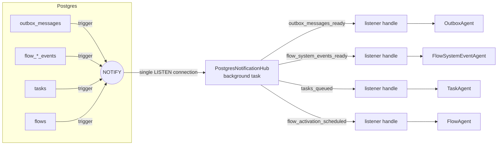
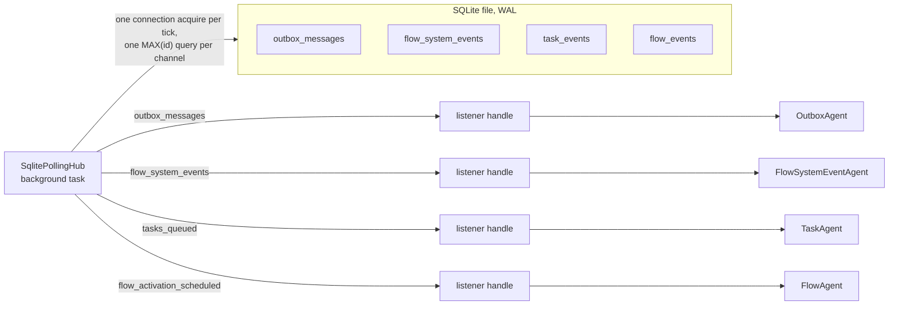

# Wakeup Listeners — Architecture

> **Status:** stable, used by the outbox, flow system event, task and flow agents.
> Type names and paths below are drawn from source — when they drift, treat the source as canonical
> and update this page.

---

## Agent / newcomer quick-start

**One-paragraph mental model.** Several background agents process work stored in the database: the
**outbox agent** relays `outbox_messages`, the **flow system event agent** feeds flow events into
projections, the **task agent** executes queued `tasks`, and the **flow agent** activates flows whose
scheduled time has come. Instead of polling their tables, each agent drains everything pending and then
sleeps on a **`WakeupListener`** until the data *might* have changed or a fallback timeout elapses; the
flow agent also wakes up at the nearest activation moment ([Deadline-driven agents](#deadline-driven-agents)). A wakeup is only a hint: the agent always re-checks storage. Each storage
engine provides the signals differently — Postgres uses `LISTEN`/`NOTIFY` fired by table triggers
and multiplexed over **one shared connection** (`PostgresNotificationHub`), SQLite polls cheap
`MAX(id)` queries for all channels in **one shared loop** (`SqlitePollingHub`), and in-memory
stores signal a channel explicitly on write (`InMemoryWakeupHub`). On every backend each agent
creates its own lightweight per-channel handle (`HubWakeupListener`) onto the backend's single hub.

**Where to start reading, by intent:**

| You want to… | Start at |
| --- | --- |
| Know the guarantees an agent can rely on | [§2 Contract](#2-contract) |
| See which agent listens to what | [§3 Inventory](#3-inventory) |
| Understand hubs and per-consumer handles | [§2 Hubs and handles](#hubs-and-handles) |
| Wake up at a stored time, not only on changes | [§2 Deadline-driven agents](#deadline-driven-agents) |
| Understand the shared Postgres connection | [§4 Postgres](#4-postgres-listennotify-via-a-shared-hub) |
| Understand why SQLite polls, and how | [§5 SQLite](#5-sqlite-a-shared-polling-hub) |
| Tune latency / idle load | [§7 Configuration](#7-configuration) |
| Add a new wakeup-driven agent | [§8 Recipe](#8-recipe-adding-a-wakeup-driven-agent) |
| Find the file for X | [§10 Reference map](#10-filecrate-reference-map) |

---

## Table of contents

- [1. Purpose \& scope](#1-purpose--scope)
- [2. Contract](#2-contract)
- [3. Inventory](#3-inventory)
- [4. Postgres: LISTEN/NOTIFY via a shared hub](#4-postgres-listennotify-via-a-shared-hub)
- [5. SQLite: a shared polling hub](#5-sqlite-a-shared-polling-hub)
- [6. In-memory: explicit signals](#6-in-memory-explicit-signals)
- [7. Configuration](#7-configuration)
- [8. Recipe: adding a wakeup-driven agent](#8-recipe-adding-a-wakeup-driven-agent)
- [9. Tests \& gotchas](#9-tests--gotchas)
- [10. File/crate reference map](#10-filecrate-reference-map)

---

## 1. Purpose & scope

Agents used to poll with a fixed interval, issuing a transaction and a query every second even when
idle — noisy for the database and for telemetry. Wakeup listeners replace that with
"sleep until something might have changed", keeping a slow fallback timeout as a safety net.

In scope: the `WakeupListener` abstraction, the hubs behind it, its three storage implementations, the Postgres triggers that feed
it, and how the four agents use it. Out of scope: what the agents do once awake (outbox routing,
flow projections, task execution).

---

## 2. Contract

```rust
#[async_trait::async_trait]
pub trait WakeupListener: Send + Sync {
    async fn wait_wake(&self, timeout: Duration, min_debounce_interval: Duration)
        -> Result<WakeHint, InternalError>;
}

pub enum WakeHint { Timeout, Signaled }
```

Invariants every implementation upholds:

1. **A wakeup is only a hint.** `Signaled` means data *might* have changed. Spurious wakeups are allowed.
2. **Changes since the previous call are never missed.** A change committed after the previous
   `wait_wake` returned (or before the first call) makes the next call return `Signaled`, possibly
   immediately. This is what makes the *drain → wait* loop below safe without races.
3. **Timeout is the safety net**, not the primary mechanism. It bounds latency if a notification path
   is misconfigured (e.g. a missing migration) and paces SQLite polling.
4. **One listener instance serves one consumer.** Every listener keeps a single pending signal
   (a `Notify` permit); a second waiter on the *same instance* would steal it. That's why the domain
   traits hand out a fresh handle per call (`new_wakeup_listener()`), and each consumer keeps its own.
   Handles on one hub are independent.

### The uniform agent loop

All agents follow the same shape: process until nothing is pending, then wait.

```rust
loop {
    process_until_empty().await?;        // outbox: all batches; flow events: all projectors; tasks: next task; flows: all due
    let hint = listener.wait_wake(max_listening_timeout, min_debounce_interval).await?;
    tracing::debug!(?hint, "Agent woke up with a hint");
}
```

Because of invariant 2, a change committed while the agent was processing is not lost: it is either
seen by `process_until_empty` or reported by the next `wait_wake`. The agent creates its handle once,
before the loop, and keeps it: a handle created per iteration would be correct too, but its first wait
always reports a spurious change (see below).

### Deadline-driven agents

The flow agent must also act when a stored time arrives: `flows.scheduled_for_activation_at` holds
each flow's next activation moment (cron and throttling are evaluated when a flow is scheduled). Its
wait races the listener against a sleep until the nearest moment:

```rust
loop {
    activate_due_flows().await?;             // bulk load, then one transaction per flow
    let nearest = nearest_flow_activation_moment().await?;
    select! {
        hint = listener.wait_wake(max_listening_timeout, min_debounce_interval) => ...,
        () = time_source.sleep(nearest - now) => ...,   // only if there is a nearest moment
    }
}
```

- **No timers to manage.** The deadline is re-read from storage after every wakeup. A flow scheduled
  *earlier* than the awaited moment sends a signal; a flow aborted or postponed needs none — the agent
  wakes at the old moment, finds nothing due, and sleeps on. So the signal only covers "an activation
  time was set" (channel `flow_activation_scheduled`).
- **The sleep uses `SystemTimeSource`**, not a tokio timer, so tests on a fake clock control it.
- **Cancelling `wait_wake` in `select!` is safe**: a signal it consumed was committed before, and the
  next iteration re-reads storage anyway.
- **Activations run concurrently.** Due flows are listed and loaded in one transaction, then each is
  activated in its own transaction, up to `concurrency.flowActivations` at once, started in
  `(activation moment, flow ID)` order. A flow changed after loading fails to save as a concurrent
  modification, and only its own transaction (including its new task) rolls back.
- **Failed activations don't spin.** A flow still due right after a pass failed to activate; it is
  retried after `awaiting_step`. Other flows are not blocked by it.

### Hubs and handles

All three backends share one shape, with the plumbing in the generic `wakeup-listener` crate:

- **`WakeupHub`** — a per-process source of change signals, registered once in DI as a `Singleton`.
  Its `Channel` type names what a listener watches: a channel name (Postgres, in-memory), or an
  `SqlitePollingChannel` (name + max-id query). `subscribe(channel)` returns a `tokio::sync::Notify`
  slot. The database hubs spawn their background task on the first subscription (DI may build them
  outside a runtime) and abort it when dropped; the in-memory hub has no task.
- **`WakeupSubscribers<C>`** — the registry every hub embeds: slots per channel, held as `Weak`
  so dropped handles are pruned on the next signal, plus a "channels changed" permit for the hub's task.
  `signal(channel)` / `signal_all()` call `notify_one`, which stores a permit when the handle isn't
  waiting, so the signal is picked up by its next `wait_wake`.
- **`HubWakeupListener<H>`** — the `WakeupListener` agents use: `(hub, channel)`, subscribing lazily
  on the first `wait_wake`, so components that resolve a bridge but never wait (e.g. to push outbox
  messages) take no slot. It waits on its slot with the timeout, then debounces: sleeps
  `min_debounce_interval` and absorbs signals that arrived meanwhile, so a burst produces one wakeup.

A fresh subscription's first wait returns `Signaled` on every backend: the handle has no earlier
reading of its own, so the agent re-checks once.

---

## 3. Inventory

| Agent | Postgres channel | Postgres triggers (table → trigger) | SQLite polling query | In-memory signal point |
| --- | --- | --- | --- | --- |
| Outbox (`OutboxAgentImpl`) | `outbox_messages_ready` | `outbox_messages` → `outbox_notify` (statement-level, `AFTER INSERT`) | `SELECT MAX(message_id) FROM outbox_messages` | `InMemoryOutboxMessageBridge` on push |
| Flow system events (`FlowSystemEventAgentImpl`) | `flow_system_events_ready` | `flow_events` → `fe_notify`, `flow_trigger_events` → `fte_notify`, `flow_configuration_events` → `fce_notify` (statement-level, `AFTER INSERT`) | `SELECT MAX(event_id) FROM flow_system_events` | `InMemoryFlowSystemEventBridge::save_events` |
| Task queue (`TaskAgentImpl`) | `tasks_queued` | `tasks` → `tasks_insert_notify` (statement-level, `AFTER INSERT`), `tasks_requeue_notify` (row-level, `AFTER UPDATE OF task_status WHEN NEW = 'queued'`) | latest `event_id` among `TaskEventCreated` / `TaskEventRequeued` in `task_events` | `InMemoryTaskEventStore::save_events` when a task becomes `Queued` |
| Flow activation (`FlowAgentImpl`) | `flow_activation_scheduled` | `flows` → `flows_activation_notify` (row-level, `AFTER UPDATE OF scheduled_for_activation_at WHEN` set to a new non-NULL value) | latest `event_id` among `FlowEventScheduledForActivation` and `FlowEventTaskFinished` with a `next_attempt_at` in `flow_events` | `InMemoryFlowEventStore::save_events` when an event sets an activation time |

Each agent obtains its handle through a domain-level trait exposing `new_wakeup_listener()`:
`OutboxMessageBridge`, `FlowSystemEventBridge`, `TaskQueueWakeupSource`, `FlowActivationWakeupSource`.
Another consumer of the same changes simply calls it again and gets an independent handle.

Notes:
- The task queue triggers fire on the `tasks` projection, not `task_events`, so the agent's own
  `Running`/`Finished` transitions don't wake it up.
- The SQLite task query scans the primary key descending and stops at the first match, so it stays
  cheap regardless of table size. The same holds for the flow activation query: nearly every flow
  emits `FlowEventScheduledForActivation`, and the `next_attempt_at` JSON check runs only on
  `FlowEventTaskFinished` rows within that short window.
- The flow activation trigger fires on the `flows` projection: every flow update rewrites
  `scheduled_for_activation_at`, and the `WHEN` clause drops resets to NULL and unchanged values.

---

## 4. Postgres: LISTEN/NOTIFY via a shared hub



**`PostgresNotificationHub`** (dill `Singleton`, depends only on the pool) owns one `PgListener`
checked out of the pool, `LISTEN`ing on every subscribed channel. A background task, spawned on the first
subscription, routes each notification to the subscribers of its channel.

Bridges hold a `HubWakeupListener<PostgresNotificationHub>` for their channel (see
[Hubs and handles](#hubs-and-handles)).

Behaviour, and why:

| Event | What the hub does | Why |
| --- | --- | --- |
| Connect / reconnect succeeds | `LISTEN` on all channels, then **signal every subscriber** | Notifications sent while `LISTEN` was not active are lost; subscribers re-check storage. Also makes the first wait after subscribing return `Signaled`. |
| New subscription | Drop the connection and reconnect with the extended channel set | Avoids cancelling `try_recv` and reusing the connection (sqlx doesn't document it as cancel-safe). Subscriptions only happen at startup; others get one spurious wakeup. |
| Connection lost (`try_recv` → `Ok(None)`) or other error | Drop the listener, reconnect | `eager_reconnect(false)`: sqlx would otherwise reconnect silently and hide lost notifications. |
| Connect fails | Log, retry after `RECONNECT_RETRY_INTERVAL` (1s) | Independent of the debounce, so a short one doesn't flood a database that is down. |
| Pool closed (`PoolClosed`) | Background task exits | Lets `pool.close()` complete: clean shutdown, and `sqlx::test` closes its pool after each test. |
| Hub dropped | Background task aborted | The task holds only the shared inner state, so dropping the last hub reference stops it. |

Other points:
- `NOTIFY` is delivered only when the notifying transaction **commits**, so a woken agent always sees the
  committed rows. Rolled-back transactions notify nobody.
- Postgres collapses identical notifications within one transaction, so statement-level triggers and
  row-level triggers with `WHEN` filters are both cheap.
- **One connection in total** for all channels, regardless of how many agents listen.

---

## 5. SQLite: a shared polling hub



SQLite has no notifications, so the hub polls. Each bridge declares an `SqlitePollingChannel` const:
a name (for logs) and a query returning the maximum id of the watched records, which must only grow.

**Why not an in-process signal?** The workspace database is opened in WAL mode, so other `kamu`
processes in the same workspace can write to it while an API server is running (verified: `kamu add`
succeeds next to a running `kamu system api-server`). Only polling sees those writes.

**Why a hub, when there is no connection to save?** The pool has a single connection
(`max_connections(1)`), shared with request transactions. One loop acquires it once per tick for all
channels, instead of independent timers per channel competing for it. And one shared backoff means a change
on any channel makes the next hop of a chain (outbox message → flow event → task) visible at the short
interval, instead of waiting out that channel's own long backoff.

Each tick: snapshot the channels, acquire the connection, run each channel's query in turn and compare
it with the channel's watermark (the maximum id seen, starting at 0). Advanced channels are signaled.

| Event | What the hub does | Why |
| --- | --- | --- |
| Any channel advanced | Signal its subscribers; reset the interval to `max(minDebounceInterval, 10ms)` | Changes come in bursts, and chained agents write the next hop shortly after. |
| Nothing advanced | Double the interval, capped by `maxListeningTimeout` | With the defaults (20ms, 2s) an idle process runs ~8 ticks per 2s, each a few primary-key lookups. |
| New subscription | Signal the new slot at once; take a tick right away | The channel may already be polled and its latest change consumed for another subscriber. A new channel gets its first reading without waiting out the backoff. |
| First reading of a channel | Watermark starts at 0, so existing rows signal | The agent may have drained before they were written; at worst a spurious wakeup. |
| Query fails | Log, skip that channel for this tick | Queries run one by one rather than combined, so a broken query only affects its own channel. |
| Connection acquire fails | Log, retry next tick | — |
| Pool closed (`PoolClosed`) | Background task exits | Clean shutdown; `sqlx::test` closes its pool after each test. |
| Hub dropped | Background task aborted | Same pattern as Postgres. |

---

## 6. In-memory: explicit signals

`InMemoryWakeupHub` (dill `Singleton`) routes signals by channel name. In-memory stores call
`hub.signal(CHANNEL)` after a successful write: the outbox bridge on push, the flow system event
bridge on `save_events`, the task event store when a task becomes `Queued`, and the flow event
store when a flow gets an activation time. The channel names
match the Postgres ones.

- A signal to a channel nobody has subscribed to is not kept. Since handles subscribe lazily, the hub
  signals every new slot right away (as the SQLite hub does), so a write made between the agent's
  drain and its first wait is not missed.
- A signal while the handle isn't waiting leaves a permit, and several coalesce into one wakeup.
- Handles debounce like on the other backends. Test harnesses that relied on in-memory ignoring it
  pass `Duration::ZERO` (e.g. `flow_harness_shared.rs`).

---

## 7. Configuration

All wakeup-driven agents share one CLI config section, mapped to a single `WakeupListenerConfig`
value in the catalog plus per-agent batch sizes:

```yaml
backgroundAgents:
  minDebounceInterval: 20ms
  maxListeningTimeout: 2s
  batching:
    outboxMessages: 20      # OutboxAgentConfig::batch_size
    flowSystemEvents: 20    # FlowSystemEventAgentConfig::batch_size
  concurrency:
    flowActivations: 8      # FlowAgentActivationConfig::concurrency
    outboxConsumers: 8      # OutboxAgentConfig::consumer_concurrency
```

- `minDebounceInterval` — how long a handle absorbs a burst after the first signal, and the SQLite
  hub's shortest poll interval. Every agent in a flow run chain adds it to end-to-end latency,
  so keep it small.
- `maxListeningTimeout` — fallback re-check period, and the SQLite hub's longest poll interval
  (`SqlitePollingHub` injects `WakeupListenerConfig` for both bounds). Deployments on Postgres typically raise it
  (e.g. `60s`): notifications carry latency, the timeout only bounds the damage of a missed one.
  The flow agent wakes up at the nearest flow activation moment regardless of it.
- `flowSystem.awaitingStepSecs` — not a polling period: the scheduling granularity (activation times
  are rounded to it) and the retry delay for flows whose activation failed.
- `batching` — records processed per transaction. The task agent has no entry: it claims and runs
  one task at a time (its analogue would be concurrency, not batching).
- `concurrency.flowActivations` — flows activated at once, each holding a pooled connection for its
  transaction; keep it well below the Postgres pool size. On SQLite activations run one at a time
  regardless, as the pool has a single connection.
- `concurrency.outboxConsumers` — outbox consumers handling messages at once, across all producers,
  each in its own transaction. Messages of one producer are still handled in order: all consumers
  finish message N before any gets N+1. Without a limit, a burst over several producers could
  demand more connections than the pool has. The two limits, the task agent and API requests all
  share one pool, so keep their sum in mind when sizing `database.maxConnections`.
- Internal constants: Postgres reconnect retry `1s` (`postgres_notification_hub.rs`), SQLite poll
  floor `10ms` (`sqlite_polling_hub.rs`).

---

## 8. Recipe: adding a wakeup-driven agent

1. **Postgres migration** (`migrations/postgres/`): a `notify_*()` function calling
   `pg_notify('<channel>', '')`, and triggers on the table(s) whose changes should wake the agent.
   Prefer statement-level `AFTER INSERT`; use row-level with `WHEN` to filter by column values.
   The migration must be applied before the new binary runs — without it, work is only picked up on
   the fallback timeout.
2. **Domain trait**: expose `fn new_wakeup_listener(&self) -> Box<dyn WakeupListener>` on the
   agent's bridge / source trait (see `TaskQueueWakeupSource`). Implementations store the hub and
   return `Box::new(HubWakeupListener::new(self.hub.clone(), CHANNEL))`.
3. **Implementations**:
   - Postgres: constructor takes `Arc<PostgresNotificationHub>`, channel is the `pg_notify` name;
     component scope `Agnostic`.
   - SQLite: constructor takes `Arc<SqlitePollingHub>`; declare
     `const POLLING_CHANNEL: SqlitePollingChannel` with a cheap query returning the max id.
   - In-memory: constructor takes `Arc<InMemoryWakeupHub>`; the store calls `hub.signal(CHANNEL)` on
     its write path.
4. **DI**: register the implementations in `src/app/cli/src/database.rs`. The three hubs are
   already registered once per backend; test catalogs using the bridges must add the hub (and, for
   SQLite, a `WakeupListenerConfig`).
5. **Agent loop**: inject `Arc<WakeupListenerConfig>`, create the handle once at the start of
   `run`, drain everything pending, then
   `wait_wake(max_listening_timeout, min_debounce_interval)` (§2). If the agent processes records in
   batches, add an entry under `backgroundAgents.batching`.
6. **Tests**: a storage test that committed changes of interest wake the listener and irrelevant ones
   don't (see `test_wakes_up_only_when_task_is_queued` for Postgres and SQLite).
7. Update the inventory in §3.

---

## 9. Tests & gotchas

| Tests | Location |
| --- | --- |
| Listener behaviour per backend | `src/infra/wakeup-listener/{inmem,postgres,sqlite}/tests` |
| Postgres hub: shared connection, routing, late subscription, connection loss | `src/infra/wakeup-listener/postgres/tests/tests/test_postgres_notification_hub.rs` |
| SQLite hub: routing, late subscriber, backoff reset, failing query | `src/infra/wakeup-listener/sqlite/tests/tests/test_sqlite_polling_hub.rs` |
| In-memory hub: routing, coalescing, late subscriber | `src/infra/wakeup-listener/inmem/tests/tests/test_inmem_wakeup_hub.rs` |
| Task queue triggers / SQLite query filter | `src/infra/task-system/{postgres,sqlite}/tests/tests/test_*_task_queue_wakeup_source.rs` |
| Agent wakes on a queued task, not on timeout | `src/domain/task-system/services/tests/tests/test_task_agent_impl.rs` |
| Flow activation triggers / SQLite query filter | `src/infra/flow-system/{postgres,sqlite}/tests/tests/test_*_flow_activation_wakeup_source.rs` |
| Flow agent: earlier activation wakes it, failing flow doesn't block others | `src/domain/flow-system/services/tests/tests/test_flow_agent_impl.rs` (`test_flow_scheduled_earlier_than_awaited_activation`, `test_flow_failing_to_schedule_does_not_block_later_flows`) |

Gotchas:
- **Never skip the re-check after `Timeout`** — it is the only thing covering a missing trigger.
- **Don't share one listener instance between two consumers** (§2, invariant 4); call
  `new_wakeup_listener()` again instead.
- **Postgres channels are per database**, so `sqlx::test` databases don't interfere with each other.
- **Postgres migrations are applied externally** (`sqlx migrate run`), not by the application.
- Observing it live: with `RUST_LOG=sqlx::query=debug,kamu_task_system_services=debug`, an idle task
  agent issues one queued-task query per `maxListeningTimeout`, and picks up a new task within
  ~`minDebounceInterval` of its commit.

---

## 10. File/crate reference map

| Layer | Crate | Directory | Key files |
| --- | --- | --- | --- |
| Contract, hub plumbing | `wakeup-listener` | `src/utils/wakeup-listener/src` | `wakeup_listener.rs`, `wakeup_hub.rs`, `wakeup_subscribers.rs`, `hub_wakeup_listener.rs` |
| Postgres | `kamu-wakeup-listener-postgres` | `src/infra/wakeup-listener/postgres/src` | `postgres_notification_hub.rs` |
| SQLite | `kamu-wakeup-listener-sqlite` | `src/infra/wakeup-listener/sqlite/src` | `sqlite_polling_hub.rs` |
| In-memory | `kamu-wakeup-listener-inmem` | `src/infra/wakeup-listener/inmem/src` | `inmem_wakeup_hub.rs` |
| Outbox | `messaging-outbox`, `kamu-messaging-outbox-*` | `src/utils/messaging-outbox/src/agent`, `src/infra/messaging-outbox/*/src/repos` | `outbox_agent_impl.rs`, `*_outbox_message_bridge.rs` |
| Flow system events | `kamu-flow-system-services`, `kamu-flow-system-*` | `src/domain/flow-system/services/src/flow_system_events`, `src/infra/flow-system/*/src` | `flow_system_event_agent_impl.rs`, `*_flow_system_event_bridge.rs` |
| Task queue | `kamu-task-system-services`, `kamu-task-system-*` | `src/domain/task-system/services/src`, `src/infra/task-system/*/src` | `task_agent_impl.rs`, `*_task_queue_wakeup_source.rs` |
| Flow activation | `kamu-flow-system-services`, `kamu-flow-system-*` | `src/domain/flow-system/services/src/flow`, `src/infra/flow-system/*/src` | `flow_agent_impl.rs`, `*_flow_activation_wakeup_source.rs` |
| Triggers | — | `migrations/postgres` | `*_outbox_listen_notify.sql`, `*_flow_system_projections.sql`, `*_tasks_listen_notify.sql`, `*_flows_listen_notify.sql` |
| DI wiring | `kamu-cli` | `src/app/cli/src` | `database.rs` |
