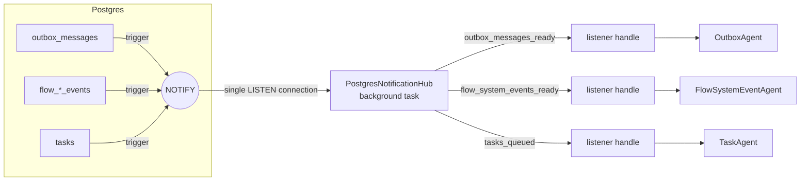

# Wakeup Listeners — Architecture

> **Status:** stable, used by the outbox, flow system event and task agents.
> Type names and paths below are drawn from source — when they drift, treat the source as canonical
> and update this page.

---

## Agent / newcomer quick-start

**One-paragraph mental model.** Several background agents process work stored in the database: the
**outbox agent** relays `outbox_messages`, the **flow system event agent** feeds flow events into
projections, and the **task agent** executes queued `tasks`. Instead of polling their tables, each agent
drains everything pending and then sleeps on a **`WakeupListener`** until the data *might* have changed
or a fallback timeout elapses. A wakeup is only a hint: the agent always re-checks storage. Each storage
engine implements the listener differently — Postgres uses `LISTEN`/`NOTIFY` fired by table triggers
and multiplexed over **one shared connection** (`PostgresNotificationHub`), SQLite polls a cheap
`MAX(id)` query with backoff, and the in-memory storage signals explicitly on write.

**Where to start reading, by intent:**

| You want to… | Start at |
| --- | --- |
| Know the guarantees an agent can rely on | [§2 Contract](#2-contract) |
| See which agent listens to what | [§3 Inventory](#3-inventory) |
| Understand the shared Postgres connection | [§4 Postgres](#4-postgres-listennotify-via-a-shared-hub) |
| Understand why SQLite polls | [§5 SQLite](#5-sqlite-polling) |
| Tune latency / idle load | [§7 Configuration](#7-configuration) |
| Add a new wakeup-driven agent | [§8 Recipe](#8-recipe-adding-a-wakeup-driven-agent) |
| Find the file for X | [§10 Reference map](#10-filecrate-reference-map) |

---

## Table of contents

- [1. Purpose \& scope](#1-purpose--scope)
- [2. Contract](#2-contract)
- [3. Inventory](#3-inventory)
- [4. Postgres: LISTEN/NOTIFY via a shared hub](#4-postgres-listennotify-via-a-shared-hub)
- [5. SQLite: polling](#5-sqlite-polling)
- [6. In-memory: explicit signals](#6-in-memory-explicit-signals)
- [7. Configuration](#7-configuration)
- [8. Recipe: adding a wakeup-driven agent](#8-recipe-adding-a-wakeup-driven-agent)
- [9. Tests \& gotchas](#9-tests--gotchas)
- [10. File/crate reference map](#10-filecrate-reference-map)

---

## 1. Purpose & scope

Agents used to poll with a fixed interval, issuing a transaction and a query every second even when
idle — noisy for the database and for telemetry. Wakeup listeners replace that with
"sleep until something might have changed", keeping a slow fallback timeout as a safety net.

In scope: the `WakeupListener` abstraction, its three implementations, the Postgres triggers that feed
it, and how the three agents use it. Out of scope: what the agents do once awake (outbox routing,
flow projections, task execution).

---

## 2. Contract

```rust
#[async_trait::async_trait]
pub trait WakeupListener: Send + Sync {
    async fn wait_wake(&self, timeout: Duration, min_debounce_interval: Duration)
        -> Result<WakeHint, InternalError>;
}

pub enum WakeHint { Timeout, Signaled }
```

Invariants every implementation upholds:

1. **A wakeup is only a hint.** `Signaled` means data *might* have changed. Spurious wakeups are allowed.
2. **Changes since the previous call are never missed.** A change committed after the previous
   `wait_wake` returned (or before the first call) makes the next call return `Signaled`, possibly
   immediately. This is what makes the *drain → wait* loop below safe without races.
3. **Timeout is the safety net**, not the primary mechanism. It bounds latency if a notification path
   is misconfigured (e.g. a missing migration) and paces SQLite polling.
4. **One listener instance serves one consumer.** The in-memory and SQLite listeners keep a single
   pending signal / last-seen id; a second concurrent waiter on the *same instance* could steal it.
   (Postgres handles are independent, but agents never share listeners anyway.)

### The uniform agent loop

All three agents follow the same shape: process until nothing is pending, then wait.

```rust
loop {
    process_until_empty().await?;        // outbox: all batches; flow events: all projectors; tasks: next task
    let hint = listener.wait_wake(max_listening_timeout, min_debounce_interval).await?;
    tracing::debug!(?hint, "Agent woke up with a hint");
}
```

Because of invariant 2, a change committed while the agent was processing is not lost: it is either
seen by `process_until_empty` or reported by the next `wait_wake`.

---

## 3. Inventory

| Agent | Postgres channel | Postgres triggers (table → trigger) | SQLite polling query | In-memory signal point |
| --- | --- | --- | --- | --- |
| Outbox (`OutboxAgentImpl`) | `outbox_messages_ready` | `outbox_messages` → `outbox_notify` (statement-level, `AFTER INSERT`) | `SELECT MAX(message_id) FROM outbox_messages` | `InMemoryOutboxMessageBridge` on push |
| Flow system events (`FlowSystemEventAgentImpl`) | `flow_system_events_ready` | `flow_events` → `fe_notify`, `flow_trigger_events` → `fte_notify`, `flow_configuration_events` → `fce_notify` (statement-level, `AFTER INSERT`) | `SELECT MAX(event_id) FROM flow_system_events` | `InMemoryFlowSystemEventBridge::save_events` |
| Task queue (`TaskAgentImpl`) | `tasks_queued` | `tasks` → `tasks_insert_notify` (statement-level, `AFTER INSERT`), `tasks_requeue_notify` (row-level, `AFTER UPDATE OF task_status WHEN NEW = 'queued'`) | latest `event_id` among `TaskEventCreated` / `TaskEventRequeued` in `task_events` | `InMemoryTaskEventStore::save_events` when a task becomes `Queued` |

Each agent reaches its listener through a domain-level trait that exposes `wakeup_listener()`:
`OutboxMessageBridge`, `FlowSystemEventBridge`, `TaskQueueWakeupSource`.

Notes:
- The task queue triggers fire on the `tasks` projection, not `task_events`, so the agent's own
  `Running`/`Finished` transitions don't wake it up.
- The SQLite task query scans the primary key descending and stops at the first match, so it stays
  cheap regardless of table size.

---

## 4. Postgres: LISTEN/NOTIFY via a shared hub



**`PostgresNotificationHub`** (dill `Singleton`, depends only on the pool) owns one `PgListener`
checked out of the pool, `LISTEN`ing on every subscribed channel. A background task, spawned on the first
subscription, routes each notification to the subscribers of its channel.

**`PostgresNotifyWakeupListener`** is a thin handle `(hub, channel)`. On its first `wait_wake` it
subscribes: it registers a `tokio::sync::Notify` slot with the hub. Components that resolve a bridge
but never wait (e.g. to push outbox messages) never subscribe.

Behaviour, and why:

| Event | What the hub does | Why |
| --- | --- | --- |
| Connect / reconnect succeeds | `LISTEN` on all channels, then **signal every subscriber** | Notifications sent while `LISTEN` was not active are lost; subscribers re-check storage. Also makes the first wait after subscribing return `Signaled`. |
| New subscription | Drop the connection and reconnect with the extended channel set | Avoids cancelling `try_recv` and reusing the connection (sqlx doesn't document it as cancel-safe). Subscriptions only happen at startup; others get one spurious wakeup. |
| Connection lost (`try_recv` → `Ok(None)`) or other error | Drop the listener, reconnect | `eager_reconnect(false)`: sqlx would otherwise reconnect silently and hide lost notifications. |
| Connect fails | Log, retry after `RECONNECT_RETRY_INTERVAL` (1s) | Independent of the debounce, so a short one doesn't flood a database that is down. |
| Pool closed (`PoolClosed`) | Background task exits | Lets `pool.close()` complete: clean shutdown, and `sqlx::test` closes its pool after each test. |
| Hub dropped | Background task aborted | The task holds only the shared inner state, so dropping the last hub reference stops it. |

Other points:
- `NOTIFY` is delivered only when the notifying transaction **commits**, so a woken agent always sees the
  committed rows. Rolled-back transactions notify nobody.
- Postgres collapses identical notifications within one transaction, so statement-level triggers and
  row-level triggers with `WHEN` filters are both cheap.
- Debounce (per handle): after the first signal, sleep `min_debounce_interval` and absorb signals
  that arrived meanwhile, so a burst produces one wakeup.
- **One connection in total** for all channels, regardless of how many agents listen.

---

## 5. SQLite: polling

SQLite has no notifications, so `SqlitePollingWakeupListener` polls a query returning the maximum id
of the watched records and compares it with the last id it has seen.

**Why not an in-process signal?** The workspace database is opened in WAL mode, so other `kamu`
processes in the same workspace can write to it while an API server is running (verified: `kamu add`
succeeds next to a running `kamu system api-server`). Only polling sees those writes.

Backoff within one `wait_wake`: the first poll is immediate (catches changes since the previous call),
then the interval starts at `max(min_debounce_interval, 10ms)` and doubles, capped by the timeout.
With the defaults (20ms, 2s) an idle agent runs ~8 cheap primary-key lookups per 2s window; worst-case
detection latency is roughly the last backoff gap (~0.75s). The backoff restarts on every call.

The first call treats all existing records as new (last-seen id starts at 0), so it returns
`Signaled` if the table is not empty — a harmless spurious wakeup.

---

## 6. In-memory: explicit signals

`InMemoryWakeupListener` wraps a `tokio::sync::Notify`. The in-memory store calls `signal()`
(`notify_one`) on write; if no one is waiting, the permit is stored, so the next `wait_wake` returns
immediately (invariant 2). Multiple signals before a wait coalesce into one wakeup. Debounce is ignored.

---

## 7. Configuration

| Agent | Config section | `minDebounceInterval` | `maxListeningTimeout` |
| --- | --- | --- | --- |
| Outbox | `outbox` | `20ms` | `2s` |
| Flow system events | `flowSystem.flowSystemEventAgent` | `20ms` | `2s` |
| Task agent | `flowSystem.taskAgent` | `20ms` | `2s` |

- `minDebounceInterval` — how long to absorb a burst after the first signal (Postgres), or the
  initial poll interval (SQLite). Every agent in a flow run chain adds it to end-to-end latency,
  so keep it small.
- `maxListeningTimeout` — fallback re-check period. Deployments on Postgres typically raise it
  (e.g. `60s`): notifications carry latency, the timeout only bounds the damage of a missed one.
- Internal constants: Postgres reconnect retry `1s` (`postgres_notification_hub.rs`), SQLite poll
  floor `10ms` (`sqlite_polling_wakeup_listener.rs`).

---

## 8. Recipe: adding a wakeup-driven agent

1. **Postgres migration** (`migrations/postgres/`): a `notify_*()` function calling
   `pg_notify('<channel>', '')`, and triggers on the table(s) whose changes should wake the agent.
   Prefer statement-level `AFTER INSERT`; use row-level with `WHEN` to filter by column values.
   The migration must be applied before the new binary runs — without it, work is only picked up on
   the fallback timeout.
2. **Domain trait**: expose `fn wakeup_listener(&self) -> &dyn WakeupListener` on the agent's
   bridge / source trait (see `TaskQueueWakeupSource`).
3. **Implementations**:
   - Postgres: `PostgresNotifyWakeupListener::new(hub, CHANNEL)`, constructor takes
     `Arc<PostgresNotificationHub>`; component scope `Agnostic`.
   - SQLite: `SqlitePollingWakeupListener::new(pool, "<cheap query returning max id>")`.
   - In-memory: `InMemoryWakeupListener`, call `signal()` from the store's write path.
4. **DI**: register the implementations in `src/app/cli/src/database.rs`. `PostgresNotificationHub`
   is already registered once in the Postgres block; test catalogs using Postgres bridges must add it.
5. **Agent loop**: drain everything pending, then `wait_wake(max_listening_timeout, min_debounce_interval)`
   (§2). Add a config section with both settings.
6. **Tests**: a storage test that committed changes of interest wake the listener and irrelevant ones
   don't (see `test_wakes_up_only_when_task_is_queued` for Postgres and SQLite).
7. Update the inventory in §3.

---

## 9. Tests & gotchas

| Tests | Location |
| --- | --- |
| Listener behaviour per backend | `src/infra/wakeup-listener/{inmem,postgres,sqlite}/tests` |
| Hub: shared connection, routing, late subscription, connection loss | `src/infra/wakeup-listener/postgres/tests/tests/test_postgres_notification_hub.rs` |
| Task queue triggers / SQLite query filter | `src/infra/task-system/{postgres,sqlite}/tests/tests/test_*_task_queue_wakeup_source.rs` |
| Agent wakes on a queued task, not on timeout | `src/domain/task-system/services/tests/tests/test_task_agent_impl.rs` |

Gotchas:
- **Never skip the re-check after `Timeout`** — it is the only thing covering a missing trigger.
- **Don't reuse one in-memory / SQLite listener instance for two consumers** (§2, invariant 4).
- **Postgres channels are per database**, so `sqlx::test` databases don't interfere with each other.
- **Postgres migrations are applied externally** (`sqlx migrate run`), not by the application.
- Observing it live: with `RUST_LOG=sqlx::query=debug,kamu_task_system_services=debug`, an idle task
  agent issues one queued-task query per `maxListeningTimeout`, and picks up a new task within
  ~`minDebounceInterval` of its commit.

---

## 10. File/crate reference map

| Layer | Crate | Directory | Key files |
| --- | --- | --- | --- |
| Contract | `wakeup-listener` | `src/utils/wakeup-listener/src` | `wakeup_listener.rs` |
| Postgres | `kamu-wakeup-listener-postgres` | `src/infra/wakeup-listener/postgres/src` | `postgres_notification_hub.rs`, `postgres_notify_wakeup_listener.rs` |
| SQLite | `kamu-wakeup-listener-sqlite` | `src/infra/wakeup-listener/sqlite/src` | `sqlite_polling_wakeup_listener.rs` |
| In-memory | `kamu-wakeup-listener-inmem` | `src/infra/wakeup-listener/inmem/src` | `inmem_wakeup_listener.rs` |
| Outbox | `messaging-outbox`, `kamu-messaging-outbox-*` | `src/utils/messaging-outbox/src/agent`, `src/infra/messaging-outbox/*/src/repos` | `outbox_agent_impl.rs`, `*_outbox_message_bridge.rs` |
| Flow system events | `kamu-flow-system-services`, `kamu-flow-system-*` | `src/domain/flow-system/services/src/flow_system_events`, `src/infra/flow-system/*/src` | `flow_system_event_agent_impl.rs`, `*_flow_system_event_bridge.rs` |
| Task queue | `kamu-task-system-services`, `kamu-task-system-*` | `src/domain/task-system/services/src`, `src/infra/task-system/*/src` | `task_agent_impl.rs`, `*_task_queue_wakeup_source.rs` |
| Triggers | — | `migrations/postgres` | `*_outbox_listen_notify.sql`, `*_flow_system_projections.sql`, `*_tasks_listen_notify.sql` |
| DI wiring | `kamu-cli` | `src/app/cli/src` | `database.rs` |
