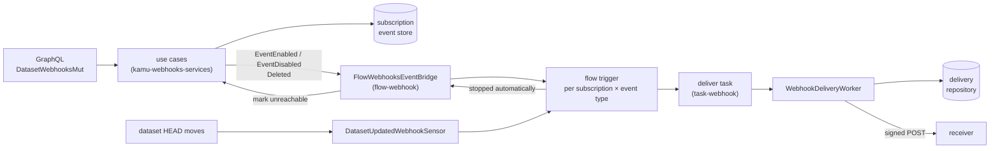
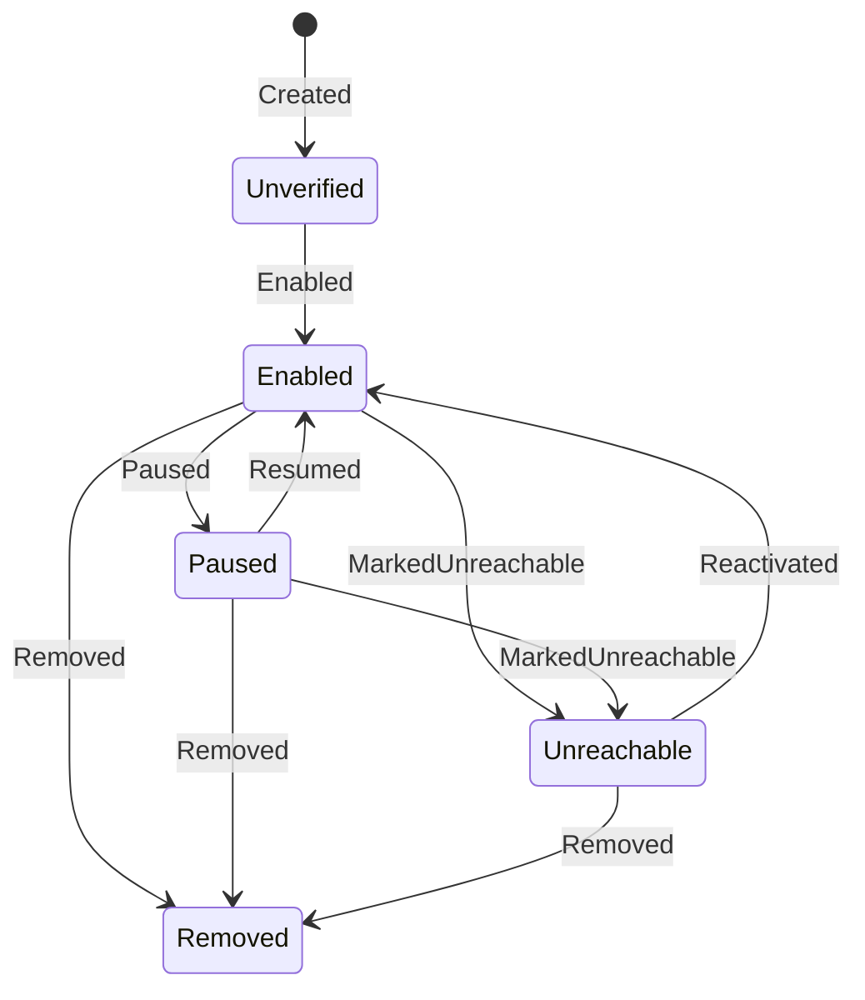

# Webhooks — Architecture

> **Status:** in production; covers webhook subscriptions on datasets, their lifecycle, secrets,
> how a delivery is signed and sent, what a receiver gets, and how subscriptions are wired to the
> flow system. Behaviour that surprises newcomers is listed in [§11](#11-testing--gotchas).
> Type names and paths below are drawn from source — when they drift, treat the source as canonical
> and update this page.

---

## Agent / newcomer quick-start

**One-paragraph mental model.** A **webhook subscription** asks Kamu to `POST` a signed JSON message
to an https URL whenever something happens to a dataset. The only user-facing event type is
`DATASET.REF.UPDATED` (`WebhookEventTypeCatalog::all_non_test`): the dataset's `HEAD` moved. A
subscription is an event-sourced aggregate owned by the webhooks domain; it does not deliver
anything itself. Enabling a subscription posts an outbox message, and the flow system turns it into
a reactive trigger for the **webhook deliver flow** of that (subscription, event type). When the
dataset updates, that flow runs a task whose runner calls the **delivery worker**: it signs the
payload with the subscription's secret (HMAC-SHA256 over an RFC 9421-style signature base), sends
it, and records the request and response. Failed deliveries follow the flow's retry policy
([flow-system.md](flow-system.md#webhook-delivery)); after too many consecutive failures the flow
trigger stops itself and the subscription becomes `Unreachable` until a user reactivates it.

**Where to start reading, by intent:**

| You want to… | Start at |
| --- | --- |
| Know the statuses and which operation moves between them | [§4 Subscription lifecycle](#4-subscription-lifecycle) |
| Know how secrets are generated, stored and rotated | [§5 Secrets](#5-secrets) |
| Write or debug a receiver: headers, payload, signature | [§6 Delivery](#6-delivery) |
| Know how a subscription becomes a flow, and how they are kept in step | [§8 Flow integration](#8-flow-integration) |
| Find the GraphQL field for an operation | [§9 GraphQL API](#9-graphql-api) |
| Find the file for X | [§12 Reference map](#12-filecrate-reference-map) |

---

## Table of contents

- [1. Purpose \& scope](#1-purpose--scope)
- [2. Concepts](#2-concepts)
- [3. Layers and crates](#3-layers-and-crates)
- [4. Subscription lifecycle](#4-subscription-lifecycle)
- [5. Secrets](#5-secrets)
- [6. Delivery](#6-delivery)
- [7. Storage](#7-storage)
- [8. Flow integration](#8-flow-integration)
- [9. GraphQL API](#9-graphql-api)
- [10. Configuration](#10-configuration)
- [11. Testing \& gotchas](#11-testing--gotchas)
- [12. File/crate reference map](#12-filecrate-reference-map)

---

## 1. Purpose & scope

This page covers the webhooks domain (`kamu-webhooks`, `kamu-webhooks-services`), its storage
crates, the receiver-facing contract of a delivery, the outbox messages that connect subscriptions
to flows, and the subscription management API.

Out of scope, each with its own owner:

| Topic | Owner |
| --- | --- |
| The deliver flow type, its trigger, batching, retries and the stop policy | [flow-system.md](flow-system.md#webhook-delivery) |
| What happens to a flow scope when it is removed | [flow-system.md](flow-system.md#11-scope-removal-and-external-events) |
| Webhook flow processes and runs in GraphQL (`Dataset.flows.processes.webhooks`, `Account.flows.processes`, the `byProcessType.webhooks` filter, `FlowDescriptionWebhookDeliver`) | [flow-system.md](flow-system.md#12-graphql-api) |
| The deliver task: planning, the runner, how delivery errors become task outcomes | [task-system.md](task-system.md#74-webhook-delivery) |
| How outbox messages are dispatched and consumed | [outbox.md](outbox.md) |

---

## 2. Concepts

| Term | Meaning | Type |
| --- | --- | --- |
| Subscription | A dataset, a target URL, a set of event types, an optional label and a secret | `WebhookSubscription` aggregate, ID `WebhookSubscriptionID` (UUID v4) |
| Event type | What a subscription listens to. Upper-cased and trimmed on parse | `WebhookEventType`; catalog `WebhookEventTypeCatalog`: `DATASET.REF.UPDATED`, and `TEST` for tests only |
| Label | Free text, at most 100 characters, trimmed; may be empty. Unique among a dataset's non-removed subscriptions when not empty | `WebhookSubscriptionLabel` |
| Target URL | Where deliveries go; must be `https` and must not resolve to a loopback address ([§4](#4-subscription-lifecycle)) | `url::Url` |
| Secret | The HMAC key a receiver shares with Kamu to verify signatures ([§5](#5-secrets)) | `WebhookSubscriptionSecret` |
| Delivery | One HTTP attempt: the request sent and, if one came back, the response | `WebhookDelivery`, ID `WebhookDeliveryID` |

A subscription always belongs to a dataset. The aggregate allows a dataset-less "system"
subscription, but the create and update use cases reach `unimplemented!()` for it.

---

## 3. Layers and crates

| Crate | Path | Holds |
| --- | --- | --- |
| `kamu-webhooks` | `src/domain/webhooks/domain` | aggregates, entities, repository traits, use case and service traits, outbox messages, `WebhooksConfig` |
| `kamu-webhooks-services` | `src/domain/webhooks/services` | use cases, secret generator, signer, sender, delivery worker, query service, dataset removal handler |
| `kamu-webhooks-inmem` / `-postgres` / `-sqlite` | `src/infra/webhooks/*` | subscription event store and delivery repository |
| `kamu-webhooks-repo-tests` | `src/infra/webhooks/repo-tests` | shared repository test suites |
| `kamu-adapter-flow-webhook` | `src/adapter/flow-webhook` | flow scope, deliver controller, sensor, payload, event bridge, startup recovery job |
| `kamu-adapter-task-webhook` | `src/adapter/task-webhook` | deliver task planner and runner |
| `kamu-adapter-graphql` | `src/adapter/graphql/src/{queries,mutations}/webhooks*` | subscription queries and mutations |



---

## 4. Subscription lifecycle

The aggregate's statuses and the events that move between them (`WebhookSubscriptionState`'s
projection). A transition the diagram does not show is rejected with a `ProjectionError`, which
update, pause, resume, reactivate and mark-unreachable turn into an `…Unexpected { status }` error;
rotate reports it as an internal error.



Not drawn: `Modified` and `SecretRotated` keep the status and are allowed from every status except
`Removed`; `Enabled`, `Paused`, `Resumed`, `Reactivated` and `MarkedUnreachable` are also accepted
when the subscription is already in the resulting status; `Removed` is accepted from every status
(from `Removed` it changes nothing). `Unverified` is never observed: create records `Created` and
`Enabled` in one save.

Every use case trusts the subscription it is given; authorization is done by the GraphQL layer
([§9](#9-graphql-api)). Pause, resume, reactivate, mark-unreachable and remove post their messages
only when the status actually changed; update posts one message per added or removed event type,
whatever the status.

| Use case | Effect | Outbox message |
| --- | --- | --- |
| `CreateWebhookSubscriptionUseCase` | validates the URL and event types, deduplicates event types, checks label uniqueness, generates a secret, records `Created` + `Enabled`; returns the ID and the new secret, which the GraphQL layer decrypts for the response | `EventEnabled` per event type |
| `UpdateWebhookSubscriptionUseCase` | same validation; label uniqueness only if the label changed; records `Modified` | `EventDisabled` per removed event type, then `EventEnabled` per added one |
| `PauseWebhookSubscriptionUseCase` | `Paused` | `EventDisabled` per event type |
| `ResumeWebhookSubscriptionUseCase` | `Resumed` | `EventEnabled` per event type |
| `ReactivateWebhookSubscriptionUseCase` | `Reactivated` | `EventEnabled` per event type |
| `MarkWebhookSubscriptionUnreachableUseCase` | `MarkedUnreachable`; called only by the flow system ([§8](#8-flow-integration)) | `WebhookSubscriptionLifecycleMessage::MarkedUnreachable` |
| `RemoveWebhookSubscriptionUseCase` | `Removed` | `WebhookSubscriptionLifecycleMessage::Deleted` |
| `RotateWebhookSubscriptionSecretUseCase` | generates a secret, records `SecretRotated`, returns it for the GraphQL layer to decrypt | none |

**Target URL validation** (`validate_webhook_target_url` in `use_cases/helpers.rs`) runs on create
and update only: the scheme must be `https`, and the host is resolved with the blocking resolver;
if any resolved address is loopback the URL is rejected. A resolution failure is not an error.
Nothing is re-checked at delivery time.

**Event types** must be non-empty. Only the GraphQL scalar checks them against the catalog, and it
accepts only the non-test types.

**Dataset deletion.** `WebhookDatasetRemovalHandler` consumes `DatasetLifecycleMessage::Deleted`
and records `Removed` on each of the dataset's subscriptions directly on the aggregate, not through
`RemoveWebhookSubscriptionUseCase`, so no `Deleted` lifecycle message is posted for them
([§8](#8-flow-integration)).

---

## 5. Secrets

| Aspect | Behaviour |
| --- | --- |
| Generation | `WebhookSecretGeneratorImpl`: 32 random bytes, hex-encoded. The 64-character hex **string** is the secret; its ASCII bytes are the HMAC key |
| At rest, with `webhooks.secretEncryptionKey` set | AES-256-GCM (`crypto_utils::AesGcmEncryptor`) with a random 96-bit nonce per secret; the key is the config string's bytes and must be exactly 32 bytes |
| At rest, without a key | the plaintext bytes, with no nonce |
| Where | inside the `Created` and `SecretRotated` events, as `{ value, secret_nonce }` |
| Decryption | `WebhookSubscriptionSecret::get_exposed_value`; a stored nonce with no configured key is `ConfigurationMismatch`; the signer unwraps it, so delivering for such a subscription panics |
| Returned to users | only in the results of `createSubscription` and `rotateSecret`; there is no field to read it later |
| Rotation | takes effect on the next delivery; the old secret stops working at once, and the status does not change |

The encryption key is passed to the domain whenever it is configured, whatever
`webhooks.secretEncryptionEnabled` says ([§10](#10-configuration)).

---

## 6. Delivery

How the task reaches the worker is in [task-system.md](task-system.md#74-webhook-delivery). The
worker, `WebhookDeliveryWorkerImpl::deliver_webhook`:

1. **Prepare** (own transaction): load the subscription (its status is not checked), serialize the
   payload once, build the headers and signature over those exact bytes, and insert a
   `WebhookDelivery` with the request.
2. **Send** (no transaction): `WebhookSenderImpl` posts the bytes.
3. **Record** (own transaction): store the response status, headers and body on the delivery. Any
   send error (connect, timeout or other) skips this step, leaving a request-only delivery. A body
   that cannot be read is recorded as empty.
4. A non-2xx status becomes `UnsuccessfulResponse` after the response is recorded.

The worker never retries; every attempt is a new task with a new delivery ID.

**Sender.** A `reqwest` client with a total request timeout of `webhooks.deliveryTimeout`, user
agent `Kamu-Webhook/1.0`, and rustls with the bundled webpki roots. Redirects, proxies and response
decompression use the library defaults. The whole response body is read as text.

### Headers

| Header | Value |
| --- | --- |
| `Content-Type` | `application/json` |
| `Content-Digest` | `sha-256=:<base64 of SHA-256 of the body>:` (RFC 9530 syntax) |
| `Signature-Input` | `sig1=(@method @path @authority "x-webhook-timestamp" "content-digest"); keyid="default"; alg="hmac-sha256"; created=<unix seconds>` |
| `Signature` | `sig1=:<base64 HMAC-SHA256>:` |
| `X-Webhook-Timestamp` | unix seconds, equal to `created` |
| `X-Webhook-Delivery-Id` | the delivery UUID; new on every attempt |
| `X-Webhook-Subscription-Id` | the subscription UUID |
| `X-Webhook-Event-Type` | for example `DATASET.REF.UPDATED` |
| `X-Webhook-Delivery-Attempt` | always `1` |
| `User-Agent` | `Kamu-Webhook/1.0` |

### Signature

The scheme borrows RFC 9421's vocabulary but not its canonical form, so a generic RFC 9421
verifier rejects it. `WebhookSignerImpl` signs this base — lines joined by `\n`, no trailing
newline, derived components unquoted, and the parameters on a line of their own without spaces:

```text
@method: POST
@path: /hook
@authority: example.com
"x-webhook-timestamp": 1747176960
"content-digest": sha-256=:…:
"@signature-params": (@method @path @authority "x-webhook-timestamp" "content-digest")
;keyid="default";alg="hmac-sha256";created=1747176960
```

`@path` is the URL path without the query; `@authority` is the URL's authority as normalized by the
`url` crate: lowercased host, a non-default port kept, `:443` dropped. To verify, a receiver
recomputes the digest of the raw body, compares it with `Content-Digest`, rebuilds the base above,
computes HMAC-SHA256 with the secret string's bytes, and compares the base64 result with
`Signature`. Kamu enforces no freshness window and sends no `expires` or `nonce`; checking
`X-Webhook-Timestamp` is up to the receiver. The test vector is in `test_webhook_signer_impl.rs`.

### Payload

`DATASET.REF.UPDATED` sends `WebhookDatasetRefUpdatedPayload`, with snake_case keys:

```json
{
  "version": 2,
  "dataset_id": "did:odf:…",
  "owner_account_id": "…",
  "block_ref": "head",
  "new_hash": "f1620…",
  "old_hash": "f1620…",
  "is_breaking_change": false
}
```

One delivery may cover several updates batched into one flow: `old_hash` comes from the first
update (omitted when the dataset had no previous head), `new_hash` from the last, and
`is_breaking_change` is true if any of them was breaking. A breaking change (a history rewrite) is
delivered like any other update.

---

## 7. Storage

| Table | Holds |
| --- | --- |
| `webhook_subscription_events` | the event store: `event_id`, `subscription_id`, `created_at`, `event_type`, `event_payload` |
| `webhook_subscriptions` | a projection for lookups: `dataset_id`, `event_types`, `status`, `label`, `last_event_id` |
| `webhook_deliveries` | one row per delivery: request payload and headers, `requested_at`, and the nullable response code, body, headers and `response_at` |

| Rule | Where |
| --- | --- |
| Concurrent saves of one subscription | optimistic check on `last_event_id` |
| Label unique per dataset | partial unique index `(dataset_id, label)` over non-removed rows with a label; empty labels are stored as `NULL` and never collide. The in-memory store checks the same rule in code |
| Removed subscriptions | excluded from every list and find query except explicit "including removed" lookups |
| Deliveries | never deleted; no API reads them |

Event type strings in `event_type` are persisted, and `Modified` is stored as
`WebhookSubscriptionEventUpdated`; use the `kamu-renaming-a-concept` skill before renaming any of
them. In SQLite, `event_types` is a comma-joined string.

---

## 8. Flow integration

The deliver flow itself is described in [flow-system.md](flow-system.md#webhook-delivery). There is
one flow binding, trigger, sensor and process per (subscription, event type), with scope
`{ "type": "WebhookSubscription", "subscription_id", "event_type", "dataset_id" }`
(`FlowScopeSubscription`). Only `DATASET.REF.UPDATED` gets triggers.

`FlowWebhooksEventBridge` keeps triggers in step with subscriptions:

| Message | Action |
| --- | --- |
| `EventEnabled` | set an active reactive trigger ([flow-system.md](flow-system.md#webhook-delivery)) |
| `EventDisabled` | pause the trigger |
| `Deleted` | run every `FlowScopeRemovalHandler` on each event type's scope |
| `MarkedUnreachable` | nothing |
| `FlowTriggerUpdatedMessage` with `StoppedAutomatically` on a subscription scope | run `MarkWebhookSubscriptionUnreachableUseCase` |

The sensor and the worker do not look at the subscription's status; a subscription stops receiving
deliveries only because its trigger is paused, stopped or removed; a task already running at that
point still delivers ([flow-system.md](flow-system.md#11-scope-removal-and-external-events)).

**Startup reconciliation.** `WebhookTriggerStartupRecoveryJob` runs on startup, inside a
transaction, and repairs triggers that do not match their subscription:

| Subscription | Trigger | Action |
| --- | --- | --- |
| `Enabled` | not active, or missing | set an active trigger |
| `Paused` | active | pause |
| `Paused` | stopped automatically | resume, then pause |
| `Paused` | missing | set, then pause |
| `Unreachable` | active | apply an automatic stop |
| `Unreachable` | paused by user | resume, then stop automatically |
| `Unreachable` | missing | set, then stop automatically |

Every other combination, and `Removed` subscriptions, are left alone.

**After a dataset is deleted**, its subscriptions are `Removed` without a `Deleted` message
([§4](#4-subscription-lifecycle)), and the dataset's own scope removal matches only the
`Dataset` scope, so the subscriptions' triggers, sensors and process states are not removed.

---

## 9. GraphQL API

Subscription management lives under the dataset and requires Maintain, checked by
`check_dataset_maintain_access`: on the query side by `Dataset.webhooks.subscriptions` and
`.subscription(id)`, on the mutation side when `DatasetMut.webhooks` is resolved and again by
`.subscription(id)`. Subscriptions are looked up with
`find_webhook_subscription_in_dataset`, so an ID from another dataset, or a removed one, resolves to
`null`.

| Field | Returns |
| --- | --- |
| `Query.webhooks.eventTypes` | the non-test event types; no authorization |
| `Dataset.webhooks.subscriptions`, `.subscription(id)` | `WebhookSubscription { id, label, datasetId, targetUrl, eventTypes, status }` |
| `DatasetMut.webhooks.createSubscription(input)` | `CreateWebhookSubscriptionResultSuccess { subscriptionId, secret }`, `WebhookSubscriptionDuplicateLabel`, `WebhookSubscriptionInvalidTargetUrl`, `WebhookSubscriptionNoEventTypesProvided` |
| `DatasetMut.webhooks.subscription(id).update(input)` | success, the same validation errors as `createSubscription`, or `UpdateWebhookSubscriptionResultUnexpected { status }` |
| `….pause`, `.resume`, `.reactivate` | success, or `…Unexpected { status }` |
| `….rotateSecret` | `RotateWebhookSubscriptionSecretSuccess { newSecret }` |
| `….remove` | `RemoveWebhookSubscriptionResultSuccess` |
| `Dataset.permissions.webhooks` | `{ canView, canUpdate }`, both equal to Maintain |

`WebhookSubscriptionInput` is `{ targetUrl, eventTypes, label }`. There is no account-level
subscription API and no API for delivery records; a failed delivery surfaces only as the task
outcome `TaskFailureReasonWebhookDeliveryProblem`
([task-system.md](task-system.md#11-graphql-api)).

---

## 10. Configuration

| Key | Default | Meaning |
| --- | --- | --- |
| `webhooks.maxConsecutiveFailures` | 5 | failed runs in a row before the trigger stops itself; at least 1 (checked at startup) and at most 10 (`MAX_CONSECUTIVE_FAILURES_COUNT`): a larger value panics when a trigger is set, including in the startup recovery job |
| `webhooks.deliveryTimeout` | 10 | total request timeout, in seconds |
| `webhooks.secretEncryptionEnabled` | `false` | with no key: `true` refuses to start, `false` logs a warning |
| `webhooks.secretEncryptionKey` | none | 32-character AES-256 key; checked at startup only when encryption is enabled |

The startup checks are in `src/app/cli/src/app.rs`; the full reference is generated into
`resources/config-reference.md`.

---

## 11. Testing & gotchas

### Testing

| What | Where |
| --- | --- |
| Use cases, with a shared harness | `src/domain/webhooks/services/tests/tests/use_cases/` (`webhook_subscription_use_case_harness.rs`) |
| Delivery worker (mocked sender), signer test vector, dataset removal handler | `src/domain/webhooks/services/tests/tests/services/` |
| Event store and delivery repository suites, run against every backend | `src/infra/webhooks/repo-tests/src/`, invoked from `src/infra/webhooks/{inmem,postgres,sqlite}/tests/` |
| Sensor, deliver controller (payload shape), event bridge, recovery job | `src/adapter/flow-webhook/tests/tests/` |
| GraphQL subscription management | `src/adapter/graphql/tests/tests/test_gql_webhook_subscriptions.rs` |

### Behaviour by design

| Behaviour | Why |
| --- | --- |
| The subscription does not gate deliveries; its trigger does | One place decides whether flows run; the bridge and the startup job keep the trigger in step with the status |
| A breaking change is delivered, with `is_breaking_change` set | Receivers need to know `HEAD` moved even when history was rewritten |
| A retry is a new delivery with a new ID | Each retry is a new task; `X-Webhook-Delivery-Attempt` does not count them |
| Update can enable a trigger of a paused subscription | It posts `EventEnabled` for every added event type whatever the status; unreachable through GraphQL while the catalog has one user-facing type |
| The secret is shown once | It is the receiver's verification key; Kamu keeps it only to sign |

---

## 12. File/crate reference map

| Concern | File |
| --- | --- |
| Aggregate, events, state, statuses | [`webhook_subscription.rs`](../../src/domain/webhooks/domain/src/aggregates/webhook_subscription.rs), [`webhook_subscription/`](../../src/domain/webhooks/domain/src/entities/webhook_subscription/) |
| Event type catalog | [`webhook_event_type_catalog.rs`](../../src/domain/webhooks/domain/src/entities/webhook_event/webhook_event_type_catalog.rs) |
| Use cases and validation | [`use_cases/`](../../src/domain/webhooks/services/src/use_cases/) (`helpers.rs`) |
| Secret generation and encryption | [`webhook_secret_generator_impl.rs`](../../src/domain/webhooks/services/src/services/webhook_secret_generator_impl.rs), [`webhook_subscription_secret.rs`](../../src/domain/webhooks/domain/src/entities/webhook_subscription/webhook_subscription_secret.rs) |
| Signing, headers, sending, delivery | [`webhook_signer_impl.rs`](../../src/domain/webhooks/services/src/services/webhook_signer_impl.rs), [`webhook_headers.rs`](../../src/domain/webhooks/services/src/services/webhook_headers.rs), [`webhook_sender_impl.rs`](../../src/domain/webhooks/services/src/services/webhook_sender_impl.rs), [`webhook_delivery_worker_impl.rs`](../../src/domain/webhooks/services/src/services/webhook_delivery_worker_impl.rs) |
| Dataset deletion | [`webhook_dataset_removal_handler.rs`](../../src/domain/webhooks/services/src/services/webhook_dataset_removal_handler.rs) |
| Outbox messages | [`messages/`](../../src/domain/webhooks/domain/src/messages/) |
| Storage | [`src/infra/webhooks/`](../../src/infra/webhooks/) |
| Flow scope, payload, controller, sensor, bridge, recovery job | [`src/adapter/flow-webhook/src/`](../../src/adapter/flow-webhook/src/) |
| GraphQL | [`queries/webhooks/`](../../src/adapter/graphql/src/queries/webhooks/), [`queries/datasets/dataset_webhooks.rs`](../../src/adapter/graphql/src/queries/datasets/dataset_webhooks.rs), [`mutations/webhooks_mut/`](../../src/adapter/graphql/src/mutations/webhooks_mut/) |
| Configuration | `WebhooksConfig` in [`webhooks_config.rs`](../../src/domain/webhooks/domain/src/webhooks_config.rs) and in [`models.rs`](../../src/app/cli/src/services/config/models.rs) |
