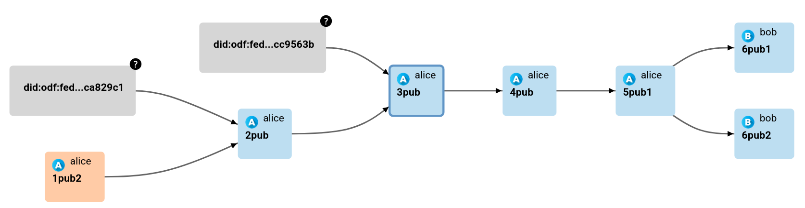

# private-datasets

In this example, combinations of datasets are provided, for convenient testing of the Private Datasets functionality.

### Datasets for lineage testing

**Legend:**

Dataset naming scheme: `$ACCOUNT/$LEVEL $VISIBILITY [$INDEX]`, where:
- `$ACCOUNT`: account
- `$LEVEL`: level in the dataset hierarchy
- `$VISIBILITY`: visibility, can be `priv` or `pub`
- `[$INDEX]`: optional dataset index

How `alice` sees the `alice/3pub` dataset lineage:

How `bob` sees the `alice/3pub` dataset lineage:

### Dataset with a private dependency

In case we have an inaccessible dataset of another user, we cannot update our derived dataset:

